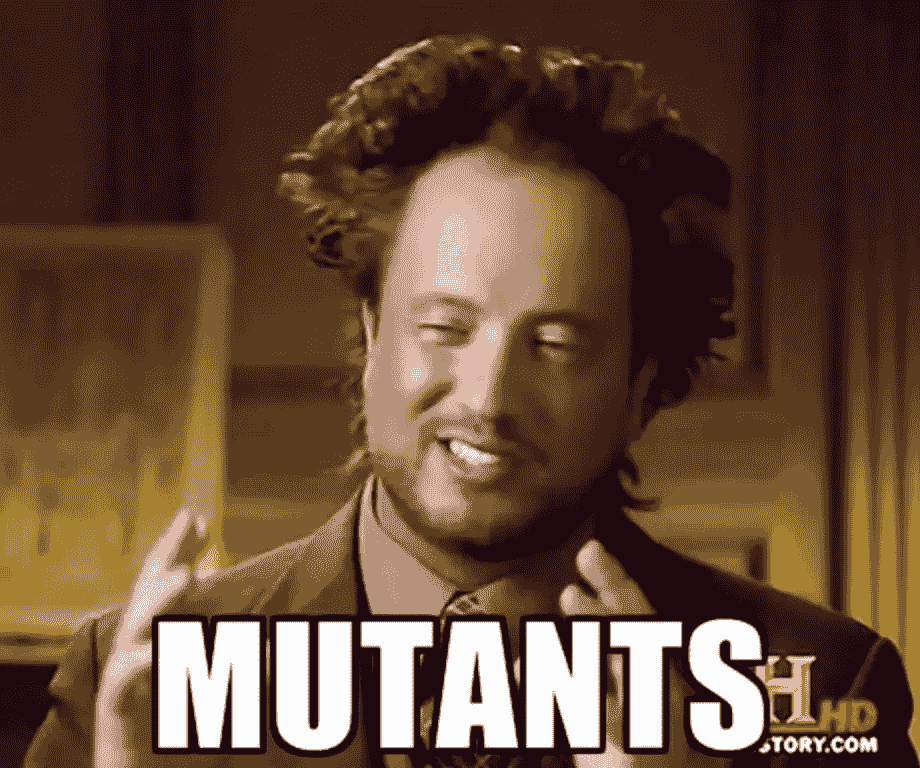
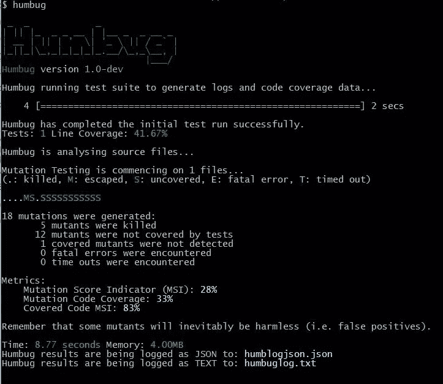

# 测试你的测试？谁看着守望者？

> 原文：<https://www.sitepoint.com/testing-your-tests-who-watches-the-watchmen/>

不管你是为一家大公司工作，还是为一家新公司工作，或者只是为你自己工作，单元测试不仅有用，而且通常是不可或缺的。我们使用单元测试来测试我们的代码，但是如果我们的测试是错误的或者不完整的，会发生什么呢？我们可以用什么来测试我们的测试？谁看着守望者？


## 进入突变测试



不，不，不是那样的。突变测试(或*突变分析*)是一种用于创建和评估软件测试质量的技术。它包括以非常小的方式修改测试。每一个被修改的版本都被称为突变体，并且通过使原始版本的行为不同于突变体来检测和拒绝突变体。突变是我们原始代码中的错误，分析检查我们的测试是否检测到这些错误。简而言之，如果一个测试在变异后仍然有效，它就不是一个好的测试。

## 利用骗局进行突变检测

Humbug 是一个针对 PHP 的突变测试框架。

为了让 Humbug 能够生成代码覆盖率，我们必须在我们的机器上安装并启用 XDebug。然后，我们可以将它作为一个全局工具来安装。

```
composer global require 'humbug/humbug' 
```

之后，如果我们运行

```
humbug 
```

命令，我们应该能够看到一些我们的 Humbug 安装信息和一个错误，表明我们没有一个`humbug.json`文件。

## 拔靴带

在我们配置和使用 Humbug 之前，我们需要一个可以测试的项目。我们将创建一个小的 PHP 计算器包，在这里我们将运行我们的单元和突变测试。

让我们创建一个`/Calculator`文件夹。在里面，让我们创建我们的`/src`和`/tests`文件夹。在我们的`/src`文件夹中，我们将有我们的应用程序代码；`/tests`文件夹将包含我们的单元测试。我们还需要在我们的包中使用 PHPUnit。最好的方法是使用 [Composer](https://www.sitepoint.com/php-dependency-management-with-composer/) 。让我们使用以下命令安装 PHPUnit:

```
composer global require phpunit/phpunit 
```

让我们创建我们的计算器。在`/src`文件夹中，创建一个`Calculator.php`文件，并添加以下内容:

```
<?php

namespace package\Calculator;

class Calculator {

    /**
     * BASIC OPERATIONS
     */
    public function add($a1, $a2) {
        return $a1 + $a2;
    }

    public function subtract($a1, $a2) {
        return $a1 - $a2;
    }

    public function multiply($a1, $a2) {
        return $a1 * $a2;
    }

    public function divide($a1, $a2) {

        if ($a2 === 0) {
            return false;
        }

        return $a1 / $a2;
    }

    /*
     * PERCENTAGE
     */

    //This will return $a1 percent of $a2
    public function percentage($a1, $a2) {
        return ( $a1 / $a2 ) * 100;
    }

    /*
     * PI
     */

    //Returns the value of pi
    public function pi() {
        return pi();
    }

    /*
     * LOGARITHMIC
     */

    //Returns the basic logarithm in base 10
    public function log($a) {
        return log10($a);
    }

} 
```

这是一个相当简单的程序。一个简单的计算器，具有基本的算术、百分比和对数运算，以及一个返回 [pi](https://en.wikipedia.org/wiki/Pi) 值的函数。接下来，在我们的`/tests`文件夹中，让我们为计算器创建单元测试。如果你需要 PHP 单元测试方面的帮助，看看这篇[教程](https://www.sitepoint.com/tutorial-introduction-to-unit-testing-in-php-with-phpunit/)。

创建一个 CalculatorTest.php 文件，并添加以下内容:

```
<?php

use package\Calculator\Calculator;

class CalculatorTest extends PHPUnit_Framework_TestCase {

    public function testAdd() {
        $calculator = new Calculator();
        $result = $calculator->add(2, 3);
        $this->assertEquals($result, 5);
    }

    public function testSubtract() {
        $calculator = new Calculator();
        $result = $calculator->subtract(6, 3);
        $this->assertEquals($result, 3);
    }

    public function testMultiply() {
        $calculator = new Calculator();
        $result = $calculator->multiply(6, 3);
        $this->assertEquals($result, 18);
    }

    public function testDivide() {
        $calculator = new Calculator();
        $result = $calculator->divide(6, 3);
        $this->assertEquals($result, 2);
    }

} 
```

这将是我们最初的测试堆栈。如果我们运行命令`phpunit`，我们将看到它成功执行，我们的 4 个测试和 4 个断言将通过。重要的是我们所有的测试都要通过，否则，Humbug 就会失败。

## 配置骗子

可以通过创建一个`humbug.json.dist`文件来手动配置 Humbug，也可以通过运行以下命令来自动配置:

```
humbug configure 
```

运行该命令将要求我们回答一些问题:

*   *What source directories do you want to include?*

    在这个例子中，我们将使用 src/，这是我们源代码的目录。

*   *Any directories you want to exclude from within your source directory?*

    在某些情况下可能有用，比如我们不想测试的外部供应商目录。它不适用于我们目前的情况。

*   *Single test suite timeout in seconds.*

    让我们用 30 秒来做这个。这可能太多了，但我们希望确保一切都有足够的时间运行。

*   *Where do you want to store your text log?*

    默认情况下，我们将保持原样。

*   *Where do you want to store your json log (if you need it)?*

    默认值为空，但我们会将其存储在`humblogjson.json`中。

*   *Generate “humblog.json.dist”?*

    这个文件在生成时将包含我们刚才提供的所有配置值。如果我们想改变什么，可以手动编辑。

## 利用谎言

既然我们已经运行了测试应用程序，并且安装了 humbog，那么让我们运行 humbog 并检查结果。

```
 humbug 
```

结果应该与此接近:



### 解读欺骗性结果

产生的突变数量仅仅是为了测试我们的测试而引入的小变化的数量。

一个**被杀的变异人(。)**是导致某项测试失败的突变。不要迷茫，这是正果！

一个**逃逸突变(M)** 是测试仍然通过的突变。这不是一个积极的结果，我们应该回到我们的测试，并检查有什么遗漏。

**未覆盖的突变**是发生在单元测试未覆盖的行中的突变。

**致命错误(E)** 和**超时(T)** 分别是产生致命错误的突变和产生无限循环的突变。

### 度量标准呢？

**突变分数指示符**指示检测到的生成突变的百分比。我们想以 100%为目标。

**突变代码覆盖率**表示被突变覆盖的测试的百分比。

**突变分数指示器**让你对确实存在的测试的有效性有所了解。

分析我们的骗子日志，我们可以看到，我们有 9 个突变体没有覆盖，和一些非常糟糕的指标。看一下`humblogjson.json`文件。这个文件是自动生成的，就像`humblog.txt`文件一样，并且包含了关于失败的内容、位置和原因的更多详细信息。我们还没有测试我们的百分比、圆周率和对数函数。此外，我们还需要涵盖将一个数除以 0 的情况。让我们添加一些测试来涵盖缺失的情况:

```
 public function testDivideByZero() {
        $calculator = new Calculator();
        $result = $calculator->divide(6, 0);
        $this->assertFalse($result);
    }

    public function testPercentage() {
        $calculator = new Calculator();
        $result = $calculator->percentage(2, 50);
        $this->assertEquals($result, 4);
    }

    public function testPi() {
        $calculator = new Calculator();
        $result = $calculator->pi();
        $this->assertEquals($result, pi());
    }

    public function testLog() {
        $calculator = new Calculator();
        $result = $calculator->log(10);
        $this->assertEquals($result, 1);
    } 
```

这一次，100%意味着所有的突变都被杀死了，我们有完整的代码覆盖。

### 下降趋势

突变测试最大的缺点，或者说是欺骗，是性能。突变测试是一个缓慢的过程，因为它取决于许多因素，如代码行之间的相互作用、测试的数量、代码覆盖的水平以及代码和测试的性能。Humbug 还进行初始测试运行、日志记录和代码覆盖，这些都会增加总持续时间。

此外，Humbug 是特定于 PHPUnit 的，这对那些使用其他测试框架的人来说可能是个问题。

也就是说，Humbug 正在积极开发中，并将继续改进。

## 结论

骗子可以成为维持你的应用程序寿命的重要工具。随着应用程序复杂性的增加，测试的复杂性也在增加——让它们始终保持 100%的复杂性变得非常重要，尤其是在处理企业生态系统时。

我们在本教程中使用的代码可以在这里克隆[。](https://github.com/sitepoint-editors/SimpleCalculator)

你用过 Humbug 吗？你用另一种方法做突变测试吗？请告诉我们您对这一切的想法！

## 分享这篇文章