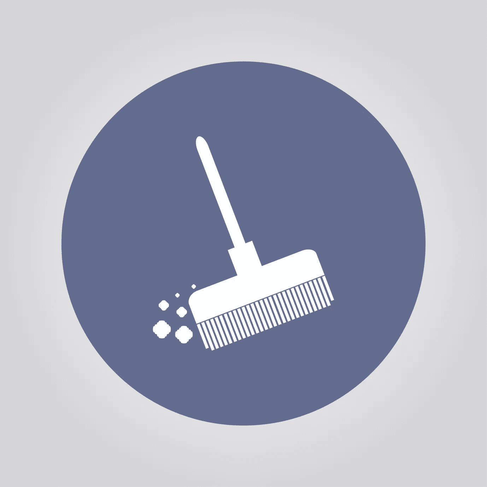

# 清理代码:为了美观重构值得吗？

> 原文：<https://www.sitepoint.com/cleaning-up-code-is-refactoring-for-aesthetics-worth-it/>

大多数开发团队都想让他们的代码库进入一个更好、更易维护的状态。但是应该选择什么定义的*更好的*？在许多情况下，没有必要深入研究领域驱动设计(DDD)来实现这个目标。有时候，甚至会适得其反。但是一个最基本的原则集合已经可以帮助每个团队很多了:干净的代码。



## 目标

Robert C. Martin 的《干净的代码》一书总结了许多简单和高级的改进，以获得更好、更容易理解、因此更易维护的代码。让我们以下面的代码片段为例:

```
public function getJobs($date)
{
    $ret = array();
    $res = $this->db->query(
        'SELECT * FROM jobs WHERE year=' . date('Y', $date) . ' AND month='
            . date('m', $date)
    );
    $res = $res->fetchAll();
    foreach ($res as $data) {
        $j = new Job(/* $data['...'] */);
        $j->rev = $j->time * $j->euro;
        $ret[] = $j;
    }
    return $ret;
} 
```

这个已经很简单的方法的目的似乎是返回某个日期的作业。虽然这个意图很清楚，但是通读这个方法并理解它是如何工作的并不容易。一旦完成，算法看起来相当简单:首先从数据库中获取一些数据，然后准备作业对象，计算一些额外的数据并返回对象。

但是花在理解这个简单代码片段上的时间就浪费了。作为一名开发人员，当你分析你和其他人的日常工作时，你会注意到你花在阅读和理解代码上的时间比实际写代码的时间要多得多。

一个唾手可得的结果就是重命名局部变量以提高可读性:

```
public function getJobs($date)
{
    $jobs = array();
    $statement = $this->db->query(
        'SELECT * FROM jobs WHERE year=' . date('Y', $date) . ' AND month='
            . date('m', $date)
    );
    $rows = $statement->fetchAll();
    foreach ($rows as $row) {
        $job = new Job(/* $row['...'] */);
        $job->rev = $job->time * $job->euro;
        $jobs[] = $job;
    }
    return $jobs;
} 
```

之前称为`$ret`的变量被重命名为`$jobs`。这个名字清楚地表明了我们可以从它那里得到什么:一个工作列表。此外，这不能轻易与更名为`$statement`和`$rows`的`$ret`相混淆。我们现在更好地理解了正在发生的事情。

提高可读性的另一个步骤是将代码分解成相互关联的逻辑片段，使其读起来更像一本书或报纸，其中段落是信息组:

```
public function getJobs($date)
{
    $statement = $this->db->query(
        'SELECT * FROM jobs WHERE year=' . date('Y', $date) . ' AND month='
            . date('m', $date)
    );
    $rows = $res->fetchAll();

    $jobs = array();
    foreach ($rows as $row) {
        $job = new Job(/* $row['...'] */);
        $job->rev = $job->time * $job->euro;
        $jobs[] = $job;
    }
    return $jobs;
} 
```

现在有两段。在第一个示例中，有许多从数据库中提取的行。第二段将这些行转换成对象。对声明`$jobs`和定界空行的这种微小的重新定位不仅简化了方法的阅读流程，还为后续可能的重构步骤做好了准备，即将任务拆分为私有方法，目的是暴露名称。

这只是干净代码提供的冰山一角。

## 方法论

从上面可以看出，重构的步骤非常简单——*小步前进*。这不仅仅是为了表示的目的，而且应该是你重构时的方式。推荐的方法是在每一步之后提交:

1.  选择 **1** 单个重构步骤
2.  执行选定的步骤
3.  验证代码是否仍然有效
4.  提交当前状态并转到 1

最重要的是，这个程序给了你一条安全线，所以你可以很容易地后退一步。每当你觉得可能会跑错方向时，你都应该这样做。如果你需要开始调试——不要。试图修复一个重构而不是恢复它实在是太费力了。很有可能你会在调试中迷失方向，这会比重新开始耗费更多的时间。如果你一步一步来，最新一步的恢复需要 5 分钟。

此外，这种方法有助于你对重构的最终目标保持专注和开放的态度。代码是复杂的，我们的大脑通常对这种复杂结构的最佳结果有偏见。在这个过程中，保持开放的心态去调整目标，你可以让它在这个过程中找到更好的解决方案。

该过程还允许您在任何时间点停止重构，而不会丢失进度。需要修复的紧急错误？一个同事要求陪练？午餐？没问题，您可以只是合并您的工作状态，或者将它留在一个分支中，以便以后再次使用。

尽管如此，重构期间频繁的提交也有一个缺点:如此多的小提交可能会污染您的版本控制历史。如果您正在使用 Git，您可以通过在推进上游之前将重构的提交压缩成一个单独的提交来减轻这种情况。

## 前提条件

以*干净的代码*为目标并应用小步骤是可持续重构的好的构建模块，但是还有更多要考虑的。

首先，仅仅因为你可以或者因为你认为当前代码看起来很丑而执行重构并不是一个好主意。更改代码总是有风险的，如果没有好的理由，你不应该冒险。一个很好的理由是，你经常需要处理一段代码，这段代码很难理解，而且变化会在整个系统中级联。但是还有许多其他原因，如频繁的错误、不可预见的业务需求等。重要的是，你要仔细分析原因，而不是一味地去重构。

其次，重要的是至少要有某种程度的自动化测试，覆盖使用被重构代码的最重要的业务案例。遗留系统通常很难用单元或集成测试方法进行测试。因此，建议不要试图通过暴力方法来应用这些方法。相反，我们发现通过前端应用测试非常有用——在我们的例子中使用 Mink 和 PHPUnit。

但是，正如软件开发中的许多决策一样，这些只是经验法则，每个项目都有自己的需求和优先级。欢迎参加我在 2016 网络夏令营举办的[清洁代码研讨会](http://2016.websummercamp.com/PHP)，了解更多信息。带上[的同伴](http://2016.websummercamp.com/Companions)——也有一个专门为其他重要的人准备的项目，所以带上同伴，让它成为一个工作假期吧！

## 分享这篇文章