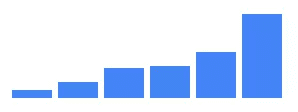
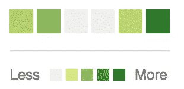
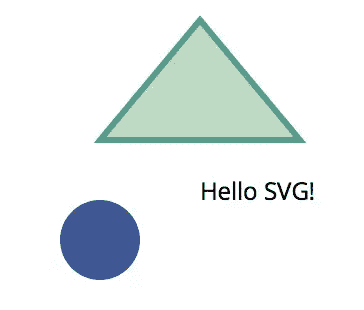
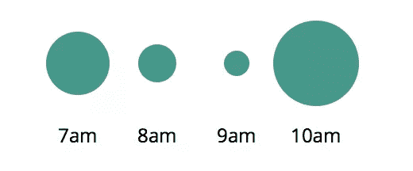
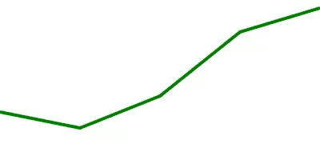
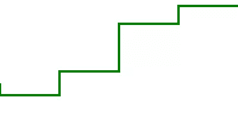
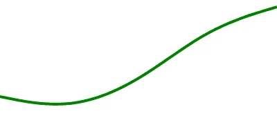

# 通过示例学习创建 D3.js 数据可视化

> 原文：<https://www.sitepoint.com/d3-js-data-visualizations/>

*这篇文章由[米凯拉·莱尔](https://www.sitepoint.com/author/mlehr)和[蒂姆·塞韦里恩](https://www.sitepoint.com/author/tseverien/)进行了同行评审。感谢 SitePoint 的所有同行评审员使 SitePoint 的内容尽可能做到最好！*

> [D3.js](https://d3js.org/) 是一个基于数据操作文档的 JavaScript 库。D3 帮助您使用 HTML、SVG 和 CSS 将数据变得生动。

我建议每个 web 开发者应该学习三个 JavaScript 库:jQuery、下划线和 D3。这些库允许你以新的方式思考代码:jQuery 允许你用 DOM 写得更少，做得更多，下划线(或 lodash)为你提供了改变你写程序方式的功能工具，D3 为你提供了丰富的数据操作和图形编程工具集。如果你对 D3 不熟悉，请花点时间看看令人印象深刻的[示例库](https://github.com/mbostock/d3/wiki/Gallery)，看看可以用它做什么。

这不是你爸爸的图表库。

威廉·普莱费尔在 1786 年发明了*条形图*、*线*和*区域*图表，并在 1801 年发明了*饼图*。今天，这些仍然是大多数数据集的主要呈现方式。现在，这些图表是*优秀的*，但是 D3 给了你工具和灵活性来为网络制作*独特的*数据可视化，你的创造力是唯一的限制因素。

D3 是一个非常灵活的低级可视化库，具有类似 jQuery 的 API，用于将数据映射到 HTML 和 SVG 文档。它包含大量有助于数据转换和物理计算的数学函数，尽管它的大部分功能来自于操纵 SVG 中的几何图形和路径。

这篇文章旨在给你一个 D3 功能的高层次概述，在每个例子中你将能够看到*输入*数据、*转换*和*输出*文档。我将向您展示代码，而不是解释每个函数的功能，您应该能够大致了解事情是如何工作的。我只对最重要的概念 *[比例](https://github.com/d3/d3-3.x-api-reference/blob/master/Scales.md)* 和 *[选择](https://github.com/d3/d3-3.x-api-reference/blob/master/Selections.md)* 进行详细说明。

## 条形图



[参见密码笔](http://codepen.io/SitePoint/pen/wWJXWa)

我承诺给你比 William Playfair 的图表更多的东西，但是用 HTML 制作简单的条形图是理解 D3 如何将数据转换成文档的最简单的方法之一。看起来是这样的:

```
d3.select('#chart')
  .selectAll("div")
  .data([4, 8, 15, 16, 23, 42])
  .enter()
  .append("div")
  .style("height", (d)=> d + "px") 
```

`selectAll`函数返回一个 D3“选择”:当我们`enter`和`append`为每个数据点创建一个 div 时，会创建一个元素数组。

这段代码将输入数据`[4, 8, 15, 16, 23, 42]`映射到这个输出 HTML。

```
<div id="chart">
  <div style="height: 4px;"></div>
  <div style="height: 8px;"></div>
  <div style="height: 15px;"></div>
  <div style="height: 16px;"></div>
  <div style="height: 23px;"></div>
  <div style="height: 42px;"></div>
</div> 
```

所有不变的样式属性都可以放在 CSS 中。

```
#chart div {
  display: inline-block;
  background: #4285F4;
  width: 20px;
  margin-right: 3px;
} 
```

## GitHub 贡献图

通过几行额外的代码，我们可以将上面的条形图转换成类似于 Github 的贡献图。



[参见密码笔](http://codepen.io/SitePoint/pen/rLyKLG)

我们可以设置一个`background-color`，而不是基于数据的值来设置高度。

```
const colorMap = d3.interpolateRgb(
  d3.rgb('#d6e685'),
  d3.rgb('#1e6823')
)

d3.select('#chart')
  .selectAll("div")
  .data([.2, .4, 0, 0, .13, .92])
  .enter()
  .append("div")
  .style("background-color", (d)=> {
    return d == 0 ? '#eee' : colorMap(d)
  }) 
```

`colorMap`函数接受一个介于 0 和 1 之间的输入值，并根据我们提供的两个值之间的颜色渐变返回一个颜色。插值是图形编程和动画中的一个关键工具，我们将在后面看到更多的例子。

## SVG 优先

D3 的强大之处在于它能与 SVG 一起工作，SVG 包含了用于绘制 2D 图形的标签，如圆形、多边形、路径和文本。



```
<svg width="200" height="200">
  <circle fill="#3E5693" cx="50" cy="120" r="20" />
  <text x="100" y="100">Hello SVG!</text>
  <path d="M100,10L150,70L50,70Z" fill="#BEDBC3" stroke="#539E91" stroke-width="3">
</svg> 
```

上面的代码绘制了:

*   半径为 20，50，120 的圆
*   文本“Hello SVG！”在 100，100
*   具有 3px 边界的三角形，`d`属性具有以下指令
    *   移动到 100，10
    *   线到 150，70
    *   线到 50，70
    *   闭合路径(Z)

`<path>`是 SVG 中最强大的元素。

## 环



[参见密码笔](http://codepen.io/SitePoint/pen/jrBKMM)

前面例子中的数据集是一个简单的数字数组，D3 也可以处理更复杂的类型。

```
const data = [{
  label: "7am",
  sales: 20
},{
  label: "8am",
  sales: 12
}, {
  label: "9am",
  sales: 8
}, {
  label: "10am",
  sales: 27
}] 
```

对于每个数据点，我们将把一个`<g>`(组)元素添加到`#chart`中，并把`<circle>`和`<text>`元素添加到每个元素中，这些元素都带有我们对象的属性。

```
const g = d3.select('#chart')
  .selectAll("g")
  .data(data)
  .enter()
  .append('g')
g.append("circle")
  .attr('cy', 40)
  .attr('cx', (d, i)=> (i+1) * 50)
  .attr('r', (d)=> d.sales)
g.append("text")
  .attr('y', 90)
  .attr('x', (d, i)=> (i+1) * 50)
  .text((d)=> d.label) 
```

变量`g`保存一个 d3“选择”,其中包含一个由`<g>`节点组成的数组，像`append()`这样的操作会向选择中的每一项添加一个新元素。

这段代码将输入数据映射到这个 SVG 文档中，你能看出它是如何工作的吗？

```
<svg height="100" width="250" id="chart">
  <g>
    <circle cy="40" cx="50" r="20"/>
    <text y="90" x="50">7am</text>
  </g>
  <g>
    <circle cy="40" cx="100" r="12"/>
    <text y="90" x="100">8am</text>
  </g>
  <g>
    <circle cy="40" cx="150" r="8"/>
    <text y="90" x="150">9am</text>
  </g>
  <g>
    <circle cy="40" cx="200" r="27"/>
    <text y="90" x="200">10am</text>
  </g>
</svg> 
```

## 折线图



[参见密码笔](http://codepen.io/SitePoint/pen/pbeKER)

在 SVG 中绘制折线图非常简单，我们希望像这样转换数据:

```
const data = [
  { x: 0, y: 30 },
  { x: 50, y: 20 },
  { x: 100, y: 40 },
  { x: 150, y: 80 },
  { x: 200, y: 95 }
] 
```

到本文档中:

```
<svg id="chart" height="100" width="200">
  <path stroke-width="2" d="M0,70L50,80L100,60L150,20L200,5">
</svg> 
```

**注意**:从图表的高度(100)中减去`y`值，因为我们希望`y`值 100 位于 svg 的顶部(从顶部算起为 0)。

假设它只有一个路径元素，我们*可以*用这样的代码自己做:

```
const path = "M" + data.map((d)=> {
  return d.x + ',' + (100 - d.y);
}).join('L');
const line = `<path stroke-width="2" d="${ path }"/>`;
document.querySelector('#chart').innerHTML = line; 
```

D3 有路径生成函数，使这变得更简单，下面是它的样子。

```
const line = d3.svg.line()
  .x((d)=> d.x)
  .y((d)=> 100 - d.y)
  .interpolate("linear")

d3.select('#chart')
  .append("path")
  .attr('stroke-width', 2)
  .attr('d', line(data)) 
```

*比*好多了！`interpolate`函数也有几种不同的方法可以在 x，y 坐标周围画线。看用“线性”、“前一步”、“基础”、“基数”怎么看。






## 天平

> 比例是将输入域映射到输出范围的函数。

[参见密码笔](http://codepen.io/SitePoint/pen/aZJKmG)

到目前为止，在我们看到的例子中，我们已经能够使用“幻数”在图表范围内定位事物，当数据是动态的时，您需要做一些数学计算来适当地缩放数据。

假设我们想要使用以下数据呈现一个 500 像素宽、200 像素高的折线图:

```
const data = [
  { x: 0, y: 30 },
  { x: 25, y: 15 },
  { x: 50, y: 20 }
] 
```

理想情况下，我们希望 y 轴值从 0 到 30(最大 y 值), x 轴值从 0 到 50(最大 x 值),以便数据占据图表的整个维度。

我们可以使用`d3.max`找到数据集中的最大值，并创建*标度*，用于将 x，y 输入值转换为 SVG 路径的 x，y 输出坐标。

```
const width = 500;
const height = 200;
const xMax = d3.max(data, (d)=> d.x)
const yMax = d3.max(data, (d)=> d.y)

const xScale = d3.scale.linear()
  .domain([0, xMax]) // input domain
  .range([0, width]) // output range

const yScale = d3.scale.linear()
  .domain([0, yMax]) // input domain
  .range([height, 0]) // output range 
```

这些比例类似于我们之前创建的颜色插值函数，它们只是将输入值映射到输出范围某处的值的函数。

```
xScale(0) -> 0
xScale(10) -> 100
xScale(50) -> 500 
```

它们还处理输入域之外的值:

```
xScale(-10) -> -100
xScale(60) -> 600 
```

我们可以在我们的线生成函数中使用这些比例，如下所示:

```
const line = d3.svg.line()
  .x((d)=> xScale(d.x))
  .y((d)=> yScale(d.y))
  .interpolate("linear") 
```

另一件可以很容易地使用缩放的事情是指定输出范围周围的填充:

```
const padding = 20;
const xScale = d3.scale.linear()
  .domain([0, xMax])
  .range([padding, width - padding])

const yScale = d3.scale.linear()
  .domain([0, yMax])
  .range([height - padding, padding]) 
```

现在，我们可以呈现一个动态数据集，我们的折线图将始终适合我们的 500px / 200px 边界，所有边都有 20px 的填充。

线性标度是最常见的类型，但也有其他类型，如代表指数标度的`pow`和代表非数字数据(如名称或类别)的`ordinal`标度。除了[数量刻度](https://github.com/mbostock/d3/wiki/Quantitative-Scales)和[顺序刻度](https://github.com/mbostock/d3/wiki/Ordinal-Scales)之外，还有[时间刻度](https://github.com/mbostock/d3/wiki/Time-Scales)用于绘制日期范围。

例如，我们可以创建一个标度，将我的寿命映射到一个 0 到 500 之间的数字:

```
const life = d3.time.scale()
  .domain([new Date(1986, 1, 18), new Date()])
  .range([0, 500])

// At which point between 0 and 500 was my 18th birthday?
life(new Date(2004, 1, 18)) 
```

## 动画飞行可视化

这一切都很好，但迄今为止，我们只看到了静态的无生命的图形。让我们制作一个动画图像，显示澳大利亚墨尔本和悉尼之间一段时间内的活动航班。

在 [CodePen](http://codepen.io) 上看到笔[D3-航班](https://codepen.io/SitePoint/pen/wWJXoK/)by site point([@ site point](http://codepen.io/SitePoint))。