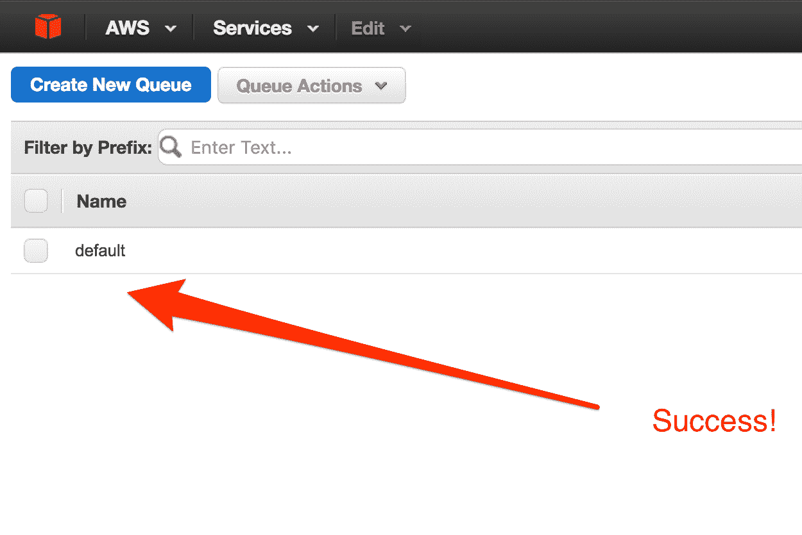

# 与肖鲁肯和 SQS 一起快速处理 API 请求

> 原文：<https://www.sitepoint.com/quickly-process-api-requests-with-shoryuken-and-sqs/>


Rails 有很多后台工作的解决方案。其中之一是一颗名为 Sidekiq，[的璀璨宝石，我们之前在 Sitepoint](https://www.sitepoint.com/comparing-background-processing-libraries-sidekiq/) 上写过。

Sidekiq 很棒，可以解决大部分开发者需求。它特别有用，因为它可以从铁轨上接过重物。然而，它有几个缺点:

*   如果你不是专业用户(每年 750 美元)并且你的进程崩溃了，你将失去你的工作。
*   如果你的工作量增加，你将需要一个更强大的 Redis 版本，这将花费更多的金钱和资源。
*   您需要托管它的仪表板，以便监控您的作业发生了什么。

你可能想考虑的另一种处理排队作业的方法是 [Shoryuken](https://github.com/phstc/shoryuken) ，它与亚马逊的 SQS(简单队列服务)协同工作。这是一个基本的消息存储库，您可以稍后通过 Shoryuken workers 处理它。这些工人然后在主 Rails 进程之外工作。有了 SQS 和肖鲁肯，你可以创建一个队列供你的工人使用，这些工人循环完成作业，直到队列为空。

使用 Shoryuken 的一些好处:

*   它是以亚马逊 SQS 为中心构建的，非常便宜(每 100 万个亚马逊 SQS 请求 0.50 美元)。
*   SQS 是按比例建造的。您正在利用亚马逊令人惊叹的基础设施，因此很容易扩展您的员工。
*   Amazon 提供了一个简单的控制台来监视您的队列，并配置如何处理死信。
*   亚马逊的 Ruby SDK 在创建队列时非常灵活。你可以想创造多少就创造多少。

在本文中，我将指导您设置 Shoryuken，以便与 Flickr API 一起使用。您将看到 Shoryuken 如何以闪电般的速度在后台处理作业。

为了开始本教程，我们将使用 Flickr API 创建一个简单的搜索栏，我们可以根据输入的 id 生成照片。

1.  首先，我们必须[建立一个雅虎账户](https://help.yahoo.com/kb/SLN2056.html)，因为这是我们访问 Flickr API 的唯一途径。一旦我们有了雅虎账户，只需访问 [Flickr 文档页面](https://www.flickr.com/services/api/)
2.  在 [Flickr 文档](https://www.flickr.com/services/api/)页面点击[创建应用](https://www.flickr.com/services/apps/create/)链接。
3.  在[Flickr.com](https://www.flickr.com/services/apps/create/noncommercial/)申请非商用钥匙。
4.  在下一页，将要求您输入有关项目的一些详细信息。只需填写项目的名称和其他信息。
5.  您将收到您的应用程序的密钥和密码。把它们写在某个地方，因为我们将在本教程中用到它们。

接下来，用一个控制器动作设置 Rails 应用程序。要设置一个新的 Rails 应用程序，从命令行生成一个如下所示的程序:

```
rails new shoryuken_flickr 
```

接下来，设置控制器。带有`index`动作的标准控制器动作是完美的:

```
rails g controller Search index 
```

在 **config/routes.rb** 中为这个动作添加一个根路由:

```
root  'search#index' 
```

在索引页面上，设置一个简单的搜索表单:

```
<%= form_tag("/", method: "get") do %>
  <%= text_field_tag(:flickr_id) %>
  <%= submit_tag("Search") %>
<% end %> 
```

我们必须设置一个 Flickr 模块来返回提交的用户 ID 的照片:

1.  首先，我们安装了 [flickr_fu](https://github.com/commonthread/flickr_fu) ,这使得获取我们想要的数据变得很容易。
2.  用我们的相关凭证建立 **flickr.yml** 文件。该文件位于**配置**文件夹中，看起来像:

    ```
    key: <%= ENV["flickr*key"] %>
    secret: <%= ENV["flickr*secret"] %>
    token_cache: "token_cache.yml 
    ```

3.  现在我们创建一个助手方法来返回索引页面的照片。在**app/helpers/search _ helper . Rb**中，添加以下内容:

    ```
    module SearchHelper
      def user_photos(user_id, photo_count = 5)
        flickr = Flickr.new(File.join(Rails.root, 'config','flickr.yml'))
        flickr.photos.search(:user_id => user_id).values_at(0..(photo_count - 1))
      end
    end 
    ```

该方法根据提供的 Flickr 用户 ID 返回照片。在**app/controllers/search _ controller . Rb**中，我们需要加入一个动作来获取数据:

```
 class SearchController < ApplicationController
    def index
      if params[:flickr_id]
        @photos = user_photos(params[:flickr_id],10).in_groups_of(2)
        @id = params[:flickr_id]
      end
    end
  end 
```

现在，只需创建一个小部分来生成照片。在 **app/views/search** 中，添加一个 **photos.html.erb** 文件，内容如下:

```
 <ul>
    <% @photos.each do |photo| %>
      <li> <% photo.each do |p| %>
      <%= link_to(image_tag(p.url(:square), :title => p.title, :border => 0, :size => '375x375'), p.url_photopage) %>
      </li>
    <% end %>
  <% end %>
  </ul> 
```

Flickr ids 出现在 URL 中的用户配置文件上。一个示例 ID 是`138578671@N04`，如果您在表单中提交该值，就会返回一堆照片。

现在我们有了一个可以从 Flickr 获取新照片的应用程序。这很棒，但是对用户来说非常慢，而且每次都刷新整个页面。

我认为这个应用程序将更好地与一点 AJAX。首先，在 **app/views/search** 中创建一个 **index.js.erb** 视图，并放入一些简单的 Javascript:

```
$('ul').remove();
$('#flickr').append("<%= j render 'photos'%>").html_safe(); 
```

在控制器中，确保我们有一个用于代码的`respond_to`块:

```
class SearchController < ApplicationController
  def index
    if params[:flickr_id]
      @photos = user_photos(params[:flickr_id],10).in_groups_of(2)
      @id = params[:flickr_id]
    end
    respond_to |format|
      format.html
      format.js
    end
  end
end 
```

最后，在搜索表单中，将`remote`设置为`true`:

```
<br/>
  <%= form_tag("/", method: "get", :remote => true) do %>
  <%= text_field_tag(:flickr_id) %>
  <%= submit_tag("Search") %> <% end %>
<br/> 
```

好吧，这很酷，但我们还没有使用 Shoryuken。该进程仍然是单线程的。

## 设置 Shoryuken

如果你还没有一个[亚马逊网络服务(AWS)](https://aws.amazon.com) 账户，你需要设置一个。跟随

1.  单击“我的帐户”下拉菜单，然后单击“AWS 管理控制台”。
2.  登录，然后您将被带到 AWS 管理控制台。
3.  在右上角的菜单栏中单击您的用户名，然后单击“安全凭证”。
4.  现在您将被带到一个页面，在这里您可以访问您的 AWS 访问密钥(访问密钥 ID 和秘密访问密钥)
5.  点击“创建新的访问密钥”并记下您的访问密钥 ID 和秘密访问密钥。你需要这些来管理肖鲁肯和 SQS。

一旦我们有了 AWS 访问密钥，下一步就是安装和配置相关的 gem。首先，通过将以下内容添加到您的 gem 文件中，安装带有相关细节的 AWS SDK:

```
gem 'aws-sdk', '~> 2' 
```

然后，`bundle install`。

我们需要用相关的凭证配置 AWS SDK。我通常会创建一个名为 **aws.rb** 的文件，放在**config/initializer**文件夹中

```
touch config/initializers/aws.rb 
```

将以下代码添加到文件中:

```
Aws.config.update({ 
  region:      "eu-west-1",
  credentials: Aws::Credentials.new(your_access_key, your_secret_key)
})

sqs = Aws::SQS::Client.new(
  region:      "eu-west-1",
  credentials: Aws::Credentials.new(your_access_key, your_secret_key)
)
sqs.create_queue({queue_name: 'default'}) 
```

请确保用您的实际凭据替换这些凭据。

如果我们转到 SQS 控制台，我们会看到在重启 Rails 服务器时创建了一个新队列。



最后，安装肖鲁肯宝石的时间到了。在我们的 Gemfile 中:

```
gem 'shoryuken' 
```

创建 Shoryuken worker 和一些中间件。我只是在 **apps** 下创建一个新目录，名为 **workers** :

```
mkdir app/workers
touch app/workers/flickr_worker.rb
touch app/workers/flickr_middleware.rb
touch config/shoryuken.yml 
```

配置我们的 Flickr 中间件:

```
class FlickrMiddleware
  def call(worker_instance, queue, sqs_msg, body)
    puts 'Before work'
    yield
    puts 'After work'
  end
end 
```

设置工作人员:

```
class MyWorker
  include Shoryuken::Worker
  shoryuken_options queue: QUEUE_NAME, auto_delete: true, body_parser: JSON

  def perform(sqs_msg, body)
    id = body.fetch('id')
    flickr = Flickr.new({
      key:"your_key",
      secret:"your_secret",
      token_cache:"token_cache.yml"
    })
    flickr.photos.search(:user_id => id).values_at(0..(5 - 1))
  end
 end 
```

以及将我们的 **config/shoryuken.yml** 文件配置为:

```
aws:
  access_key_id: 'AWS_KEY'
  receive_message:
    attribute_names:
    - ApproximateReceiveCount
    - SentTimestamp
  region: eu-west-1
  secret_access_key: 'AWS Secret Key'
  concurrency: 25
  delay: 0
  queues:
    - [default, 6] 
```

太棒了。我们几乎已经准备好了一切。剩下的就是向我们的队列发送消息。在搜索控制器中，输入以下内容:

```
 class SearchController < ApplicationController
    include SearchHelper

    def index
      # 138578671@N04 submit this in the form
      if params[:flickr_id]
        FlickrWorker.perform_async("id" => params[:flickr_id])
        sleep 0.1
        @photos = Photo.find_by_user_id(params[:flickr_id]).photos
      end
      respond_to do |format|
        format.html
        format.js
      end
    end
  end 
```

现在我们只需提交另一条消息。这一次，您应该看到它出现在 SQS 控制台上。您可能需要使用屏幕右上角的刷新按钮来刷新 SQS 控制台。

您应该会看到队列中有一条消息，但是由于某种原因，它没有被处理。最好弄清楚。打开另一个终端窗口并导航到您的项目。在那里，您必须运行以下命令:

```
bundle exec shoryuken -R -C config/shoryuken.yml 
```

现在，您应该看到您的工作人员正在清理队列。当你回到你的应用程序，你可能会看到一个错误。记住，Shoryuken 在后台运行，所以它不能为当前进程创建实例变量。您可以将照片保存到数据库中，然后在结果到达时轮询该表。

```
rails g model Photo user_id:string photos:string 
```

现在，我们只需检查我们的迁移文件，确保添加了正确的字段。打开迁移文件(在 **db/migrate** 中)并确保它看起来像:

```
class CreatePhotos < ActiveRecord::Migration
  def change
    create_table :photos do |t|
      t.string :user_id
      t.string :photos

      t.timestamps null: false
    end
  end
end 
```

如果一切正常，我们需要迁移数据库。

```
rake db:migrate 
```

确保序列化数据库中返回的数组。在 **app/models/photos.rb** 中:

```
class Photo < ActiveRecord::Base
  serialize :photos
end 
```

然后在每次运行 worker 时更新我们的表。在`SearchHelper#user_photos`方法的底部添加一行将照片写入数据库:

```
photos = flickr.photos.search(:user_id => id).values_at(0..(5 - 1))
Photo.create(:user_id => id, :photos => [photos]) 
```

要查看它的工作情况，请为您的搜索控制器操作添加一个延迟，让您的数据库有机会更新。在现实世界中，我建议使用 AJAX 的更优雅的解决方案。

```
sleep 1.5 
```

这就是了。现在，您已经知道如何利用一些很棒的库，通过 Shoryuken 处理排队的任务。虽然这个例子很不自然，但我用它来演示如何在 SQS 中使用 Shoryuken。毫无疑问，您可能至少有一个用例会受益于排队消息。

## 分享这篇文章