# 什么是脸书画布:完全指南

> 原文：<https://www.sitepoint.com/what-is-facebook-canvas-a-complete-guide/>

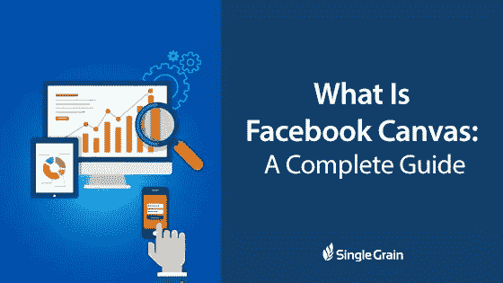

*这篇文章最初出现在 Single Grain 上，这是一家专注于扩大客户获取规模的成长型营销机构。*

脸书广告公司总是推出令人兴奋的新方法来与客户互动，并推动参与和转化。图片轮播广告和[领先广告](https://www.singlegrain.com/marketing-strategy-2/facebook-lead-ads-everything-you-need-to-know-increase-mobile-conversions/)就是两个很好的例子，它们都为营销人员提供了不同的目的。有了图像轮播广告，你可以讲述一个故事或展示多种产品；销售线索广告旨在获得尽可能多的销售线索信息。

脸书画布是最近刚刚向企业和广告商大规模推出的最新功能，它肯定与我们习惯的不同。

在这篇文章中，我们将看看什么是脸书画布，它可以如何使用，为什么你应该使用它，如何创建它，等等。

## 什么是脸书画布？

直接出自[脸书](https://canvas.facebook.com/)之口:“画布是一种身临其境、富于表现力的脸书体验，让企业讲述他们的故事，展示他们的产品。”

换句话说，这是一种企业可以创造的互动内容。例如，其中一个选项是一张带有标签的图片，标签上写着“点击打开”一旦用户点击它，图片将带他们到一个全屏广告，其中有多个幻灯片，他们可以滚动。如果你选择的话，每个屏幕都可以有一个可点击的链接把用户带到你的网站，你也可以有一个非常简单的行动号召，比如“立即点击购物”

Canvas 旨在帮助企业讲述一个消费者会喜欢且对其业务有益的故事。它们还高度可定制。

只有活跃地使用移动设备并在 iOS 和 Android 上工作的用户才能查看画布。

直到最近，只有几个大品牌，如环球影城，温迪的，和目标，有机会访问脸书画布，而它是在测试阶段。

## 为什么使用脸书画布？

脸书画布张贴和广告是不同的，他们是互动的。它们不同于我们目前在脸书上看到的任何其他类型的内容，这使得用户对它们更感兴趣。

几个月前，我看到了环球影业的一则脸书帆布广告，尽管当时我并不知道这是什么，但它还是引起了我的注意，我拍了一张截图，以便日后研究。该截图如下图所示:

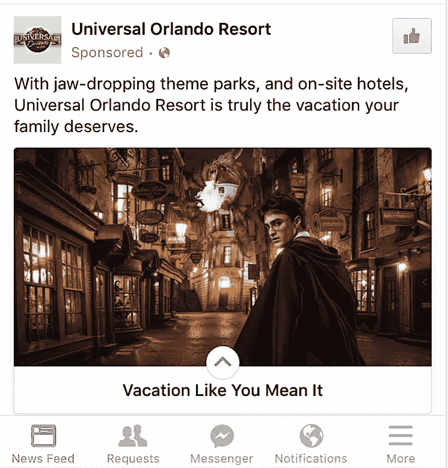

Canvas 目前是一个仅限移动设备的体验，旨在让用户继续在一个画布中浏览我称之为“页面”或幻灯片的内容(很像在一篇文章中向下滚动，这会让你离开你的新闻订阅，但让你留在脸书应用程序中)。这很重要，因为:

*   脸书 78%的广告收入来自移动广告。
*   据估计，目前脸书每月有 90 亿用户，其中 11.9 亿人通过移动设备访问该平台，其中 5.81 亿是纯移动用户。
*   脸书 75%的视频浏览量来自手机。

这些统计数据告诉我们，手机的使用正在增加，找到与手机用户联系的新方式可以帮助企业和脸书广告的成功。

脸书画布还允许我们在单个帖子或广告中添加更多的信息片段(文本、图像、视频和 CTA)，使它们更有价值。你可以突出更多的产品，展示单个产品的更多使用案例，或者使用 Canvas 讲述一个故事，让你的观众参与进来，帮助建立品牌关系。

## 如何创建脸书画布

创作脸书画布实际上比我想象的要容易得多；像所有的脸书一样，创建过程是用户友好的，非常简单。

有大量选项可供选择，允许您定制画布的几乎每一个方面。一开始这可能会让人不知所措，但是请记住，您可以创建多个画布并测试它们，看看哪一个最适合您。

本教程将介绍如何访问画布生成器，如何使用画布生成器创建新画布，不同视觉选项的概述，推荐的图像规格，以及如何使用已完成的画布运行活动。

## 哪里可以找到画布

脸书画布现在几乎每个人都可以通过电源编辑器。要通过 Power Editor 访问 Canvas，您需要在实际的广告级别创建一个新的广告。选择带有图像或视频的广告。

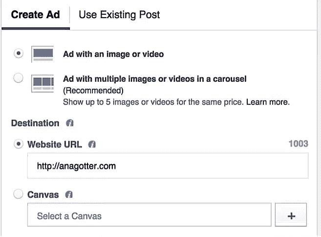

在网址下面，你会看到选择画布的选项。你可以点击它旁边的+号来创建一个。

一旦在 Power Editor 中构建了画布，您就可以通过页面的发布工具和 composer 来访问完成的画布。

如果您不喜欢 Power Editor，也不想使用它来创建画布，您可以请求从您的页面访问画布生成器。有些用户可能已经有了。

要从页面中查找画布，请转到发布工具。

从那里，向下滚动，直到你看到画布，如果你可以访问它。

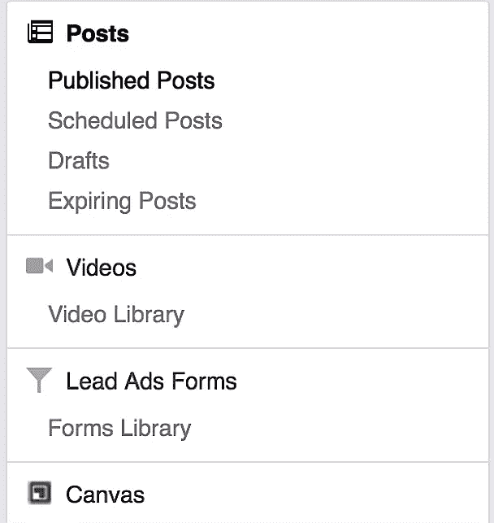

如果您还没有此权限，您可以在此处[请求访问。](https://www.facebook.com/help/contact/162497704112958)

## 创建画布的“主页”

在本教程中，我将向您展示如何从页面管理器创建一个画布，但是构建器在那里和在 Power Editor 中看起来是一样的。

同样，要从页面中找到 Canvas，请转到发布工具，然后向下滚动到 Canvas。

在这里，您可以查看当前和已经创建的画布，并且可以通过单击右上角的蓝色“+Create”按钮来创建新的画布。

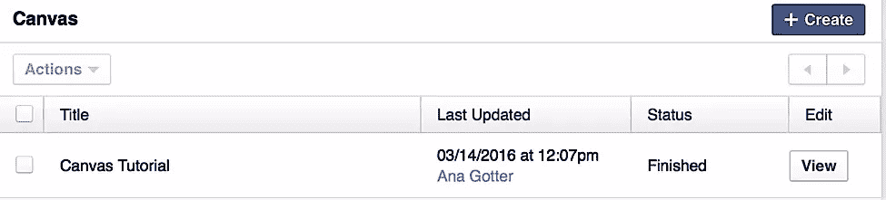

这将打开画布生成器，您将立即被提示命名画布。

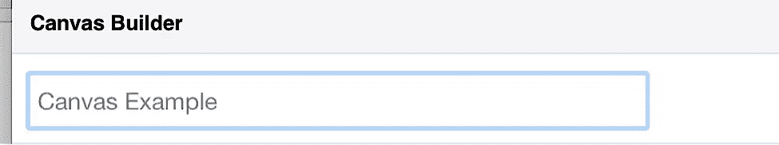

然后为画布选择一个主题。您可以选择白色、黑色或自定义主题。

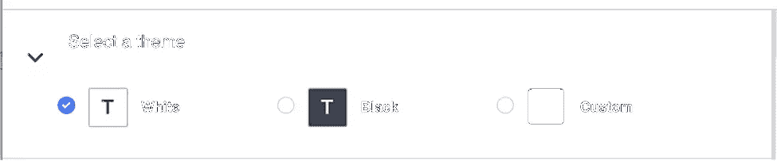

主题决定了画布底部的外观。您选择的主题将是非图像空间的背景色。

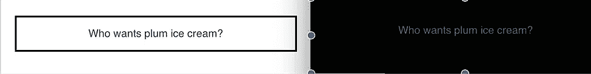

在标题部分，你可以为你的画布上传一个标志。您可以在右侧的快速预览中看到它的样子。

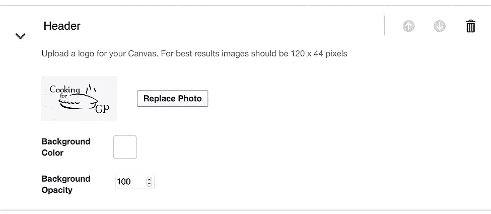

在同一个部分，你也可以为你的标题选择背景颜色，以及背景的不透明度(背景标题的透明度)。因为我从我的网站上选择了一个可以适应任何背景的标志，在这里也是如此。

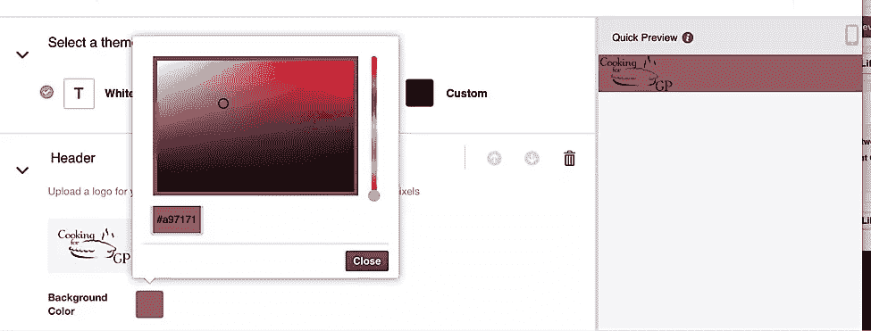

在下一部分，您将上传一张照片，并为您的画布选择“主页”的格式。你首先要上传一张照片，它会占据首页的大部分。然后从图像格式选项中选择，我们将在本文的下一部分讨论。

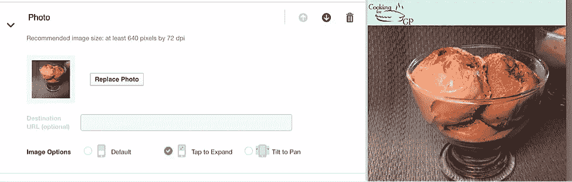

画布创建器的下一部分是“按钮”部分。填写用户可以单击的按钮的文本。这个按钮将把用户带到一个目标 URL，所以文本需要简短。

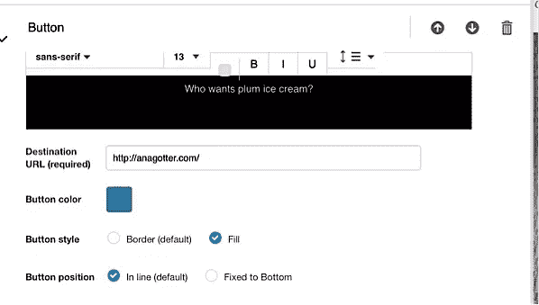

在按钮部分，您可以选择按钮文本的字体、文本的大小、文本行上下的间距、文本的颜色以及加粗、斜体和下划线等附加功能。

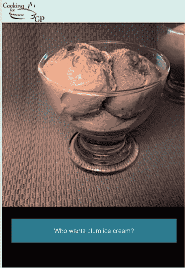

文本格式化后，您还可以定制可点击的按钮。您可以选择按钮的颜色，以及您是希望该颜色填充它还是只是一个边框，以及您是希望按钮对齐还是固定在画布的底部。一旦您做出了这些决定，您的画布的“主页”就完成了，您可以添加更多的组件。

## 画布的图像选项

当你创建画布时，你会得到三个不同的画布首页格式选项。

这些选项是:

*   **默认**。图像占据了大部分屏幕，不需要交互就可以完整地查看。*输入 URL 目的地仅适用于此图像选项。*
*   **点击展开**。当用户点击图像时，他们会在全屏上看到它，并可以放大图像。
*   **倾斜至平移**。使用此选项，用户将倾斜他们的设备来左右旋转图像，使图像具有交互性和动态性。

所有三个图像选项适用于不同的图像和不同类型的活动。用不同的图片(和不同的目标)来测试它们，看看哪种最适合你。

一旦你完成了你的画布(附加组件和所有)，点击保存草稿，可以在你的画布的快速预览上面找到，然后点击完成。你需要在脸书让你完成之前保存它。请记住，一旦你点击完成按钮，脸书将生成一个网址，你可以附加到您的广告，你将无法再编辑它。

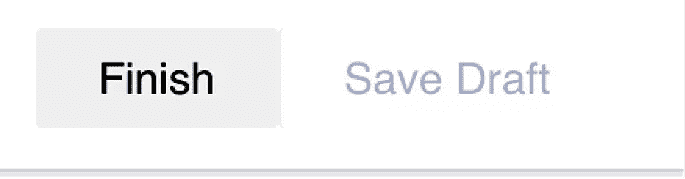

## 向画布添加组件

一旦你完成了画布的“主页”,你可以选择添加更多的组件。这些组件是 canvas 帖子和广告如此伟大的一大部分原因——它们是交互式的，为查看它们的用户提供更多信息和图像。

添加组件时，您可以选择添加:

*   一个按钮
*   一个图像转盘，需要你上传至少两个图像，用户将垂直滚动(而不是水平)
*   一张照片
*   文本块，不像按钮那样可以点击，但是可以包含比按钮多得多的文本
*   av 视频

要添加组件，请单击画布生成器底部的“添加组件”按钮。

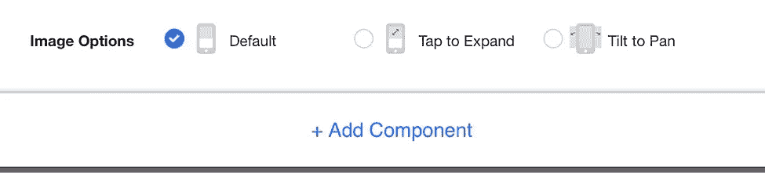

然后会询问您想要添加什么类型的组件。您可以一次选择多个组件，这些组件将按顺序添加到您的画布中。

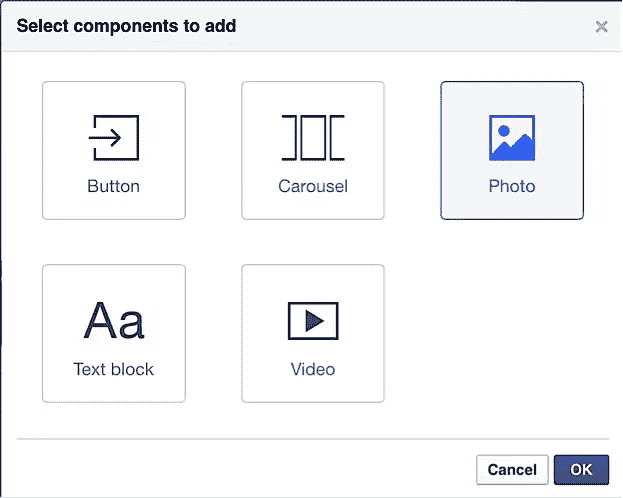

通过单击垃圾桶旁边的向上和向下箭头，可以对组件进行重新排序(这将完全删除一个组件)。

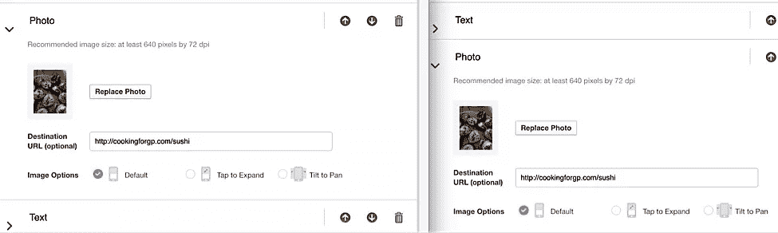

当您和用户在不同的组件间滚动时，您的标题将始终停留在画布的顶部。

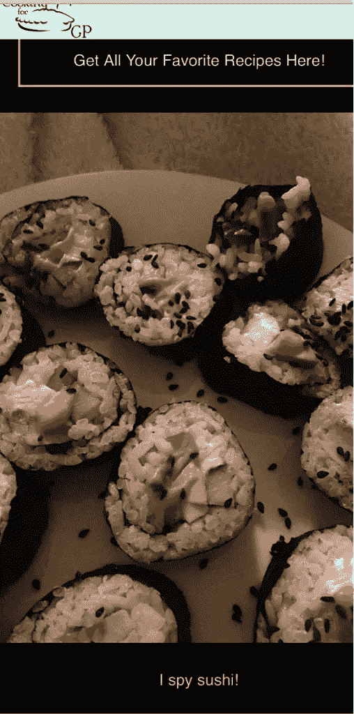

## 推荐规格和用途

为了获得最佳视觉效果，并让您的内容在画布上被接受，在创建画布时需要记住一些推荐的规格和使用要求。这些产品直接来自脸书，包括:

*   该徽标的推荐规格为 120×44 像素
*   主图像的推荐图像尺寸为 640 像素 72 DPI
*   按钮的文本需要简短，并且似乎需要适合一行，文本大小为 14
*   图像传送带需要至少有两个图像，并且图像需要具有相同的大小。图像传送带也不能有“点击打开”图像选项。
*   视频需要不超过 2 分钟，建议您添加字幕，这样人们就可以在没有音频的情况下参与进来。“点击打开”也不适用于视频组件。

## 创建画布广告

在你创建了你的画布(并仔细检查了拼写错误！)并点击完成按钮，您就可以查看您的广告了。

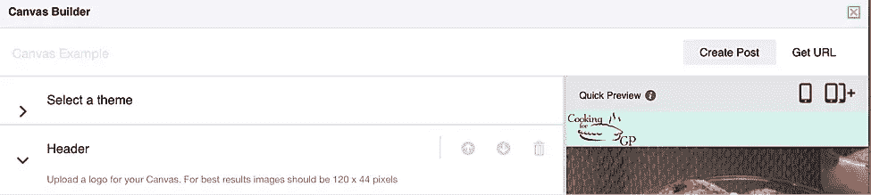

当您选择完成的画布时，您可以选择立即将其转换为页面帖子，或者复制画布 URL。

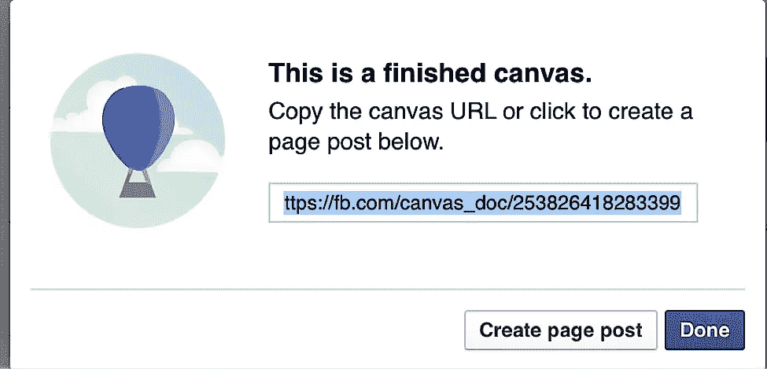

要在 Power Editor 中创建画布广告，您可以创建新的画布，或者在创建新广告时选择以前制作的画布。

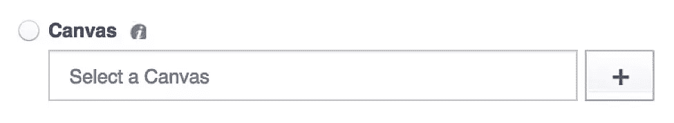

然后，您可以像往常一样创建广告的其余部分。

## 最后的想法

脸书画布是新的，它是不同的，这自然使它兴奋的用户和营销人员。随着越来越多的用户转向移动平台，并越来越多地在他们的移动设备上访问脸书，使用 Canvas 来吸引他们可以产生强大而积极的结果。

创建一个画布比预期的要简单，但是如果你迷失在细节中的话，那就太难了。通过专注于你希望你的画布完成的特定目标，或者你希望它讲述的故事，你可以创建一个有效的营销工具，可以通知、娱乐和鼓励用户之间的销售。

## 分享这篇文章