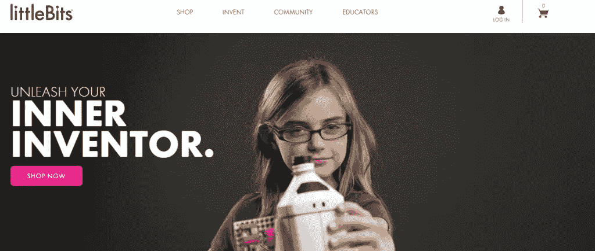
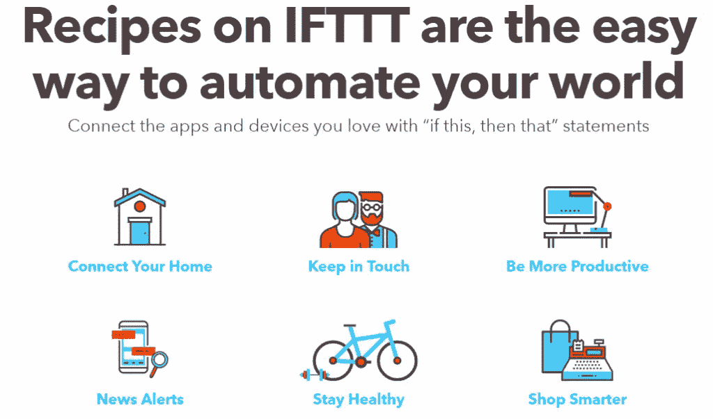
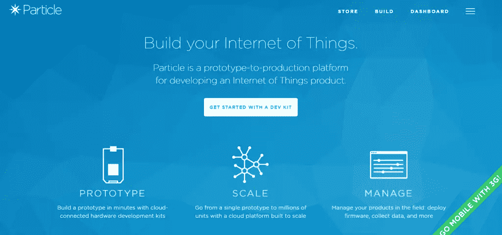
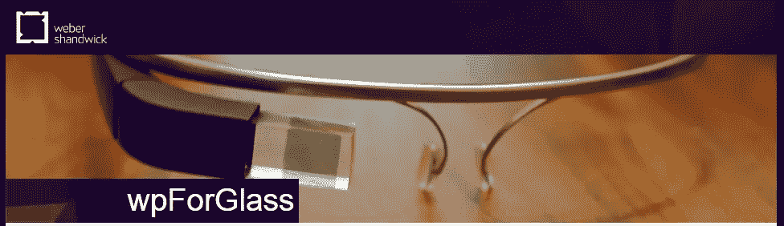
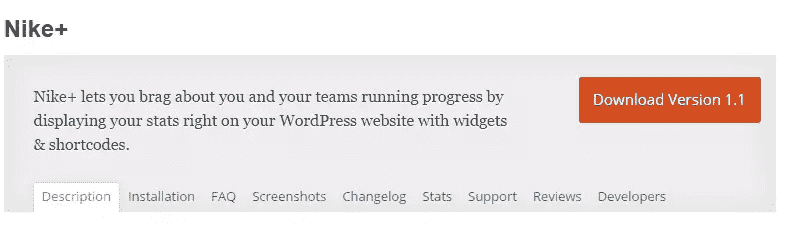

# 将 WordPress 与物联网整合

> 原文：<https://www.sitepoint.com/integrating-wordpress-with-the-internet-of-things/>

SitePoint 的第 10 周！整个星期，我们都在发布关于互联网和物理世界的交集的文章，所以请继续查看[物联网标签](https://www.sitepoint.com/blog/)以获取最新更新。

继电子商务和社交媒体之后，下一个大事件已经到来——支持互联网的设备，或者被称为“[物联网](https://en.wikipedia.org/wiki/Internet_of_things)”——WordPress 准备迎接它。

这一革命性的模式转变将改变我们生活的方方面面，从优化我们的住房到我们的出行方式。尽管物联网已经进入了家庭自动化领域，但它还没有随着 WordPress 的整合而起飞。

物联网通过收集数据和实时利用数据来创造价值。WordPress 和物联网可以以传感器到机器的关系(其中 WordPress 是传感器)一起工作，以提高生产率，使过程更有效，并在不使用额外的复杂机器的情况下分析数据。考虑到这一点，在这篇文章中，我们将从 WordPress 的角度来看物联网，以及它将如何允许我们的网站与设备进行通信，以使物联网变得智能。

在我们开始之前，让我们把每件事情放入上下文中。

## 物联网概述

简单来说，物联网(IoT)就是通过互联网连接各种设备。术语*物联网*本身指的是一组支持互联网的设备的概念，这些设备是智能的、互联的、交互式的和自主的。

> 物联网是关于连接支持互联网的设备，这些设备将信息反馈给我们、基于云的应用程序以及彼此之间(设备到设备)。这些“智能”设备可以是任何东西，从手机、冰箱、洗衣机到可穿戴设备、医疗设备或喷气发动机。–[tech world](http://www.techworld.com/big-data/what-is-internet-of-things-3631109/)

当我们谈论物联网设备时，脑海中最常见的例子是家庭自动化设备，如[灯泡](http://www2.meethue.com/en-xx/)、冰箱、烤面包机和[咖啡机](http://iotlist.co/posts/prodigio-connected-nespresso-machine)。然而，物联网的效果在[智慧城市](https://en.wikipedia.org/wiki/Smart_city)和[农业](http://www.techworld.com/news/big-data/farming-industry-must-embrace-internet-of-things-3596905/)中也是可见的。智能设备通过无线连接与外界联系，无线连接可以通过 Wi-Fi、RFID、NFC 甚至蓝牙建立。

## 简史

凯文·阿什顿经常被认为是“物联网”一词的发明者。虽然我们只是在过去十年左右才听到这个术语，但这个概念最初起源于 70 年代，被称为*普及计算*或*嵌入式互联网*。

经过几次尝试，物联网终于超越了所有的宣传，进入了今天的现代技术基础设施。然而，它是从 1990 年约翰·罗基发明的第一台互联网设备开始逐渐发展起来的，那是在[万维网](https://en.wikipedia.org/wiki/World_Wide_Web)—[互联网烤面包机](http://www.livinginternet.com/i/ia_myths_toast.htm)问世一年后。

> 第一个物联网设备比第一个网页早一年就被创造出来了！

据[物联网分析](https://iot-analytics.com/internet-of-things-definition/)报道，Ashton 于 1999 年将这一革命性现象命名为*物联网*，目的是推广 RFID 技术。物联网在过去几年中发展迅速，这在一定程度上要归功于[云](http://www.webopedia.com/TERM/C/cloud_computing.html)。如果你想更多地了解物联网是如何开始的，它是如何起飞的，请查看 Postscapes 的这段时间线:[物联网简史](http://postscapes.com/internet-of-things-history)。

## 物联网有多大？

你可能听说过*“物联网比你想象的要大得多”*到处都是。但是它到底有多大呢？

*   [IDC](http://cloudtimes.org/2014/11/14/idc-the-market-of-the-internet-of-things-in-more-concrete-than-other-technologies/) 预测，到 2020 年，物联网市场将超过**3 万亿美元**。
*   根据高德纳公司的数据，到 2022 年，一个典型的家庭可能会拥有近 **500 个联网设备**。
*   据 [Business Insider](http://www.businessinsider.com/how-the-internet-of-things-market-will-grow-2014-10) 报道，预计到 2020 年，共有【2020 亿台物联网设备连接到互联网，超过智能手机、平板电脑和台式电脑等 100 亿台传统计算设备。

## 让物联网变得智能

物联网在几乎每个行业都取得了巨大的进步，从灯泡到咖啡机，从室内供暖到牲畜，都有联网设备。随着各种实现的出现，它在 WordPress 中的含义最终成为可能。其中一项技术是 WP REST API，它使物联网与 WordPress 的集成变得更加容易。我们之前已经在 SitePoint 上为感兴趣的人介绍了 WordPress REST API:

*   [WP API——使用 WordPress REST API](https://www.sitepoint.com/wp-api/)
*   [WordPress JSON REST API](https://www.sitepoint.com/wordpress-json-rest-api/)

> “随着数十亿设备在野外相互聊天，web 的未来显然将严重依赖于有清晰的协议和开放的 API 来促进这种通信——这正是 REST API 的设计目的。”汤姆·尤，西太平洋管理大学发展部

WP REST API 与 WordPress 已建立的插件生态系统合作，本质上是为了允许现实世界的设备通过互联网与 WordPress 连接，从而允许 WordPress 用户与现实世界的设备连接。

## WordPress 中物联网的非凡实现

将 WordPress 与流行的自动化服务相结合，你可以改善用户体验，并致力于提高用户参与度和互动性。以下是摘自缅因州单词营的几个案例:

*   专业博主可以设置一个铃声，每当你在博客帖子或页面上获得新评论时，铃声就会立即回复读者。
*   企业主可以使用带有 WordPress 的物联网设备，在每次收到或回答支持票时点亮，以保持员工的积极性，并让员工知道哪些团队成员回复了最多的票。
*   记录下你在一段时间内完成了多少销售，当你公司的销售目标达到时，就挥舞旗帜。
*   设置你的站点，如果你的站点出现停机，它会给你一个移动通知，这样你就可以纠正这个问题。

## WordPress 和流行服务

一些不同的服务允许网站管理员将现实世界的设备和他们的 WordPress 站点连接起来。网站管理员可以使用这些系统将他们的网站与各种物联网设备集成在一起。在本节中，我们将了解其中的四种服务，并重点介绍它们为用户提供的功能。

### [小比特位](http://littlebits.cc/)

littleBits 由电子积木组成，可以用来发明各种新设备，然后通过平台自带的 API 连接到互联网。

> littleBits 制作了一个易于使用的电子积木平台，让每个人都能创造大大小小的发明。–[小比特位](http://littlebits.cc/)

电子积木有**颜色编码**，这使得它们非常容易使用，**磁性**，这使得它们可以方便地相互连接，**可重复使用**，这意味着你可以使用一套积木来创造几个不同的发明。

littleBits 使用户能够发明从智能家居设备到遥控汽车和[旋转滚轮](https://youtu.be/IE9dU_REgmc)到涂鸦向导的一切东西。截至目前，littleBits 库由 60 个模块组成，这些模块可以以几乎数百万种不同的组合方式与其他模块相连，因此您永远不会发明不完的东西。

littleBits 最棒的地方在于，它使用户能够非常轻松地创建模块化的物联网设备。然后，用户可以通过 littleBits 的内置仪表板自动化或控制这些设备，或者与 littleBits 的 API 进行定制集成。

### [IFTTT](https://ifttt.com/)

IFTTT (If This Then That)通过授权发明者建立简单的 If-Then 与应用程序和现实世界产品(他们称之为配方)的联系，为他们开辟了许多创造性的可能性。目前，有两种类型的配方-DO 配方和 IF 配方。

用户可以自定义 DO 食谱来创建按钮、相机和记事本，然后通过简单的点击来启动它们。配方是否必须由用户明确启动，而配方是否在后台自动运行。例如，用户可以将配方配置为:

> 如果我把一张图片发布到 Instagram，就把照片保存到 Dropbox。

截至目前，IFTTT 兼容 321 个频道，包括 WordPress、MailChimp、Workflow、Slack、littleBits、Particle，以及 13 个不同的社交网络平台。这里有一个[频道](https://ifttt.com/channels)的完整列表，你可以用 IFTTT 为其建立配方。

IFTTT 将您选择的频道聚集在一个地方，然后允许用户创建食谱来整合它们以实现目标。每个配方都涉及两个 web 应用程序——一个用来触发，另一个用来执行给定的操作。IFTTT 非常容易上手，其直观的界面允许用户创建食谱，即使他们不是特别懂编程。RC Lations 为 WordPress 开发了一个 [littleBits 插件](https://wordpress.org/plugins/littlebits/)来帮助站长们开始使用这个平台。

WordPress 使网站管理员能够连接他们的网站——无论是免费的还是自主的——到 IFTTT，并把它作为一个触发器或者一个动作。到目前为止，IFTTT-WordPress 集成有两个触发器和两个动作可用。

*   **触发器:**第一个触发器，*任何新帖子*，每当站长在他们的博客上发布新帖子时就会触发。第二个是*带有标签或类别的新帖子*，做了同样的事情，但是允许站长只为特定的类别或标签触发触发器。
*   **动作:** *创建帖子*和*创建照片帖子*是作为触发的结果，站长可以让他们的站点执行的两个动作。前者创建一个简单的帖子，而后者创建一个照片帖子，并将给定的 URL 链接到一个图像。

你可以通过将服务连接到你的博客来开始 IFTTT-WordPress 的集成。请务必在[上查看这些关于使用 IFTTT 和 WordPress](https://managewp.com/using-ifttt-with-wordpress) 以及[如何使用 IFTTT](http://www.wpbeginner.com/wp-tutorials/how-to-automate-wordpress-and-social-media-with-ifttt/) 实现 WordPress 和社交媒体自动化的帖子。

### [粒子](https://www.particle.io/)

粒子是一种受欢迎的服务，它使用户能够在原型和生产之间转换，并构建物联网产品。该服务为用户提供了一个与云连接的硬件开发工具包，可以轻松实现他们的想法。

> 每个产品都是从原型开始的。我们的硬件开发套件——光子(Wi-Fi)和电子(2G/3G 蜂窝)——可帮助您在几分钟内构建第一个物联网原型。–[粒子](https://www.particle.io/)

Particle 的突出特点是，您设计的物联网设备本质上是由实时、安全和可扩展的云平台支持的。该服务还具有优质的设备管理仪表板，可让您控制和管理您的产品集合，部署固件更新，收集数据，并将它们与其他服务集成。

根据他们的网站，开始使用物联网产品最简单的方法是开源开发套件。Particle 拥有一项技术，可以让用户创建自己的物联网设备，这些设备预装了固件库并连接到云。

用于 WordPress 的 particle[Spark Core](https://community.particle.io/t/spark-core-plugin-for-wordpress/3553)插件允许网站管理员通过设置访问令牌、核心 ID 和 API URL 直接向 Spark 核心发送请求。

这些是一些最受欢迎的服务，允许 WordPress 用户将他们的网站与物联网设备集成，以提供更多价值。

## 物联网和 WP REST API

WordPress REST API 允许用户将 web 应用程序和平台与 WordPress 集成，以构建集成系统、定制解决方案，当然还有物联网应用程序。现在 WordPress REST API 的一部分被合并到了 WordPress 核心中，这使得使用开源 API 和协议来促进设备到设备的通信变得更加容易。

WordPress REST API 通过允许 web 开发者建立一个直接的通信路径来传输和接收数据，完美地适应了这个互联网设备与 WordPress 集成的新时代。

## 现实世界中的物联网和 WordPress

### [wpForGlass](http://torquemag.io/wpforglass-the-first-wordpress-plugin-for-google-glass/)

wpForGlass 是 Weber Shandwick 数字创新团队的成果，是 WordPress 最早的物联网实现之一，专门开发用于谷歌眼镜。这个插件允许网站管理员从他们的谷歌眼镜直接发布文章到他们的 WordPress 站点。

一定要看看这个说明 wpForGlass 如何工作的视频。

该插件通过使用谷歌的镜像 API 工作，允许用户将谷歌眼镜拍摄的照片和视频直接发布到他们的博客上。设置这个插件需要一些技术知识来配置相关的 Google Mirror API。

### [耐克+](https://wordpress.org/plugins/nikeplus/)

Nike+是一个关注健康的 WordPress 插件，让你跟踪你的跑步过程，然后在你的网站上显示它们——包括小部件和短代码。该插件设计用于个人或团队网站。

该插件允许用户发布四种不同的统计数据:

*   个人总计
*   人事档案
*   运行历史记录
*   团队总数

尽管该插件在过去几年中没有得到更新，但 Nike+是为 WordPress 网站开发的首批物联网实现之一。

## 包装它

在不久的将来，我们的大多数设备都将连接到互联网。

受欢迎的服务使得 WordPress 网站管理员可以马上开始使用物联网。我们鼓励你亲自尝试一下，看看哪一种最适合你。

如果物联网和 WordPress 配对，你会创造什么？请在下面评论让我们知道！

## 分享这篇文章