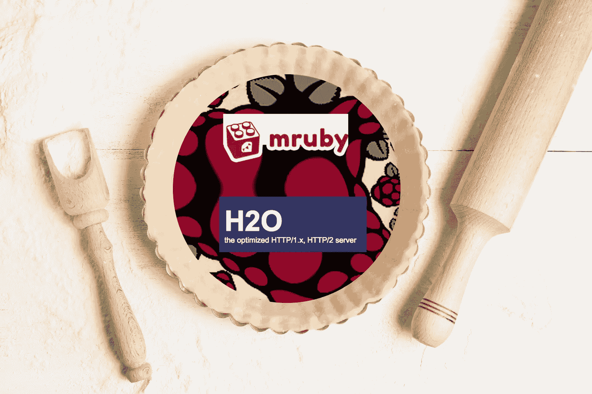
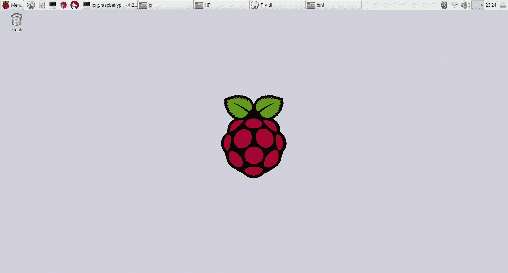

# mRuby 树莓派的配方？加 h2o 就行了！

> 原文：<https://www.sitepoint.com/need-a-recipe-for-mruby-flavored-raspberry-pi-just-add-h2o/>


SitePoint 的第 10 周！整个星期，我们都在发布关于互联网和物理世界的交集的文章，所以请继续查看[物联网标签](https://www.sitepoint.com/blog/)以获取最新更新。



当 SitePoint 的优秀员工告诉我物联网周的事情，并说我需要写几篇与 Ruby 相关的物联网帖子时，我认为这是一个信号。几个月前，我买了一台树莓 Pi 3，从那以后它就一直在收集数码灰尘。它坐在我的电脑椅旁边的桌子上，嘲笑我。

“嘿，格伦，还记得你买我的时候吗？我还在……你至少可以把我当杯垫什么的吧？”

每天我都不得不面对我的书呆子羞耻，面对我自己不作为的无用的灯塔。

嗯，不会再有了！上周给了我一个机会，让我克服羞愧，最终使用我的树莓派。我再也不用考虑上交我的书呆子卡，去找一份大型商店迎宾员的工作了。

说实话，我购买树莓派的主要动机之一是和我的孩子一起做“事情”。我的几个孩子(我有很多)已经显示出对编程和其他极客的爱好，所以我认为 RPi 是一个浇灌这些种子的伟大平台。然而，说到树莓派，我只是一个业余园丁。因此，我利用物联网周和这篇文章作为一个机会来更加熟悉树莓派。

关于这一点，可能需要一个免责声明。总的来说，我对 RPi 和嵌入式系统不熟悉。在这些平台上混日子经常会涉及到编译 C 库和其他一些我早就忘记了曾经知道的东西。所以，这篇文章和文章中的内容都是以“让它工作”的方式完成的。不管怎样，我有过一些挣扎。

好了，关于我和我的缺点已经说的够多了。让我们变得书呆子。

## 目标

我对 RPi 的一个长期目标是做一个你花 129 美元就能买到的可视门铃。这些设备允许你使用一个应用程序来查看谁在你家门口，包括与他们交谈的能力等。现在，在你兴奋地认为这篇文章将向你展示如何制作其中一个之前，不要。我将只涉及我认为将构成最终产品的几个方面。

我要解决的第一件事是从 RPi 传输图片并在浏览器中查看它们的能力。显然，门铃需要这样做，所以这是一个很好的开始。

目标#2 是从 RPi 提供一个简单的 API。我的门铃将需要捕捉和提供数据，并做其他 API/微服务/闪亮的玩具事情，所以这将证明是我长期努力的基础。

## 装备

简而言之，我们来看一下设备:


为了开始我的 RPi 十字军东征，我购买了以下:

*   树莓 Pi 3
*   5V 电源
*   Raspberry Pi 摄像头模块
*   俏皮的红树莓皮盒
*   64 GB microSD 卡。我认为这需要 10 级或更高，所以一定要得到正确的东西。你可以购买已经安装了 NOOBS 的 microSD 卡，我将在下一节谈到这一点。

如果你需要购买这些物品，我很幸运有 [MCM 电子](http://www.mcmelectronics.com/)和【Pololu.com】T2。

然后，从我不断增长的书呆子储备中，我提供了:

*   USB 键盘
*   USB 鼠标
*   支持 HDMI 的显示器

## 软件

鉴于这是一篇 SitePoint Ruby 频道的帖子，我将尝试使用一些 Ruby 工具来实现我的目标。我通过寻找 Ruby 和嵌入式系统之类的东西开始了这篇文章的研究。这几乎立刻把我带到了 [mRuby](https://github.com/mruby/mruby) ，这是我在担任编辑期间在[少数](https://www.sitepoint.com/try-mruby-today/) [帖子](https://www.sitepoint.com/hacking-mruby-onto-heroku/)上看到的。说实话，我不是很确定 mRuby 是什么或者如何使用它。事实上，我一度认为它只是一个精简的 Ruby 解释器，占用空间很小。写这篇文章告诉我，它是*嵌入*在*其他*程序中，等等。也就是说，mRuby 构建在另一个程序中，为该程序提供 Ruby 处理。我们今天在本帖中所做的事情应该会让我们明白这一点。

### 操作系统

对于操作系统，我选择了 Raspbian，因为它是“默认”的 RPi 操作系统。我在上面提到过 [NOOBS](https://www.raspberrypi.org/downloads/noobs/) ，你可以获得预装在 microSD 卡上的。NOOBS 有几个操作系统选项，你可以在启动 RPi 时选择一个。如果你已经走了那条路，选择 Raspbian 就大功告成了。

另一个选择是在空白的 microSD 卡上安装 NOOBS(或其他操作系统)，我尝试过这样做。整整四个小时。我无法让 RPI 从那张卡上启动，所以我用这些指令直接在卡上安装了 Raspbian。这非常有效，我可以启动 RPi:



Raspbian 附带了 Ruby 2.1.5，对于我们今天的需求来说已经足够好了。此外，大多数 RPi 指令建议您运行`raspi-config`并扩展文件系统以使用您的整个卡。我还使用了`raspi-config`来选择正确的区域设置和键盘。如果您在键入时看到奇怪的行为，比如键入`$`显示`£`(或者反之亦然，取决于您想要什么)，那么您可能需要更改您的区域设置和键盘。

正如我提到的，我想创建一个 API 并从相机中捕捉图片，将它们都展示给浏览器。这需要某种网络服务器。结合我的网络服务器需求和我使用 mRuby 的愿望，我得到了*完美的*软件: [h2o 网络服务器](https://h2o.examp1e.net/)。h2o 声称是一种更快的 web 服务器，使用更少的 CPU，并充分利用所有 HTTP/2 的乐趣。此外，我并不羞于承认，当我读到这里时，我有点尖叫:h2o 使用 mRuby，提供了用 Ruby 编写处理程序的能力！就好像作者知道我最终会写这篇文章一样！耶！

### h2o 设置

幸运的是，其他人已经完成了在 Raspberry Pi 上设置 h2o 的步骤。我在研究中提到了两个这样的帖子:

*   [Bounga.org](http://www.bounga.org/raspberry/2016/02/02/json-api-with-rack-and-mruby-on-raspberry/)
*   卢卡·圭迪

这两篇文章都是快速的、信息丰富的读物，所以我建议你在继续之前至少阅读其中的一篇。我将快速浏览一下设置步骤。您需要确保 RPi 上安装了所有正确的软件包:

```
$ sudo apt-get update
$ sudo apt-get install -y build-essential cmake bison git 
```

这将安装请求的项目。我们现在应该可以安装 h2o 了:

```
$ git clone https://github.com/h2o/h2o.git
$ cd h2o
$ cmake -DCMAKE_C_FLAGS_RELEASE= \
  -DCMAKE_CXX_FLAGS_RELEASE= \
  -DCMAKE_INSTALL_PREFIX=./dist \
  -DCMAKE_BUILD_TYPE=Release \
  -DCMAKE_FIND_FRAMEWORK=LAST \
  -DCMAKE_VERBOSE_MAKEFILE=ON \
  -Wno-dev
$ make
$ make install 
```

如你所知，这一步需要一段时间。

配置 h2o 只是创建或 YAML 并启动 h2o 二进制文件的简单事情。以下是 h2o 配置文件的示例，名为 h2o.conf，位于 h2o 目录中:

```
listen: 8080
hosts:
  "localhost:8080":
    paths:
      /api:
        file.dir: .
        mruby.handler-file: json_api.rb 
```

这个文件将告诉 h2o 监听端口 8080，并在名为 **json_api.rb** 的文件中公开一个由 Ruby 处理程序支持的`/api`端点。在这种情况下，Ruby 处理程序只是一个框架应用程序，正如从 Bounga 的帖子中窃取的文件所示:

```
class JsonApi
  def initialize
    @storage = {foo: "bar"}
  end

  def call(env)
    body = JSON.generate({foo: @storage[:foo]})

    [
      200,
        {'Content-Type'   => 'application/json',
         'Content-Length' => body.size},
       [body]
     ]
  end
end

JsonApi.new 
```

有了配置文件和处理程序，启动 h2o 服务器就像以下一样简单:

```
dist/bin/h2o --conf h2o.conf 
```

并访问端点，在本例中是 http://localhost:8080/api

```
curl http://localhost:8080/api/
{"foo":"bar"} 
```

恭喜你！你现在是 mRuby 的正式用户了。

## 目标 1:拍摄照片

为了捕捉图片，我将使用我在测试安装名为 [`raspistill`](https://www.raspberrypi.org/documentation/usage/camera/raspicam/raspistill.md) 的相机模块时找到的一个 [OS 命令。顺便说一下，你应该把你的相机模块安装在 RPi 上。现在，要从相机捕捉图像，请键入以下内容:](https://thepihut.com/blogs/raspberry-pi-tutorials/16021420-how-to-install-use-the-raspberry-pi-camera)

```
raspistill -o image.png 
```

您应该会看到一个窗口在屏幕上弹出，并最终消失(这是“预览”窗口)，表明图像已被捕获。打开文件，您会看到类似这样的内容:


注意:毫无疑问，你的照片会是一个更吸引人的主题。

因此，我们有一个系统命令，可以用来从相机捕捉图像。现在，我们只需要从 Ruby 处理程序中调用它:

```
class PicApi
  def call(env)
    file = capture

    [
      200,
        {'Content-Type'   => 'image/jpeg',
         'Content-Length' => File.size(file)},
       file
     ]
  end

  private

  def capture
    fn = Time.now.to_i.to_s
    `raspistill -n -o /tmp/#{fn}.jpg`
    File.open("/tmp/#{fn}.jpg")
  end
end

PicApi.new 
```

这很简单。我使用`raspistill`来捕获文件(如果你不知道的话，在 Ruby 中反勾号触发一个系统命令)，就像我们上面做的一样。不同的是位置和参数。我将文件(基于当前时间命名)写入到`/tmp`目录，这样它最终会被破坏，我使用`-n`参数跳过预览屏幕。一旦我们有了文件，用`File.open`打开它会返回一个`File`对象，它根据框架规范响应`each`。当我发现这有多简单时，我非常激动。所有这些真的帮助我把 mRuby 放在了我大脑中正确的位置，让我觉得自己是一个相当可靠的书呆子。

准备好处理程序后，需要将它添加到 h2o 配置文件( *h2o.conf* )中:

```
listen: 8080
hosts:
  "localhost:8080":
    paths:
      /:
        file.dir: .
      /api:
        file.dir: .
        mruby.handler-file: json_api.rb
      /pic:
        file.dir: .
        mruby.handler-file: pic_api.rb
    access-log: /dev/null 
```

现在，在 h2o 目录中:

```
dist/bin/h2o --conf h2o.conf 
```

如果你打开[http://localhost:8080/pic](http://localhost:8080/pic)，一张捕捉到的图像就是你的奖励！

## 目标 2:一个 API

我上面提到的两篇 h2o 文章都有如何为 h2o 创建基本 API 处理程序的例子。因此，我需要做一些不同的事情来增加知识，而不是简单地回收它。我将向嵌入式 mRuby 安装添加 PostgreSQL 支持，并演示如何连接到 PostgreSQL。在我看来，这里真正的好处是为 mRuby 和 h2o 添加功能的另一个例子，同时提到我在这个过程中遇到的困难。

首先，简单的部分:因为 Ruby 是一个如此不可思议的社区，有人已经为 PostgreSQL 创建了 [mRuby 绑定。我们只需要将它添加到 mRuby 中。Luca 的帖子为 Hiredis 做了同样的事情，步骤是:](https://github.com/authorNari/mruby-pg)

### 克隆回购

将相关的 git 存储库克隆到 h2o 目录下的 **deps/** 文件夹中。在这种情况下，我克隆了[这只](https://github.com/authorNari/mruby-pg)。

### 编译 h2o

使用与上面相同的`cmake`命令编译 h2o。然而，我被困在这里*小时*。这是我的面包差点毁了我所有的魔力的地方。当您构建 h2o 时，创建的工件之一是带有编译版本的 mruby 的 **mruby/** 目录。在后续的构建中，如果这个目录存在，mRuby 是**而不是**重新构建的，所以任何新的`deps`都不会被编译到二进制文件中。我没有意识到这一点，这让我很惭愧。所以，如果你的 **h2o** 目录下有一个 **mRuby** /目录(注意:我说的是**不是**说的是 **deps/mruby** ，删除它，然后运行:

```
cmake -DCMAKE_C_FLAGS_RELEASE= \
    -DCMAKE_CXX_FLAGS_RELEASE= \
    -DCMAKE_INSTALL_PREFIX=./dist \
    -DCMAKE_BUILD_TYPE=Release \
    -DCMAKE_FIND_FRAMEWORK=LAST \
    -DCMAKE_VERBOSE_MAKEFILE=ON \
    -Wno-dev 
```

### 创建 Ruby 处理程序

创建新的处理程序。我创建了一个名为 **pg_api.rb** 的文件，如下所示:

```
class PgApi
  def initialize
    @conn = PG::Connection.new(host: '192.168.1.52',
              port: 5432,
              dbname: 'mydb', 
              user:'myuser', password:'mypassword')
  end

  def call(env)
    body = get_data
    [
      200,
        {'Content-Type'   => 'application/json',
         'Content-Length' => body.size },
      body 
    ]
  end

  private

  def get_data
    json = []
    @conn.exec("select * from accounts") do |result|
      json << {
       email: result["email"],
       created_at: result["created_at"]
      }
    end
    json
  end
end

PgApi.new 
```

使用`mruby-pg`类`PG::Connection`，我创建了一个到在我的网络上运行的 PostgreSQL 实例的连接。如果你没有机会接触到这样的东西，我建议你用 Docker 把它放在你网络上的一个盒子里。这很容易。

### 配置 h2o 以使用处理程序

将新的处理器添加到 h2o 配置中:

```
listen: 8080
hosts:
  "localhost:8080":
    paths:
      /:
        file.dir: .
      /api:
        file.dir: .
        mruby.handler-file: json_api.rb
      /pic:
        file.dir: .
        mruby.handler-file: pic_api.rb
      /pg:
        file.dir: .
        mruby.handler-file: pg_api.rb
    access-log: /dev/null 
```

这已经过时了。只需添加一个指向我们的 Ruby 处理程序的`/pg`端点，然后重启 h2o。

```
dist/bin/h2o --conf h2o.conf 
```

如果你访问[http://localhost:8080/pg/](http://localhost:8080/pg/)，你会看到 JSON 格式的 SQL `select`语句的结果。mmmmmmmRuby…很好的 RPi。

如您所见，我可以创建任何我想要的 JSON API，由 PostgreSQL 支持。实际上，您应该尝试使用另一个数据库，比如 MongoDB 或 MySQL。

## 结论

嗯，我达到了我的两个目标。我可以从相机中捕捉图像并将其展示给浏览器，我还可以发布一个由 PostgreSQL 数据库支持的 API。也许这不是世界上最雄心勃勃的目标，但它们是我的基础，也是我的最终目标。我的下一步是捕捉现场视频…我听说 [uv4l](http://www.linux-projects.org/uv4l/) 很适合这个…

我希望你从这篇文章中有所收获，并受到启发，开始使用树莓派和 mRuby 进行研究。如果你想听我的建议，就加 h2o…

## 分享这篇文章