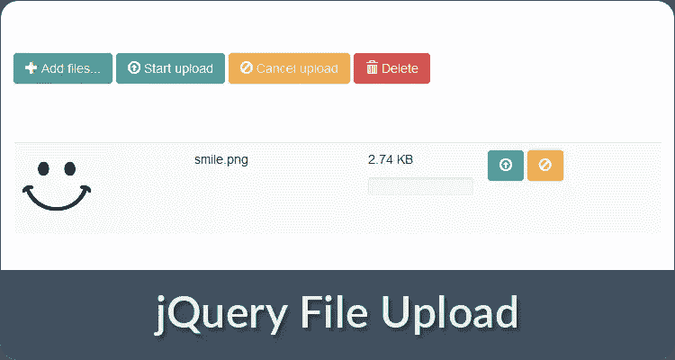
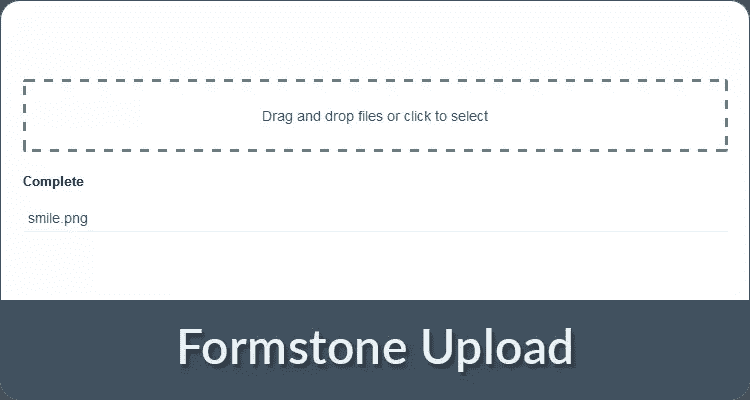
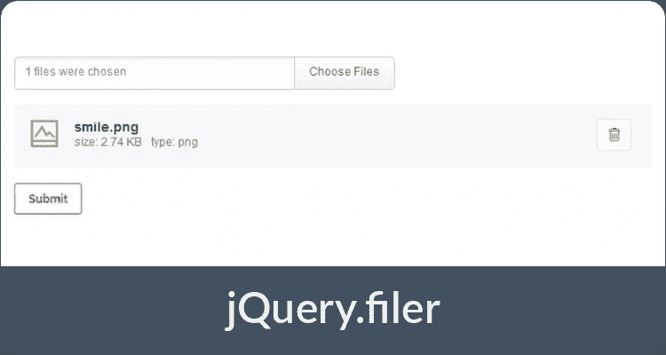
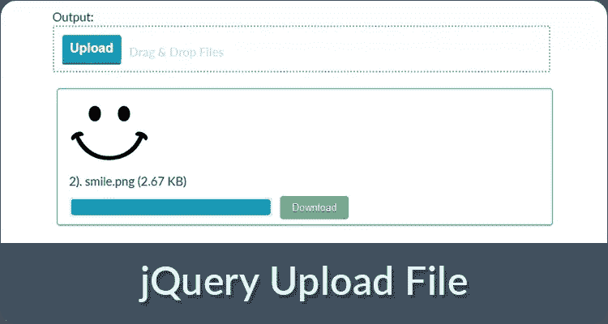
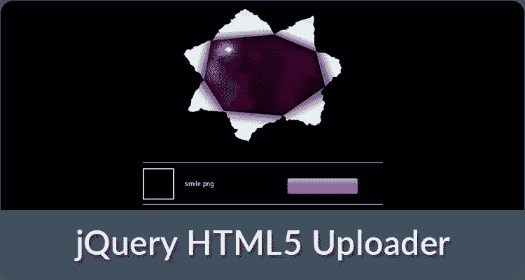
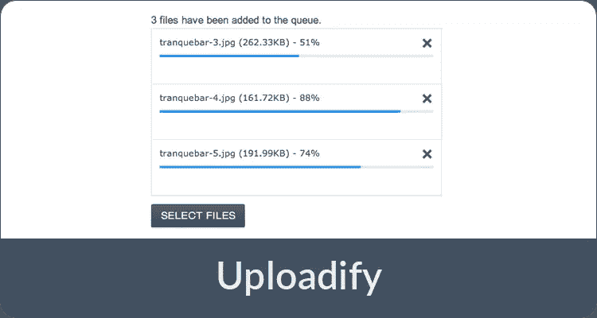

# 10 个 jQuery 文件上传插件

> 原文：<https://www.sitepoint.com/10-jquery-file-uploads/>

这篇受欢迎的文章于 2016 年 7 月更新，以反映文件上传插件的当前状态。与旧文章相关的评论已被删除。

用 Ajax 实现文件上传是非常具有挑战性的，尤其是如果你想要像拖放支持、图像预览或进度条这样的功能。以下 10 个 jQuery 文件上传插件提供了许多选项和出色的用户界面，可以让您快速实现一个漂亮的文件上传器。

## 1.FineUploader

FineUploader 是一个灵活的、主动维护的上传程序，用纯 JavaScript 编写，但也可以作为 jQuery 插件使用。与下面所有其他插件相比，它实现了最有趣也是最独特的功能:暂停/恢复上传、并发分块、`<canvas>`上传、重试、文件夹上传、编辑文件名等等。

[网站](http://docs.fineuploader.com/integrating/jquery.html)
[源代码](https://github.com/FineUploader/fine-uploader)

## 2.Dropzone.js

Dropzone.js 是一个纯 JavaScript 和 jQuery 版本的文件上传器，几乎可以选择任何内容，如图像预览(缩略图)、最大文件大小的指定、上传时重命名文件、并行上传或上传时调整图像大小。文档清晰易读，尽管有大约 500 个未解决的问题(错误和功能请求)——其中许多已经存在多年——所以请注意，如果您遇到问题，您可能只能靠自己。

[网站](http://www.dropzonejs.com)
[源代码](https://github.com/enyo/dropzone)
关于 Dropzone.js 的进一步文章:[如何用 Express 和 Dropzone.js 构建文件上传表单](https://www.sitepoint.com/file-upload-form-express-dropzone-js/)

## 3.jQuery 文件上传

像 Dropzone.js (#1)一样，jQuery 文件上传为您提供了非常相似的选项来满足您的需求(尽管有不同的 UI)，以及 jQuery UI 和 AngularJS 的预制集成。它非常受欢迎，所以你会在 [StackOverflow](http://stackoverflow.com/search?q=%22jQuery+File+Upload%22) 上找到许多答案，但是该项目已经在 GitHub 上禁用了问题，文档可能很难阅读。

[网站](https://blueimp.github.io/jQuery-File-Upload/)
[源代码](https://github.com/blueimp/jQuery-File-Upload/)

## 4.多负载

如果您想从开箱即用的内置 UI 开始，Plupload 是一个很好的选择。它为你提供了更少的定制选项，但是有几十个带有语言包和 Flash 或 Silverlight 后备的主题。

[网站](http://www.plupload.com)
[源代码](http://www.plupload.com/download)

## 5.Formstone 上传

Formstone 是一个有用的 web 组件集合，包括 Upload，一个独立的 jQuery 文件上传插件。因为它只提供了基本的定制选项，而且 UI 非常简单，所以入门应该很容易。

[网站](https://formstone.it/components/upload/)
[源代码](https://github.com/Formstone/Formstone/)

## 6.jQuery，档案管理员

这个插件专注于一个很棒的内置 UI，基于模块化架构，允许你轻松启用或禁用组件，并指定自定义主题。另外，它为你提供了一个 PHP 类来处理上传请求。

[网站](http://filer.grandesign.md/)
[源代码](https://github.com/CreativeDream/jquery.filer)

## 7.引导文件输入

Bootstrap File Input 是一个带有 jQuery API 的 Bootstrap 3.x 文件上传插件，提供了定制所需的一切。它不仅允许您预览上传的图像，还可以预览文本、HTML、视频、音频、Flash 和对象文件。

[网站](http://plugins.krajee.com/file-input)
[源代码](https://github.com/kartik-v/bootstrap-fileinput)

## 8.jQuery 上传文件

jQuery 上传文件是一个简单的上传插件，具有所有基本选项，以及图像预览、本地化和使用自定义模板构建自己的 UI 的功能。因为每个特性都有一个例子，所以实现应该会很快。

[网站](http://hayageek.com/docs/jquery-upload-file.php)
[源代码](https://github.com/hayageek/jquery-upload-file)

## 9.jQuery HTML5 上传程序

这个上传程序允许你将文件拖放到一个元素中(例如一个`
`)，然后将文件(或多个文件)上传到一个指定的 URL。不多也不少。

网站
[源代码](https://github.com/MicheleBertoli/jquery-html5-uploader)

## 10.上传

Uploadify 是一个基于 Flash 的 jQuery 上传插件，可以在你的网站上添加一个选择按钮。由于定制是有限的，支持论坛已经关闭，Flash 一般不应该使用，不建议再使用它。还有另一个插件，叫做 UploadiFive，它基于 HTML5，可以在同一网站上获得，但在撰写本文时，商业许可证的价格为 100 美元。

[网站](http://www.uploadify.com/)
[源代码](http://www.uploadify.com/download/)

## 小费

有时您或者您的客户可能有特殊的需求，您需要创建没有 jQuery 的 UI，或者遵循特定的风格指南。在这种情况下，您可能会对以下两个项目感兴趣，它们允许您使用完全自制的用户界面来实现文件上传:

*   Resumable.js
*   [FileAPI](http://mailru.github.io/FileAPI/)

## 结论

这些是市场上最著名的插件。如果你有任何使用它们的经验——好的或坏的——或者有其他值得注意的文件上传插件，请在评论中告诉我们。

## 分享这篇文章