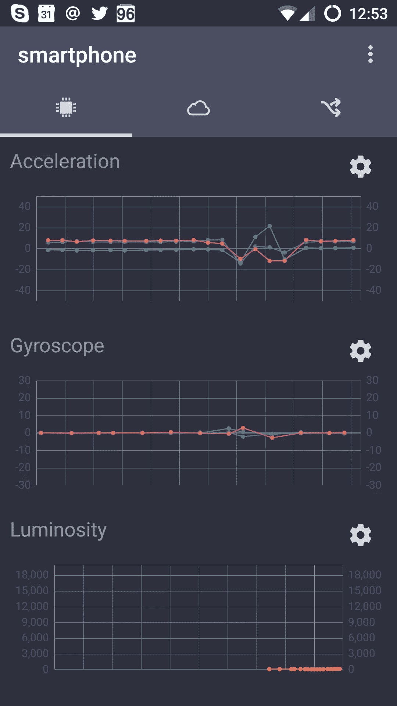
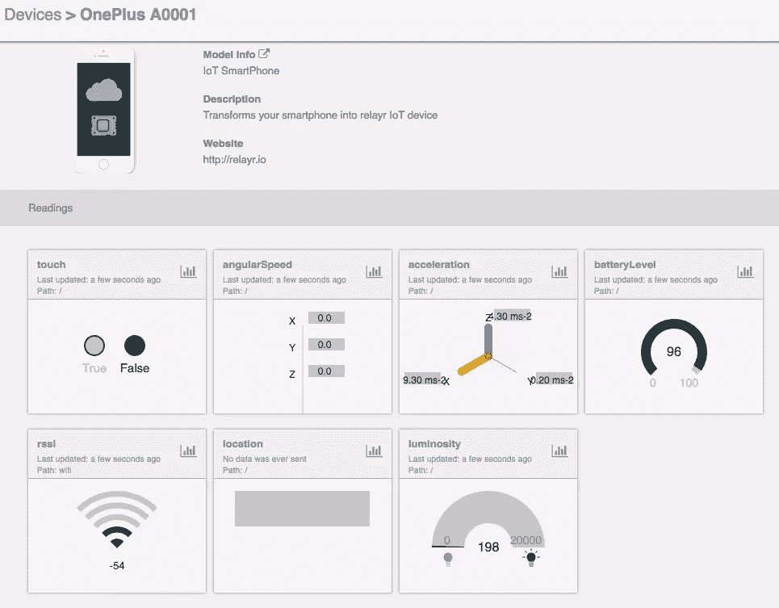
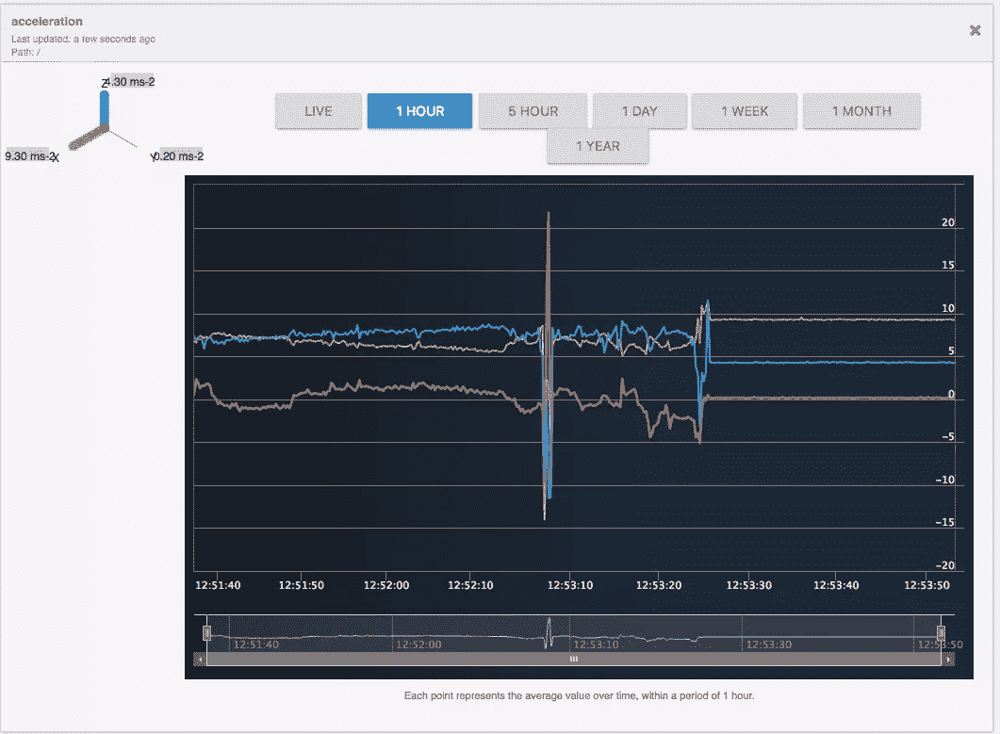

# 借助 relayr Android 应用和 SDK 快速开发物联网

> 原文：<https://www.sitepoint.com/rapid-iot-development-with-the-relayr-android-app-and-sdk/>


SitePoint 的第 10 周！整个星期，我们都在发表关于互联网和现实世界的交集的文章，所以请继续关注最新的更新。

[relayr](http://relayr.io) 是一个物联网平台即服务，旨在帮助物联网开发者集中和聚合物联网连接设备产生的数据。通过安装他们的[硬件](http://docs.relayr.io/hardware/)和[软件](http://docs.relayr.io/software/)SDK，你不需要担心各种设备生成的特定 SDK 和数据类型，而是针对 relayr APIs 进行编码。

relayr 从 [Wunderbar](https://relayr.io/wunderbar/) 开始，这是一个定制的物联网原型工具，提供了大量的传感器和适配器。今年 5 月，该公司发布了[原型物联网 Android 应用](http://blog.relayr.io/engineering/iot-smartphone-guide)，我在柏林会见了他们的两个团队(Bernard 和 Marcos ),讨论他们为什么要开发这款应用，以及开发者可以用它做什么。


虽然 Wunderbar 是一个很好的设备，但 relayr 团队发现他们没有接触到他们想要的那么多开发人员。定制硬件设备仍然是一个很高的准入门槛，需要大量的电缆和复杂的配置才能工作。该团队意识到，制造物联网原型所需的传感器和测量方法已经可以在几乎每个人都可以使用的设备中获得。他们的手机。

该应用适用于 [Android](https://play.google.com/store/apps/details?id=io.relayr.iotsmartphone) ，iOS 也即将推出(相信我，我看到了测试版)。这款应用可以让你追踪加速度、陀螺仪、光度、位置、屏幕触摸、电池电量和 wifi 信号，所有这些都会自动记录到 relayr 的云仪表盘上。





您还可以进入更长期的历史概述:



## 制造继电器供电的卡特彼勒监控器

是时候构建一个利用该应用程序和 relayr SDKs 的应用程序了。我用的是最近在柏林 Droidcon 上的一个稍微修改过的演示版本。你可以在 [GitHub](https://github.com/sitepoint-editors/droidcon-workshop-2016) 上找到最终的项目。

我们的猫金吉讨厌休息室的门关着。在那里她可以挠地毯，坐在我的桌子上，在她的猫薄荷里打滚。我经常想把门关上，这样她就不能那样做了。问题是，她跳上门把手拉下来，让自己进去。

在这个示例应用程序中，我将使用手机的陀螺仪来确定手柄是否向下(在这种情况下，方向改变 90 度)，因为她正挂在上面。然后在 Android 应用程序中显示当前结果。当然，输出应用程序可以是 relayr 支持的任何语言，在“现实世界”中，我会用合适的传感器替换我的手机，我不会把我的手机绑在门把手上。Proto 应用的目的纯粹是为了测试。

**注意**:在这个项目中还有一个*硬件*文件夹，这是为神童棒准备的，但是你可能会觉得挖掘它很有趣。从现在开始，我将引用在 *protoIoT* 文件夹中找到的文件。

**注意**:代码使用 Butterknife 来整理代码注入， [SitePoint 在 2015 年有一篇文章](https://www.sitepoint.com/tidying-code-with-android-butterknife/)更详细地介绍了这个库。

在为 relayr 平台开发 Android 应用程序时，您实际上使用了两种不同的 SDK，Java SDK 包含许多基础代码，Android SDK 添加了与 Android 开发相关的特定 API。

将这些作为依赖项添加到*build . gradle(Module:proto IOT)*中:

```
dependencies {
    ...
    compile 'io.relayr:android-sdk:1.0.3'
    compile 'io.relayr:java-sdk:1.2.1'
} 
```

打开*Constants.java*文件并将`PROTO_IOT__DEVICE_ID`常量更改为您的设备 ID，您可以通过单击设备概览上的齿轮图标找到该 ID:

```
public static final String PROTO_IOT__DEVICE_ID = "59b7da98-b2cb-4018-a9ff-aa48f83652e4"; 
```


运行应用程序。首次运行时，您需要登录您的 relayr 帐户，此登录屏幕是通过使用 SDK 检查用户是否登录而生成的，如果没有，则显示一个登录屏幕。

将你的手机翻转 90 度，你应该会看到图像和文字的变化来反映状态的变化。把它翻回来，原始图像就回来了。

打开*TabCurrent.java*。当你打开这个标签时，它会运行`loadUserInfo()`功能来加载用户数据，如果成功，会将你在上面添加的智能手机设备加载到具有`loadProtoIotDevice()`功能的应用程序中。如果该功能成功加载，那么就该开始监听具有`subscribeToProtoIotData()`功能的设备生成的物联网数据了。

SDK 允许您订阅设备，并使用`.subscribeToCloudReadings()`功能对变化做出反应:

```
private void subscribeToProtoIotData() {
    if (mDevice == null) return;

    mDevice.subscribeToCloudReadings()
            .timeout(Constants.DEFAULT_TIMEOUT, TimeUnit.SECONDS)
            .observeOn(AndroidSchedulers.mainThread())
            .subscribe(new SimpleObserver<Reading>() {
                @Override public void error(Throwable e) {
                    Toast.makeText(getContext(), R.string.problem_loading_data, Toast.LENGTH_SHORT).show();
                    Log.e("TabCurrent", "subscribeToProtoIotData error");
                    e.printStackTrace();

                    if (e instanceof TimeoutException) subscribeToProtoIotData();
                }

                @Override public void success(Reading reading) {
                    if (reading.meaning.equals("acceleration")) {
                        final AccelGyroscope.Acceleration accel = mGson.fromJson(reading.value.toString(), AccelGyroscope.Acceleration.class);
                        showCatState(Math.abs(accel.x) > 6);
                    }
                }
            });
} 
```

该函数获取在*Constants.java*中定义的超时值，设置一个要运行的线程，并创建一个`Reading`对象，以便在 subscribe 方法成功时从中提取值。

在被覆盖的`success`方法内部，您可以开始对读取类型和值做出反应。使用`reading.meaning.equals()`检查来自`touch`、`angularSpeed`、`acceleration`、`batteryLevel`、`rssi`、`location`和`luminosity`的读数类型。一旦您知道您正在处理的读数是什么类型，您就可以使用相关的 Java 类(在本例中是`io.relayr.java.model.AccelGyroscope`)来提取读数并对其做出反应。

对于这种门锁应用，如果设备加速度计的`x`轴上的值大于 6，则需要改变显示的图像。


检查其他类型的读数并提取值是一个类似的过程。例如，陀螺仪读数:

```
if (reading.meaning.equals("angularSpeed")) {
   final AccelGyroscope.AngularSpeed gyro = mGson.fromJson(reading.value.toString(), AccelGyroscope.AngularSpeed.class);
   showToiletState(Math.abs(gyro.x) > 1);
} 
```

## 测试你的想法

我发现用手机上的读数进行实验很容易，看看我可以用它们触发什么，从原型的角度来看很棒。我在试用 Proto IoT 应用程序和 relayr 平台时遇到了两个主要问题，网络超时和文档。网络超时可能更多的是由于我们劣质的路由器，但是记住在你的应用中处理这些问题是很重要的。其次，relayr 的文档很乱。似乎有很多可用的信息，但是找到你要找的东西很难，尤其是当你可能还不知道你要找什么的时候，我确信把这些整理好是当前的首要任务。

如果你正在寻找一种方法来原型化你的物联网想法，那么我强烈建议尝试使用你选择的语言的 Proto 应用程序和 relayr SDKs。让我知道你尝试了什么，它是如何为你工作的。

## 分享这篇文章