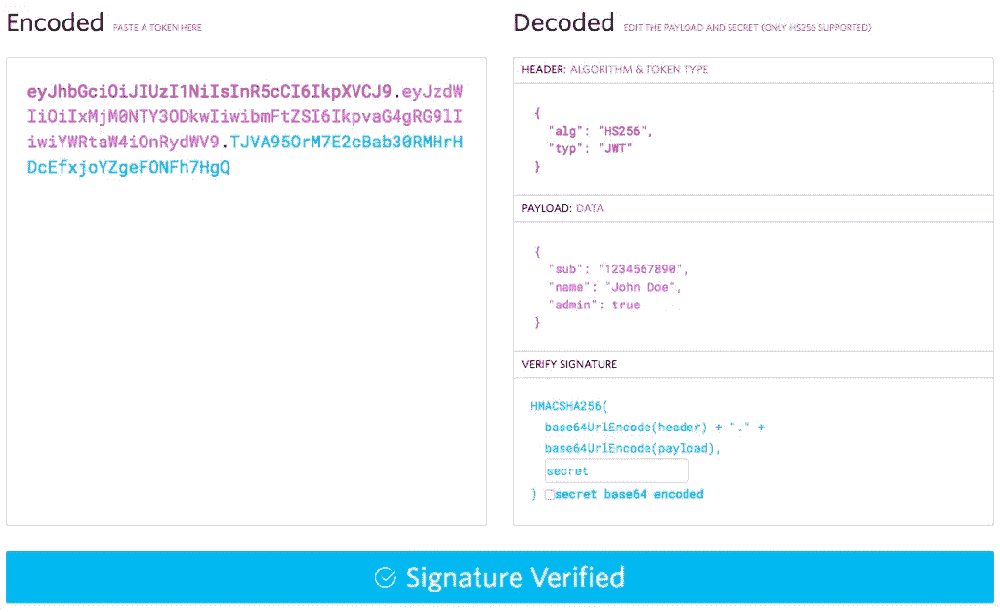

# 使用 JSON Web 令牌保护您的物联网设备和服务

> 原文：<https://www.sitepoint.com/securing-your-iot-devices-and-services-with-json-web-tokens/>


*这是 SitePoint 的 IoT 周！整个星期，我们都在发布关于互联网和物理世界的交集的文章，所以请继续查看[物联网标签](https://www.sitepoint.com/blog/)的最新更新。*

物联网安全是当今世界的热点问题:连接互联网的设备比人口还多，共享的数据量在过去几年中呈爆炸式增长。然而，保护这些数据的安全正迅速成为一个问题——特别是随着健康敏感设备的出现，以及如车辆等一旦受到危害就会很危险的设备的出现！

我不能声称拥有所有的答案，但是我确实有一个锦囊妙计，应该可以帮助您寻求安全性——JSON Web Tokens，我也将它称为 jwt。这些小型、便携、可验证的令牌有助于确保您从设备和服务器发送和接收的通信来自可信来源。它们也是很好的载体和访问令牌。

## 什么是 JSON Web 令牌？

对于那些以前没有接触过这些的人来说，JSON Web 令牌是基于 JSON 的令牌，用于在 Web 上发送经过验证的信息。它们在发送之前是 base64 编码的，所以看起来像这样:



jwt.io 调试器显示一个 JSON Web 令牌

你在上面看到的是位于 JWT.io 的 JWT 调试器，在这个网站上你可以学到更多关于 JWT 的东西，比我们在这篇文章中看到的要多得多。左边是编码完成的 JWT。它包括:

*   base64 编码的标头，用“.”连接
*   有效负载，base64 编码，带有另一个“.”
*   签名密钥

右边是解码后的报头和有效载荷。它们由声明*(这只是 JSON 键值对的一个昵称)*组成。有些声明是由标准声明的— `"alg"`代表密钥的签名算法，`"sub"`代表订户。其他的说法你自己做，比如`"admin"`。

这个密钥由一个带签名的头哈希和一个`"."`连接而成，然后是有效载荷，都是 base64 编码的。它由双方持有的秘密签名，可以是对称的(一个字符串)或非对称的(一个 RSA 公钥/私钥对)。

这些声明共同描述了令牌本身以及您想要保留的任何其他内容，例如用户信息和相关会话数据。只是要确保这些数据是有限的 JWTs 的一个很大的好处是，如果不过度填充，它们会非常小！

通过将 jwt 放入 Authorization HTTP 头中来发送 jwt，格式如下:

```
Authorization: bearer <token>
```

如果不能修改 HTTP 头，许多服务也会接受 JWT 作为主体参数，甚至是查询参数。如果可以使用 HTTP 头，不推荐使用这些方法。

## jwt 有什么好处？

物联网世界是一个小型设备的世界，开发人员努力使这些设备发出的 HTTP 呼叫尽可能小。jwt 通过很少的开销来帮助解决这个问题。他们使用极简的 JSON 方案和 base64 编码来实现这一点。只要确保你不要添加太多你自己的主张，否则规模的好处会被你对它们的使用所掩盖！将声明保持在最低限度，以保持您的应用程序运行。

为什么不是饼干？这也是监听 HTTP 请求的需要。您的服务器不必使用 cookie 来查找有关用户会话的其他信息，这一切从一开始就在 JWT 内部。这意味着不需要进行额外的数据库或外部服务调用。同样，这取决于你如何使用它们，所以要仔细考虑你需要什么，不需要什么。

jwt 的另一个好处是它们是通用的——几乎每个平台都有 JSON 解析器，访问 base64 编码/解码以及 hsa256 签名和验证的能力变得越来越容易。此外，jwt 由 web 标准支持，因此您可以放心地知道您使用的技术可以轻松地与其他 web 标准兼容的服务集成，包括许多 OAuth2 提供者和 OpenID Connect 标准的所有提供者。

即使您的物联网设备无法解码令牌，它也可以作为服务器和服务的访问令牌交给设备。只要您的设备可以存储提供给它的字符串，jwt 就可以被您的物联网设备用作存储的凭证。只是要格外确保这些令牌的安全，并密切关注它们，因为不记名令牌如果泄露会很危险！

当今 web 架构面临的众多挑战之一是在分散于多个领域的服务之间进行自我验证——即使是一个爱好者或公司也可能在不同的 PaaS 提供商上运行服务！JWT 使这种跨域协商变得更加容易——只要各方共享相同的秘密来验证密钥，那么 JWT 就不会关心域、子域、端口等。

## 加密呢？

当我解释 JWTs 时，我听到的第一件事是“数据是编码的，但我需要它被加密，否则我的数据会被所有人看到！”不用担心——有由 RFC 7517 处理的 JSON Web 加密，它允许您加密您的 JSON Web 令牌，并且仍然参与标准遵从！甚至有很多支持它的图书馆。我还见过它被命名为 JOSE (Javascript 对象签名和加密)。

## 在物联网架构中使用 jwt

现在，我们到了精彩的部分——如何做。我们将从您的物联网设备和物联网服务器的角度来看这一点。

### 在物联网设备上使用 jwt

如果您只想接收一个 JWT 作为不记名令牌，而不使用其中包含的信息，那么您所要做的就是将从服务器接收的 JWT 存储在设备上，并随每个经过身份验证的请求一起发送。

如果您想要使用有效负载，或者让您的设备发布自己的 jwt，您的设备将需要能够:

*   JSON 解析/字符串化
*   base64 编码/解码
*   HS256 签名验证

它还需要存储服务器将用来签署/验证 jwt 的共享秘密。

收到令牌后，您需要执行以下步骤:

1.  用存储在设备上的密码验证密钥的签名。
2.  如果签名有效，使用 base64 解码来获得字符串化的 JSON 有效负载。
3.  将有效负载解析为一个对象。

现在你知道了！对于 Arduino 爱好者来说，有一些用于 base64 编码/解码、HS256 验证和 JSON 对象处理的库。对于像 Raspberry Pi 这样运行 Linux 的平台，你可以使用许多不同的脚本语言(Python、Ruby、Node.js)来处理 JWT，[jwt . io 网站](http://jwt.io)概述了几个可供你使用的 SDK。

### 在物联网服务器上使用 jwt

正如我在设备部分提到的，你可以使用 JWT.io 网站上提到的 SDK[来控制你如何在你的服务器上处理 JWT 验证。](http://jwt.io)

例如，如果您使用 Node.js 和 Express，那么可以使用`express-jwt`中间件来防止用户或设备在没有经过验证的 JWT 的情况下访问路由。

既然我们已经介绍了在实践中使用 jwt，那么让我们来谈谈在物联网架构中使用 jwt 时要记住的一些经验法则。

## 一些关于 jwt 的一般性建议

这些是我在使用 jwt 的过程中获得的一些知识，其中一些是常识。但是在您的架构中实现 jwt 时，最好记住它们。

### 始终验证签名

当您的服务器收到带有令牌的请求时，一定要验证签名，否则您将失去使用 JWT 的主要价值——知道发送者就是他们所说的那个人！

### 使用(并强制执行)到期字段

在标准中，`iat`字段是令牌发出的时间，`exp`字段是令牌到期的时间戳。强烈建议您使用并强制执行这两个字段，尤其是在您拥有敏感信息的情况下。这样，最终如果令牌确实发出去了，它就会过期。

### `id`字段如何变得非常方便

等待受损令牌过期是一回事，但能够主动撤销令牌也很有帮助。JTI (JSON 令牌 ID)声明对此有所帮助——您可以撤销对特定 ID 的访问，而不是一次更改密码并撤销所有令牌！只要确保你的 jti 是高度抗冲突的，就像任何 GUID 一样。

## 结论

感谢您继续关注我，并了解如何使用 JSON Web 令牌保护您的物联网设备！

## 分享这篇文章