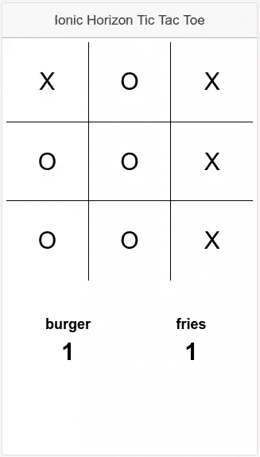
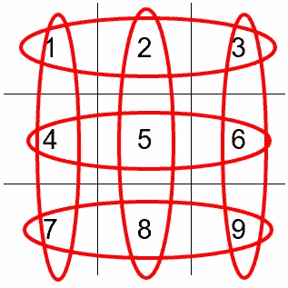

# horizon:JavaScript 移动应用的可扩展后端

> 原文：<https://www.sitepoint.com/horizon-a-scalable-backend-perfect-for-javascript-mobile-apps/>

Horizon 是基于 JavaScript 的跨平台移动应用的可扩展后端，尤其是那些需要实时功能的应用。它是由 RethinkDB 的优秀人员构建的，所以使用 RethinkDB 作为默认数据库。如果您不熟悉 RethinkDB，它是一个具有实时功能的开源数据库。

Horizon 公开了一个客户端 API，允许您与底层数据库进行交互。这意味着您不必编写任何后端代码。你所要做的就是启动一个新的服务器，运行它，Horizon 会处理剩下的事情。数据在服务器和连接的客户端之间实时同步。

如果你想了解更多关于 Horizon 的信息，你可以查看他们的 [faq 页面](http://horizon.io/faq/)。

在本教程中，你将使用 Ionic 和 Horizon 构建一个井字游戏应用程序。我假设您对 Ionic 和 Cordova 并不陌生，所以我不打算深入解释 Ionic 特有的代码。如果你想了解一些背景知识，我建议你去 Ionic 网站上查看一下[入门指南](http://ionicframework.com/getting-started/)。如果你想跟进，你可以在 Github 上克隆 [app repo。这是最终应用的外观:](https://github.com/anchetaWern/ionic-horizon-tictactoe)



## 安装 Horizon

RethinkDB 充当 Horizon 的数据库，因此在安装 Horizon 之前，您必须先安装 RethinkDB。你可以在这里找到如何安装 RethinkDB。

一旦安装了 RethinkDB，您就可以通过在终端中执行以下命令来通过 [npm](https://www.npmjs.com/) 安装 Horizon:

```
npm install -g horizon 
```

## Horizon 服务器

Horizon 服务器充当应用程序的后端。每当应用程序执行代码时，它都会与数据库对话。

您可以通过在终端中执行以下操作来创建新的 Horizon 服务器:

```
hz init tictactoe-server 
```

这将创建 Horizon 使用的 RethinkDB 数据库和服务器文件。

创建服务器后，您可以通过执行以下命令来运行它:

```
hz serve --dev 
```

在上面的命令中，您将`--dev`指定为一个选项。这意味着您想要运行一个开发服务器。开发服务器设置了以下选项:

*   这意味着 websockets 和文件不是通过加密连接提供的。
*   `--permissions no`:禁用[权限约束](http://horizon.io/docs/permissions/)。这意味着任何客户端都可以在数据库中执行任何操作。Horizon 的权限系统基于白名单。这意味着默认情况下，所有用户都没有权限做任何事情。您必须明确指定允许哪些操作。
*   `--auto-create-collection yes`:首次使用时自动创建收藏。在 Horizon 中，集合相当于关系数据库中的表。将此选项设置为`yes`意味着每次客户端使用新的收藏时，都会自动创建新的收藏。
*   `--auto-create-index yes`:首次使用时自动创建索引。
*   `--start-rethinkdb yes`:在当前目录下自动启动一个新的 RethinkDB 实例。
*   `--allow-unauthenticated yes`:允许未经验证的用户执行数据库操作。
*   `--allow-anonymous yes`:允许匿名用户执行数据库操作。
*   `--serve-static ./dist`:启用静态文件服务。如果您想要在浏览器中测试与 Horizon API 的交互，这将非常有用。horizon 服务器默认运行在端口 8181 上，因此您可以通过访问*[http://localhost:8181](http://localhost:8181)*来访问该服务器。

**注意**:永远不要在产品中使用`--dev`选项，因为它为攻击者打开了许多漏洞。

## 构建应用程序

现在，您已经准备好构建应用程序了。首先创建一个新的 Ionic 应用程序:

```
ionic start tictactoe blank 
```

### 正在安装 Chance.js

接下来您需要安装 [chance.js](http://chancejs.com/) ，这是一个用于生成随机数据的 JavaScript 实用程序库。对于这个应用程序，你用它来为玩家生成一个唯一的 ID。您可以使用以下命令通过 [bower](https://bower.io/) 安装 chance.js:

```
bower install chance 
```

### index.html

打开 *www/index.html* 文件，添加以下代码:

```
<!DOCTYPE html>
<html>
  <head>
    <meta charset="utf-8">
    <meta name="viewport" content="initial-scale=1, maximum-scale=1, user-scalable=no, width=device-width">
    <title></title>

    <link href="lib/ionic/css/ionic.css" rel="stylesheet">
    <link href="css/style.css" rel="stylesheet">

    <!-- IF using Sass (run gulp sass first), then uncomment below and remove the CSS includes above
    <link href="css/ionic.app.css" rel="stylesheet">
    -->
    <!-- chance.js -->
    <script src="lib/chance/dist/chance.min.js"></script>
    <!-- ionic/angularjs js -->
    <script src="lib/ionic/js/ionic.bundle.js"></script>

    <!-- cordova script (this will be a 404 during development) -->
    <script src="cordova.js"></script>

    <!-- horizon script -->
    <script src="http://127.0.0.1:8181/horizon/horizon.js"></script>

    <!-- your app's js -->
    <script src="js/app.js"></script>

    <!--main app logic -->
    <script src="js/controllers/HomeController.js"></script>
  </head>
  <body ng-app="starter">
    <ion-nav-view></ion-nav-view>
  </body>
</html> 
```

上面的大部分代码是来自 Ionic blank starter 模板的样板代码，只添加了 chance.js 脚本:

```
<script src="lib/chance/dist/chance.min.js"></script> 
```

horizon 脚本由 horizon 服务器提供服务。

**注意**:如果您打算以后部署它，您必须更改 URL。

```
<script src="http://127.0.0.1:8181/horizon/horizon.js"></script> 
```

主要的应用程序逻辑位于这个 JavaScript 文件中:

```
<script src="js/controllers/HomeController.js"></script> 
```

### app.js

*app.js* 文件是运行初始化应用程序的代码的地方。打开 *www/js/app.js* ，在`run`函数的正下方添加以下内容:

```
.config(function($stateProvider, $urlRouterProvider) {
  $stateProvider

  .state('home', {
    cache: false,
    url: '/home',
    templateUrl: 'templates/home.html'
  });
  // if none of the above states are matched, use this as the fallback
  $urlRouterProvider.otherwise('/home');
}); 
```

这为默认的应用程序页面设置了一个路径。该路由指定了用于该页面的模板以及可以访问该页面的 URL。

### HomeController。射流研究…

在 *www/js/controllers* 目录下创建一个 *HomeController.js* 文件，并添加以下内容:

```
(function(){
  angular.module('starter')
  .controller('HomeController', ['$scope', HomeController]);

  function HomeController($scope){

    var me = this;
    $scope.has_joined = false;
    $scope.ready = false;

    const horizon = Horizon({host: 'localhost:8181'});
    horizon.onReady(function(){
      $scope.$apply(function(){
        $scope.ready = true;
      });
    });

    horizon.connect();

    $scope.join = function(username, room){

      me.room = horizon('tictactoe');

      var id = chance.integer({min: 10000, max: 999999});
      me.id = id;

      $scope.player = username;
      $scope.player_score = 0;

      me.room.findAll({room: room, type: 'user'}).fetch().subscribe(function(row){
        var user_count = row.length;

        if(user_count == 2){
          alert('Sorry, room is already full.');
        }else{
          me.piece = 'X';
          if(user_count == 1){
            me.piece = 'O';
          }

          me.room.store({
            id: id,
            room: room,
            type: 'user',
            name: username,
            piece: me.piece
          });

          $scope.has_joined = true;

          me.room.findAll({room: room, type: 'user'}).watch().subscribe(
            function(users){

              users.forEach(function(user){

                if(user.id != me.id){

                  $scope.$apply(function(){
                    $scope.opponent = user.name;
                    $scope.opponent_piece = user.piece;
                    $scope.opponent_score = 0;
                  });

                }

              });

            },
            function(err){
              console.log(err);
            }
          );

          me.room.findAll({room: room, type: 'move'}).watch().subscribe(
            function(moves){
              moves.forEach(function(item){

                var block = document.getElementById(item.block);
                block.innerHTML = item.piece;
                block.className = "col done";

              });

              me.updateScores();

            },
            function(err){
              console.log(err);
            }
          );
        }

      });

    }

    $scope.placePiece = function(id){

      var block = document.getElementById(id);

      if(!angular.element(block).hasClass('done')){
        me.room.store({
          type: 'move',
          room: me.room_name,
          block: id,
          piece: me.piece
        });
      }

    };

    me.updateScores = function(){

      const possible_combinations = [
        [1, 4, 7],
        [2, 5, 8],
        [3, 2, 1],
        [4, 5, 6],
        [3, 6, 9],
        [7, 8, 9],
        [1, 5, 9],
        [3, 5, 7]
      ];

      var scores = {'X': 0, 'O': 0};
      possible_combinations.forEach(function(row, row_index){
        var pieces = {'X' : 0, 'O': 0};
        row.forEach(function(id, item_index){
          var block = document.getElementById(id);
          if(angular.element(block).hasClass('done')){
            var piece = block.innerHTML;
            pieces[piece] += 1;
          }
        });

        if(pieces['X'] == 3){
          scores['X'] += 1;
        }else if(pieces['O'] == 3){
          scores['O'] += 1;
        }
      });

      $scope.$apply(function(){
        $scope.player_score = scores[me.piece];
        $scope.opponent_score = scores[$scope.opponent_piece];
      });
    }

  }

})(); 
```

分解上面的代码，首先设置默认状态。`has_joined`确定用户是否已经加入房间。`ready`确定用户是否已经连接到 Horizon 服务器。当设置为`false`时，您不会向用户显示应用程序的用户界面。

```
$scope.has_joined = false;
$scope.ready = false; 
```

连接到 Horizon 服务器:

```
const horizon = Horizon({host: 'localhost:8181'});
horizon.onReady(function(){
  $scope.$apply(function(){
    $scope.ready = true;
  });
});

horizon.connect(); //connect to the server 
```

正如我前面说过的，Horizon 默认运行在端口 8181 上，这就是为什么您将`localhost:8181`指定为端口。如果您正在连接到远程服务器，这应该是分配给服务器的 IP 或域名。当用户连接到服务器时，触发`onReady`事件。这是您将`ready`设置为`true`的地方，这样您就可以向用户显示 UI。

```
horizon.onReady(function(){
  $scope.$apply(function(){
    $scope.ready = true;
  });
}); 
```

#### 加入房间

接下来，当用户点击**加入**按钮时，是否执行`join`功能:

```
$scope.join = function(username, room){
    ...
}; 
```

在函数内部，连接到一个名为`tictactoe`的集合。

**注意**:由于您处于开发模式，如果这个集合不存在，它会自动创建。

```
me.room = horizon('tictactoe'); 
```

生成一个 ID 并将其设置为当前用户的 ID:

```
var id = chance.integer({min: 10000, max: 999999});
me.id = id; 
```

设置用户名和默认玩家分数。

**注意**:这些变量被绑定到模板上，所以你可以随时显示和更新它们。

```
$scope.player = username;
$scope.player_score = 0; 
```

在表格中查询将`room`设置为当前房间和`user`类型的文档。不要被`subscribe`函数的使用弄糊涂了，您实际上并没有在监听变化。您已经使用了`fetch`功能，这意味着它将只在用户加入房间时执行。

```
me.room.findAll({room: room, type: 'user'}).fetch().subscribe(function(row){
    ...
}); 
```

返回结果后，检查用户数量。当然，井字游戏只能由两个玩家玩，所以如果用户试图加入一个已经有两个玩家的房间，请提醒用户。

```
var user_count = row.length;

if(user_count == 2){
  alert('Sorry, room is already full.');
}else{
    ...
} 
```

否则，继续执行接受用户的逻辑，根据当前用户数量确定将分配给用户的部分。第一个进入房间的人得到“X”块，第二个人得到“O”块。

```
me.piece = 'X';
if(user_count == 1){
    me.piece = 'O';
} 
```

一旦你确定了棋子，将新用户存储到集合中，然后拨动`has_joined`开关，井字游戏棋盘就会出现。

```
me.room.store({
    id: id,
    room: room,
    type: 'user',
    name: username,
    piece: me.piece
});

$scope.has_joined = true; 
```

接下来，监听集合中的变化。这次不用`fetch`，用`watch`。每当添加新文档或更新(或删除)与所提供的查询相匹配的现有文档时，都会执行回调函数。当执行回调函数时，如果文档的用户 ID 与当前用户的用户 ID 不匹配，则循环所有结果并设置对手详细信息。这就是你如何向当前用户展示谁是他们的对手。

```
me.room.findAll({room: room, type: 'user'}).watch().subscribe(
  function(users){

    users.forEach(function(user){

      if(user.id != me.id){

        $scope.$apply(function(){
          $scope.opponent = user.name;
          $scope.opponent_piece = user.piece;
          $scope.opponent_score = 0;
        });

      }

    });

  },
  function(err){
    console.log(err);
  }
); 
```

接下来订阅对类型为`move`的文档所做的更改，每次玩家将他们的棋子放在棋盘上时都会执行这些更改。如果发生这种情况，循环所有的移动，并添加文本到相应的块。*从现在开始，我将使用“块”这个词来指代棋盘上的每个单元格*。

添加的文本是每个用户使用的部分，也用`col done`替换了类名。`col`是用于 Ionic 的网格实现的类，`done`是用于显示特定块上已经有一块的类。你可以用它来检查用户是否还能把他们的棋子放在方块上。在更新了棋盘的 UI 之后，通过调用`updateScores`函数(稍后将添加)来更新分数。

```
me.room.findAll({room: room, type: 'move'}).watch().subscribe(
  function(moves){
    moves.forEach(function(item){

      var block = document.getElementById(item.block);
      block.innerHTML = item.piece;
      block.className = "col done";

    });

    me.updateScores();

  },
  function(err){
    console.log(err);
  }
); 
```

#### 放置一块

每当用户点击棋盘上的任意块时，您就调用`placePiece`函数，将块的 ID 作为参数提供给该函数。这允许你以任何你想要的方式操纵它。在这种情况下，您使用它来检查该块是否没有类`done`。如果没有，创建一个新的移动指示房间，块和块的 ID。

```
$scope.placePiece = function(id){

  var block = document.getElementById(id);

  if(!angular.element(block).hasClass('done')){
    me.room.store({
      type: 'move',
      room: me.room_name,
      block: id,
      piece: me.piece
    });
  }

}; 
```

#### 更新分数

要更新分数，构建一个包含可能获胜组合的数组。

```
const possible_combinations = [
  [1, 4, 7],
  [2, 5, 8],
  [3, 2, 1],
  [4, 5, 6],
  [3, 6, 9],
  [7, 8, 9],
  [1, 5, 9],
  [3, 5, 7]
]; 
```

`[1, 4, 7]`为第一行，`[1, 2, 3]`为第一列，依此类推。只要有相应的数字，顺序并不重要。这里有一个视频可以帮助你更好地理解:



**你也可以做对角线(`[1, 5, 9]`和`[3, 5, 7]`)但是我用的编辑工具不允许，所以请多包涵。**

接下来，初始化每首曲子的分数，并遍历每种可能的组合。对于循环的每次迭代，初始化已经放置在棋盘上的每个棋子的总数。然后在这些项目中寻找可能的组合。使用`id`，检查相应的块是否已经连接了一块。如果有，获取实际的棋子并增加棋子总数。一旦循环完成，检查每件的总数是否等于`3`。如果是这样的话，增加该作品的分数，直到你遍历了所有可能的组合。一旦完成，更新当前玩家和对手的分数。

```
var scores = {'X': 0, 'O': 0};
possible_combinations.forEach(function(row, row_index){
  var pieces = {'X' : 0, 'O': 0};
  row.forEach(function(id, item_index){
    var block = document.getElementById(id);
    if(angular.element(block).hasClass('done')){ //check if there's already a piece
      var piece = block.innerHTML;
      pieces[piece] += 1;
    }
  });

  if(pieces['X'] == 3){
    scores['X'] += 1;
  }else if(pieces['O'] == 3){
    scores['O'] += 1;
  }
});

//update current player and opponent score
$scope.$apply(function(){
  $scope.player_score = scores[me.piece];
  $scope.opponent_score = scores[$scope.opponent_piece];
}); 
```

### 主模板

在 *www/templates* 目录下创建一个*home.html*文件，并添加以下内容:

```
<ion-view title="Home" ng-controller="HomeController as home_ctrl" ng-init="connect()">
  <header class="bar bar-header bar-stable">
    <h1 class="title">Ionic Horizon Tic Tac Toe</h1>
  </header>

  <ion-content class="has-header" ng-show="home_ctrl.ready">
    <div id="join" class="padding" ng-hide="home_ctrl.has_joined">
      <div class="list">
        <label class="item item-input">
          <input type="text" ng-model="home_ctrl.room" placeholder="Room Name">
        </label>
        <label class="item item-input">
          <input type="text" ng-model="home_ctrl.username" placeholder="User Name">
        </label>
      </div>

      <button class="button button-positive button-block" ng-click="join(home_ctrl.username, home_ctrl.room)">
        join
      </button>
    </div>

    <div id="game" ng-show="home_ctrl.has_joined">
      <div id="board">
        <div class="row">
          <div class="col" ng-click="placePiece(1)" id="1"></div>
          <div class="col" ng-click="placePiece(2)" id="2"></div>
          <div class="col" ng-click="placePiece(3)" id="3"></div>
        </div>
        <div class="row">
          <div class="col" ng-click="placePiece(4)" id="4"></div>
          <div class="col" ng-click="placePiece(5)" id="5"></div>
          <div class="col" ng-click="placePiece(6)" id="6"></div>
        </div>
        <div class="row">
          <div class="col" ng-click="placePiece(7)" id="7"></div>
          <div class="col" ng-click="placePiece(8)" id="8"></div>
          <div class="col" ng-click="placePiece(9)" id="9"></div>
        </div>
      </div>
      <div id="scores">
        <div class="row">
          <div class="col col-50 player">
            <div class="player-name" ng-bind="player"></div>
            <div class="player-score" ng-bind="player_score"></div>
          </div>
          <div class="col col-50 player">
            <div class="player-name" ng-bind="opponent"></div>
            <div class="player-score" ng-bind="opponent_score"></div>
          </div>
        </div>
      </div>
    </div>
  </ion-content>
</ion-view> 
```

分解上面的代码，你就有了主包装器，直到用户连接到 Horizon 服务器时才显示出来。

```
<ion-content class="has-header" ng-show="home_ctrl.ready">
    ...
</ion-content> 
```

加入房间的形式:

```
<div id="join" class="padding" ng-hide="home_ctrl.has_joined">
  <div class="list">
    <label class="item item-input">
      <input type="text" ng-model="home_ctrl.room" placeholder="Room Name">
    </label>
    <label class="item item-input">
      <input type="text" ng-model="home_ctrl.username" placeholder="User Name">
    </label>
  </div>

  <button class="button button-positive button-block" ng-click="join(home_ctrl.username, home_ctrl.room)">
    join
  </button>
</div> 
```

井字游戏棋盘:

```
<div id="board">
  <div class="row">
    <div class="col" ng-click="placePiece(1)" id="1"></div>
    <div class="col" ng-click="placePiece(2)" id="2"></div>
    <div class="col" ng-click="placePiece(3)" id="3"></div>
  </div>
  <div class="row">
    <div class="col" ng-click="placePiece(4)" id="4"></div>
    <div class="col" ng-click="placePiece(5)" id="5"></div>
    <div class="col" ng-click="placePiece(6)" id="6"></div>
  </div>
  <div class="row">
    <div class="col" ng-click="placePiece(7)" id="7"></div>
    <div class="col" ng-click="placePiece(8)" id="8"></div>
    <div class="col" ng-click="placePiece(9)" id="9"></div>
  </div>
</div> 
```

玩家得分:

```
<div id="scores">
  <div class="row">
    <div class="col col-50 player">
      <div class="player-name" ng-bind="player"></div>
      <div class="player-score" ng-bind="player_score"></div>
    </div>
    <div class="col col-50 player">
      <div class="player-name" ng-bind="opponent"></div>
      <div class="player-score" ng-bind="opponent_score"></div>
    </div>
  </div>
</div> 
```

### 式样

以下是该应用程序的风格:

```
#board .col {
  text-align: center;
  height: 100px;
  line-height: 100px;
  font-size: 30px;
  padding: 0;
}

#board .col:nth-child(2) {
  border-right: 1px solid;
  border-left: 1px solid;
}

#board .row:nth-child(2) .col {
  border-top: 1px solid;
  border-bottom: 1px solid;
}

.player {
  font-weight: bold;
  text-align: center;
}

.player-name {
  font-size: 18px;
}

.player-score {
  margin-top: 15px;
  font-size: 30px;
}

#scores {
  margin-top: 30px;
} 
```

## 运行应用程序

您可以在浏览器中测试应用程序，方法是在应用程序的根目录中执行以下操作:

```
ionic serve 
```

这将在本地为项目服务，并在默认浏览器中打开一个新的选项卡。

如果你想和朋友一起测试，你可以使用 [Ngrok](https://www.sitepoint.com/use-ngrok-test-local-site/) 将 Horizon 服务器暴露在互联网上:

```
ngrok http 8181 
```

这会生成一个 URL，当连接到 Horizon 服务器时，您可以将该 URL 用作`host`的值:

```
const horizon = Horizon({host: 'xxxx.ngrok.io'}); 
```

另外，在您的【index.html】文件中更改对 *horizon.js* 文件的引用:

```
<script src="http://xxxx.ngrok.io/horizon/horizon.js"></script> 
```

要创建移动版本，请向您的项目添加一个平台(对于本例，是 Android)。这假设您已经在机器上安装了 Android SDK。

```
ionic platform add android 
```

然后生成*。apk* 文件:

```
ionic build android 
```

然后，您可以发送生成的*。apk* 文件给你的朋友，这样你们都可以享受游戏。或者你也可以独奏，如果你喜欢的话。

## 从这里去哪里

在本教程中，您构建了一个简单的应用程序，还有许多可以改进的地方。以下是你可能想尝试的几个领域。把这些当作你进一步学习技能的家庭作业。

*   **构建 4×4 或 5×5 版本**:你构建的 3×3 版本几乎总是会导致僵局，尤其是如果两个玩家都是井字游戏的专家。
*   得分逻辑:你不得不做很多循环来得到每个球员的得分。也许你能想到更好的方法来实现它。
*   **改进样式**:目前的样式很简单，模仿了孩子们过去在纸上玩的井字游戏。
*   **添加动画**:你可能想在用户加入房间时为棋盘添加一个“滑下”动画，或者在玩家将棋子放在棋盘上时添加一个“弹入”动画。你可以使用 [animate.css](https://daneden.github.io/animate.css/) 来实现这些类型的动画。
*   **添加社交登录**:对于这样一个简单的应用程序来说，这可能有些矫枉过正，但是如果你想学习[Horizon 中的认证是如何工作的](http://horizon.io/docs/auth)，那么这是一个很好的练习。通过 Horizon 认证，用户可以使用他们的脸书、Twitter 或 Github 账户登录。
*   **增加再玩功能**:游戏结束后显示“再玩”按钮。当按下时，它清除棋盘和分数，以便玩家可以再次玩。
*   **添加实时排行榜**:添加一个显示谁赢得了最多游戏的排行榜，一个重新启动次数最多的房间的排行榜(如果您已经实现了“再玩一次”功能)。

*如果您有任何问题、意见或很棒的应用改进想法，请在下面的评论中告诉我*。

## 分享这篇文章