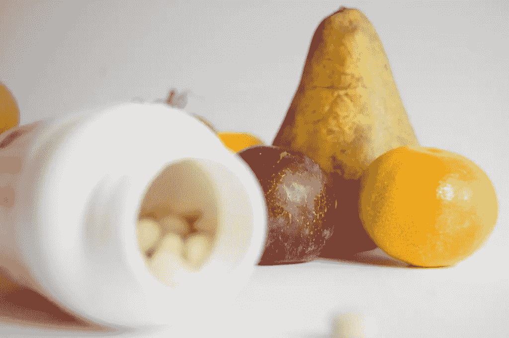
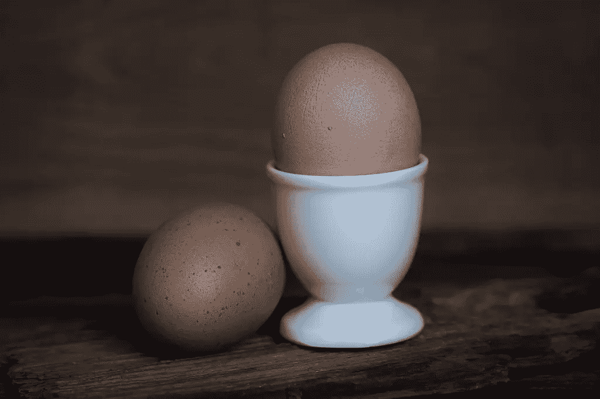
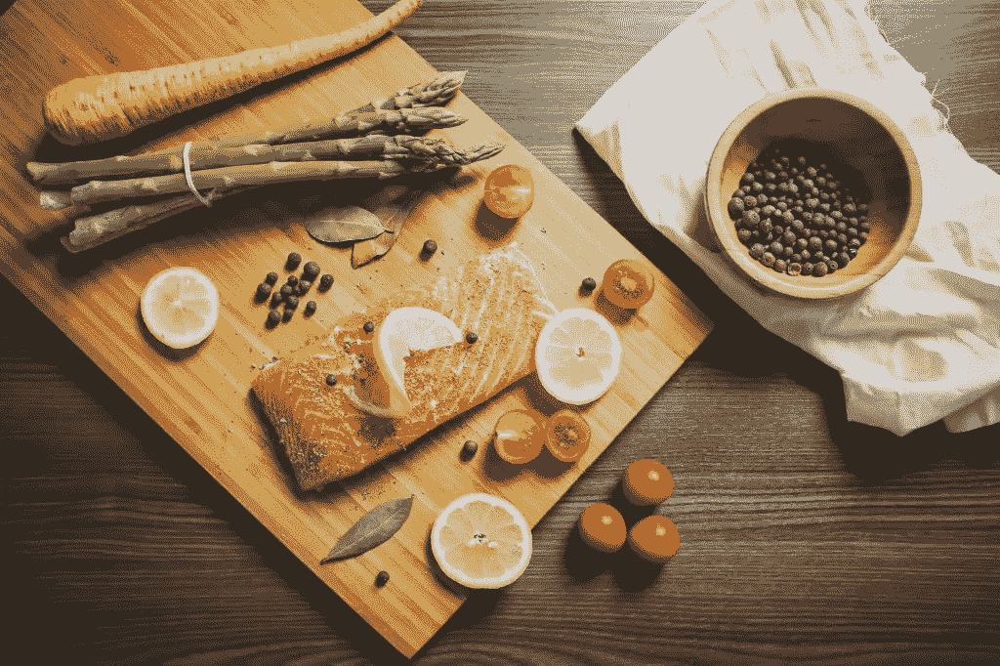

# 对企业家来说，最好的益智药是营养品

> 原文：<https://www.sitepoint.com/the-best-nootropic-smart-drug-for-entrepreneurs-is-nutrition/>

对于一个企业家来说，最重要的工具是一个功能齐全的大脑。这应该很容易，因为我们都有一个内置于我们系统中的大脑，但有时它们并不像我们希望的那样发挥最佳功能。有时他们需要一点刺激，对一些人来说这意味着寻求益智药物的帮助。

## 什么是益智药？

益智药和智能药物都是增强认知功能的补充剂，但许多人都有误解，认为它们是一回事。事实上，真正的益智药没有副作用，也不会损害你的神经元结构。另一方面，智能药物会带来副作用，如易怒、情绪波动、压力、焦虑以及对食欲和睡眠的不良反应(想想《无限的 T1》中的[布莱德利·库珀)。它们还会让人上瘾，对你的健康造成长期损害。](https://www.youtube.com/watch?v=hzDk2To1mUs)

虽然益智药可能对一些企业家和其他需要尽可能提高大脑的人有用(例如学生！)，它们真的是理想的选择吗？尽管市场上出现了越来越多的益智补品，但还有另一种提高智力的自然方法，不需要倾家荡产或服用补品。

好老套**营养**！

## 为提高智力而吃东西

许多古老的文化，我们的祖先，以及那些不容易获得药物的人仍然通过将食物用作药物来保持身心健康。营养是一种简单、自然且廉价的方法，可以让大脑保持敏锐并处于最佳状态。

这里有一些必须的食物和营养，应该包含在每个企业家的饮食中。

### 胆碱

为了产生一种叫做乙酰胆碱的神经递质，需要食用胆碱。神经系统中的这种神经递质对注意力、记忆力和专注力至关重要。它在我们储存短期记忆的能力中起着关键作用。鸡蛋是胆碱的最大来源，因为蛋黄中含有卵磷脂(其中含有胆碱)。

胆碱也可以通过器官肉(如肝脏)、牛奶和全麦食品摄入。早餐吃一个鸡蛋可能是你早上大脑工作时唯一需要的益智食品。注意不要吃太多，因为它们含有高水平的胆固醇。

### 蛋白质

蛋白质是由氨基酸组成的，氨基酸又组成了神经递质，如血清素和多巴胺(令人感觉棒极了的激素)。这些荷尔蒙让我们感到快乐，没有压力，并增强了思维的清晰感——所有这些都有助于保持高能量水平。

蛋白质可以在瘦肉、家禽、海鲜、奶制品和蛋类中找到，⏤基本上任何是(或来自)动物的东西。

### 抗氧化剂

抗氧化剂是我们抵御自由基(由于氧化、压力、烟雾、紫外线、加工食品而失去一个电子的分子；基本上任何不好的)。自由基攻击我们的细胞，老化我们的身体和大脑，导致免疫系统损伤，心脏问题，阿尔茨海默氏病，痴呆症和癌症…以及其他疾病。

抗氧化剂可以在水果和蔬菜中找到，如鳄梨、洋葱、菠菜、西兰花、甜椒、苹果，当然还有富含抗氧化剂的浆果。将这些食物包含在你的饮食中会显著增强你的记忆、思维和学习能力，让你的创业精神更加强大，持续时间更长。

### 欧米伽-3 脂肪酸

ω-3 脂肪酸对你的健康至关重要，由于我们不能自然产生它们，我们必须从食物中获取这些健康脂肪。DHA(二十二碳六烯酸)、ALA(α-亚麻酸)和 EPA(二十碳五烯酸)是我们饮食中需要的 3 种主要 omegas。DHA 和 EPA 主要存在于油性鱼类中，而 ALA 存在于坚果、植物油、动物脂肪、亚麻籽和绿叶蔬菜中。

DHA 对大脑的结构和发育尤其重要，还可能减缓大脑在晚年的衰老过程。确保你的饮食中包括油性鱼类，而不是服用鱼油补充剂，⏤天然来源总是更有益的。

### b 族维生素

叶酸、核黄素、烟酸和 B12 等 b 族维生素协同发挥多种身体功能，包括释放身体从碳水化合物、蛋白质和脂肪中获得的能量。这些必需的维生素被发现可以[减少疲倦和疲劳](https://www.sitepoint.com/10-sleep-mistakes-that-could-be-hurting-your-productivity/)，这两样东西在紧张的一天困扰着忙碌的企业家。

b 族维生素实际上可以在多种食物中找到，包括豆类和豆类、绿叶蔬菜、土豆、香蕉、海鲜、鱼、牛奶、酸奶和肉类。

## 结论

大脑是身体中最劳累的器官；确保它的健康是非常重要的。当大脑缺乏所需的营养时，它无法达到最佳状态，对于那些总是需要思考的企业家来说，益智药似乎是天赐之物，但这只是在这个问题上贴了个创可贴。

拥有健康、均衡的饮食⏤富含健脑食品⏤是企业家能拥有的最好也是最简单的“益智食品”，如果被采用，它将永远让你的大脑在未来的**年**保持强壮、年轻和敏锐。

## 分享这篇文章