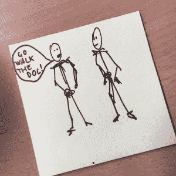
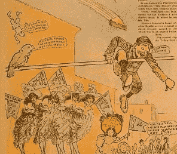
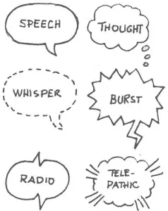
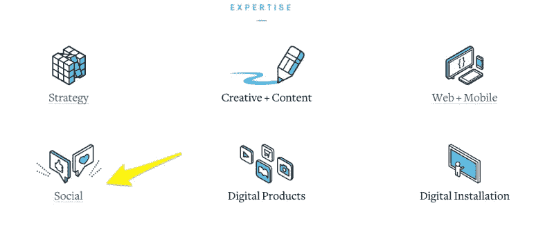
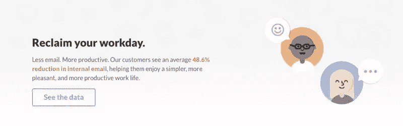
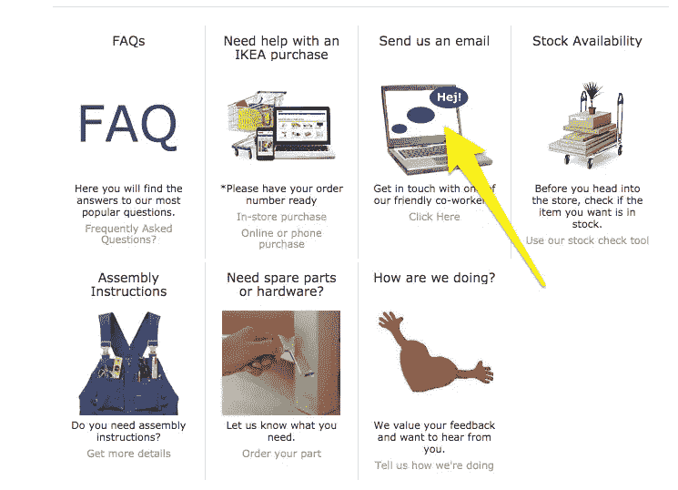

# 谦逊的语音泡泡将如何改变我们未来的用户界面

> 原文：<https://www.sitepoint.com/why-the-humble-speech-balloon-will-transform-our-future-uis/>

上周，我做了一个简单的实验。我递给朋友一些纸和一支铅笔，让他画两个人。

他热心地画了一些简笔画。

“好吧，”我说。"现在画第一个人告诉第二个人去遛狗."

我的朋友立即在左图的头部上方勾勒出一个讲话气泡，并用大字写道:“去遛狗吧！”

正如我所假设的，他展示谈话的方法是一个演讲气球。但是如果我们没有这个默认呢？描绘对话会令人惊讶地棘手——你可以将它添加到图片的某个地方，也许作为一个标题或在空中盘旋——但这样就不会清楚谁在对谁说什么。

事实证明，这个不起眼的图标在设计中非常重要。让我们深入探讨演讲泡沫的起源，然后探究它今天是如何被使用的。

## 演讲泡沫的发明

当你想到“现代发明”时，你可能不会想到语音泡沫。然而，这些球形符号实际上是比枪、显微镜和望远镜，甚至蒸汽泵更近的发明。

在艺术家有语音泡泡之前，他们用的是 bandelores。想象一个长长的、展开的矩形，充满了从某人嘴里延伸出来的文本。是啊，不漂亮。

<small>[伯恩哈德·斯特里格尔——1506](https://en.wikipedia.org/wiki/Bernhard_Strige)></small>

正如独立作家罗德里·马森[评论的那样](http://www.independent.co.uk/arts-entertainment/books/features/interesting-object-the-speech-balloon-8967847.html)，它们“不协调地从人们的嘴里冒出来，看起来有点像大型超市的收银台收据，也一样难以阅读。”

18 世纪和 19 世纪，束发带非常流行。事实上，当时的主要漫画家用它们来讽刺拿破仑、纳尔逊和皇室。但是当艺术家们意识到这些延伸的卷轴难以阅读时，他们开始转向其他的传统。

当 1895 年《纽约日报》刊登《黄种人小子》时(历史学家认为这是第一部连环漫画)，漫画人物的话出现在他们的胸前。然而，到了 1896 年，他们乘着气球在头顶上漂浮。言论泡沫已经诞生。

<small>1895 年至 1898 年《黄种人》漫画摘录</small>

如今，拿起一本漫画书，几乎不可能*而不是*发现演讲气泡。但是由于它们与交流的普遍联系，它们的传播已经远远超出了纸的起源。

## 为什么《演讲泡沫》会大受欢迎？

言论泡沫持续流行的原因并不明显。首先，如果你看看绝大多数通用图标，它们与“现实生活”中的图标非常相似:比如信封图标，通常代表“消息”，或者垃圾桶图标，几乎总是意味着“删除”。

另一方面，语音气泡看起来不像我们在日常生活中认识的任何东西——可能是因为“语音”没有我们可以看到或触摸到的真实世界的模拟。

另外，[可用性研究表明](https://www.nngroup.com/articles/icon-usability/)即使是最常见的，看似简单的图标(如心形、时钟和书签)也经常被误解。

那么，言论泡沫是如何不仅在设计中存活下来，而且茁壮成长的呢？我有一个理论。

首先，在《黄色小子》之后，漫画书里的语音泡泡变得无处不在。毕竟，它们是无限有用的:艺术家用它们来将引用归于特定的人物，显示对话的顺序，甚至描绘人物如何说话。

漫画书在二十世纪非常受欢迎。不同背景、阶层和年龄的男人、女人、男孩和女孩都阅读它们，而不仅仅是小孩子。因此，每个人都逐渐认识到泡沫的意义。

演讲气球的形状也扮演了(并且继续扮演)一个角色。我们发现圆形在潜意识层面很有吸引力:[它们让人感到温暖、友好和自然](http://www.creativebloq.com/logo-design/psychology-logo-shapes-8133918)。此外，戒指通常暗示团结和关系。

所以，每当你看到一个言论泡沫，你就会受到一波积极联想的冲击。你还会微妙地想起社区——如果你仔细想想，它会让一个演讲泡泡成为一种交流方式的理想象征。

## 5 个主要使用案例

既然我已经解释了为什么语音泡沫会随着时间的推移而存在，让我们来看看它是如何在现代网页设计中使用的。不是“言语泡沫=说话”这么简单。

事实上，它们的用例可以分为几个主要类别。从最常见到最不常见，它们是:

*   聊天的选项
*   说话的一般概念
*   联系信息
*   留下反馈的能力
*   翻译服务

大多数流行的社交网络使用语音气泡作为聊天的选项。例如，当你通过 Gmail 登录收件箱时，点击顶部导航栏中的语音气球会打开 Google Hangouts。

与此同时，脸书的信息图标是一个层叠在另一个之上的小语音气泡，而 Twitter 的直接信息图标是邮箱和语音气球的结合体。

事实上， [Blitz Agency](http://www.blitzagency.com/) 的主页清楚地表明了社交网络和言论泡沫之间的联系已经变得多么紧密:

当然，语音泡泡也可以方便地用来说明信息交换。

看看 Slack 如何在其产品页面上整合了不止一个而是两个语音气球:

不太常见的是，语音气泡象征着联系信息或留下反馈的能力:

最后但同样重要的是，他们将翻译过程可视化:

<small>谷歌翻译</small>

## 那么，言论泡沫的下一步是什么？

哦，不亚于统治世界。

让我解释一下。

据优步的开发者体验负责人克里斯·梅西纳(传说是标签 T1 的发明者)称，2016 年将是对话式商务年。

墨西拿写道

> “对话式商务(在我看来)在很大程度上与利用聊天、消息或其他自然语言界面(即语音)与人、品牌或服务和机器人进行交互有关，迄今为止，这些在双向、异步消息传递环境中没有真正的位置。”

换句话说，我们将通过我们目前为人类同胞保留的渠道与品牌和公司对话:如 Slack、Facebook Messenger、微信、iMessages 等渠道。

不出所料，有很多关于对话式商务对 UI 意味着什么的讨论。Layer 的联合创始人托马斯托尔法(tomatolfa)认为,[每条信息都有可能充当一个迷你应用程序](https://medium.com/the-layer/the-future-of-conversational-ui-belongs-to-hybrid-interfaces-8a228de0bdb5#.vc3dgo3zw)——它不仅可以包含文本，还可以包括照片、视频、按钮或它们的组合。

但是为什么就此打住呢？他解释说，有无限的机会来创建“一口大小的应用程序”，包括“照片传送带、媒体播放器、迷你游戏、库存项目、消息内支付”等等。

由于我们用来与机器人和虚拟助手交谈的大多数渠道都使用语音气泡，它很可能是这些迷你应用程序的“运载工具”。

事实上，如果设计师聪明，他们会全心全意地拥抱演讲气球。在这一点上，演讲气球感觉很友好是的，因为它们的形状，但更重要的是，因为它们已经成为人与人交流的代名词。

因此，如果你想让用户信任机器人，并把它们融入到日常交易中，值得信任的、*人类*感觉的语音气泡将是关键。让我们面对现实吧，人们总是对技术进步保持警惕——尤其是当涉及到具有*模仿人类*智能的机器人时。我们都知道在*、*、 *I、*、*、*等电影中发生了什么。

可以说，通过在机器人上放置友好的面孔，设计师可以帮助机器人与人类的交互感觉更正常。其实不使用语音气泡的通讯 app，像 Slack，应该考虑实现。

语音泡泡可能是通过不起眼的漫画书进入我们的视觉语法的，但可以肯定的说，从那以后它已经有了令人印象深刻的发展。

如果要我打赌，它的未来会更光明。

## 分享这篇文章