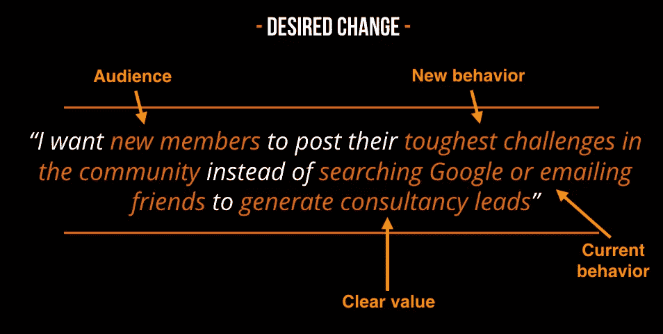

# 采访:理查德·米林顿谈建设伟大的社区

> 原文：<https://www.sitepoint.com/interview-richard-millington-on-building-great-communities/>

社区是许多组织的重要组成部分。建立和培养一个社区并不是一件容易的事情——组织必须小心地将它成功地整合到他们的商业模式中。今天，我很高兴和理查德·米林顿在一起，他研究社区已经有几年了，并帮助了许多组织。

理查德是社区咨询公司 FeverBee 和独家社区管理培训课程 Pillar Summit 的创始人。

谢谢你接受我的邀请，理查德！

理查德:我的荣幸。

埃利奥:你能简单解释一下什么是 FeverBee 吗？最初是什么让你开始发烧的？

Richard:fever bee 都是关于用社会科学来解决社会问题。值得注意的是，我们在建立社区、试图更好地合作、彼此分享知识时所面临的许多挑战都源于社会心理、动机和习惯。

我们试图做的是将大量的信息提炼为非常实用的步骤，帮助人们建立强大的社区，并与他们的员工或客户更好地合作。

我们从 2008 年就开始这样做了。在此之前，我已经在视频游戏领域管理社区多年。毕业后，我在塞斯·戈丁 公司实习，学到了很多如何建立成功社区的知识。从那时起，该公司通过向一些世界顶级组织提供咨询，培训一代社区专业人士，以及出版有助于提供建议的书籍而发展壮大。我们还做了很多其他的事情，但是这是一个很好的总结。

Elio:我注意到社区和贡献者在今天的商业模式中逐渐获得了更大的角色。这种转变的原因是什么？

理查德:我认为目前社区有点被夸大了。有很多组织建立社区并取得成功的例子。然而，有更多的社区试图建立一个社区而失败的例子。要么他们不能得到正确的概念，要么他们不知道如何让人们加入和参与。

这里的一个自然问题是注意力障碍。今天有太多的社区在争夺有限的观众注意力。

然而，社区方法对于许多内部和外部的组织都非常有效。这部分是因为我们拥有比过去好得多的技术。虽然论坛很棒，但我们现在拥有的工具更容易使用，更集成，设计更好，也更符合我们的习惯。这在一定程度上也是社会变革的结果。办公室隔间不像以前那么受欢迎了。我们期待更多的参与和合作。

我们正在慢慢地变得更好，为社区提供一个清晰的用例。我们看到越来越少的社区供人们在早上谈论他们喜欢的任何事情，而越来越多的社区供人们为了特定的目的而访问。这可能是为了得到答案，分享想法，建立他们的声誉，等等…

当有一个清晰的用例时，它的价值是非常明显的:组织节省了资金，增加了客户忠诚度，并提高了生产力。

但是要小心炒作。并不是每个组织都应该建立一个社区，而那些建立了社区的组织将会在当前的关注大战中挣扎。

Elio:社区管理是一个相当宽泛的术语。在衡量社区影响时，你认为哪些指标是重要的，因为这通常是一个很难确定的方面？

理查德:这是一个 HUUUGGGEEE 话题。我尽量简化。社区投资回报率不容易衡量，但它总是可以衡量的。如果你能定义它，你就能衡量它(借用吴荣国的一句话)。

首先，让我们区分社区健康指标和 ROI 指标。它们并不相同，也不像你想象的那样相关。健康包括对活动、成员和社区意识的测量。ROI 是企业从投资中获得的回报。

根据我们获得的数据，我们使用数据库分析、抽样技术或调查来确定。

自加入社区以来，成员的支出增长是否超过了同期非成员的支出增长？如果普通客户以前花费 60 美元，现在花费 90 美元，而非会员花费 40 美元，现在花费 60 美元，您可以将 10 美元的差异(30 美元会员-20 美元非会员)归因于社区。将这个数字乘以活跃成员的数量，你就有了一个可以使用的数字。

社区产生了新的业务吗？销售线索是通过社区发现的吗？转化率提高了吗？我在 Moz 的朋友 Jenn 知道，执行{x}任务的成员更有可能转化为客户。这相对容易追踪。

保留率提高了吗？自从加入/未加入社区以来，社区成员的保留率是否比非成员的保留率提高了更多？

呼叫偏转。这与客户服务社区更相关。您确定每次通话的成本(通话人员的总成本+管理费用/通话次数),然后查看社区中有多少问题得到了回答。然后检查有多少人拨打了客户服务热线(调查),以及他们是否解决了问题。这可能会比这复杂得多，但你得到了基本的想法。

对于生产力和协作这样的话题，人们倾向于衡量各种各样的东西。减少电子邮件、自我报告的价值案例、感知价值调查等。可以说，最终的衡量标准是员工生产率。你将收入除以员工人数。但是有太多的事情会影响这一点，以至于它经常变得不切实际。你可以做的一件简单的事情是调查成员，看看他们花了多少时间寻找文件，然后再调查他们。

对于非营利组织，你会更多地关注满意度调查，以及每满意度点数的成本。同样，这是一个巨大的话题，但你可以衡量它。

这里常见的错误是将成员与非成员进行比较。不要那样做。你只是在拿你最好的顾客和其他人做比较。这是一个巨大的抽样误差。

埃利奥:临界质量呢？大多数社区管理者都很难达到这个目标。对于那些试图在社区独立运作之前达到临界质量的人，你有什么好的建议？

我们之前已经深入讨论过这个话题。我在这里试着总结一下:

**1)开始真的很小**。找到最小可能的利基，没有人会费心去满足和绝对支配这个利基。从那里逐渐展开。

**2)在启动社区之前建立关系**。让一个社区起步的最大因素是你已经存在的关系的数量。你越出名越好。在这里遵循芯片流程。一旦你与 50 多名目标受众建立了牢固的关系，那么就启动社区并邀请人们加入。

一开始就保持简单。只有一个人们可以参与的领域，集中你所拥有的一切，让这个领域尽可能地不可思议。你真的希望这里成为每个人每天都可以参观的神奇地方。挑战期望，比他们期望的好两倍…这是人们成长和推荐你的方式。

专注于邀请他人、建立关系和讨论。当你刚刚离开地面的时候就是这样。把你的注意力集中在做好这三件事上。

现在这应该足够了。

埃利奥:接下来的问题是“我有什么好处？”许多社区管理者在他们的社区里都会遇到。毕竟，大多数社区成员将他们的空闲时间奉献给了一些没有报酬的事情。你会建议社区经理如何处理这些情况？

理查德:我不认为很多人会这么说，这更多的是关于我们对社区形成的联想。

我们付出了很多却没有得到多少回报吗？我们会把社区和高努力低回报联系起来，停止参与。

人们参与社区不是为了获得实实在在的回报，所以我们应该绝对避免给他们。我会杀死大多数不使用可变奖励原则的游戏化。

相反，人们会继续参与，原因有几个:

**1)相互支持**。如果社区帮助成员更好地解决问题(最重要的是更快！)而不是其他地方，当人们有问题要解决时，他们就会来参观。问题是人们只有在有问题要解决的时候才会去拜访。

**2)更大的影响力**。如果参与社区能给成员带来更大的影响力，他们会继续参与。如果他们觉得通过参与可以建立自己的声誉并对周围环境产生更好的影响，他们会继续参与。

**3)归属感**。如果你能培养一种强烈的社区意识，人们会不断回来，因为他们喜欢与同龄人互动。这是非常强大的。

新的想法/探索。如果你能让社区成为人们分享新想法的地方，人们会每天都来，因为他们不想错过。它有助于人们更好地理解这个话题。

如果你能很好地提供这四个中的至少一个，你将解决 WIIFM 问题。

埃利奥:我们来谈谈你的书《嗡嗡社区》。你写一本关于社区管理的书的想法是怎么产生的？

已经有一些关于社区的好书了，但它们是从理论或社会学的角度来探讨这个话题的。例如，他们会讨论社区应该如何工作或者他们对社会的影响。克莱·舍基的*《大家来了》*大概就是一个很好的例子。

我真的很想从最实际的角度写点东西。我想弄清楚我们不断重复看到的许多错误，以及我们如何相应地调整我们正在做的事情。最重要的是，我想要一本指南，当人们不得不发起新的讨论、维持讨论、创建内容或计划用户社区之旅时，他们可以使用它。

我们真正试图做的事情之一(并不总是成功)是使我们的材料尽可能实用和立即可操作。不利的一面是，提示越具体，这本书的保质期就越短。但我真的被迄今为止的好评所折服，我认为迄今为止对这本书和我们的业务来说，这种交换都是值得的。

你打算将来再写一本书吗？

理查德:我们走着瞧:-)

对社区管理感兴趣的人可以参加你们近期即将举办的活动吗？

**Richard:** 我们最近于 6 月 6 日在纽约举办了研讨会(http://newyork.feverbee.com)，我们也将很快重新推出我们的在线培训课程，今年晚些时候肯定会有一些大型活动。

谢谢你的精彩采访，理查德！这是非常有见地的。

理查德:感谢邀请我！

## 分享这篇文章