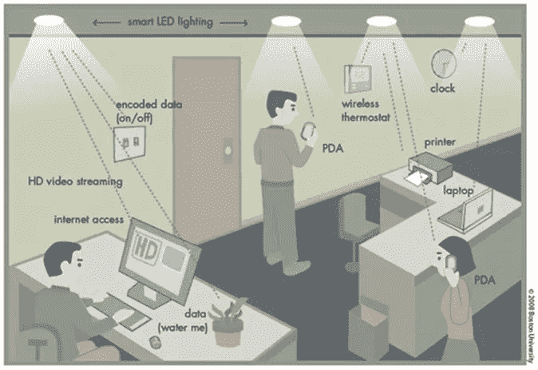
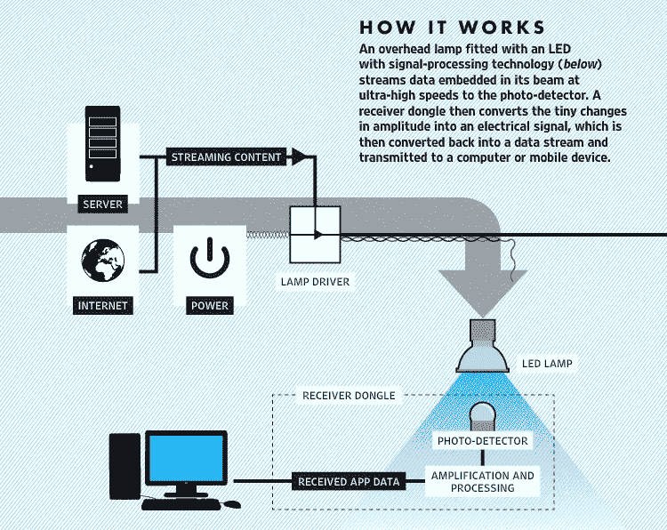
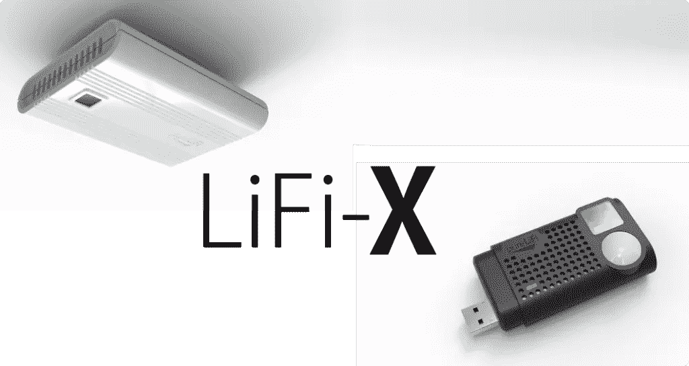

# Li-Fi:点亮无线网络的未来

> 原文：<https://www.sitepoint.com/li-fi-lighting-the-future-of-wireless-networks/>

光保真(Li-Fi)是一种相对较新的无线通信技术。它使用光信号来传递数据。围绕 Li-Fi 的兴奋是因为它已被证明比 Wi-Fi 速度更快。在实验室里， [Li-Fi 已经达到了每秒 224 千兆比特的速度](http://www.sciencealert.com/li-fi-tested-in-the-real-world-for-the-first-time-is-100-times-faster-than-wi-fi)。同一实验室在爱沙尼亚的一家工厂实地测试了 Li-Fi 技术，并实现了每秒 1 千兆位的传输速率。

来源:波士顿大学和科学警报

哈拉尔德·哈斯教授在 2011 年的一次 TED 演讲中向世界介绍了 Li-Fi。他想把世界上的灯泡变成无线路由器。在 TED 演讲后不久，2012 年，他推出了 [Pure Li-Fi](http://purelifi.com/) 来领导 Li-Fi 产品开发。Pure Li-Fi 是一家开发 Li-Fi 设备的公司。Li-Fi 联盟的成立也是为了共享信息和开发技术。 [Li-Fi 联盟](http://lificonsortium.org/)是一个开放的非营利组织——任何组织都可以许可他们的技术或与他们合作。加入该联盟不收会员费。

> “我们所需要做的就是在每一个潜在的照明设备上安装一个小的微芯片，然后这将结合两个基本功能，照明和无线数据传输。未来，我们不仅会有 140 亿个灯泡，我们可能会在全球部署 140 亿个 Li-fi，以实现更清洁、更环保、甚至更光明的未来。”哈拉尔德·哈斯 2011 年 Ted 演讲。

Herald Hass 已经证明，数据可以通过光谱传输——这使得 Li-Fi 成为一种光学无线通信形式。Li-Fi 使用红外线和紫外线(可见光)波来传输数据。红外线和紫外线光谱比无线电波能携带更多的信息。这就是为什么 Li-Fi 可以实现比 Wi-Fi 更高的速度。

目前，Li-Fi 技术专注于使用发光二极管(LEDS)发出的光来传输数据。led 因其高效、低环境影响和长寿命而在世界各地非常受欢迎。家庭和办公室里的 LED 灯可以变成无线路由器。LED 灯泡是一种半导体光源，因此，可以改变灯泡的恒定电力供应，使其变亮或变暗。使用可见光通信(VLC ), LED 灯泡中的电流以非常高的速度开关。把它想象成包含 1 和 0 的复杂莫尔斯电码。这种闪烁的速度太快，人眼无法察觉，因此人类和动物不会受到影响。Li-Fi 将在您关闭灯后继续工作，因为 led 将亮起，并以人眼无法识别的低亮度发出信号。要访问 Li-Fi 网络，你只需要一个检测光信号的设备，以及一个破译光信号的组件。

Wi-Fi 使用无线电频率波，这种技术的空间有限，很快就达到了极限。有限的容量是无线电频谱在美国受到严格监管的原因。Li-Fi 最可爱的一面是它使用了可见光光谱。可见光光谱比无线电频谱大 10 000 倍，而且不受管制。所以你不需要执照就可以利用光谱。

Li-Fi 的另一个优势是它使用光谱而不是无线电频率。因此，它不会发出电磁干扰。这使得它更适合于高度敏感的区域。电磁干扰会影响矿井等区域的通信，或者扰乱医院等地方的敏感设备。

## 它是如何工作的

数据被输入装有信号处理技术的 LED 灯泡。LED 灯泡以高不可见光率向光电探测器发送数据。接收器将脉冲转换成电信号，然后将电信号转换回二进制数据，这就是我们所消费的网络内容。LED 灯将联网，因此多个用户可以使用单个 LED 灯访问数据，或者从一个 LED 灯移动到另一个 LED 灯，而不会影响他们的访问。

来源:纯 Li-Fi

从一开始，哈拉尔德·哈斯教授就想开发一种适合日常生活的无线技术。他不想要一种需要在我们的生活中进行大量改造的技术，这将增加成本和复杂性。通过纯 Li-Fi 和像 Li-Fi 联盟这样的其他公司，已经建立了相对容易融入我们生活的解决方案。Pure Li-Fi 构建了一个家庭解决方案 LiFi-X，用户可以购买一个砖块大小的模块，连接到他们的 LED 灯泡，笔记本电脑或台式机等设备可以通过 USB 加密狗接收数据。设置非常简单。

来源:纯 Li-Fi

虽然 Li-Fi 的速度比 Wi-Fi 快，但它的范围非常短。离光源越远，速度越慢。也就是说，你不一定需要在 LED 灯下才能访问 Li-Fi，因为它可以利用表面(包括墙壁)的光反射来实现平均 70 MB/s 的速度。与 Wi-Fi 不同，Li-Fi 不能穿透墙壁，因为它使用光谱。虽然不能穿透墙壁限制了 Li-Fi 的范围，但这也使该技术更加安全。它确保用户可以限制可访问的区域。Li-Fi 的安全方面引起了技术和国防公司的极大兴趣。

由于 Li-Fi 可以达到的速度及其空间限制，该技术将与蜂窝和 Wi-Fi 技术一起作为连接的额外选择。Li-Fi 可以用来分流蜂窝和 Wi-Fi 网络的大量流量。例如，Li-Fi 可以在购物中心或体育场等人口密集的区域使用，允许用户消费视频或直播等内容丰富的媒体。由于用户将使用 Li-Fi 网络，这将释放该区域的蜂窝和 Wi-Fi 网络容量。这是因为上行链路需要很少的容量，而下行链路使网络变得紧张。这项技术将很快拥有一个相当迷人的安装基础，因为迪拜计划很快成为第一个用 Li-Fi 安装路灯的城市。据说这些灯每盏花费了迪拜 1000 美元。

物联网(IoT)是一场革命，许多专家都在问，我们将从哪里找到处理所有这些数据的能力？Li-Fi 已证明自己是一个可行、高效且安全的解决方案。家庭、办公室或工厂可以在 Li-Fi 上运行自己的高容量网络，而不会对公共容量产生不利影响。

## 分享这篇文章