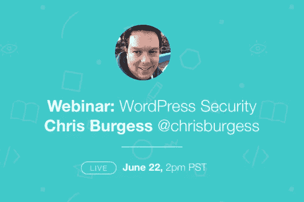

# 传播关于 WordPress 安全的信息

> 原文：<https://www.sitepoint.com/spreading-the-word-on-wordpress-security/>

当我说网站安全时，你是感到兴奋、焦虑还是只是不确定？

大多数人发现很难爱上安全感，即使我们知道这是不应该被忽视或忽略的东西。

WordPress 用户–你知道 WordPress 为三分之一的网络提供动力吗？这带来了很多好处——一个伟大的、支持性的社区，大量的插件和工具——但这也使 WordPress 成为攻击者的热门目标。作为网站所有者或开发者，我们需要对我们建立和维护的网站负责。有一个由免费和付费工具和服务组成的*庞大的*生态系统来帮助**保持我们网站的干净和安全**。

我们每个月都会与各种主题的专家举行网络研讨会，本周我们将讨论 WordPress 的安全性。克里斯·伯吉斯， [Clickify](https://clickify.com/) 的联合创始人和 SitePoint 自己的 [WordPress 编辑](https://www.sitepoint.com/author/cburgess/)将加入我们分享他的智慧。

Chris 将探讨与常见 web 安全问题相关的风险，并提供一些方便的提示。他甚至会谈到一些实用的、现实世界中的预防措施，你可以用它们来保护和监控你的 WordPress 网站。如果这还不足以让你在日程表中圈出这个事件，你还有机会参与讨论并**向克里斯提出你自己的问题**！

## 这是什么时候发生的？

将您的闹钟设置为:**2016 年 6 月 22 日下午 1 点(太平洋标准时间)**。不要错过，[现在就报名参加活动](https://app.webinarjam.net/register/20023/0956d9ce38)。

## 分享这篇文章