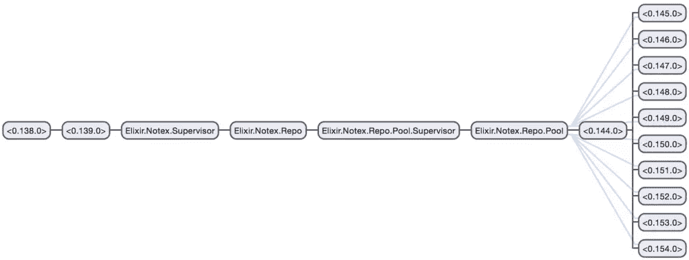

# Elixir 的胞外文库介绍

> 原文：<https://www.sitepoint.com/introduction-to-elixirs-ecto-library/>

[Elixir](http://elixir-lang.org) 是一种现代、动态、函数式编程语言，用于构建高度分布式和容错的应用程序。Ecto 是它处理数据库的主要库，为我们提供了在通用 API 下与数据库交互的工具，为数据库和我们的应用程序一起版本化，并在我们的应用程序中处理数据。

本文简要介绍了 Ecto 库的主要方面。虽然它是为 Ecto 1.x 编写的，但本文中的示例与 Ecto 2 是向前兼容的，如果有差异，就会提到。假设有灵药和合剂的基本知识。

## 应用程序

我们将从头开始构建一个非常简单的应用程序，为我们存储和检索笔记。通过这样做，我们将查看 Ecto 的四个主要组件:repos、模式、变更集和查询。

### 创建新的应用程序

让我们从生成一个新的 Mix 应用程序开始:

```
mix new notex --sup 
```

`--sup`标志生成一些 OTP 应用程序所需的附加样板代码。这个应用程序需要有一个监督树，因为 Ecto 需要它(稍后会详细介绍)。

### 设置依赖关系

现在，让我们用一些应用程序依赖项来更新我们的`mix.exs`文件。为此，我们将需要指定 Ecto 和它的一个适配器。为此我选择了使用 MySQL，所以我们需要指定 [Mariaex 库](https://github.com/xerions/mariaex) (Ecto 支持[多个数据库](https://github.com/elixir-lang/ecto#usage))。

用以下内容更新`mix.exs`文件中的`application/0`函数:

```
def application do
  [applications: [:logger, :ecto, :mariaex],
   mod: {Notex, []}]
end 
```

并用以下内容更新`deps/0`:

```
defp deps do
  [{:ecto, "~> 1.1.5"}, # or "~> 2.0" for Ecto 2
   {:mariaex, "~> 0.6.0"}] # or "~> 0.7.0" for Ecto 2
end 
```

现在用`mix deps.get`获取依赖项。

接下来，我们需要将这些依赖关系集成到我们的应用程序中。这将涉及为一个 Ecto 存储库创建一个新的包装器模块，更新我们的应用程序的监督树以启动和监督这个新模块，并配置适配器的连接信息。

让我们首先用下面的代码在`lib/notex/repo.ex`定义一个`Notex.Repo`模块:

```
defmodule Notex.Repo do
  use Ecto.Repo, otp_app: :notex
end 
```

该模块(`lib/app_name/repo.ex`)的位置是常规的。任何时候我们使用一个`mix ecto`命令，它将默认在`AppName.Repo`寻找已定义的库。我们可以把它放在其他地方，但是不方便的是必须使用`-r`(或`--repo`)标志来指定它的位置。

上面的`Notex.Repo`模块使我们能够使用 Ecto 处理数据库。它首先从 Ecto 的`Repo`模块(提供数据库查询 API)注入函数，然后将我们的 OTP 应用程序命名为`:notex`。

一个 Ecto 存储库为我们提供了一个公共接口来与底层的*数据库*进行交互(这是由所使用的适配器决定的)。因此，尽管 Ecto 使用术语 repo，但它并没有**而不是**遵循存储库设计模式，因为它是数据库的包装器，而不是表。

既然我们已经定义了`Notex.Repo`模块，我们现在必须将它添加到`Notex`模块(位于`lib/notex.ex`)中的监督树中。用以下内容更新`start/2`功能:

```
def start(_type, _args) do
  import Supervisor.Spec, warn: false

  children = [
    supervisor(Notex.Repo, []),
  ]

  opts = [strategy: :one_for_one, name: Notex.Supervisor]
  Supervisor.start_link(children, opts)
end 
```

我们添加了`Notex.Repo`模块作为子监督者(因为它本身就是一个监督 OTP 应用程序)。这意味着它将由我们的 OTP 应用程序监管，并且我们的应用程序将负责在应用程序启动时启动它。

用 Ecto 创建的每个连接都使用一个单独的进程(这个进程是使用一个名为 [Poolboy](https://github.com/devinus/poolboy) 的库从一个进程池中提取的)。这样做是为了让我们的查询可以并发执行，并从失败(例如超时)中恢复过来。因此，我们的应用程序需要 OTP，因为 Ecto 有自己需要监控的进程(包括监控数据库连接池的监控树)。使用 [Erlang 的观察者库](http://erlang.org/doc/apps/observer/observer_ug.html)可以看出这一点，它使我们能够可视化应用程序中的流程。

在将 repo 添加到要监控的 worker 进程之后，我们需要最后配置适配器，以便它可以与我们的数据库通信。将以下代码放在“config/config.exs”文件的末尾(根据需要更新详细信息):

```
config :notex, Notex.Repo,
  adapter: Ecto.Adapters.MySQL,
  database: "notex",
  username: "root",
  password: "root",
  hostname: "localhost"

# uncomment the following line if Ecto 2 is being used
# config :notex, ecto_repos: [Notex.Repo] 
```

这里，我们指定了 OTP 应用程序的名称(`:notex`)和新定义的模块的名称(`Notex.Repo`)，以便与数据库进行通信。其他配置选项应该是不言自明的。Ecto 2 要求我们另外指定一个我们在应用程序中使用的 Ecto repos 列表。

Ecto 实际上为我们提供了一个将上述`Repo`模块设置为 mix 任务的快捷方式:`mix ecto.gen.repo`。这为我们生成了存储库模块，并用一些基本配置更新了`config.exs`文件(尽管`Repo`模块仍然需要手动添加到监督树中)。我在这里避免使用它，主要是为了演示如何手动设置 Ecto(这一点，以及 repo 生成器假设您使用 Postgres 的事实，因此我们无论如何都必须在配置中更新适配器)。

在继续之前，让我们快速地看一下流程层次。(注意，如果您运行的是 Ecto 2，那么在尝试编译项目之前，您首先需要用`mix ecto.create`创建数据库。)在 Elixir 的交互式 shell 中启动我们的应用程序，然后启动观察器:

```
iex -S mix

iex(1)> :observer.start
:ok 
```

导航到**应用**选项卡，我们可以看到应用的进程，包括哪些是主管:



所以这就是为什么这个应用程序需要是一个 OTP 应用程序。但是，在本文中，这是我们关于进程和 OTP 的最深入的研究。在以后的文章中将会更详细地介绍它们。

### 创建数据库和表

现在有了这个设置，我们就可以创建数据库和表了。要创建数据库，请运行以下命令:

```
mix ecto.create 
```

为了创建表，我们将使用 Ecto 的迁移特性。迁移使我们能够将数据库与源代码一起版本化，从而能够跟踪更改并应用不同的状态。因此，只要我们想改变数据库的结构，我们就会创建新的迁移。

可以使用`mix ecto.gen.migration`命令创建新的迁移，如下所示:

```
mix ecto.gen.migration create_notes_table 
```

上面应该会在`priv/repo/migrations`创建一个新的迁移文件夹，以及一个新的迁移文件。这个文件的前缀是创建的日期和时间(为了便于目录排序)，以及我们的迁移名称。打开该文件，将其修改为以下内容:

```
defmodule Notex.Repo.Migrations.CreateNotesTable do
  use Ecto.Migration

  def change do
    create table(:notes) do
      add :note_name, :string
      add :note_content, :string
    end
  end
end 
```

为了简单起见，我们使用了`create`宏来定义一个新表(称为`notes`，它有两个字段:`note_name`和`note_content`。主键是自动为我们创建的(名为`id`)。虽然我们的两个字段都被定义为简单的字符串，但是 Ecto 支持许多类型——你可以在它的文档中查看[。](https://hexdocs.pm/ecto/Ecto.Schema.html)

迁移完成后，我们现在可以使用以下命令运行迁移:

```
mix ecto.migrate 
```

这将创建带有 3 个字段的`notes`表(第三个字段是主键`id`)。

创建了表之后，现在是为表创建模型的时候了。该模型用于定义表的字段及其各自的类型。在转换和验证数据时，应用程序和 Ecto 将使用它们来查询 DSL。模型定义还可能包含虚拟字段(与迁移定义不同)，这些字段通常用于保存我们不想持久保存的短暂数据(例如未散列的密码)。

在其最基本的形式中，我们的`Notex.Note`模型(位于`lib/notex/note.ex`)将如下所示:

```
defmodule Notex.Note do
  use Ecto.Schema

  schema "notes" do
    field :note_name, :string
    field :note_content, :string
  end
end 
```

我们注入了`Ecto.Schema`模块，这样我们就可以使用`schema`宏来定义字段及其类型。当我们使用 Ecto 的变更集时，这些定义将变得很重要。`schema`宏为我们做的另一件事是将该类型的结构定义为当前模块(在本例中是`%Notex.Note{}`)。这个结构将使我们能够创建新的变更集(很快会有更多的介绍)并将数据插入到表中。

有了以上内容，我们就可以启动 IEx 并开始查询我们的数据库了:

```
iex(1)> import Ecto.Query
nil

iex(2)> Notex.Repo.all(from n in Notex.Note, select: n.note_name)
[] 
```

(编辑了控制台调试信息。)

导入 Ecto 的`Query`模块是为了让所有的查询 DSL 宏(比如`from`)在 shell 中对我们可用。然后我们创建一个简单的查询来返回所有记录(使用`all/1`，只选择`note_name`字段。这将返回一个空列表，因为我们当前在数据库中没有记录。让我们创建一个新的变更集，并将其插入到表中:

```
iex(1)> import Ecto.Query
nil

iex(2)> changeset = Ecto.Changeset.change(%Notex.Note{note_name: "To Do List", note_content: "Finish this article"})
%Ecto.Changeset{action: nil, changes: %{}, constraints: [], errors: [],
 filters: %{},
 model: %Notex.Note{__meta__: #Ecto.Schema.Metadata<:built>, id: nil,
  note_content: "Finish this article", note_name: "To Do List"}, optional: [], opts: [],
 params: nil, prepare: [], repo: nil, required: [],
 types: %{id: :id, note_content: :string, note_name: :string}, valid?: true,
 validations: []}

iex(3)> Notex.Repo.insert(changeset)
{:ok,
 %Notex.Note{__meta__: #Ecto.Schema.Metadata<:loaded>, id: 2,
  note_content: "Finish this article", note_name: "To Do List"}}

iex(4)> Notex.Repo.all(from n in Notex.Note, select: n.note_name)
["To Do List"] 
```

(编辑了控制台调试信息。)

我们从再次导入`Ecto.Query`开始，这是最后一次获取操作所需要的(特别是对于`from`宏)。然后，我们使用来自`Ecto.Changeset`的`change/1`函数，通过`%Notex.Note{}`结构创建一个新的变更集。然后插入并检索这个变更集。

变更集是我们在处理记录时使用的。它们使我们能够在插入之前跟踪数据的变化，以及验证这些变化并将它们的值转换为正确的数据类型(根据我们的模式定义)。正如我们从上面所看到的，`%Ecto.Changeset{}`结构包含了许多成员，这些成员对于查看更改是否有效(`changeset.valid?`)、如果无效会有什么错误(`changeset.errors`)等等非常有用。

让我们更新`Notex.Note`模型来演示一些变更集和查询操作，因为在 IEx 中执行这些有点麻烦:

```
defmodule Notex.Note do
  use Ecto.Schema

  import Ecto.Changeset, only: [cast: 4]
  import Ecto.Query, only: [from: 2]

  alias Notex.Note
  alias Notex.Repo

  schema "notes" do
    field :note_name, :string
    field :note_content, :string
  end

  @required_fields ~w(note_name)
  @optional_fields ~w(note_content)

  def insert_note(%{} = note) do
    %Note{}
    |> cast(note, @required_fields, @optional_fields)
    |> Repo.insert!
  end

  def get_notes do
    query = from n in Note,
      select: {n.id, n.note_name}

    query
    |> Repo.all
  end

  def get_note(note_id) do
    Repo.get!(Note, note_id)
  end

  def update_note(%{"id" => note_id} = note_changes) do
    Repo.get!(Note, note_id)
    |> cast(note_changes, @required_fields, @optional_fields)
    |> Repo.update!
  end

  def delete_note(note_id) do
    Repo.get!(Note, note_id)
    |> Repo.delete!
  end
end 
```

让我们逐一检查这五个新功能。`insert_note/1`函数为我们创建了一个新的便笺。 [`cast/4`](https://hexdocs.pm/ecto/Ecto.Changeset.html#cast/4) 函数处理从输入字段到各自字段类型的数据转换(根据我们的模式定义)，并确保所有必需字段都有值。然后，从 cast/4 返回的变更集被插入到数据库中。注意，在 Ecto 2 中，应该使用 [`cast/3`](https://hexdocs.pm/ecto/Ecto.Changeset.html#cast/3) 和 [`validate_required/3`](https://hexdocs.pm/ecto/Ecto.Changeset.html#validate_required/3) 函数，而不是`cast/4`。

`get_notes/0`函数返回表中所有音符的元组列表。这是通过 select 语句中的模式匹配来完成的。(例如，我们可以很容易地用`select: %{id: n.id, note_name: n.note_name}`返回一个地图列表。)

`get_note/1`函数根据音符 ID 从表中检索单个音符。这是通过`get!`函数完成的，该函数要么在成功时返回注释，要么在失败时抛出。

`update_note/1`函数根据提供的音符 ID 更新音符。请注意函数签名映射中的字符串键(`id`键)。这是我从 Phoenix 框架中得到的一个约定，其中未整理的数据(通常是用户提供的)用字符串键表示在映射中，整理过的数据用原子键表示在映射中。为了执行更新，我们首先根据 ID 从数据库中检索注释，然后使用`cast/4`函数将更改应用于记录，最后将更新后的变更集插回到数据库中。

`delete_note/1`函数从数据库中删除一个音符。我们首先通过 ID 从数据库中获取注释(类似于`update_note/1`函数)，然后使用返回的`Note`结构删除它。

有了上面的 CRUD 操作，让我们跳回 IEx 并尝试一下:

```
iex(1)> alias Notex.Note
nil

iex(2)> Note.insert_note(%{"note_name" => "To Do's", "note_content" => "Finish this article..."})
{:ok,
 %Notex.Note{__meta__: #Ecto.Schema.Metadata<:loaded>, id: 6,
  note_content: "Finish this article...", note_name: "To Do's"}}

iex(3)> Note.get_notes                                                                           
[{6, "To Do's"}]

iex(4)> Note.get_note(6)
%Notex.Note{__meta__: #Ecto.Schema.Metadata<:loaded>, id: 6,
 note_content: "Finish this article...", note_name: "To Do's"}

iex(5)> Note.update_note(%{"id" => 6, "note_name" => "My To Do List"})
{:ok,
 %Notex.Note{__meta__: #Ecto.Schema.Metadata<:loaded>, id: 6,
  note_content: "Finish this article...", note_name: "My To Do List"}}

iex(6)> Note.get_note(6)                                              
%Notex.Note{__meta__: #Ecto.Schema.Metadata<:loaded>, id: 6,
 note_content: "Finish this article...", note_name: "My To Do List"}

iex(7)> Note.delete_note(6)
{:ok,
 %Notex.Note{__meta__: #Ecto.Schema.Metadata<:deleted>, id: 6,
  note_content: nil, note_name: nil}}

iex(8)> Note.get_notes
[] 
```

(编辑了控制台调试信息。)

现在我们有了它，一个使用 Ecto 的基本 CRUD 应用程序！我们可以呈现输出，并使 API 更易于查询，但我将把它作为一个扩展，因为这些与我们所涉及的内容无关(我认为这篇文章足够长)。

# 结论

本文通过从头开始创建一个简单的 CRUD 应用程序，研究了 Ecto 的基础知识。我们已经看到了 Ecto packs 管理记录和数据库变更的许多功能，包括迁移、模式及其查询 DSL，还触及了 OTP 之类的无关主题。我希望这对那些希望在 Elixir 中快速使用数据库的人来说是一个很好的入门。

在我的下一篇文章中，我将介绍 [Elixir 的 Ecto 查询 DSL](https://www.sitepoint.com/understanding-elixirs-ecto-querying-dsl-the-basics/) 的基础知识。

## 分享这篇文章