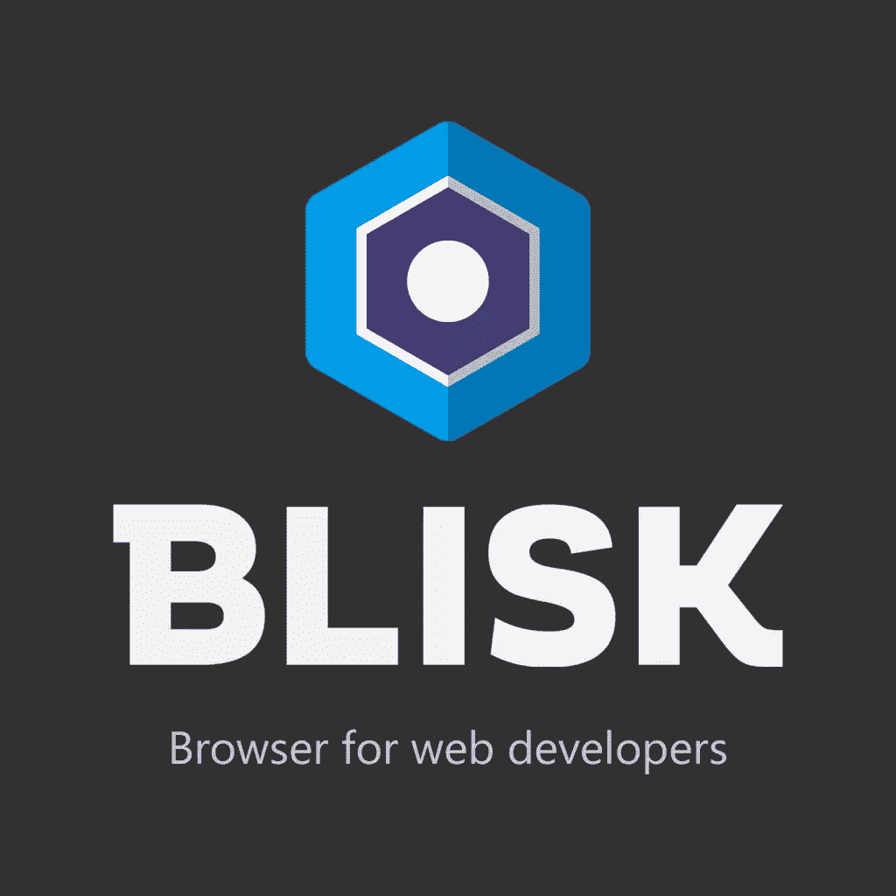
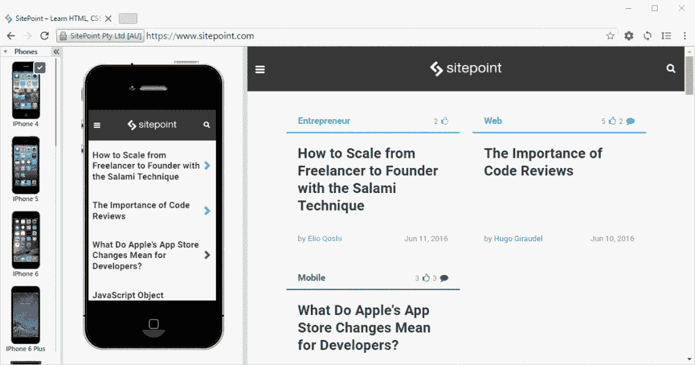
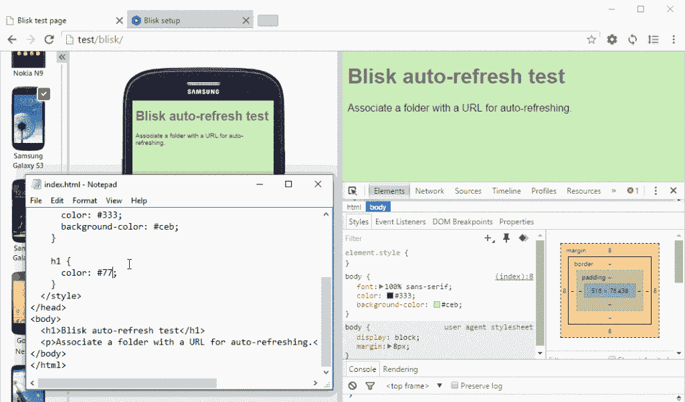

# Blisk:你的下一代网络开发浏览器？

> 原文：<https://www.sitepoint.com/blisk-your-next-web-development-browser/>

您在日常 web 开发任务中使用哪种浏览器？如果我最近的推特民意调查可信的话，我们中有四分之三的人使用默认浏览器。或许这是可以理解的:

*   这是我们最常打开的应用程序
*   我们完全按照我们喜欢的方式进行了配置
*   它提供了优秀的开发工具*(他们都是！)*
*   我们很乐意使用这些工具，而且
*   这是我们更喜欢的浏览器。

但是它实用吗？

如果你和我一样，你的默认浏览器在任何时候都有 57 个打开的标签页，里面有各种应用程序、工具和文章，你打算以后再看 *(…但很少会这样做！)*。在那个浏览器中开发是可能的，但是应用程序已经使用了许多资源。存储器和处理速度可能会受到负面影响。撞车可能是灾难性的！

您可能还启用了影响代码的插件，例如广告或脚本修饰符。你可以花几个小时调试系统，却发现问题是由你的一个扩展引起的，而这个扩展不是由“普通”用户安装的。您可以暂时禁用这些插件，但是这种选择会影响每个标签。

您可能还需要执行开发操作，如删除 cookies、清除本地存储或接受不安全的自签名 SSL 证书。如果在同一个域上运行不止一个测试应用程序，或者不小心从经常使用的网站上删除数据，这可能会导致问题复杂化。

尽管存在这些问题，只有四分之一的 web 开发人员会为主要开发任务打开另一个浏览器。其中不到一半的人使用专门的应用程序，如火狐开发者版或 T2 Opera 开发者浏览器。供应商努力提供这些工具，因为他们意识到没有 web 开发社区的支持，任何浏览器都不可能成功。他们通常提供最新工具和渲染引擎的测试版本，所以他们是一个很好的选择。然而，如果您有一个即时交付日期，您将需要在该浏览器的主流版本中测试您的应用程序，以确保您不依赖于尚未可用的技术或不同的实现。

## Blisk Beta 更好吗？

[Blisk](https://blisk.io/) 是一款新的浏览器，专门面向专业 web 开发人员，用于原型开发、编码、调试和测试任务。

Blisk Beta 仅适用于 Windows，但 Mac 和 Linux 版本正在开发中。安装有点令人不安，因为没有对话框或选项:Blisk 只是安装并立即运行。*(网站建议注册。没有必要这样做，尽管未来的特性可能需要这样做。)*

该应用程序使用与 Chrome、Opera 和 Vivaldi 相同的 Blink 渲染引擎。这是一个安全的选择，提供了那些浏览器中的标准开发工具(是的，这些工具是可停靠的)。这就是相似性的终点，Blisk 增强了您的 web 开发工作流程…

## 滚动同步设备视图

页面显示在双窗口中，包括:

*   标准桌面视图，以及
*   模拟的移动/平板电脑视图。

目前支持 9 款智能手机和 4 款平板电脑。您可以通过单击设备图标来模拟屏幕分辨率、像素比率、用户代理和触摸事件，从而进行切换。这些设备是在浏览器中提供的，所以它们离线工作，不需要云服务。

滚动是自动同步的(尽管您可以禁用它):

## 更改时自动刷新

您可以将 URL 与文件夹位置相关联。Blisk 将监控文件更新，并在发生变化时自动刷新两个设备:

如果你以前没有使用过类似的系统，它就是网络版的巫术。它节省了大量的时间，因为你不再需要切换你的编辑器和浏览器来查看更新。

## 承诺的功能

Blisk 是一个早期测试版，但在未来的版本中会有一些令人兴奋的新功能:

*   设备旋转至横向
*   网页分析，用于监控代码质量、资产规模、JavaScript 错误和其他指标
*   一键式设备截图并与同事分享
*   与 GitHub、BitBucket、Dropbox、Google Drive 和 Trello 等第三方服务集成。

## 应该采用整体叶盘吗？

Blisk 展现了希望。Mac/Linux 支持是必需的，界面需要润色，设备轮换是必不可少的，但它已经足够好用于通用开发任务。

使用 [Browsersync](https://www.browsersync.io/) 等工具，已经可以以更复杂的方式实现滚动同步和自动刷新等功能。然而，Blisk 以最小的配置在任何网页上开箱即用，并且不需要打开多个浏览器。

我喜欢 Blisk 背后的想法。一个专用的开发浏览器是有意义的，我是一个皈依者！它会引诱你离开你的默认浏览器吗？

## 分享这篇文章