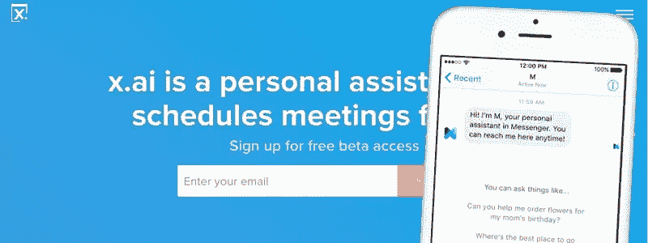
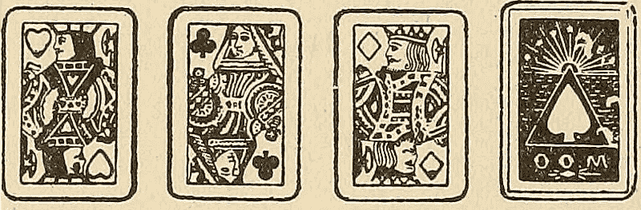
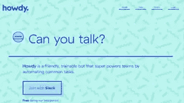

# 关于对话式用户界面，每个设计师都需要知道的 5 件事

> 原文：<https://www.sitepoint.com/5-things-every-designer-needs-to-know-about-conversational-uis/>

想象一下，你想点一份披萨——和往常一样——但你没有打开应用程序，而是发送了一条信息。“我想吃披萨”(它知道你最喜欢吃什么，而你又觉得有需求)。那天早些时候，你买了一场演出的票，并订了一辆车带你去——“给我两张 x 战警电影的票，还有一辆去演出地点的车”。

所有这些都不依赖于应用程序完美的用户界面。相反，底层服务是通过同一个消息应用程序来使用的。然后，UX 变得不那么可视，而更像是对话式的互动，在这种互动中，一个准备好做出反应的机器人根据我们的请求采取行动。

## “设计”只会越来越大

人工智能个人助理服务，如[脸书 M](http://www.wired.com/2015/08/facebook-launches-m-new-kind-virtual-assistant/) 和 [x.ai](https://x.ai/) 已经在让这成为现实，而在 Slack 中的机器人“同事”Howdy 帮助团队组织午餐订单和安排会议，所有这些都是通过聊天、打字或大声说话来实现的。

虽然 Google Now 自 2011 年就已经出现，但最近发布的 Google Assistant 的目的是创造一种“环境体验”,让用户不再关注界面，而是关注目标。

虚拟助手:来自脸书的 x.ai 和‘M’

这需要设计师掌握大量新技能，包括语言学和编剧知识，仅举两个例子。这并不是说聊天在每种情况下都是最好的——在有很多变量的情况下(比如选择四种不同的披萨上的配料)——往往更适合视觉界面，但在如上所述的情况下，ii 可以更快地询问，而不是打开应用程序进行选择。

由于设计师的职权范围已经远远超出了我们目前对设计构成要素——视觉——的理解，所以那些认为自己是设计师的人只会越来越多。随着这个行业越来越向专业化转变，像“网页设计师”这样的头衔似乎变得多余，只是因为它们说得少，但包含的内容多。

## 人物角色对于用户来说不仅仅是

那么，当我们“设计”聊天界面时，我们需要考虑什么呢？第一件事是像人一样思考，而不一定是受机器控制的人。

我们使用的许多交互设计范例和策略都起源于一个时代，那时计算机交互需要坐在一个米色的盒子前，用鼠标在屏幕上移动指针。桌面隐喻——将文件存储在文件夹中——是为了让用户通过使用他们已经熟悉的概念(办公室)来适应使用这些奇怪的新机器而开发的。

聊天用户界面变得专注于文字的措辞和细微差别，让用户感觉他们更像一个人，而不是一个 1 和 0，尽管是一个满足他们需求的人。

就像 [Mailchimp](http://mailchimp.com/) 使用[的声音和语气](http://styleguide.mailchimp.com/voice-and-tone/)作为他们广告文案的[风格指南](http://styleguide.mailchimp.com/)一样，聊天用户界面设计师也需要考虑机器人*听起来如何*以及什么样的语气适合每种环境。

当 Mailchimp 成功分派客户的活动时，用户感到高兴和宽慰，因此文案可以“尽情搞笑”。但是，万一出了问题，语气需要“严肃”一些，表现出关心。不要和沮丧的人开玩笑。

那么，当聊天机器人和一个正在订披萨的 20 岁年轻人说话时，会使用什么措辞呢？这与那些对药物治疗有疑问的年长很多的人有什么不同呢？

我们针对这两类用户的视觉设计会有所不同，当然，他们所期望的对话语气也会不同。前者可能轻松有趣，而后者则应该毫不费力、平静而又准确。或者其他什么，这将在研究中得到证实。

为聊天用户界面构建人物角色似乎和围绕指示性用户开发人物角色来指导我们的设计决策一样重要。

## 语气的一致性是关键

许多机器人初创公司雇佣喜剧演员和编剧来创作机器人的角色。想象一下，一家未来的初创公司付钱给路易斯·C·K，让他帮他们建造一个能找到你喜欢的餐馆的“机器人”?这不仅仅是写微型副本，因为它是关于通过各种场景构建一个一致的角色。

这与电视剧编剧如何塑造主角的内在和外在角色并考虑她可能如何处理每一集的情况没有什么不同。她会有什么反应，她会说什么或做什么，甚至还有什么是她不会说的？

## 为人类而设计

像微软命运多舛的人工智能种族主义者这样的失礼行为，Tay 实验并不局限于聊天机器人；它们延伸到任何算法介导的交互。举个例子，几年前埃里克·迈耶在《脸书回顾》中的可怕经历。语境是王道，但重要的是要确保移情和常识永远不会退居二线。

## 有些人可能会被落下

随着视觉用户界面退居幕后，底层服务成为 UX 的真正货币，许多人想知道，像苹果这样以实体产品和视觉设计为主导的公司，在很长一段时间里在服务方面都有所欠缺。迄今为止，他们的移动业务模式是基于“一个紧密控制的孤立应用网格，你每天在一个光滑的制造卓越的矩形上戳上一千次”，但这能持续多久呢？

看似“非设计”的学科，如编剧，正越来越多地被拉入设计的轨道，在这个领域成为一名设计师绝对是一个激动人心的时刻。

Howdy 最近刚刚发布了一个机器人工具包，可以在 Slack 中创建自己的机器人，所以现在也许是开始设计未来对话体验的好时机。

我们已经倾向于将品牌拟人化——给它们灌输性格特征，就像它们是人一样——品牌花了很多钱来确保这种性格得以保持。

毫不奇怪，许多机器人初创公司雇佣喜剧演员和编剧来创作机器人的角色，因此消息交互超越了微型复制，感觉不仅是人类的，而且在不同背景下是一致的。

## 分享这篇文章