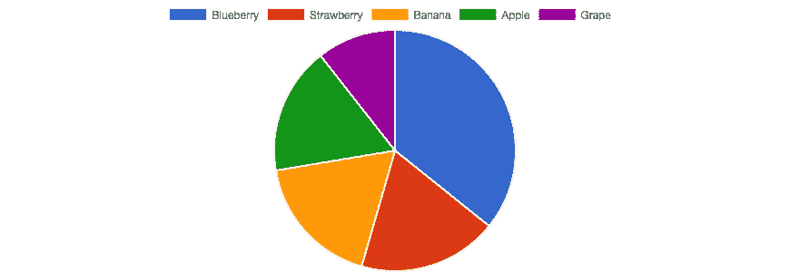
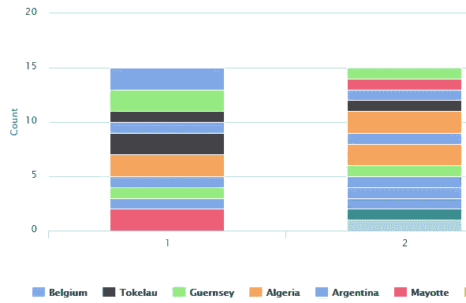
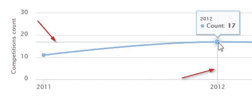

# 使用 Chartkick 在 Rails 上制作简单的图形和图表

> 原文：<https://www.sitepoint.com/make-easy-graphs-and-charts-on-rails-with-chartkick/>



我们每天都要处理各种格式的数据。在我看来，表示数字数据的最方便的格式之一是图表。用户喜欢图表，尤其是交互式的图表，因为它们既漂亮又有趣——与枯燥的静态表格形成对比。

在 web 应用程序中呈现漂亮的交互式图形有许多解决方案，但今天我们将讨论一些特殊的东西:一个为 Rails 构建的解决方案，它使呈现图形变得轻而易举。这个解决方案被称为 Chartkick，由安德鲁·凯恩设计。Chartkick 可以与 [Google Charts](https://developers.google.com/chart/) 、 [Highcharts](http://www.highcharts.com/) 和 [Chart.js](http://www.chartjs.org/) 配合使用。它有许多定制选项，也有许多支持库，如 [groupdate](https://github.com/ankane/groupdate) 、 [hightop](https://github.com/ankane/hightop) 和 [active_median](https://github.com/ankane/active_median) 。

在本文中，我们将讨论如何将 Chartkick 集成到 Rails 应用程序中，呈现各种图形，定制它们，使它们异步加载，以及如何使用 groupdate 和 hightop gems 进一步增强您的代码。

源代码可以在 [GitHub](https://github.com/bodrovis/Sitepoint-source/tree/master/Graphs_with_Chartkick) 上找到。

工作演示可在 [Heroku](https://sitepoint-graphs.herokuapp.com/) 获得。

## 准备应用程序

继续创建一个新的 Rails 应用程序:

```
$ rails new HappyGrapher -T 
```

对于本文，我将使用 Rails 5 候选版本，但是所提供的代码示例应该也适用于 Rails 4 和 3。

假设我们的应用程序跟踪“运动者”(运动员)和他们参加的比赛。以下是我们需要的所有表格的信息:

`sporters`

*   `name` ( `string`)
*   `age`(`integer`)–在这个演示中，我们假设年龄在 18 到 50 岁之间
*   `country_id`(`integer`)–建立`sporters`和`countries`之间关系的外键

`countries`

*   我们将随机添加 50 个国家到我们的数据库中

`competitions`

*   我们将会有一系列完全随机的比赛

`competition_results`

*这将是在`sporters`和`competitions`之间建立多对多关系的中间表。*

*   `sporter_id`(`integer`)–外键
*   `competition_id`(`integer`)–外键
*   运动员获得了第几名。对于这个演示，我们假设这个列可以取 1 到 6 之间的值。

创建并应用所有必要的迁移:

```
$ rails g model Country name:string
$ rails g model Sporter name:string age:integer country:references
$ rails g model Competition title:string
$ rails g model CompetitionResult sporter:references competition:references place:integer
$ rake db:migrate 
```

还要创建一个控制器、一个视图和一个根路由:

*statistics_controller.rb*

```
class StatisticsController < ApplicationController
  def index
  end
end 
```

*views/statistics/index . html . erb*

```
<h1>Statistics</h1> 
```

*config/routes.rb*

```
[...]
root 'statistics#index'
[...] 
```

到目前为止一切顺利，但是为了呈现图表，我们显然需要一些样本数据，所以现在让我们添加这些数据。

### 加载样本数据

为了加快加载样本数据的过程，我将使用两个 gem:[faker](https://github.com/stympy/faker)，它允许您生成从姓名和电子邮件到段落和伪黑客短语的各种文本，以及 [countries](https://github.com/hexorx/countries) ，它极大地简化了获取现有国家的信息。将这些宝石添加到*宝石文件*:

*Gemfile*

```
[...]
gem 'countries'
gem 'faker'
[...] 
```

并安装它们:

```
$ bundle install 
```

现在打开 *seeds.rb* 文件，粘贴这段代码，添加 50 个国家:

*db/seeds.rb*

```
ISO3166::Country.all.shuffle.first(50).each do |country|
  Country.create({name: country.name})
end 
```

这将添加完全随机的国家，所以如果你最终在你的表中有南极洲或圣多美，不要感到惊讶。

现在我们还需要一群运动员:

*db/seeds.rb*

```
100.times { Sporter.create({
             name: Faker::Name.name,
             age: rand(18..50),
             country_id: rand(1..50)
         }) } 
```

这里我们使用 Faker 生成一个样本名。

接下来，比赛。我找不到任何现成的列表，所以我们将手动输入运动名称:

*db/seeds.rb*

```
%w(tennis parachuting badminton archery chess boxing racing golf running skiing walking cycling surfing swimming skeleton).each {|c| Competition.create({title: c}) } 
```

最后，竞赛结果是:

*db/seeds.rb*

```
Competition.all.each do |competition|
  sporters = Sporter.all.shuffle.first(6)
  (1..6).each do |place|
    CompetitionResult.create({
                       sporter_id: sporters.pop.id,
                       competition_id: competition.id,
                       place: place,
                       created_at: rand(5.years.ago..Time.now)
                    })
  end
end 
```

注意，我们覆盖了`created_at`列，假装几年或几个月前发生了一场比赛。

## 显示简单的图表

好了，一切准备就绪，可以开始实现核心功能了——图表。将 chartkick 宝石添加到*宝石文件*中:

*Gemfile*

```
[...]
gem 'chartkick'
[...] 
```

并安装它:

```
$ bundle install 
```

Chartkick 同时支持 [Google Charts](https://github.com/ankane/chartkick#google-charts) 和 [Highcharts](https://github.com/ankane/chartkick#highcharts) 和 [Chart.js](https://github.com/ankane/chartkick#chartjs-in-beta) (从 2.0 版本开始这是默认适配器。)对于这个演示，我将使用 Highcharts，但是 Google Charts 的安装过程非常相似。

首先，下载最新版本的 Highcharts 并将其放在 *javascripts* 目录中(或者您可以通过 CDN 将`javascript_include_tag`添加到*layouts/application . html . erb*中来加载它)。接下来，添加这两个文件:

*JavaScript s/application . js*

```
[...]
//= require highcharts
//= require chartkick
[...] 
```

差不多了，我们现在可以渲染图表了。首先，让我们展示一个柱状图来说明运动者的年龄。

加载所有 sporters:

*statistics_controller.rb*

```
[...]
def index
  @sporters = Sporter.all
end
[...] 
```

并调整视图:

*views/statistics/index . html . erb*

```
<%= bar_chart @sporters.group(:age).count %> 
```

我们简单地将运动员按年龄分组，并计算每组的项目数量。非常简单。

您可能想知道如何为您的图形定义设置，给它一个名称，调整宽度、高度和其他东西。这也很简单——一些[设置](https://github.com/ankane/chartkick#options)被作为参数直接传递给`bar_chart`(和其他类似的方法)，其他设置在`:library`选项中。

创建一个新的`StatisticsHelper`并在那里提取代码:

*statistics_helper.rb*

```
module StatisticsHelper
  def sporters_by_age
    bar_chart @sporters.group(:age).count, height: '500px', library: {
      title: {text: 'Sporters by age', x: -20},
      yAxis: {
         allowDecimals: false,
         title: {
             text: 'Ages count'
         }
      },
      xAxis: {
         title: {
             text: 'Age'
         }
      }
    }
  end
end 
```

`:library`包含特定于库的设置。这里我们是防止十进制数字出现在 Y 轴上(很明显，我们不可能有 20 岁的 2，5 sporters)并给它一个名字。x 轴也有一个定义的名称。在此基础上，提供整个图形的名称(默认情况下，它会出现在底部)。Highcharts 有很多其他选项，所以一定要浏览它的[文档](http://api.highcharts.com/highcharts)。

还要注意，设置也可以在全局中定义[。](https://github.com/ankane/chartkick#global-options)

### 使用 Hightop

如果您希望只显示运动员中最“受欢迎”的年龄，请使用[hightop](https://github.com/ankane/hightop)gem——一个小而有用的库，旨在解决此类任务。简单地将它包含到 *Gemfile* 中:

*Gemfile*

```
[...]
gem 'hightop'
[...] 
```

然后跑

```
$ bundle install 
```

例如，现在您可以显示十个最受欢迎的年龄:

*views/statistics/index . html . erb*

```
<%= bar_chart @sporters.top(:age, 10) %> 
```

## 异步呈现图形

如果您的数据库有大量数据要处理以呈现一个图形，页面加载会很慢。因此，最好异步呈现您的图形。Chartkick [也支持](https://github.com/ankane/chartkick#say-goodbye-to-timeouts)这一功能。您所要做的就是创建一个单独的路线和一个控制器动作，然后在一个视图中使用这个路线。注意，它需要 jQuery 或 Zepto.js 存在。

创建新路线:

*config/routes.rb*

```
[...]
resources :charts, only: [] do
  collection do
    get 'sporters_by_age'
  end
end
[...] 
```

和控制器:

*图表 _ 控制器. rb*

```
class ChartsController < ApplicationController
  def sporters_by_age
    result = Sporter.group(:age).count
    render json: [{name: 'Count', data: result}]
  end
end 
```

准备就绪后，只需修改您的助手来调用新创建的路由:

*statistics_helper.rb*

```
[...]
def sporters_by_age
  bar_chart sporters_by_age_charts_path, height: '500px', library: {
    [...]
  }
end
[...] 
```

现在您的图表将被异步加载，允许用户浏览页面上的其他内容。不再需要`@sporters`实例变量，所以可以从`StatisticsController`的`index`方法中移除它。

## 更多图表类型

### 柱形图

为了演示柱形图的用法，让我们展示一下每个国家有多少运动者。首先，创建一个类似于我们之前定义的新助手:

*statistics_helper.rb*

```
[...]
def sporters_by_country
  column_chart sporters_by_country_charts_path, library: {
      title: {text: 'Sporters by country', x: -20},
      yAxis: {
          title: {
              text: 'Sporters count'
          }
      },
      xAxis: {
          title: {
              text: 'Country'
          }
      }
  }
end
[...] 
```

在视图中使用它:

*views/statistics/index . html . erb*

```
[...]
<%= sporters_by_country %>
[...] 
```

添加路线:

*config/routes.rb*

```
[...]
resources :charts, only: [] do
  collection do
    get 'sporters_by_age'
    get 'sporters_by_country'
  end
end
[...] 
```

至于控制器动作，它会稍微复杂一点，因为我们必须手动构造结果:

*图表 _ 控制器. rb*

```
[...]
def sporters_by_country
  result = {}
  Country.all.map do |c|
    result[c.name] = c.sporters.count
  end
  render json: [{name: 'Count', data: result}]
end
[...] 
```

请注意`result`散列是如何构建的——关键是国家的名称，值是运动者的总数。

重新加载页面，观察结果！

### 堆积柱形图

让我们也显示每个国家占据某个地方的次数(从 1 到 6)。再次定义一个新的助手:

*statistics_helper.rb*

```
[...]
def results_by_country
  column_chart results_by_country_charts_path, stacked: true, height: '500px', library: {
      title: {text: 'Results by country', x: -20},
      yAxis: {
          title: {
              text: 'Count'
          }
      },
      xAxis: {
          title: {
              text: 'Countries and places'
          }
      }
  }
end
[...] 
```

请注意提供以下结果的`stacked: true`选项:



在视图中使用辅助对象:

*views/statistics/index . html . erb*

```
[...]
<%= results_by_country %>
[...] 
```

添加路线:

*config/routes.rb*

```
[...]
resources :charts, only: [] do
  collection do
    get 'sporters_by_age'
    get 'sporters_by_country'
    get 'results_by_country'
  end
end
[...] 
```

最后，创建控制器动作:

*图表 _ 控制器. rb*

```
[...]
def results_by_country
  result = Country.all.map do |c|
    places = {}
    (1..6).each do |place|
      places[place] = c.sporters.joins(:competition_results).
          where("competition_results.place = #{place}").count
    end
    {
        name: c.name,
        data: places
    }
  end
  render json: result
end
[...] 
```

我们取所有的国家，用`map`构建一个数据数组。在里面，找到所有来自这个国家的运动员，他们占据了一个特定的位置。`joins`用于与`competition_results`表连接，因为关于地点的信息存储在那里。然后只需使用`where`和`count`来获得所需的值。然后，正如我们已经看到的，为`:name`分配国家名称，为`:data`分配`places`散列。因此，将创建一个散列数组。

### 折线图和分组日期

我们今天要讨论的最后一种图表类型是折线图。为了证明这一点，让我们展示一下每年举行了多少场比赛。

再次创建一个助手

*statistics_helper.rb*

```
[...]
def competitions_by_year
  line_chart competitions_by_year_charts_path, library: {
      title: {text: 'Competitions by year', x: -20},
      yAxis: {
          crosshair: true,
          title: {
              text: 'Competitions count'
          }
      },
      xAxis: {
          crosshair: true,
          title: {
              text: 'Year'
          }
      }
  }
end
[...] 
```

`:crosshair`选项用于跟随用户指针显示一个有用的十字准线。



在您的视图中使用此助手:

*views/statistics/index . html . erb*

```
[...]
<%= competitions_by_year %>
[...] 
```

并添加新路线:

*config/routes.rb*

```
[...]
resources :charts, only: [] do
  collection do
    get 'sporters_by_age'
    get 'sporters_by_country'
    get 'results_by_country'
    get 'competitions_by_year'
  end
end
[...] 
```

现在我们需要创建一个新的控制器动作，但是我们如何按照年份对比赛进行分组和计数呢？当然，我们可以构造自己的查询，但是 Chartkick 的作者已经处理好了，并精心制作了一个方便的 [Groupdate gem](https://github.com/ankane/groupdate) 。顾名思义，它允许您按年、月、日等对记录进行分组。它支持时区、日期范围、格式、排序和其他有趣的东西，所以它是一个使用 Chartkick 的很好的解决方案。

将 Groupdate 添加到您的 *Gemfile* 中:

*Gemfile*

```
[...]
gem 'groupdate'
[...] 
```

Groupdate 唯一的问题是它不支持 SQLite3，所以你必须使用其他的 DMBS。在这个演示中，我将使用 PostgreSQL。请注意，如果您决定使用 MySQL，还必须安装[时区支持](https://github.com/ankane/groupdate#for-mysql)。

通过用 pg gem 替换 sqlite3，再次调整您的 *Gemfile* :

*Gemfile*

```
[...]
gem 'pg'
[...] 
```

然后安装宝石:

```
$ bundle install 
```

并修改 *database.yml* 配置文件:

*config/database.yml*

```
[...]
development:
  adapter: postgresql
  encoding: unicode
  database: your_database
  pool: 5
  username: your_user
  password: your_password
  host: localhost
  port: 5432
[...] 
```

现在再次运行迁移，并用示例数据填充表

```
$ rake db:migrate
$ rake db:seed 
```

在执行这些命令之前，不要忘记创建一个数据库(`rake db:create`)。

现在我们可以对控制器的动作进行编码:

*图表 _ 控制器. rb*

```
[...]
def competitions_by_year
  result = CompetitionResult.group_by_year(:created_at, format: "%Y").count
  render json: [{name: 'Count', data: result}]
end
[...] 
```

看起来很棒。`:format`选项允许您提供密钥的格式。只要我们想只显示年份，我就使用`%Y`。可用指令的完整列表可以在官方的 [Ruby 文档](http://ruby-doc.org/core-2.2.2/Time.html#method-i-strftime)中找到。

再次重新加载页面，观察最终结果。如果您对图表的外观不满意，可以试试在 [Highcharts 文档](http://api.highcharts.com/highcharts)中找到的显示设置。

## 结论

在本文中，我们讨论了 chart kick——一个简化图表呈现的绝佳工具。我们尝试使用各种类型的图表，让它们异步加载，还使用了额外的 gem，比如 Groupdate 和 Hightop。当然，这些宝石还有更多，所以一定要浏览它们的文档并进一步试验代码。

像往常一样，请随意发表您的问题和反馈。快乐如数家珍，后会有期！

## 分享这篇文章