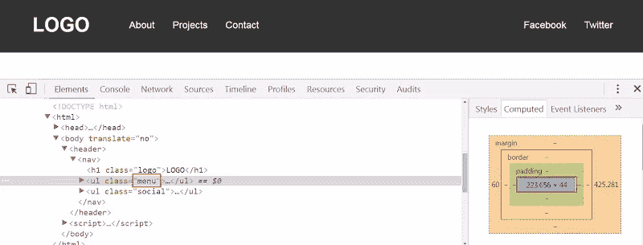

# 快速提示:z 索引和自动边距在 Flexbox 中如何工作

> 原文：<https://www.sitepoint.com/quick-tip-how-z-index-and-auto-margins-work-in-flexbox/>

[Flexbox](https://www.w3.org/TR/css-flexbox-1/) 以解决常见的布局问题而闻名，比如粘性页脚和等高列。除了这些功能之外，它还提供了一些不太流行的其他有用特性。让我们来探索其中的两个吧！

## 柔性盒和`z-index`

您可能已经知道，`z-index`属性只对定位的元素有效。默认情况下，所有元素都有`position: static`并且没有定位。当元素的`position`属性设置为`relative`、`absolute`、`fixed`或`sticky`时，该元素被“定位”。

然而，一个“未定位”的元素，比如一个 flex 项目，也可以接收`z-index`属性。 [CSS 柔性盒布局规范](https://drafts.csswg.org/css-flexbox-1/#painting)说:

> Flex 项目的绘制与内联块[CSS21]完全相同，除了使用顺序修改的文档顺序来代替原始文档顺序，并且除 auto 之外的 z 索引值创建堆叠上下文，即使位置是静态的。

要理解这种行为，请考虑以下示例:

在 [CodePen](http://codepen.io) 上通过 SitePoint ( [@SitePoint](http://codepen.io/SitePoint) )查看笔 [Flexbox 和 z-index](http://codepen.io/SitePoint/pen/JKYEgj/) 。

这里我们定义了两个元素:`.front`元素和`.back`元素。`.front`元素有一个子元素，一个数字为“1”的盒子。`.front`元素本身是绝对定位的。具体来说，它有`position: fixed`并覆盖整个视口。

我们的`.back`元素是一个 flex 容器。它包含两个子元素—编号为“2”和“3”的框。基于上面的讨论，我们可以设置 flex 项目的`z-index`属性，即使它们不是定位元素(例如，它们有`position: static`)。

请注意，当我们通过单击上面演示中的按钮将`z-index: 2`添加到 flex 项目时，它们被放置在`.front`元素的顶部。

## Flexbox 和自动边距

通过对 flex 项目应用自动边距，我们能够解决常见的 UI 模式。首先，让我们假设我们想要构建这个典型的页眉布局:


为了构建它，我们将使用 flexbox。没有浮动，固定宽度，或任何类似的东西。

这是我们的标记:

```
<header>
  <nav>
    <h1 class="logo">LOGO</h1>

    <ul class="menu">
      <li>
        <a href="">About</a>
       </li>
      <li>
        <a href="">Projects</a>
      </li>
      <li>
        <a href="">Contact</a>
      </li>
    </ul>

    <ul class="social">
      <li>
        <a href="">Facebook</a>
      </li>
      <li>
        <a href="">Twitter</a>
      </li>
    </ul>
  </nav>
</header>
```

我们的 CSS 看起来像这样:

```
header {
  background: #333;
}

nav {
  display: flex;
  align-items: center;
  width: 90%;
  max-width: 1200px;
  margin: 0 auto;
}

.menu {
  margin-left: 60px;
  margin-right: auto;
} 
```

在这个例子中，我们的`nav`元素是 flex 容器，徽标、主菜单和社交菜单是 flex 项目。正如您在前面的可视化中所看到的，前两个 flex 项沿着主轴与 flex 容器的左侧对齐。相反，社交菜单沿主轴与其父菜单的右边缘对齐。

实现这种定制对齐的一种方法是将`margin-right: auto`添加到主菜单中。只需一行代码，我们就可以覆盖社交菜单的默认对齐方式，并将其一直推到容器的右侧。类似地，我们使用`align-self`属性来覆盖 flex 项沿横轴的默认对齐方式。

除了自动边距，我们还可以使用第二种方法来构建想要的布局。首先，我们从主菜单中移除`margin-right`属性，然后，我们向它添加`flex-grow: 1`。

尽管这两种情况下的结果似乎是一样的，但有一个很大的区别。对于第一个解决方案，我们的菜单有它的初始计算宽度。例如，当视窗宽度为 1100 像素时，菜单宽度如下所示:



另一方面，对于第二种解决方案，菜单宽度变得更大，因为我们指定了`flex-grow: 1`。以下是视口宽度为 1100 像素时对应的宽度:


Codepen 演示:

在 [CodePen](http://codepen.io) 上通过 SitePoint ( [@SitePoint](http://codepen.io/SitePoint) )查看笔[自定义 Flexbox 对齐自动边距](http://codepen.io/SitePoint/pen/ezpgqx/)。

现在让我们假设我们想要修改标题布局。这是新的期望:


标记保持不变。我们只是在 CSS 中做了一些改动:

```
nav {
  background: #333;
  display: flex;
  flex-direction: column;
  height: 100vh;
  width: 180px;
  padding: 20px;
  box-sizing: border-box;
}

.menu {
  margin-top: 60px;
  margin-bottom: auto;
} 
```

在本例中，请注意社交菜单与其父菜单的底部边缘对齐。同样，这是通过将`margin-bottom: auto`添加到主菜单来实现的。当然，我们也可以使用`flex-grow: 1`，然而这种解决方案会增加菜单的高度。

请参见下面的 Codepen 演示:

通过 [CodePen](http://codepen.io) 上的 SitePoint ( [@SitePoint](http://codepen.io/SitePoint) )查看 Pen [自定义 Flexbox 与 flex-grow:1](http://codepen.io/SitePoint/pen/GqpWKW/) 对齐。

另一件要记住的事情是，如果我们在任何例子中定义了`justify-content`属性，我们不会看到任何视觉上的差异。这是因为我们使用自动边距来对齐 flex 项。只有当我们移除自动边距时,`justify-content`属性才会生效。[根据规格](https://www.w3.org/TR/css-flexbox-1/#auto-margins):

> 如果自由空间被分配给自动边距，对齐属性将在该维度上不起作用，因为边距将窃取弯曲后剩余的所有自由空间。

接下来，让我们创建一个新的标题变体:


毫无疑问，这可以通过将`justify-content: space-between`设置为 flex 容器来轻松实现。但是再一次，我们能够产生带有自动边距的相同布局。我们所要做的就是将`margin: 0 auto`应用到主菜单。

Codepen 演示:

在 [CodePen](http://codepen.io) 上通过 SitePoint ( [@SitePoint](http://codepen.io/SitePoint) )查看笔[自定义 Flexbox 对齐自动边距](http://codepen.io/SitePoint/pen/beVqax/)。

## 结论

在本文中，我们介绍了两个鲜为人知的 flexbox 技巧。在结束之前，让我们回顾一下:

*   我们可以将`z-index`属性应用于 flex 项目，即使它们有`position: static`。
*   我们可以使用自动边距来实现 flex 项目在主轴上的定制对齐。

如果你在你的项目中使用了这些技巧，请在下面的评论中告诉我们。