# 20 个鼓舞人心的免费工具，让字体搭配更好

> 原文：<https://www.sitepoint.com/20-inspirational-free-resources-for-better-typeface-pairing/>

配对字体是网页设计项目中最难做好的部分之一，我们手边有大量的自定义字体也不会让事情变得更容易。

如果你刚刚开始掌握网页排版的旅程，很可能阅读一些类似…

> 展示和它的模板是单线的……但是它们散发出很棒的节奏和温暖，带有一点手写的味道。
> 
> –[颤音字体评论](http://typographica.org/typeface-reviews/tremolo/)Laura mese guer

…对你来说可能就像品酒对禁酒主义者一样有意义。

字体选择与其说是科学，不如说是一门艺术。因此，阅读关于排版、单个字体和铸造厂的知识需要大量的实践。然而——正如蒂姆·布朗在他的指南[组合字体](http://blog.typekit.com/2016/04/29/combining-typefaces-free-guide-to-great-typography/)中所说——“如果你不小心，练习会花费不合理的时间”(第 38 页)。与此同时，你正在做的网站对你初露头角的排版技能提出了直接的要求。你需要想出一个好的解决方案，而且要快。

在这篇文章中，你会发现大量的在线资源，这些资源将补充你对网页排版的学习，并帮助你设计出漂亮的字体组合。

您还将了解下面列出的一些服务如何让您测试所选字体的浏览器渲染，并提供将它们包含在项目中的便捷方式。

## 伟大的字体组合

浏览有好的字体组合的网站是一个很好的方法，可以培养对字体如何一起工作以及在什么环境下使用它们的眼光。查看下面的参考资料，获得一些很好的例子。

### 谷歌字体配对功能

[谷歌字体](https://www.google.com/fonts)不仅仅是挑选定制字体的服务。它也是一个你可以了解更多关于你所选择的字体的地方，包括一些与它配合良好的字体的建议。

当你在 Google Fonts 上选择一种字体时，点击字体容器框右下角的小*弹出*按钮。

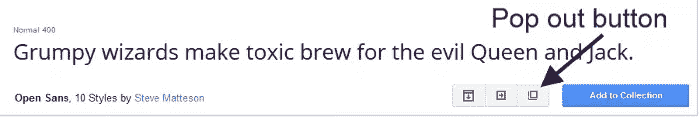

接下来，点击*配对*标签，你会看到你的选择如何在网络上与其他字体配对的例子。

虽然我喜欢这个资源，但在我看来，它并没有说太多关于使用建议配对的上下文。例如，什么样的网站同时使用开放的 San 和 Roboto？它们是像新闻网站和博客那样的重文本网站吗？它们是像摄影作品集网站那样以图片为主的网站吗？哪些页面元素使用 Open Sans，哪些使用 Roboto？

在选择类型组合时，这是非常有用的信息，为了找到它，我们必须到别处去找。

### 漂亮的网页类型

漂亮的网页字体展示了谷歌字体的精选字体。

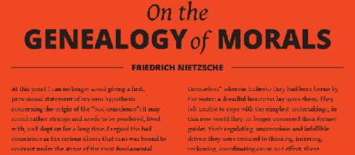

这些例子有点笼统——它们不是取自有特定目标和策略的真实网站。也就是说，网站在设计精美的部分展示了它的字体选择。注意文本的层次结构、字体粗细和风格，所有这些都在使文本更具可读性和传达适当的情绪方面发挥了作用。

### 谷歌网络字体排版项目

谷歌字体的另一个鼓舞人心的字体组合收藏在[谷歌网络字体排版项目](https://femmebot.github.io/google-type/)网站上。

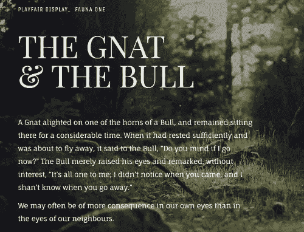

这个网站上的设计是字体配对和它们在网络上的用途的美丽插图。正如 GitHub repo 上该项目的[自述文件](https://github.com/femmebot/google-type)所说:

> 首要目标是交流，而不是装饰。

### Typ.io

Typ.io 为你提供大量关于时尚排版设计的信息，以及最新的一系列字体搭配良好的网站。

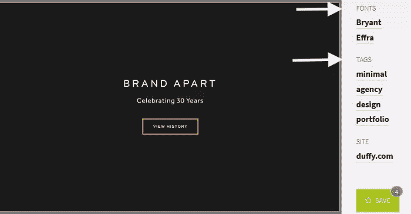

你不仅会看到匹配的字体，还会感受到字体在真实网站设计中的作用——哪种字体用于标题，哪种字体用于正文，设计师为某类网站选择的字体，如作品集、博客、营销等。其实你可以通过**行业**、**字体**、**字体服务**来搜索网站。

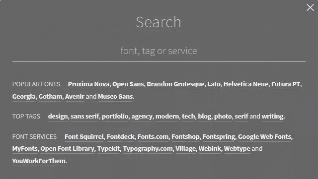

最后，点击带有你最喜欢的字体组合的图片，你会得到 CSS 代码和链接到你可以购买或下载字体文件的服务。

### 正在使用的字体

[使用中的字体](http://fontsinuse.com/)是另一个受欢迎的资源，它提供了大量可以很好地协同工作的字体，取自真实的网站。

其令人印象深刻的搜索功能让您可以通过以下方式浏览版式档案:

*   工业
*   格式
*   字体

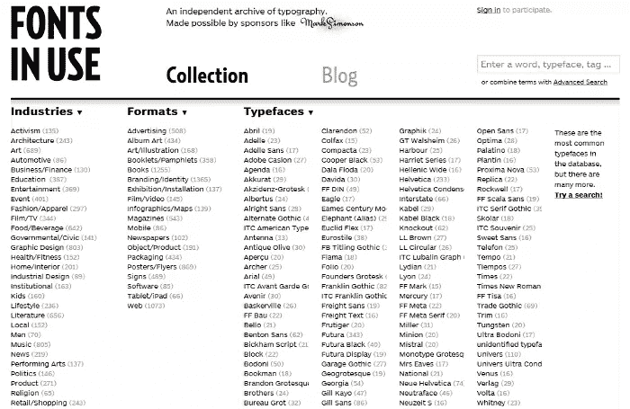

为了强调这一点，展示字体如何在各种行业和背景的网站上工作，对于培养良好排版决策的眼光至关重要。

## 交互式类型配对工具

我将在下面列出的资源将要求您在搜索完美的类型组合时进行输入。无论是一种测试字体的方式，还是简单地进行选择并等待大量合适的匹配，这些工具都是交互式的，使用起来很有趣。

### 打字呼吸

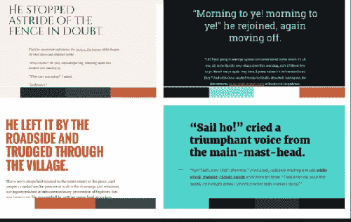

[排版](http://typespiration.com/)的美妙之处在于它可以让你浏览不同的设计，展示[漂亮的免费字体](https://www.sitepoint.com/free-fonts)和调色板。

如果您点击任何设计，您可以选择:

*   预览设计的特写镜头。如果你点击右上角的*基线网格*按钮，你也可以检查文本如何位于基线网格上:
    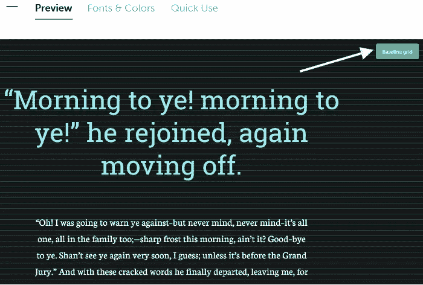
*   了解设计中使用的字体和颜色:
    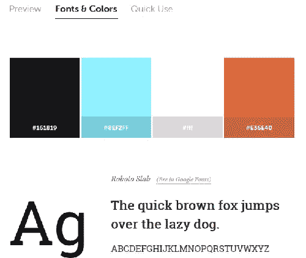
*   复制并粘贴您需要在项目中重新创建设计的 HTML 和 CSS 代码:
    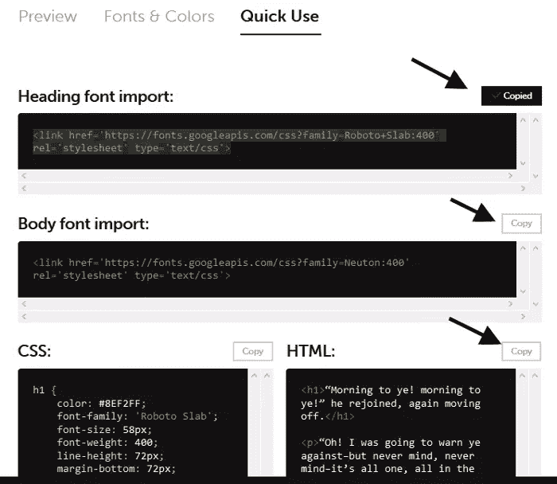

### 字体对

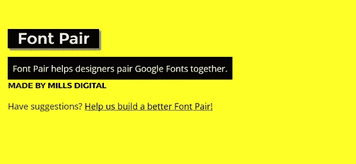

[字体对](http://fontpair.co/)允许您根据多个过滤器浏览字体组合:

*   **无衬线字体/衬线字体**–标题将使用无衬线字体，正文采用衬线字体。衬线字体在每个字符的末尾有小的花饰，无衬线字体则没有。
*   **衬线/无衬线**–标题有衬线，正文无衬线。
*   **无衬线字体/无衬线字体**–标题和正文的无衬线字体。
*   **草书/无衬线字体**–标题为草书，正文为无衬线字体。草书字体有一种手写风格，适合标题和标志，但最好避免用于正文。
*   **草书/衬线**–标题用草书，正文用衬线。
*   **Serif/Serif**–标题和正文的 Serif 字体。

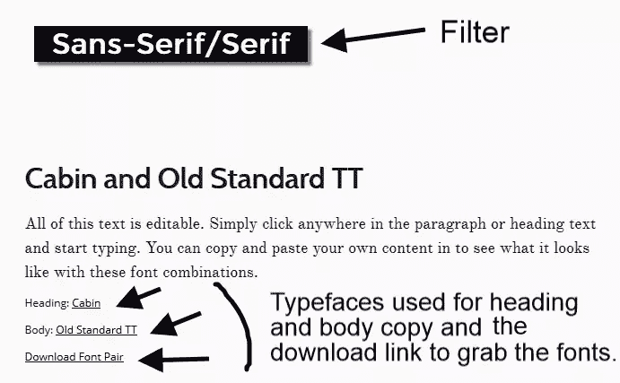

如果你已经决定了一种字体，你正在寻找一个合适的匹配，只需在页面顶部的搜索框中输入它的名称。网站将显示使用您的选择的建议列表:

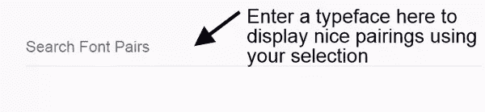

这里你可以做的另一件很酷的事情是用你自己的文本替换示例文本。这对于测试您选择的组合与网站内容的配合非常有用:

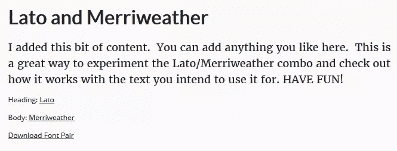

### 天才打字

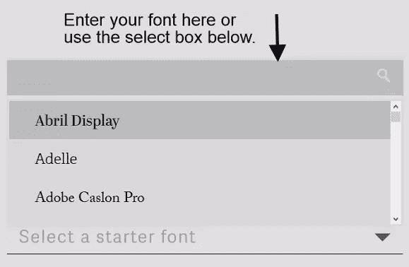

Type Genius 是一项智能服务，可以让你找到与你选择的字体非常匹配的字体。

只需选择一种字体，点击*查看匹配*按钮。

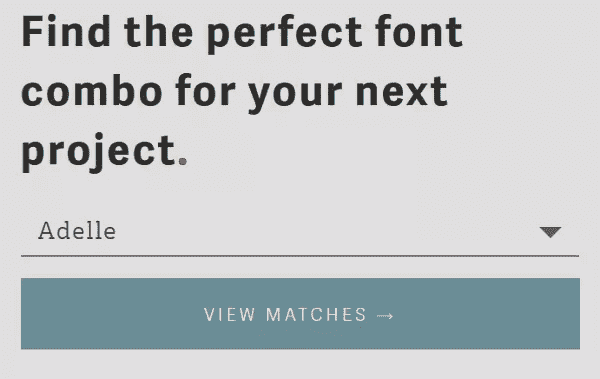

键入 Genius 将显示一个页面，其中包含:

*   使用您选择的字体的建议配对。
*   使用建议配对的网站链接。
*   可编辑的标题和正文来试验你选择的字体。
*   链接到可以下载字体文件的服务。

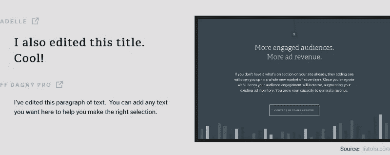

### 字体组合器

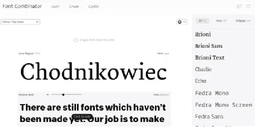

字体组合器是一个强大的在线工具，非常适合浏览荷兰字体铸造和设计工作室 Typotheque 设计的匹配字体组合。

您可以从拉丁、希腊和西里尔字符集选择字体。选择框允许您使用各种关键字浏览字体配对，如优雅、经典、时尚等。您可以完全编辑显示的文本，调整所选字样的样式，并将页面右侧列出的任何字样拖到显示区域进行测试。

### Adobe Typekit 组合

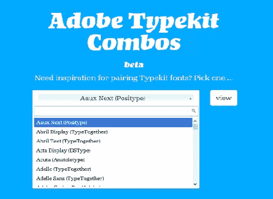

[的 Adobe Typekit combs](https://twitter.com/fontdata)font data 是一个漂亮的工具，仍处于测试阶段，它可以让你选择一种 Typekit 字体，并为你找到匹配的字体。

一旦您做出选择并单击*查看*按钮，该工具将显示一个建议匹配 Webkit 字体的列表和一个链接，您可以在这些网站上看到这些字体。

## 类型配对学习工具

我将在下面列出的工具不仅仅适用于对字体的搭配提出很好的建议。它们也是最重要的，给你关于字体和如何匹配字体的知识。

### 类型连接

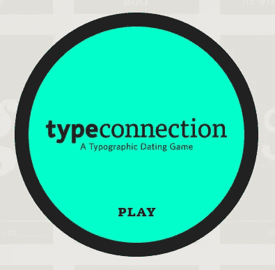

这是我的最爱。[类型连接](http://typeconnection.com/)由[奥拉·萨尔茨](http://auraseltzer.com/)自称为**排版约会游戏**。

这是一个高度互动的工具，以约会游戏的形式，用于寻找优秀的字体配对和学习印刷术。

类型连接从知名字体开始，寻找正确的匹配。你是一个媒人，将使用一种组合字体的策略来寻找理想的伴侣。在这一过程的每一步，你都会学到一些关于印刷术语、的**含义，以及**字体的历史等等。一旦游戏结束，你会发现比赛成功或失败的**原因**。****

它的创造者把[型连接的主要目标](http://www.typeconnection.com/about.php)浓缩成了这样:

> 通过玩类型连接，你加深了你自己与类型的连接。

但是，不要停留在游戏上。Type Connection 网站是一个印刷金块的宝库，包括字体组合策略的总结和大量关于印刷的各种参考链接。

### 混合字体(PDF)

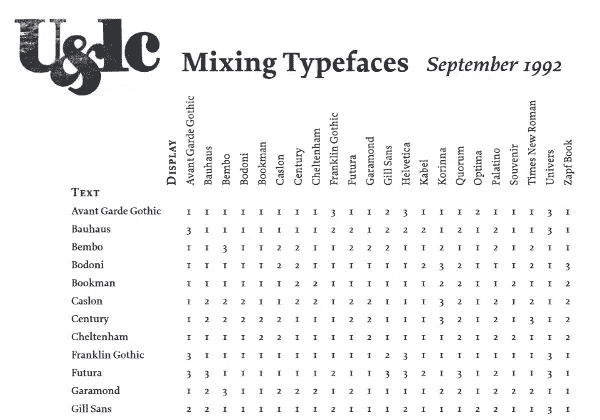

[混合字体](http://www.as8.it/handouts/mixing-typefaces_U&lc1992.pdf)是从 [U & lc](http://www.designishistory.com/1960/ulc/) (大写和小写)中摘录的一页的 PDF 副本，这是一份面向设计社区的历史性出版物。

在正文左侧的纵轴上选择一种字体，并将其与横轴上的显示字体进行交叉引用。两种字体相交处方框内的数字表示它们之间的兼容程度:

1.  随意组合。
2.  不是保守的选择。
3.  再想想。

### 混合字体的艺术

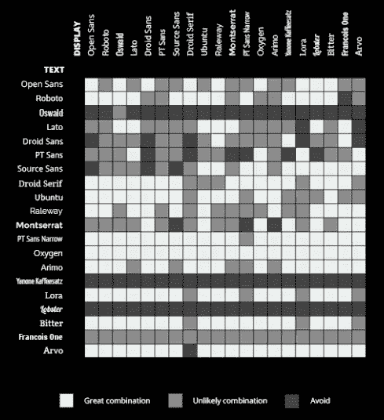

[混合字体的艺术](http://www.fastprint.co.uk/blog/the-art-of-mixing-typefaces.html)是一个由 [FastPrint](http://www.fastprint.co.uk/blog/) 创建的关于组合谷歌字体的伟大信息图，它从我上面列出的 U & lc 文档中获得灵感。

信息是用颜色而不是数字来传达的，但它的工作方式非常相似。

### 组合字体的艺术

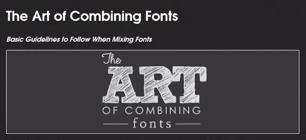

字体组合的艺术是一个极好的信息图表，可以让你了解一两件关于字体配对的事情……啊，读起来也很有趣。

### 混合和匹配字体

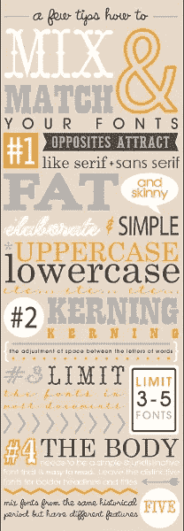

混合和匹配字体是另一张漂亮的信息图，其中包含了 Fontaholic 提供的一些微型排版课程。

### 印刷术的十诫

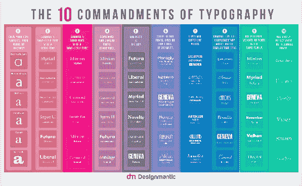

DesignMantic 的这张[信息图](http://www.designmantic.com/blog/infographics/ten-commandments-of-typography/)既有字体组合的例子，也有关于排版的绝佳建议。

## 在浏览器中预览和显示字体

在购买或下载字体之前，最好先测试一下它在不同屏幕分辨率下在浏览器中的显示效果。

下面的在线资源可以让你很好地预览你选择的字体。其中一些还将帮助您在项目中包含字体。

### 谷歌字体预览和流媒体服务

当你在谷歌字体库浏览字体时，你有各种预览选择的显示选项。

您可以:

*   预览单句，这是默认视图:
    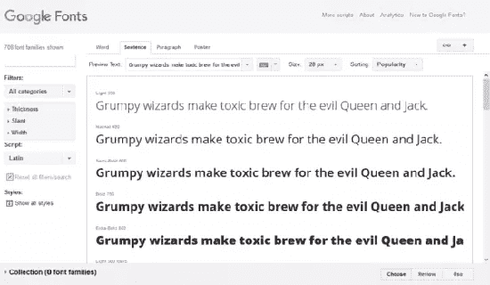
*   预览单个单词:
    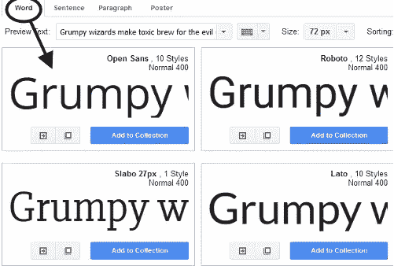
*   预览一段:
    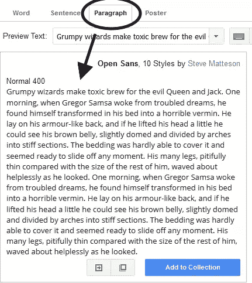
*   预览放大的海报式字体显示:
    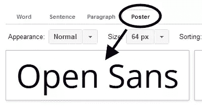
*   选择不同的文本进行预览或输入您自己的:
    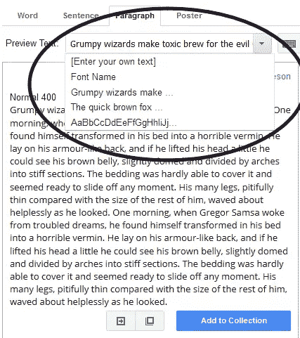
*   增加和减小预览中的字体大小:
    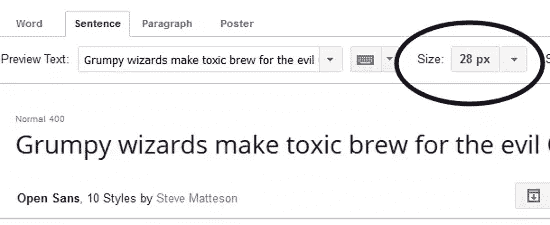

再深入一点，你会发现 Google Fonts 有一些额外的选项来预览和测试你的字体选择。

点击*添加到字体集*按钮，尝试添加一些字体到字体集。

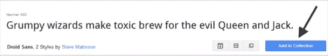

我已经将 Droid Sans 和 Droid Serif 添加到我的集合中进行测试。当你刚开始时，从一个有无衬线和衬线变体的字体系列中选择是最安全的选择之一。

一旦字体位于字体集内，您就可以:

*   **点击字体旁边的 x 图标，删除单个字体**。
*   **点击*从集合中删除所有系列*按钮，删除所有选中的字体**。
*   **点击屏幕底部的*查看*按钮，以各种互动方式测试您的选择**。

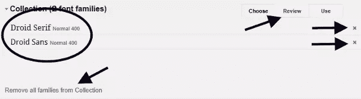

一旦你进入*回顾*屏幕，点击*试驾*选项，让你的选择跟上步伐。

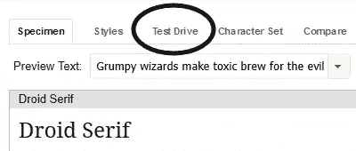

在这个屏幕上，您可以测试正文、标题和副标题的字体，更改字体大小、行高和其他 CSS 属性，用自己的内容替换现有内容，等等。

如果这还不够，你可以通过点击谷歌字体网站的*评论*屏幕上的*尝试 Typecast* 选项，在 Typecast 上进一步测试你的选择。这将把你带到 Typecast 应用程序上，我将在下一节介绍它。

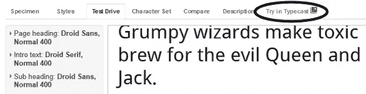

一旦你对自己的选择感到满意，你就可以使用 Google CDN(内容交付网络)轻松地将这些字体包含在你的项目中。

首先点击屏幕底部的*使用*按钮。

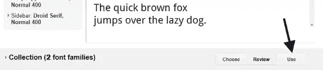

从这里你可以通过选择你需要的字体样式和字符集来微调你的选择。坚持你真正需要的—**你添加的样式和字符集越多，文件在浏览器中加载的时间就越长**。

最重要的是，你可以简单地获取谷歌字体提供的代码，并将其粘贴到你的项目中，然后让该服务将字体传输到你的网站。

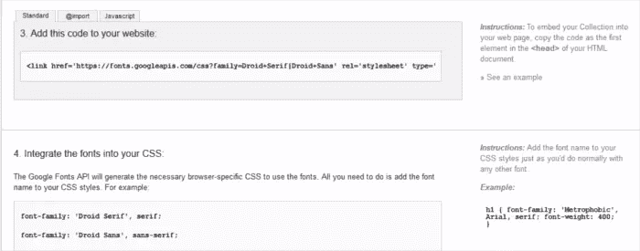

### 类型转换原型功能

Typecast 提供了一个交互式画布来设计工作原型。通过创建一个免费帐户，您可以导出所有必要的 HTML 和 CSS 代码，以便轻松包含在您的项目中。

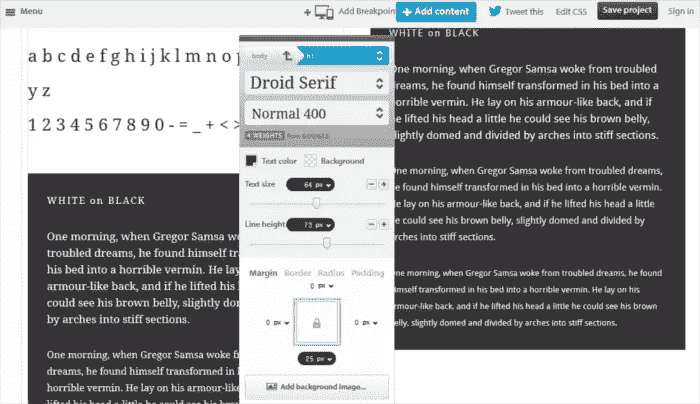

通过点击 Typecast 应用程序中文本的任何部分，您可以做各种事情，例如:

*   添加您自己的文本内容。
*   改变字体。
*   调整大量的 CSS 值，如背景色，颜色，字体大小，行高等。
*   预览不同视窗大小的字体。
*   检查文本在基线网格上的行为。

### 网络字体混合器

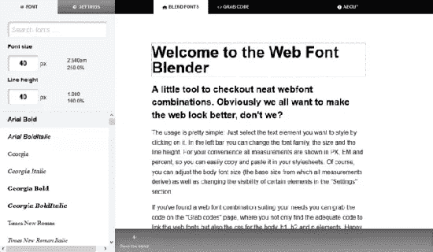

[Web Font Blender](http://andreasweis.com/webfontblender/) 不像 Typecast 那样功能丰富，但它拥有您快速混合和匹配谷歌字体库中的字体、编辑现有文本、调整 CSS 字体值以及抓取代码以与您的项目无缝集成所需的一切。

### Adobe Typekit 预览和 Web 字体流服务

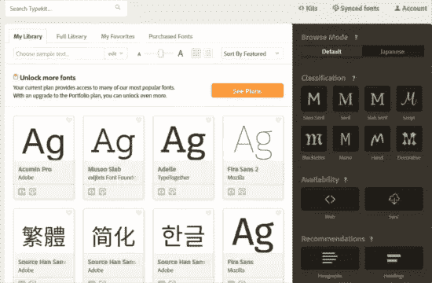

像谷歌字体一样，Adobe 的 Typekit 可以让你预览大量的字体，并把你选择的字体放到你的网站上，以便于收录。你不需要许可每一个单独的字体。

与谷歌字体不同，Typekit 是一种基于订阅的服务，提供不同的定价方案。您可以使用免费订阅计划试用 Typekit，该计划允许您为自己的网站选择 940 多种字体。

您有许多浏览字体的选项，包括标题和段落、语言、字体系列等的建议。

当您准备好预览字体时，请点按它。在新的屏幕上，你将能够检查它的各种重量和风格，并了解更多关于字体家族和创造它的铸造厂。

如果你点击*标本*标签，你会看到一个链接到*打开展开的网页字体标本*。此链接显示一个屏幕，您可以在其中预览您为正文和标题选择的各种大小的字体。

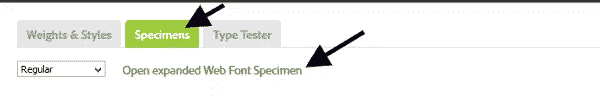

您可以点击*样本*选项卡旁边的*型测试仪*选项卡。现在，您可以添加自己的文本，并使用所有可用的粗细和样式以不同的大小预览您选择的字体。

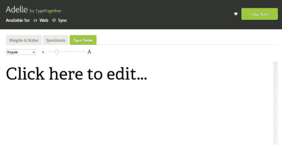

一旦你准备好在你的网站上使用一种或一组字体，点击屏幕右上角的*使用字体*按钮，然后点击*网页*标签。

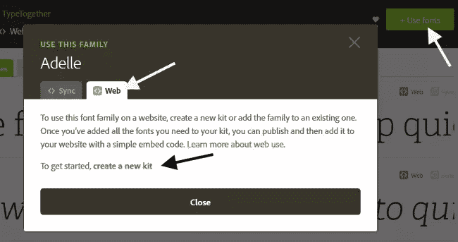

Typekit 使用**工具包**作为在 web 项目中包含字体的一种方式。这里有一个关于如何创建工具包的简短教程。如需详细信息，请前往[类型套件帮助页面](https://helpx.adobe.com/typekit/using/add-fonts-website.html)。

首先点击*创建一个新套件*链接，如上图所示。

接下来，会弹出一个屏幕，要求您输入套件名称和网站域名。继续这样做，然后点击*继续*按钮。

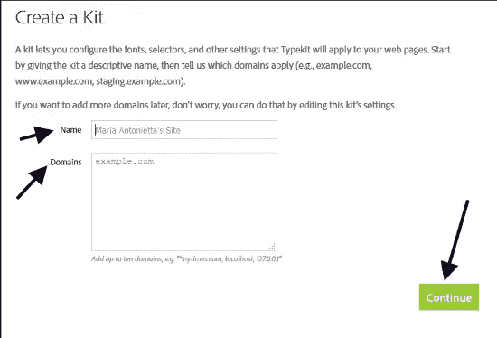

酷，你刚刚创建了一个工具包！

要在您的项目中使用该工具包，只需将代码类型工具包提供的代码复制并粘贴到 HTML 文档的`<head>`部分。然后点击*继续*按钮进入下一个屏幕。

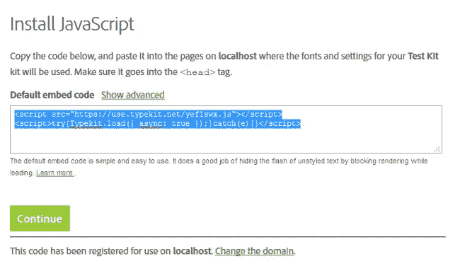

最后一步是选择字体的字符集、粗细和样式。留意弹出窗口底部的**套件尺寸**信息——字符集、字体和样式越多，你给网页增加的权重就越大。

如果您想让 Typekit 来处理排版元素的样式，请在页面顶部的输入框中输入相关的 CSS 选择器。或者，您可以简单地将相关的 CSS 规则添加到网站的样式表中。

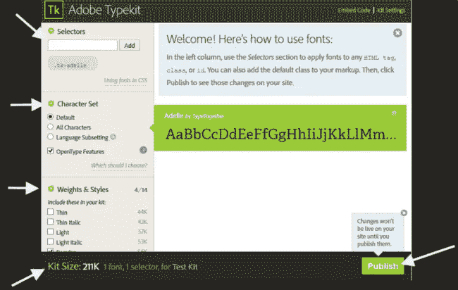

完成后，继续点击*发布*。你的网站应该在几分钟内显示你选择的字体。

## 结论

这篇文章一直都是关于挑选优秀字体组合的在线资源，预览它们，并毫无痛苦地将它们包含在你的项目中。

请记住，您可以同时使用多种工具。例如，你可以在谷歌网页字体排版项目中找到不错的组合，并在 Typecast 上试用。

为了获得更好的学习效果，请通读这些关于字体组合的常青树文章:

*   杰森·圣玛丽亚的《网络排版》
*   蒂姆·布朗的《组合字体:伟大排版的免费指南》

你能建议选择和预览字体的其他资源吗？点击下面的评论框，与社区分享它们。

## 分享这篇文章