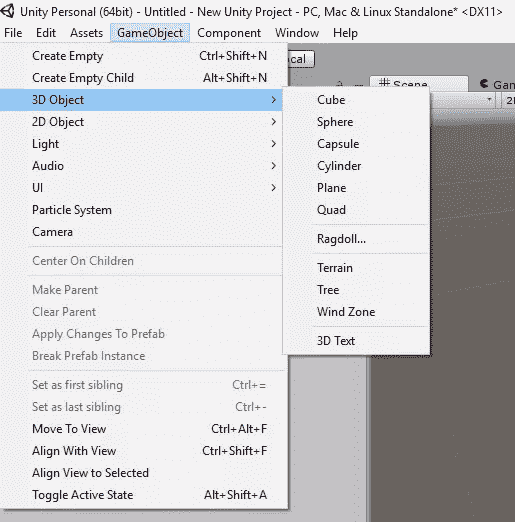
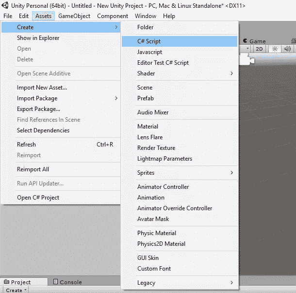
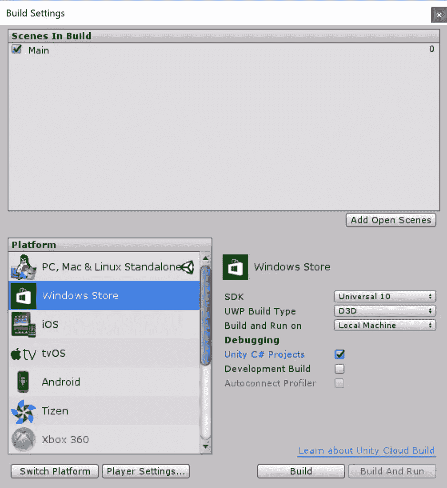
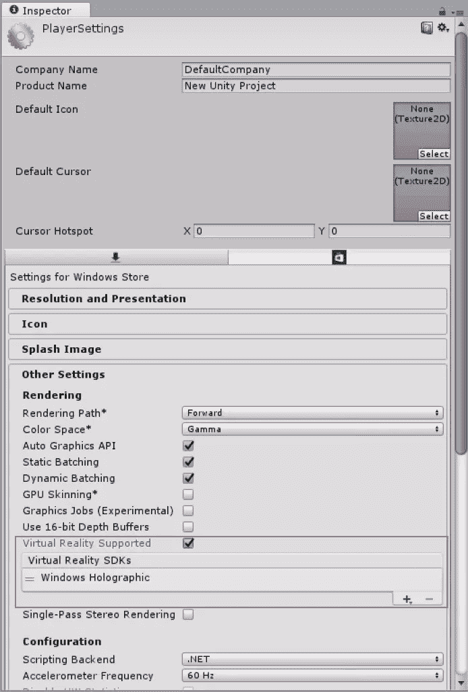
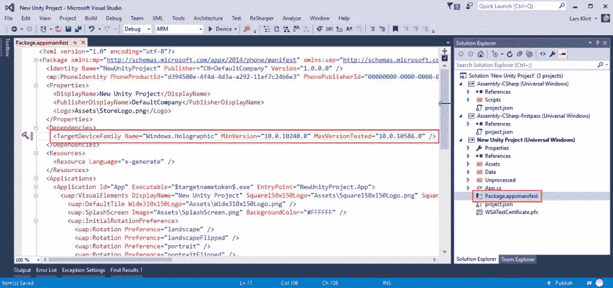
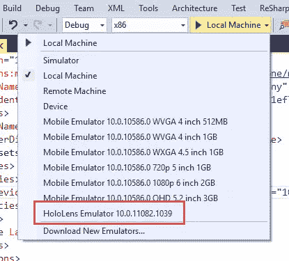
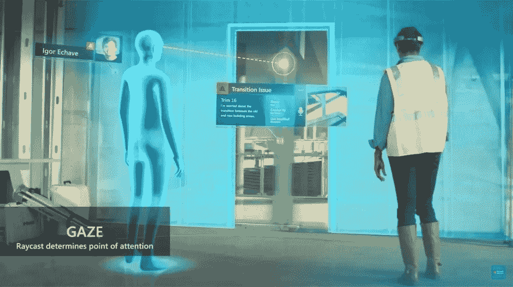

# 微软 HoloLens 开发入门

> 原文：<https://www.sitepoint.com/getting-started-with-microsoft-hololens-development/>

目前最令人兴奋和开创性的技术产品之一是微软的 HoloLens。显示与任何物理环境无缝混合的实时 3D 全息图的能力为现代计算开辟了无限的新可能性。我刚刚揭开了全息兔洞的表面，考虑到硬件刚刚开始作为 3000 美元的开发者套件发货，可以肯定地说最好的还在后面。

如果你迫不及待地想要等到全面上市，并想在今天深入研究 HoloLens 应用程序开发，那么有一个好消息！工具已经可以使用了，而且是免费的，你甚至不需要一个 HoloLens 就可以开始使用。

## 先决条件

随着 HoloLens 运行 Windows 10，应用程序是为[通用 Windows 平台](https://msdn.microsoft.com/en-us/windows/uwp/get-started/whats-a-uwp) (UWP)构建的，这意味着为移动设备、桌面、Xbox 和其他平台编写的 UWP 应用程序也将在 HoloLens 上运行。创建全息体验需要两个主要工具— Visual Studio 2015 和 Unity 3D。您将把这些与 SDK 和模拟器一起使用。总的来说，您将需要以下内容:

*   [Windows 10](https://www.microsoft.com/en-us/software-download/windows10/)
*   [Visual Studio 2015 更新 2](https://go.microsoft.com/fwlink/p/?LinkId=534599) (社区版)
*   [全息透镜的 Unity 3D](http://unity3d.com/pages/windows/hololens)
*   [Windows 10 SDK](https://developer.microsoft.com/en-us/windows/downloads/windows-10-sdk) (如果你还没有安装 Visual Studio 2015)
*   [全息透镜模拟器](http://go.microsoft.com/fwlink/?LinkID=724053)

一旦你安装了这些工具，你就准备好创造你的第一次全息体验。

虽然 HoloLens 运行 UWP 应用程序，这些应用程序又是使用 C#和 Visual Studio 编写的，但 HoloLens 应用程序的独特之处在于 3D 全息图。这些都是在你最喜欢的 3D 软件中创建和建模的，但如果你像我一样，不知道如何创建 3D 模型，你可以使用专业人员为你创建的服务。Unity 甚至有自己的 [3D 模型资产商店](https://www.assetstore.unity3d.com/)。我将对 Unity 做一个简短的介绍，但是这是一个很大的话题。 [SitePoint 有一些其他的 Unity 文章](https://www.sitepoint.com/saving-data-between-scenes-in-unity/)让你开始。

[Unity 3D](http://unity3d.com/) 允许您导入和操作 3D 模型，并管理每个对象的事件和脚本。你可以控制灯光、环境(称为“场景”)以及你想投射给用户的世界的每一个方面。Unity 不容易掌握，但如果你想创建 HoloLens 应用程序，这是没有办法的。

## 在 Unity 中创建 3D 对象

通过打开*游戏对象*菜单，进入 *3D 对象*并选择你想要的 3D 对象，你可以在 Unity 中创建基本的形状。



选择一个球体会在场景中创建一个基本的球体形状，然后可以对其进行操纵、设置动画和控制。


在全息体验中与 3D 对象交互的主要方式是将脚本附加到对象上。您可以通过在 Unity 中创建新的脚本来实现这一点。



您可以在 Visual Studio 中通过双击来编辑这个脚本。

```
using UnityEngine;
using System.Collections;

public class SphereBehaviour : MonoBehaviour {

    // Use this for initialization
    void Start () {

    }

    // Update is called once per frame
    void Update () {

    }
} 
```

当应用程序启动并设置任何事件或初始化代码时，会调用`Start`方法。`Update`每帧调用一次，用于检测碰撞、`RayCast`点击和其他用户交互。

要将脚本附加到 Unity 中的一个对象上，*将其拖放到该对象上。当调用这些方法时，脚本中的代码将正确执行。这可能是在开始时，当一个用户说出一个语音命令或你全息体验中的任何其他事件时。*

要运行全息应用程序，您需要将项目导入 Visual Studio，Unity 可以为您创建一个完整的 UWP 应用程序解决方案。使用*构建设置菜单*中的以下构建设置。



确保打开*播放器设置*，选择*虚拟现实支持*，并确保 *Windows 全息 SDK* 存在。



当你点击 *Build* 时，Unity 会在你选择的文件夹中创建一个完整的 UWP 应用解决方案。您可以在 Visual Studio 中打开此解决方案。


默认情况下，从 Unity 导出的通用 Windows 平台应用程序可以在任何 Windows 10 设备上运行。因为 HoloLens 不同，所以应用程序应该利用只有 HoloLens 才有的功能。为此，您需要将`TargetDeviceFamily`设置为“Windows”。全息”在 Visual Studio 的 *Package.appxmanifest* 文件中如下图所示。



现在，您可以在 HoloLens 模拟器中运行该解决方案。




现在，您已经了解了创建 3D 工作空间的工作流程，可以添加模型并将脚本应用于这些模型，是时候看看 HoloLens 应用程序中与全息图交互的主要领域了。

## 凝视输入

凝视是 HoloLens 应用程序的第一种输入形式，也是你聚焦全息图的方式。当用户通过 HoloLens 观看时，它是视野的中心，本质上是一个“鼠标光标”。你可以随心所欲地设计这个光标，因此它可以与你的应用程序、公司徽标或任何其他 3D 形状相关联。



图片来源:微软

请记住，HoloLens 使用用户头部的位置和方向，而不是他们的眼睛，来确定他们的视线矢量。它就像一个从全息透镜中心直射出来的激光笔。

光标也是一个 3D 对象，您需要对其进行编码，使其行为类似于光标。在 Unity 中创建一个新的脚本，并将其附加到您的模型中，然后使用类似下面的代码:

```
using UnityEngine;

public class WorldCursor : MonoBehaviour
{
  private MeshRenderer meshRenderer;

  // Use this for initialization
  void Start()
  {
    // Grab the mesh renderer that's on the same object as this script.
    meshRenderer = this.gameObject.GetComponentInChildren<MeshRenderer>();
  }

  // Update is called once per frame
  void Update()
  {
    // Do a raycast into the world based on the user's
    // head position and orientation.
    var headPosition = Camera.main.transform.position;
    var gazeDirection = Camera.main.transform.forward;

    RaycastHit hitInfo;

    if (Physics.Raycast(headPosition, gazeDirection, out hitInfo))
    {
      // If the raycast hit a hologram...
      // Display the cursor mesh.
      meshRenderer.enabled = true;

      // Move the cursor to the point where the raycast hit.
      this.transform.position = hitInfo.point;

      // Rotate the cursor to hug the surface of the hologram.
      this.transform.rotation = Quaternion.FromToRotation(Vector3.up, hitInfo.normal);
    }
    else
    {
      // If the raycast did not hit a hologram, hide the cursor mesh.
      meshRenderer.enabled = false;
    }
  }
} 
```

代码的重要部分是`RayCast`对象。这就是上面提到的“激光束”,是测试你的用户是否在看一个物体。如果有一个点击，你显示光标，让它“拥抱”任何表面。

## 手势输入

一旦你用目光锁定了一个你想与之互动的对象，你就可以用手势来进行实际的互动。最常见也是免费的手势是“轻拍”。这就像单击鼠标左键来调用对象上的动作。可以执行更复杂的手势，例如“点击并按住”以在 3D 空间中移动对象。

在 Unity 中创建另一个脚本，并包含类似下面的代码。然后，脚本会链接到项目的根目录，因为您希望手势在应用程序中是全局的，并与任何 3D 对象进行交互。

```
using UnityEngine;
using UnityEngine.VR.WSA.Input;

public class GazeGestureManager : MonoBehaviour
{
  public static GazeGestureManager Instance { get; private set; }

  // Represents the hologram that is currently being gazed at.
  public GameObject FocusedObject { get; private set; }

  GestureRecognizer recognizer;

  // Use this for initialization
  void Start()
  {
    Instance = this;

    // Set up a GestureRecognizer to detect Select gestures.
    recognizer = new GestureRecognizer();
    recognizer.TappedEvent += (source, tapCount, ray) =>
    {
      // Send an OnSelect message to the focused object and its ancestors.
      if (FocusedObject != null)
      {
        FocusedObject.SendMessageUpwards("OnSelect");
      }
    };
    recognizer.StartCapturingGestures();
  }

  // Update is called once per frame
  void Update()
  {
    // Figure out which hologram is focused this frame.
    GameObject oldFocusObject = FocusedObject;

    // Do a raycast into the world based on the user's
    // head position and orientation.
    var headPosition = Camera.main.transform.position;
    var gazeDirection = Camera.main.transform.forward;

    RaycastHit hitInfo;
    if (Physics.Raycast(headPosition, gazeDirection, out hitInfo))
    {
      // If the raycast hit a hologram, use that as the focused object.
      FocusedObject = hitInfo.collider.gameObject;
    }
    else
    {
      // If the raycast did not hit a hologram, clear the focused object.
      FocusedObject = null;
    }

    // If the focused object changed this frame,
    // start detecting fresh gestures again.
    if (FocusedObject != oldFocusObject)
    {
      recognizer.CancelGestures();
      recognizer.StartCapturingGestures();
    }
  }
} 
```

在这个代码片段中需要注意的主要对象是`GestureRecognizer`。它负责识别应用程序用户的手势。这里你注册了`TappedEvent`来传递`OnSelect`事件给一个被点击的对象。

`Update`方法不断检查是否有任何对象被注视，并设置对象为焦点，如果对象被点击，则向其发送一个点击事件。

## 语音输入

我最喜欢的与 HoloLens(或者至少是模拟器)交互的方式是使用语音。除了“看到它说出来”的规则，你还可以创建自己的短语，让 HoloLens 识别。当应用程序识别出一个特定的短语时，就会触发一个事件，您可以使用该事件来处理该短语的操作。

```
using System.Collections.Generic;
using System.Linq;
using UnityEngine;
using UnityEngine.Windows.Speech;

public class SpeechManager : MonoBehaviour
{
  KeywordRecognizer keywordRecognizer = null;
  Dictionary<string, System.Action> keywords = new Dictionary<string, System.Action>();

  // Use this for initialization
  void Start()
  {
    keywords.Add("Reset world", () =>
    {
      // Call the OnReset method on every descendant object.
      this.BroadcastMessage("OnReset");
    });

    keywords.Add("Drop Object", () =>
    {
      var focusObject = GazeGestureManager.Instance.FocusedObject;
      if (focusObject != null)
      {
        // Call the OnDrop method on just the focused object.
        focusObject.SendMessage("OnDrop");
      }
    });

    // Tell the KeywordRecognizer about our keywords.
    keywordRecognizer = new KeywordRecognizer(keywords.Keys.ToArray());

    // Register a callback for the KeywordRecognizer and start recognizing!
    keywordRecognizer.OnPhraseRecognized += KeywordRecognizer_OnPhraseRecognized;
    keywordRecognizer.Start();
  }

  private void KeywordRecognizer_OnPhraseRecognized(PhraseRecognizedEventArgs args)
  {
    System.Action keywordAction;
    if (keywords.TryGetValue(args.text, out keywordAction))
    {
      keywordAction.Invoke();
    }
  }
} 
```

这里完成所有繁重工作的对象是`KeywordRecognizer`，它的构造函数将关键字作为一个`Array`。每当它识别出一个短语，就会引发`OnPhraseRecognized`事件，并调用关键字的动作。当用户说“重置世界”时，消息`OnReset`被广播，当说“放下物体”时，`OnDrop`事件被发送到被注视的物体。

## 音频输入

创造全息体验的最后一个主要部分是沉浸式音频。它不是一种让用户提供输入的方式，而是一种向用户展示体验中发生了什么以及他们应该注意什么的方式。

添加音频在技术上并不难，但添加既合适又与体验相关的音频就难了。SDK 将负责根据用户通过 HoloLens 观看的位置来定位声音，但太多的声音会令人困惑，太少的声音会让用户不知道接下来该做什么。

下面的片段添加了两个声音，一个是物体撞击的声音，另一个是物体(比如你的球体)滚动的声音。

```
using UnityEngine;

public class SphereSounds : MonoBehaviour
{
  AudioSource audioSource = null;
  AudioClip impactClip = null;
  AudioClip rollingClip = null;

  bool rolling = false;

  void Start()
  {
    // Add an AudioSource component and set up some defaults
    audioSource = gameObject.AddComponent<AudioSource>();
    audioSource.playOnAwake = false;
    audioSource.spatialize = true;
    audioSource.spatialBlend = 1.0f;
    audioSource.dopplerLevel = 0.0f;
    audioSource.rolloffMode = AudioRolloffMode.Custom;

    // Load the Sphere sounds from the Resources folder
    impactClip = Resources.Load<AudioClip>("Impact");
    rollingClip = Resources.Load<AudioClip>("Rolling");
  }

  // Occurs when this object starts colliding with another object
  void OnCollisionEnter(Collision collision)
  {
    // Play an impact sound if the sphere impacts strongly enough.
    if (collision.relativeVelocity.magnitude >= 0.1f)
    {
      audioSource.clip = impactClip;
      audioSource.Play();
    }
  }

  // Occurs each frame that this object continues to collide with another object
  void OnCollisionStay(Collision collision)
  {
    Rigidbody rigid = this.gameObject.GetComponent<Rigidbody>();

    // Play a rolling sound if the sphere is rolling fast enough.
    if (!rolling && rigid.velocity.magnitude >= 0.01f)
    {
      rolling = true;
      audioSource.clip = rollingClip;
      audioSource.Play();
    }
    // Stop the rolling sound if rolling slows down.
    else if (rolling && rigid.velocity.magnitude < 0.01f)
    {
      rolling = false;
      audioSource.Stop();
    }
  }

  // Occurs when this object stops colliding with another object
  void OnCollisionExit(Collision collision)
  {
    // Stop the rolling sound if the object falls off and stops colliding.
    if (rolling)
    {
      rolling = false;
      audioSource.Stop();
    } 
  }
} 
```

`OnCollisionEnter`、`OnCollisionStay`和`OnCollisionExit`事件决定何时开始音频剪辑、是否继续音频剪辑以及何时停止音频剪辑。这只是添加碰撞事件触发的声音的一种方式，但您也可以添加环境音频，如在整个体验中播放的音乐或由进度事件触发的语音剪辑。添加音频使您的体验更加可信，让用户完全沉浸其中。

*代码片段来自[https://developer . Microsoft . com/en-us/windows/holographic/holographic _ 101 e](https://developer.microsoft.com/en-us/windows/holographic/holograms_101e)*

## 你的全息甲板未来

如果你是一名为桌面、移动和企业环境开发传统软件的软件开发人员，为 HoloLens 创建应用和体验是迈向未知的一步。你思考 3D 空间体验的方式将挑战你对应用开发的传统认知。

为 HoloLens 开发应用程序的好处是，你不必花 3000 美元购买一台 HoloLens 来开始。所有的工具都是免费的，您可以将模拟器用于几乎所有您想要开发的场景，稍后在真实设备上进行测试。

HoloLens 运行 Windows 10，所以你现有的 UWP 应用程序将工作，你可以选择扩展它们，以便在 HoloLens 上运行时提供完整的全息体验。

数字现实的未来是光明的，尽早掌握它将让你在消费者加入后充分利用这个平台。

*我很乐意听到您在*下面的问题和评论。

## 分享这篇文章