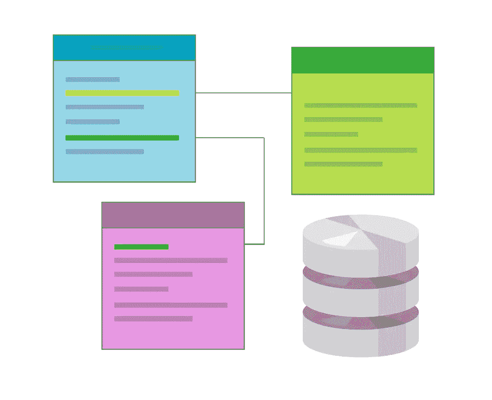

# 重温一下关于 Rails 协会的知识

> 原文：<https://www.sitepoint.com/brush-up-your-knowledge-of-rails-associations/>



Rails 5 很快就要推出了(目前在 RC1)，所以在为这个主要版本做准备的同时，是时候重温一下基础知识了。今天我们将讨论[活动记录关联](http://guides.rubyonrails.org/association_basics.html)。

关联使得在代码中对记录执行各种操作变得更加容易。有多种类型的关联可用:

*   一对一
*   一对多
*   多对多
*   多态一对多

在这篇文章中，我们将讨论所有这些以及进一步定制的一些选项。源代码可以在 [GitHub](https://github.com/bodrovis/Sitepoint-source/tree/master/AR_Relations) 上获得。

## 一对多关联

首先，创建一个新的 Rails 应用程序:

```
$ rails new OhMyRelations -T 
```

对于这个演示，使用的是 Rails 5 候选版本，但是本文中讨论的所有内容都适用于 Rails 3 和 4。

一个[一对多关联](http://guides.rubyonrails.org/association_basics.html#the-has-many-association)可能是最常见和最广泛使用的类型。这个想法非常简单:记录 A 可能有许多记录 B，而记录 B 只属于一个记录 A。对于每个记录 B，你必须存储它所属的记录 A 的一个`id`——这个`id`被称为一个**外键**。

我们在实践中试试吧。假设，我们有一个用户，他可能有很多帖子。首先，创建`User`模型:

```
$ rails g model User name:string 
```

至于`posts`表，它必须包含一个外键，惯例是根据相关的表来命名该列，所以在我们的例子中，它就是`user_id`(注意单数形式):

```
$ rails g model Post user:references body:text 
```

`user:references`是定义外键的一种简洁方式——它会自动命名相应的列`user_id`,并在其上添加一个索引。在您的迁移中，您将看到类似于以下内容的内容:

```
t.references :user, foreign_key: true 
```

当然，你也可以说:

```
$ rails g model Post user_id:integer:index body:text 
```

应用您的迁移:

```
$ rake db:migrate 
```

不要忘记，模型本身必须具备适当建立关系的特殊方法。只要我们在生成迁移时使用了`references`关键字，`Post`模型就已经有了下面一行:

```
belongs_to :user 
```

尽管如此，仍需手动修改`User`:

*型号/用户. rb*

```
[...]
has_many :posts
[...] 
```

注意关系名称的复数形式(“post **s** ”)。对于`belongs_to`关系，您使用单数形式(“用户”)。

这并不难，是吗？现在关系已经建立，您可以使用如下方法:

*   `user.posts`–引用用户的帖子
*   `user.posts << post`–在用户和帖子之间建立新的关系
*   `post.user`–引用帖子的所有者
*   `user.posts.build({ })`–为用户实例化一篇新文章，但还没有保存到数据库中。它确实填充了帖子上的`user_id`属性。这类似于说`Post.new({user_id: user.id})`。
*   `user.posts.create({ })`–创建新帖子并将其保存到数据库中。
*   `post.build_user`–同上，实例化一个新用户，但不保存
*   `post.create_user`–同上，实例化用户并保存到数据库中

让我们讨论一下在定义关系时可以设置的一些选项。例如，假设您希望将`belongs_to`关系称为`author`，而不是`user`:

*车型/后 rb*

```
[...]
belongs_to :author
[...] 
```

然而，这还不够，因为 Rails 使用`:author`参数来导出相关模型的名称和外键。只要我们没有名为`Author`的模型，我们就必须指定类的实际名称:

*车型/后 rb*

```
[...]
belongs_to :author, class_name: 'User'
[...] 
```

到目前为止还不错，但是`posts`表也没有`author_id`字段，所以我们需要重新定义`:foreign_key`选项:

*车型/后 rb*

```
[...]
belongs_to :author, class_name: 'User', foreign_key: 'user_id'
[...] 
```

现在，在您的控制台中，您可能会执行以下操作:

```
$ post = Post.new
$ post.create_author 
```

一切都应该很好。

请注意，对于`has_many`关联，还有`:class_name`和`:foreign_key`选项可用。更重要的是，使用这些选项，你可以建立一个模型引用自身的关系，如这里的所述。

您可以设置的另一个常见选项是`:dependent`，通常用于`has_many`关系。我们为什么需要它？假设一个叫约翰的用户有一堆帖子。然后，出乎意料地，John 从数据库中被删除了——嗯，这是常有的事……但是他的帖子呢？他们仍然将`user_id`列设置为约翰的 id，但是这个记录已经不存在了！这些帖子被称为*孤立记录*，可能会导致各种各样的问题，所以你可能会想要处理这种情况。

`:dependent`选项接受以下值:

*   `:destroy`–所有相关对象将被逐一移除(在单独的查询中)。适当的回调将在删除前后运行。
*   `:delete_all`–所有相关对象将在一次查询中被删除。将不执行任何回调。
*   `:nullify`–关联对象的外键将被设置为`NULL`。将不执行任何回调。
*   `:restrict_with_exception`–如果有任何关联记录，将引发异常。
*   `:restrict_with_error`–如果有任何关联的记录，将向所有者(您试图删除的记录)添加一个错误。

因此，如您所见，有许多方法可以处理这种情况。在这个演示中，我将使用`:destroy`:

*型号/用户. rb*

```
[...]
has_many :posts, dependent: :destroy
[...] 
```

有趣的是，`belongs_to`还支持`:dependent`选项——它可能被设置为`:destroy`或`:delete`。但是，对于一对多关系，我强烈建议您不要设置此选项。

另一件值得一提的事情是，在 Rails 5 中，默认情况下，如果父记录不存在，就不能创建记录。基本上，这意味着你不能做:

```
Post.create({user_id: nil}) 
```

因为显然没有这个用户。

通过调整以下初始化文件，可能会禁用整个应用程序的这一新功能:

*config/initializer/active _ record _ owners _ to _ required _ by _ default . Rb*

```
Rails.application.config.active_record.belongs_to_required_by_default = false # default is true 
```

您也可以为单独的关系设置`:optional`设置:

```
belongs_to :author, optional: true 
```

## 一对一的关联

对于一对一关系，你基本上是说一个记录正好包含另一个模型的一个实例。例如，让我们将用户的地址存储在一个名为`addresses`的单独的表中。该表必须包含一个外键，该外键默认情况下以关系命名:

```
$ rails g model Address street:string city:string country:string user_id:integer:index
$ rake db:migrate 
```

对于用户，只需说:

*型号/用户. rb*

```
has_one :address 
```

有了这些，您可以调用如下方法

*   `user.address`–获取相关地址
*   `user.build_address`–与`belongs_to`提供的方法相同；实例化一个新地址，但不
    保存到数据库中。
*   `user.create_address`–实例化一个新地址，并保存到数据库中。

`has_one`关系允许你定义`:class_name`、`:dependent`、`:foreign_key`和其他选项，就像`has_many`一样。

## 多对多关联

### “拥有并属于许多”协会

多对多关联稍微复杂一些，可以通过两种方式建立。首先讨论一个[直接关系](http://guides.rubyonrails.org/association_basics.html#the-has-and-belongs-to-many-association)，没有任何中间模型。它被称为“拥有并属于许多”或简称为“HABTM”。

假设，一个用户可以注册许多不同的事件，并且一个事件可以包含许多用户。为了实现这个目标，我们需要一个单独的表(通常称为“连接表”)来存储用户和事件之间的关系。这个表必须有一个特殊的名字:`users_events`。基本上，我们建立关系的只是两个表名的组合。

首先，创建`events`:

```
$ rails g model Event title:string 
```

现在中间表:

```
$ rails g migration create_events_users user:references event:references
$ rake db:migrate 
```

注意中间表的名称——Rails 希望它由两个表名组成(“事件”和“用户”)。此外，高阶名称(` events `)应该是第一个(` events > users `,因为字母“e”在字母“u”之前)。最后一步是将`has_and_belongs_to_many`添加到两个模型中:

*型号/用户. rb*

```
[...]
has_and_belongs_to_many :events
[...] 
```

*模型/事件. rb*

```
[...]
has_and_belongs_to_many :users
[...] 
```

现在，您可以调用如下方法:

*   `user.events`
*   `user.events << [event1, event2]`–创建用户和一系列事件之间的关系
*   `user.events.destroy(event1)`–破坏记录之间的关系(实际记录不会被删除)。还有一个`delete`方法，除了不运行回调之外，它做的差不多
*   `user.event_ids`–从集合中返回 id 数组的简洁方法
*   `user.event_ids = [1,2,3]`–使集合仅包含由所提供的主键值标识的对象。
    注意，如果集合最初包含其他对象，它们将被删除。
*   `user.events.create({})`–创建一个新对象并将其添加到集合中

`has_and_belongs_to_many`接受我们已经讨论过的`:class_name`和`:foreign_key`选项。但是，它还支持其他一些特殊设置:

*   `:association_foreign_key`–默认情况下，Rails 使用关系名来查找中间表中的外键，该外键又用于查找相关联的对象。因此，举例来说，如果你说`has_and_belongs_to_many :users`，将使用`user_id`列。然而，这并不总是方便的，所以可以使用`:association_foreign_key`来定义定制列的名称。
*   `:join_table`–该选项可用于重新定义中间表的名称(在本例中称为`users_events`)。

差不多就是这样。尽管如此，`has_and_belongs_to_many`仍然是一种非常严格的定义多对多关联的方法，因为您不能独立地使用关系模型。在许多情况下，您会希望为每个关系存储一些额外的数据，或者定义额外的回调，这是 HABTM 关系无法做到的。因此，我将向您展示另一种更方便的方法来解决相同的任务。

### “有许多经过”的联想

定义多对多关联的另一种方法是使用[has many to](http://guides.rubyonrails.org/association_basics.html#the-has-many-through-association)关联类型。假设我们有一个游戏列表，并且不时地举行关于这些游戏的比赛。许多用户可能参加许多比赛。除了在用户和游戏之间建立多对多的关系之外，我们还希望存储关于每次注册的附加信息，比如比赛的类别(业余、半职业、职业等)。)

首先，创建一个新的`Game`模型:

```
$ rails g model Game title:string 
```

我们还需要一张中间桌子，但这一次需要一个模型:

```
$ rails g model Enrollment game:references user:references category:string
$ rake db:migrate 
```

对于`Enrollment`型号，一切都是自动设置的:

*models/enrollment.rb*

```
[...]
belongs_to :game
belongs_to :user
[...] 
```

调整其他两个模型:

*型号/用户. rb*

```
[...]
has_many :enrollments
has_many :games, through: :enrollments
[...] 
```

*models/game.rb*

```
[...]
has_many :enrollments
has_many :users, through: :enrollments
[...] 
```

这里，我们明确地指定了建立这种关系的中间模型。现在，您可以将每个注册作为一个独立的实体来处理，这样更方便。注意，如果源关联的名称不能从关联的名称中自动推断出来，您可以利用`:source`选项并相应地设置它的值。

因此，总的来说，使用`has_many :through`比使用`has_and_belongs_to_many`更好，然而，在简单的情况下，你可以坚持使用后一种解决方案。

## “有一个通过”协会

另一个有趣的关联类型是[有一个到](http://guides.rubyonrails.org/association_basics.html#the-has-one-through-association)，有点类似于我们在上一节看到的。其思想是一个模型通过一个中间模型与另一个模型相匹配。假设用户有一个钱包，钱包有支付历史。首先，创建`Purse`模型:

```
$ rails g model Purse user:references funds:integer 
```

`user_id`将成为在用户和他的钱包之间建立关系的外键。现在是`PaymentHistory`型号:

```
$ rails g model PaymentHistory purse:references
$ rake db:migrate 
```

现在像这样调整模型:

*型号/用户. rb*

```
has_one :purse
has_one :payment_history, through: :purse 
```

*型号/钱包. rb*

```
belongs_to :user
has_one :payment_history 
```

*models/payment _ history . Rb*

```
belongs_to :purse 
```

这种类型的关系很少使用，但有时会派上用场。

## 多态关联

[多态关联](http://guides.rubyonrails.org/association_basics.html#polymorphic-associations)在某些情况下可能会挽救局面。尽管名字很吓人，但想法很简单:您有一个模型，它可能属于单个关联上的许多不同的模型。假设，你要让游戏和用户可以评论。当然，你可能有两个独立的模型叫做`UserComment`和`GameComment`，但是，总而言之，除了它们属于不同的模型之外，注释是非常相似的。这就是多态关联发挥作用的时候了。

创建新的`Comment`模型:

```
$ rails g model Comment body:text commentable_id:integer:index commentable_type:string 
```

很可能，你已经明白了。`commentable_id`是与其他表建立关系的外键。反过来，`commentable_type`将包含一个评论所属的模型的实际名称。迁移:

```
create_table :comments do |t|
  t.text :body
  t.integer :commentable_id
  t.string :commentable_type

  t.timestamps
end
add_index :comments, :commentable_id 
```

可以重写为:

```
create_table :comments do |t|
  t.text :body
  t.references :commentable, polymorphic: true, index: true

  t.timestamps
end
add_index :comments, :commentable_id 
```

我们之前已经看到过`references`方法，但是这次它还附带了一个`:polymorphic`选项。

应用迁移:

```
$ rake db:migrate 
```

`Comment`模型将有`belongs_to`关联，但有一点小小的变化:

*models/comment.rb*

```
[...]
belongs_to :commentable, polymorphic: true
[...] 
```

只要我们称我们的字段为`:commentable_id`和`:commentable_type`，整个关系就必须称为`commentable`。

现在是`User`和`Game`型号:

*型号/用户. rb*

```
[...]
has_many :comments, as: :commentable
[...] 
```

*models/game.rb*

```
[...]
has_many :comments, as: :commentable
[...] 
```

`:as`是一个特殊选项，说明这是一个多态关联。现在，启动您的控制台并尝试运行:

```
$ u = User.create
$ u.comments.create({body: 'test'}) 
```

在`comments`表中，`commentable_type`将被设置为`User`，而`commentable_id`将被设置为用户的 id。您的多态关联工作得很好，现在您可以轻松地使其他模型成为可注释的了！

## 结论

在本文中，我们讨论了 Rails 中可用的各种类型的关联。我们已经了解了如何设置和进一步定制它们。[官方文档](http://guides.rubyonrails.org/association_basics.html)包含了每个协会的参考资料，所以如果你还没有看的话，一定要去看看。

希望这篇文章对你的知识有所帮助。敬请期待，后会有期！

## 分享这篇文章