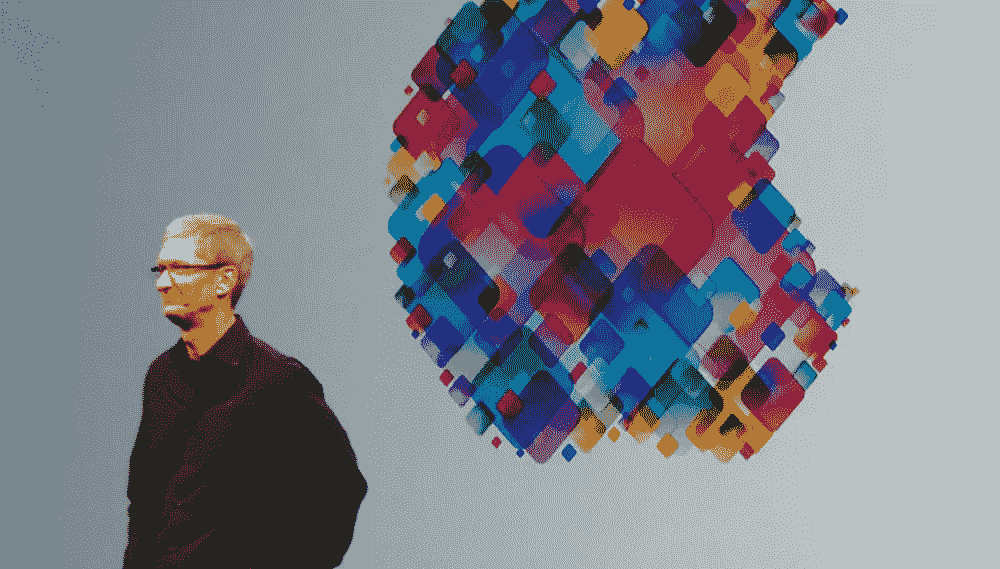

# 苹果会在后设备时代、以人工智能为中心的未来取得成功吗？

> 原文：<https://www.sitepoint.com/will-apple-succeed-in-a-post-device-ai-centric-future/>

这篇社论最初发表在 SitePoint 企业家通讯上。[在这里](https://www.sitepoint.com/newsletter/)注册，每两周接收一次我们企业家报道的更新。

长篇大论地重复自史蒂夫·乔布斯第二次出现以来苹果的成就对任何人都没有好处。它让电脑再次变得性感，用 iPod 改变了音乐消费，按照自己的形象重塑了移动行业，最终让平板电脑成为人们最想使用的东西。除了那款电脑化的手表，在过去的 15 年里，它几乎没有犯过引人注目的错误。

很难想象，在经历了这一切之后，苹果会像诺基亚和黑莓那样收场:消费电子公司在各自的行业中占据了绝对的主导地位，结果却反过来被主导。

然而，在最近一篇关于避免黑莓命运的文章中，Marco Ament 已经开始担心这个问题，尽管是推测性的。

历史上有很多这种现象的例子。大规模、有价值的业务以惊人的速度变成废墟，因为他们没有准备好利用创新竞争对手手中的市场重大变化。随着技术进步的速度不断加快，我们看到它发生得越来越频繁，越来越快。

苹果对隐私权的支持值得称赞，但它限制了人工智能技术的能力范围。从来没有 Google Now 是劣等助手的时候。即使是苹果的博客们，带着无尽的玫瑰色眼镜，也总是承认这一点。苹果也倾向于坚持自己的优势，即使是在创新新产品类别时——它是高利润电脑屏幕的生产商。与此同时，谷歌和亚马逊利用他们的大数据专业知识，推动人工智能研究。

苹果的问题是人工智能终于开始发挥作用了。尽管从诺基亚的静音手机和黑莓手机到 iPhone 风格的智能手机的飞跃不仅为技术，也为社会本身带来了重大转变，但相比之下，良好的人工智能的影响将使所有这些看起来与从软盘驱动器到光盘的转变一样重要。相机的不断改进可以让买家从安卓转向 iPhone 或者相反的日子已经一去不复返了；从现在开始，我们将对我们的设备以智能方式帮助我们的新方式感到最兴奋，预测我们的需求并代表我们执行复杂的任务，而在以前，技术只是促进了这些任务。

正如马可所说:

> 如今，苹果的日常管理得当，总体表现良好。但如果情况发生变化，优先考虑这些大数据人工智能服务，苹果将发现自己处于与黑莓近十年前相似的位置:尽管他们非常擅长，但他们能够做的事情将不再足够，他们将无法赶上。

同样的罪魁祸首——谷歌和亚马逊——也正在撼动其他地方。正如 Business Insider 指出的那样，作为家庭数字助理销售的亚马逊 Echo 不仅仅是一个新产品类别的畅销。它的销量超过了 Bose、Sonos 和 Logitech 的哑音箱，尽管众所周知 Echo 音箱的音质较差。

与此同时，谷歌刚刚发布了一款类似的产品 Google Home，据称该产品在执行人工智能驱动的辅助任务方面普遍表现出色，尽管最初的动作范围较窄。

几年来，我们一直在问自己这样一个问题:既然电脑、手机和其他电脑化的屏幕已经克服了以前让我们沮丧的所有限制，那么下一步会是什么？正如沃希尼·瓦拉在《纽约客》中所写的，我们正看到一个后设备时代的开端。计算机技术足够强大和灵活，我们可以开始将其扩展到基本的屏幕和输入范式之外，将其无缝集成到我们的环境中。

对苹果来说，这是一个关乎生死存亡的问题，在我看来，它与苹果在人工智能领域的障碍一样令人担忧。苹果的优势在于电脑屏幕，我们似乎正在接近电脑屏幕领域有意义创新的极限。

我们将继续需要计算机化的屏幕，苹果可能会继续非常擅长制造它们，但同样可以说——夸张地说，当然——打印机也是如此。佳能和兄弟非常擅长制造打印机，但他们并没有引领世界上最大的技术进步。

正如 Brian S. Hall 在“[为什么苹果不能让亚马逊效仿](http://www.brianshall.com/2016/02/01/echo-and-the-moneymen/)”中所说:

> 但苹果是一家电脑屏幕+闪存盘的公司，所有其他设备和智能产品都不需要电脑屏幕或闪存盘，因此该公司正在努力说服我们在想要亚马逊 Echo 时购买 Apple Watch，或者坚持我们除了笔记本电脑还需要 iPad Pro，而我们都知道我们不需要。
> 
> 没有简单的方法可以解决这个问题。

在过去的十年里，我每年都看到新的争论，关于为什么苹果的第二个成功时代达到了顶峰，但每年这些争论都没有击中要害。对我来说，此时的这些担忧似乎更有道理。我并不是在预测苹果在消费电子领域的领导地位的终结。任何事情都可能发生。但这一次，这种担忧有些伤人。

综上所述，苹果拥有的现金比它知道如何使用的要多(从字面上看)，这永远是一个通配符。

我们会看到的，而且可能是迟早的事。

*图片来源:[迈克·迪尔科斯基](https://www.flickr.com/photos/deerkoski/7178643521)*

这篇社论最初发表在 SitePoint 企业家通讯上。[在这里](https://www.sitepoint.com/newsletter/)注册，每两周接收一次我们企业家报道的更新。

## 分享这篇文章