# 教您的树莓派与 IBM Watson 对话

> 原文：<https://www.sitepoint.com/teaching-your-raspberry-pi-to-speak-with-ibm-watson/>

事实证明，你可以用树莓派和 IBM Bluemix 做很多事情。在本系列的第一篇文章中，我们探索了如何将 Raspberry Pi 连接到 IBM Bluemix、IBM Watson 和 Node-RED。如果你还没有用 Bluemix 和 Node-RED 设置好你的 Raspberry Pi，先浏览一下[第一部分](https://www.sitepoint.com/connecting-a-raspberry-pi-to-ibm-watson-and-bluemix/)，然后再回来！我个人为此使用了树莓 Pi 3，但是我假设树莓 Pi 2 也可以工作得一样好。

在本文中，我们将探讨如何将文本到语音引入到前面例子中的 Node-RED 流中。

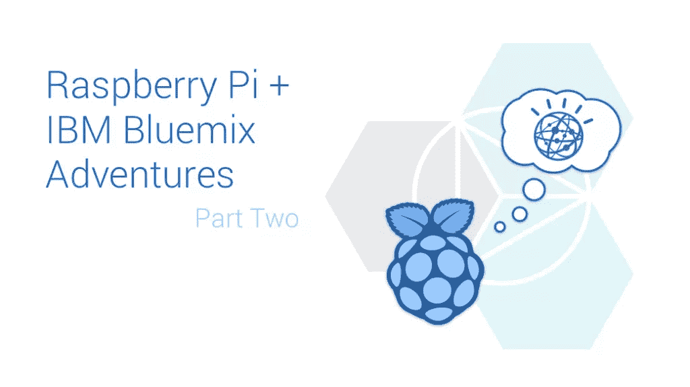

SitePoint/PatCat 的作品，徽标权利:IBM 和 Raspberry Pi 基金会

## 在 ibm blue mix 中将文本连接到语音

为了访问 IBM Watson 的文本到语音服务，我们需要在 Bluemix 中添加“文本到语音”服务。让我们前往 [Bluemix 服务页面](https://console.ng.bluemix.net/catalog/#services)并找到“文本到语音”服务(注意不要选择“语音到文本”…那是不同的！).

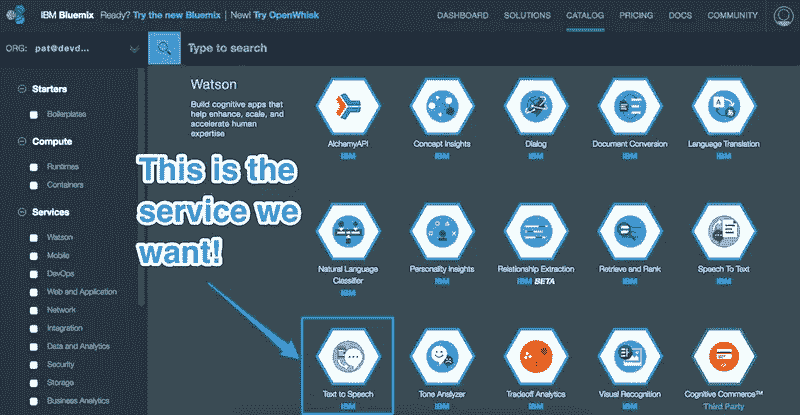

这应该会把我们带到文本到语音服务的 Bluemix 页面。

在该页面上，我们将看到将该服务添加到我们的 IBM Bluemix 库中的各种选项。我们确保我们用于 Raspberry Pi 的空间被选中(在上一篇文章中我称我的空间为“Dev ”),并保持应用程序未绑定。我们可以给服务一个名称(我称我的服务为“声音”)，给凭证一个名称(我保持原样)。我唯一可用的计划是“标准”计划，所以我也没有做任何改动。一旦我们对我们的设置满意，我们点击“创建”。

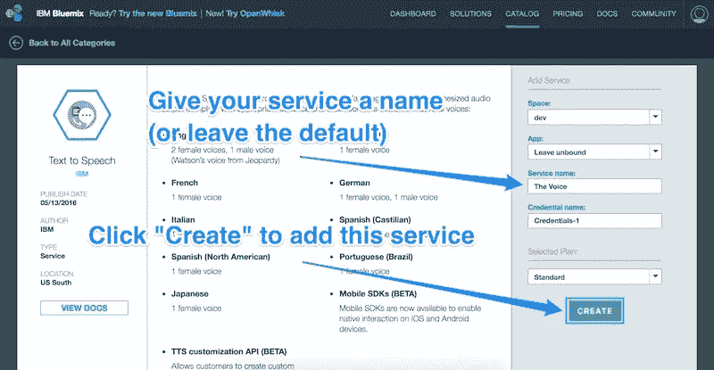

在我们的空间中创建服务后，我们将被带到该服务的页面。我们单击左边的“Service Credentials”菜单项来访问我们需要给 Node-RED 的用户名和密码，以便访问我们新的 IBM Watson 文本到语音服务。从本页复制用户名和密码:

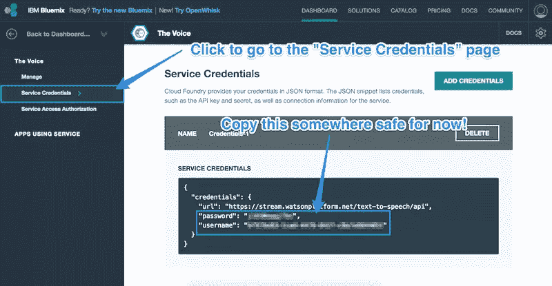

## 向 Node-RED 添加新的 IBM Watson 服务

为了访问 Node-RED 中的 IBM Watson 文本到语音服务，我们需要安装一些新的节点。为此，我们通过 SSH 进入我们的 Pi(或者直接从我们的 Pi 打开终端)并键入:

```
cd ~/.node-red
```

这将我们带到节点红色的应用程序文件夹。从这里开始，我们安装一个新的红色节点集合，名为 [node-red-node-watson](http://flows.nodered.org/node/node-red-node-watson) 。这包括访问一整套 IBM Watson 服务，包括我们需要的文本到语音转换。要安装它，我们从 Node-RED 文件夹在 Pi 上运行以下命令:

```
sudo npm install node-red-node-watson
```

## 安装 ALSA 开发库

IBM Watson Text to Speech 功能会将我们的 Node-RED 应用程序的文本转换成语音文件，但我们还需要一种方法让 Pi 播放这些文件——否则将永远听不到这些文字！为了让它在您的 Pi 上工作，您可能需要运行以下命令来安装开发 ALSA 库:

```
sudo apt-get install libasound2-dev
```

## 重新启动节点-红色

为了使新的 Node-RED 节点更改生效，我们需要重新启动 Node-RED。为此，我们运行以下两个命令:

```
node-red-stop

node-red-start
```

## 我们的新节点-红色流

我们现在已经准备好了能够执行文本到语音转换并回放的所有部件——现在是时候将这些部件放入 Node-RED 并让它运行了。

当我们在安装 node-red-node-watson 包并重启后打开 Node-RED 时，我们应该在左侧的“IBM_Watson”下看到一堆新节点:

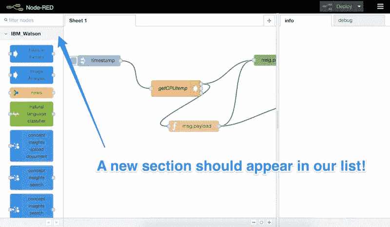

让我们向下滚动，找到“文本到语音”节点，并将其拖动到我们的节点-红色表单中:

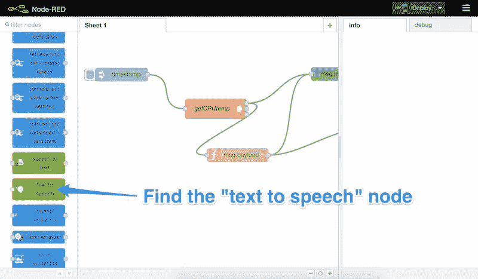

一旦在我们的表中，我们双击它打开它的设置:

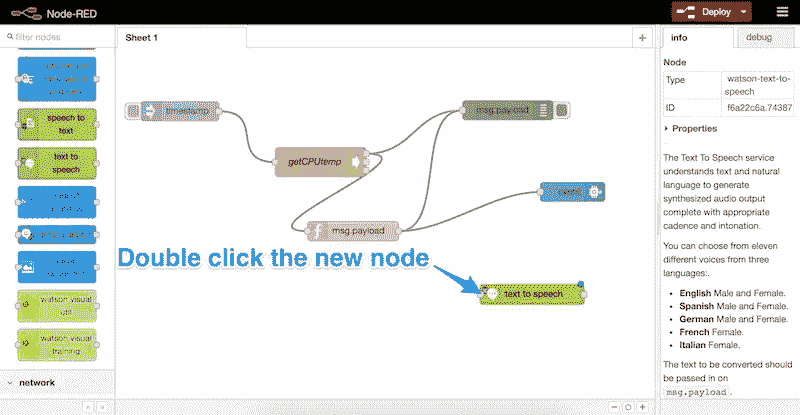

这是我们添加凭证的部分，我们之前从 IBM Bluemix 复制了凭证(用户名和密码)。我们把这些粘贴到这里，并为我们的 Pi 的声音选择一种语言和一种声音。我们将文件格式保留为“WAV”，然后单击“确定”:


我们的文本到语音转换已经准备好发挥它的魔力了。我们现在需要一种方法来告诉它说什么。让它告诉我们 Pi 的温度是多少，就像我们在上一篇文章中发送给 IBM Bluemix 的系统一样。

首先，我们将把一个新的函数节点拖到我们的表中:

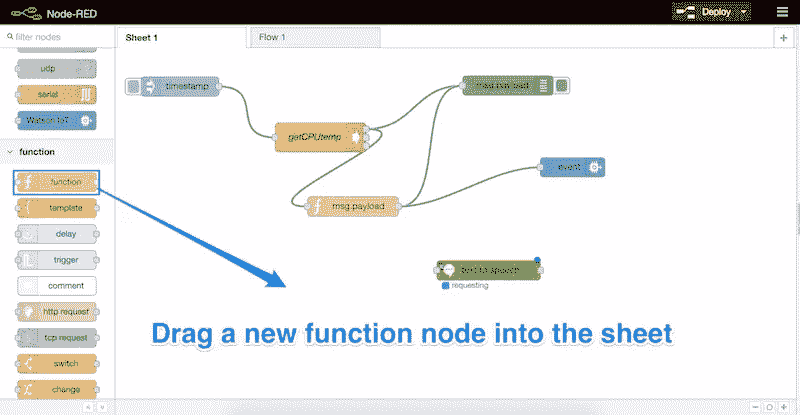

双击新节点，输入以下代码以实现其功能:

```
msg.payload = "My current CPU temperature is " + 
              msg.payload.replace("temp=","").replace("'C\n","") +
              " degrees celsius";
return msg;
```

这个函数的作用是格式化我们的消息，就像我们在上一篇文章中使用的一样，但是我们不是把它格式化成 JSON 字符串，而是把它格式化成人类可读的句子。句子会说“我现在的 CPU 温度是 X 摄氏度”。我们将这句话存储在`msg.payload`变量中，这是 IBM Watson 文本到语音节点所期望的。我们也可以给功能节点一个标签，我把我的叫做“温度文字”:

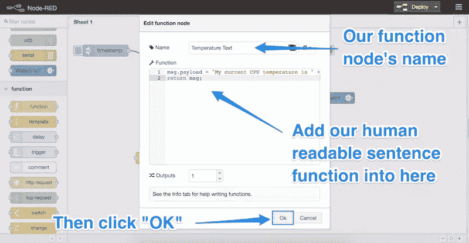

我们将我们的 *getCPUTemp* 节点的输出链接到新功能节点的输入:

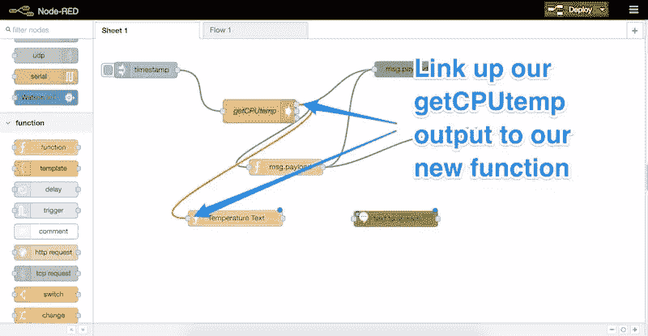

然后将我们的功能节点的输出链接到我们的文本到语音节点的输入:

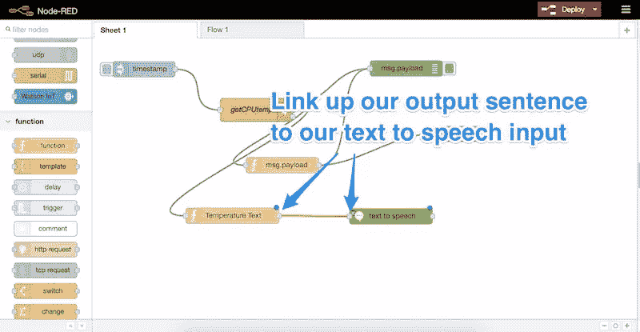

然后，我们将另一个功能节点放入工作表中。在该节点中，我们设置了一个简单的函数，将变量`msg.speech`设置为`msg.payload`，这是我们的文本到语音节点返回的内容:

```
msg.payload = msg.speech;
return msg;
```

你可以随意称呼这个节点，我称之为“格式化语音”。然后点击“确定”:

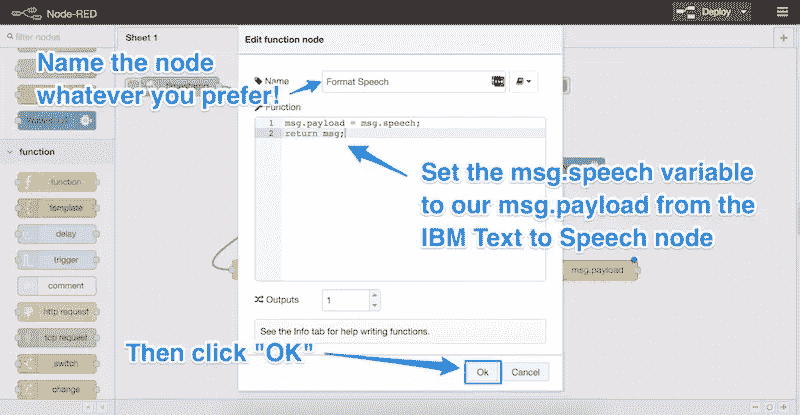

## 存储和检索我们的声音文件

我们现在有一个生成的声音缓冲区，并准备存储在某个地方，以便我们可以播放它。为了将它存储在一个文件中，我们使用“文件”节点，它可以在“存储”标题下找到。将没有输出的文件拖到表单中:

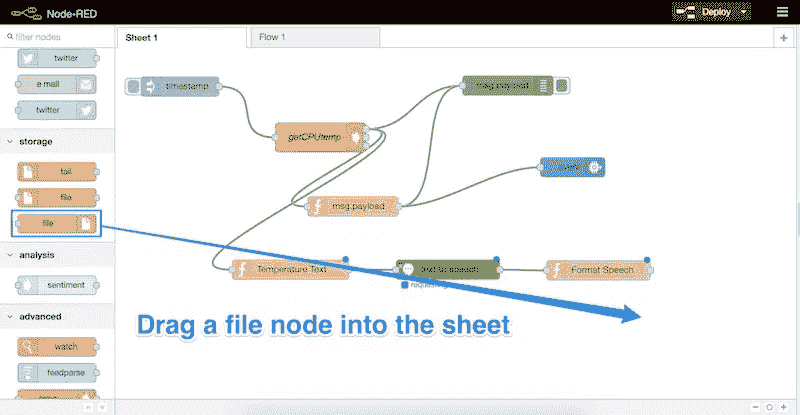

我们双击新节点并输入以下设置:

*   我们将文件名设置为`/home/pi/temp/speech.wav`(其中 *pi* 是当前运行 Node-RED 的用户名)。
*   操作应该是“覆盖文件”。
*   我们确保“向每个有效负载添加新行(\n)？未选中。
*   应该选中“如果目录不存在，则创建目录”，以便 Node-RED 可以在需要时为文件创建目录。
*   我们将节点命名为—您可以随意命名！我把我的命名为“创建 WAV”。
*   点击“确定”！

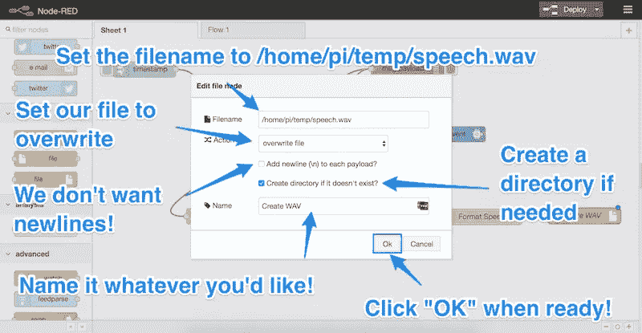

这就创建了一个简单的流程，每当 IBM Watson 为我们翻译一些文本时，它都会为我们生成一个 WAV 文件。确保每个节点都像这样连接:

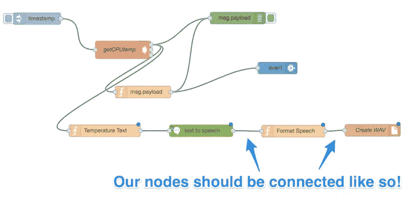

## 播放声音

在我们尝试运行这个应用程序之前，我们需要调整它的运行频率。为此，我们双击“时间戳”节点:

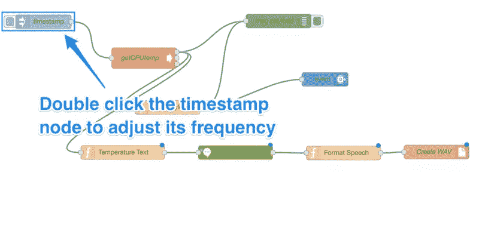

让我们将频率设置得更合理一些——记住，IBM Watson 的声音每次都需要时间来实际说出台词！另外，请注意，如果该服务在一个月内超过 100 万个字符，IBM 将对其收费，所以您不希望过度使用该服务——尤其是如果您频繁地请求该服务，以至于根本听不到该服务的声音！一分钟的间隔对我来说很有效:


现在，我们拖入一个“延迟”节点。在我们尝试播放之前，IBM Watson 需要等待一段时间来执行文本到语音转换。当声音文件更新时，有一些方法可以在 Node-RED 中运行节点，但我发现它们有时会有一点问题——简单的延迟似乎效果最好。

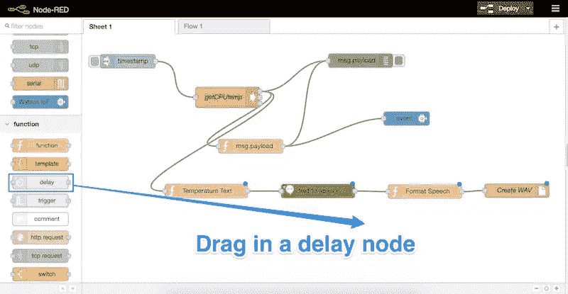

我们双击该节点打开其设置，将延迟更改为 1 秒，然后单击“确定”:

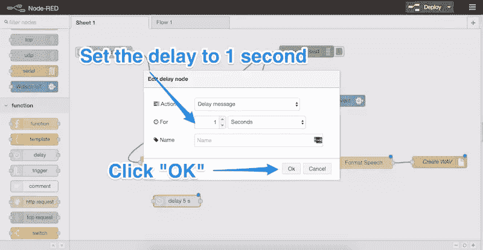

我们将“格式化语音”输出(或任何您命名的函数)连接到我们的延迟，如下所示:

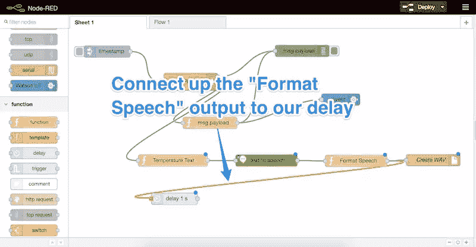

然后，我们拖入一个新节点—文件读取节点。它将位于我们之前拖入的“文件”节点之上，但同时具有输入和输出:

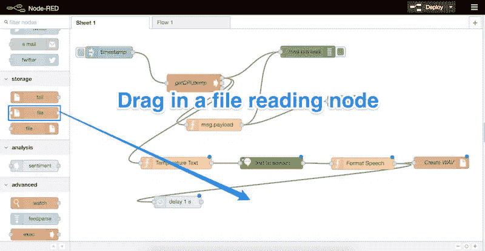

双击新节点并输入以下设置:

*   我们将文件名设置为`/home/pi/temp/speech.wav`(与我们之前创建的文件名相同)。
*   我们确保输出是“缓冲”。
*   我们将其命名为“Read WAV”(当然，您可以随意称呼它)。
*   点击确定！

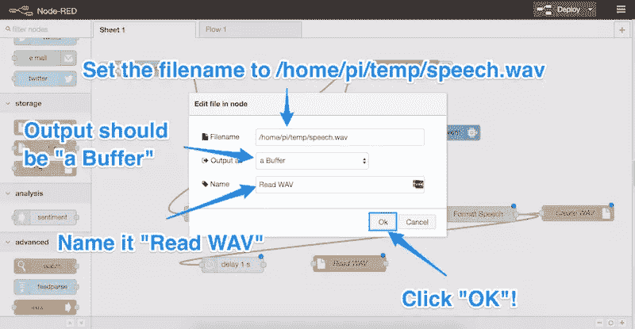

我们将延迟节点连接到“Read WAV”节点，然后拖动最后一个节点——“exec”节点。这个在“高级”部分下面，可以运行 Unix 命令。这就是我们在 Pi 上播放音频的方式。

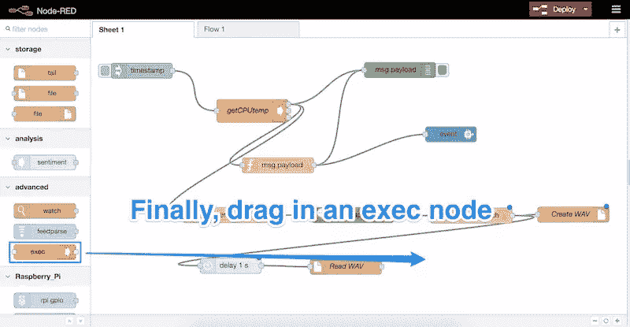

我们双击该新节点来更改其设置。我们将命令设置为:

```
aplay /home/pi/temp/speech.wav
```

这将在我们的 Pi 上播放声音文件！我们不需要选择单选按钮或任何东西，我们只需命名节点(我将我的命名为“Play Audio”)并单击 OK:

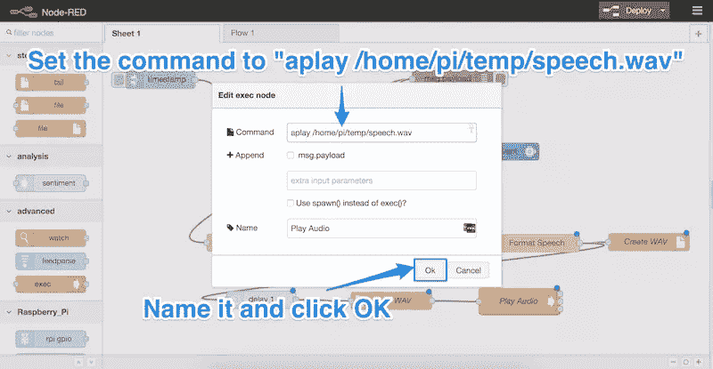

## 在活动

至此，我们已经做好了一切准备:

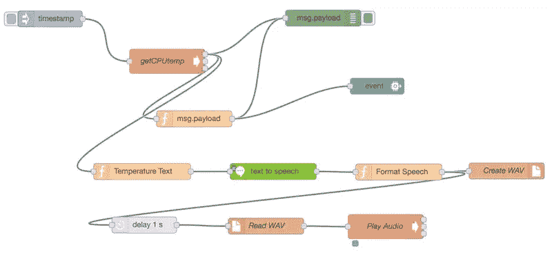

您可能需要在 Pi 上更改的一个设置是输出音频的位置。我使用以下命令将音频导入 3.5 毫米插孔:

```
amixer cset numid=3 1
```

您可以在 [Raspberry Pi 音频配置页面](https://www.raspberrypi.org/documentation/configuration/audio-config.md)找到更多关于更改您的 Raspberry Pi 音频设置的信息。

音频设置正确且一切就绪后，单击红色节点界面右上角的“部署”按钮。如果一切按计划进行，它应该会成功运行，您的树莓 Pi 应该会开始与您交谈！

下面是我在 Twitter 上发布的一个视频，是我的树莓派通过星巴克的杯子对我说话:

> 我的 [@Raspberry_Pi](https://twitter.com/Raspberry_Pi) 继续通过一个 [@StarbucksAu](https://twitter.com/StarbucksAu) 杯子和我说话，真是太棒了。科技的乐趣……【pic.twitter.com/KIjgtPSnfe 
> 
> —帕特里克·卡坦扎里蒂(@ thatpatrickguy)[2016 年 5 月 24 日](https://twitter.com/thatpatrickguy/status/734962986406674433)