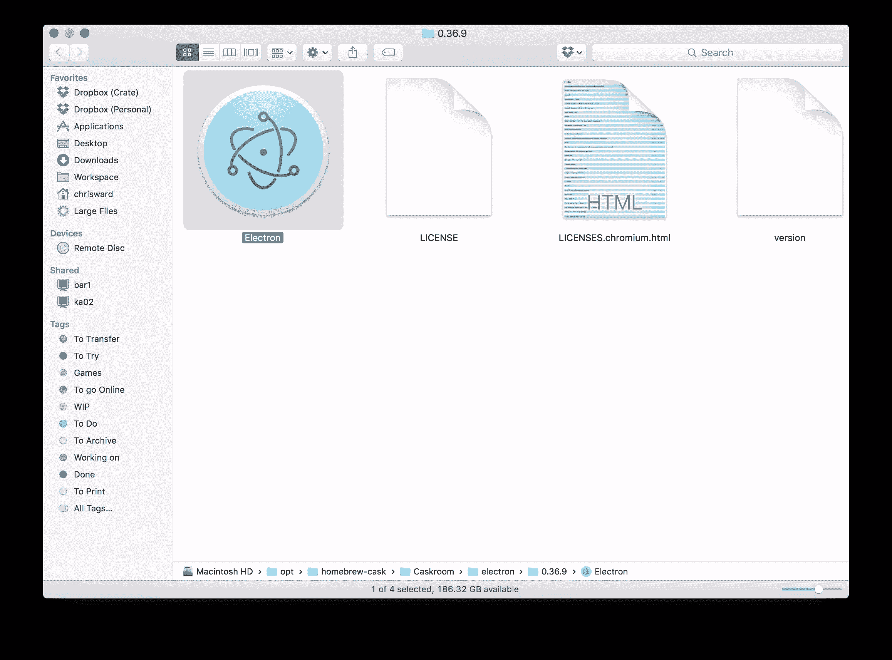
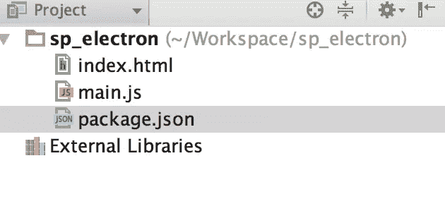
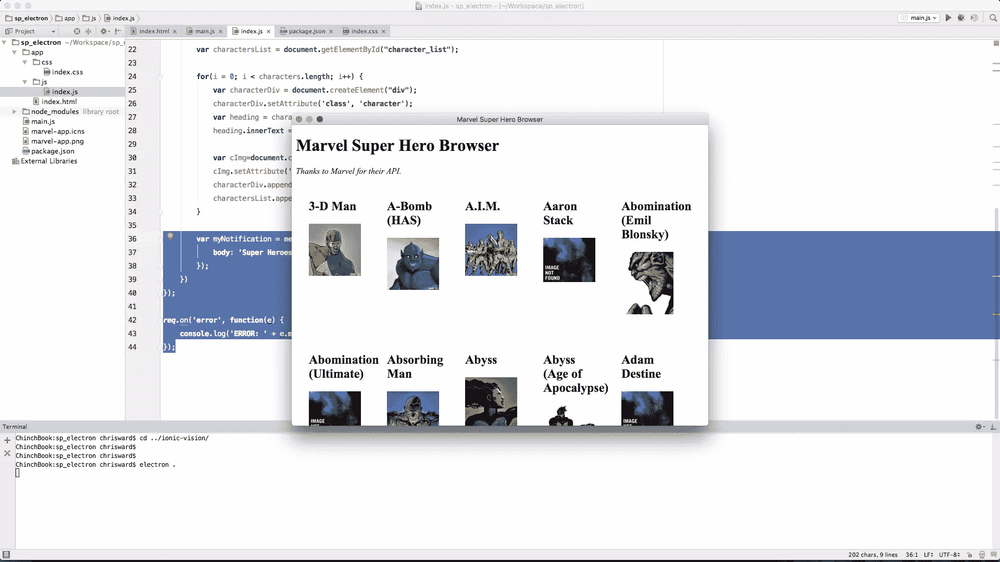
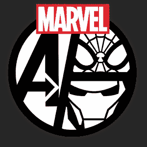
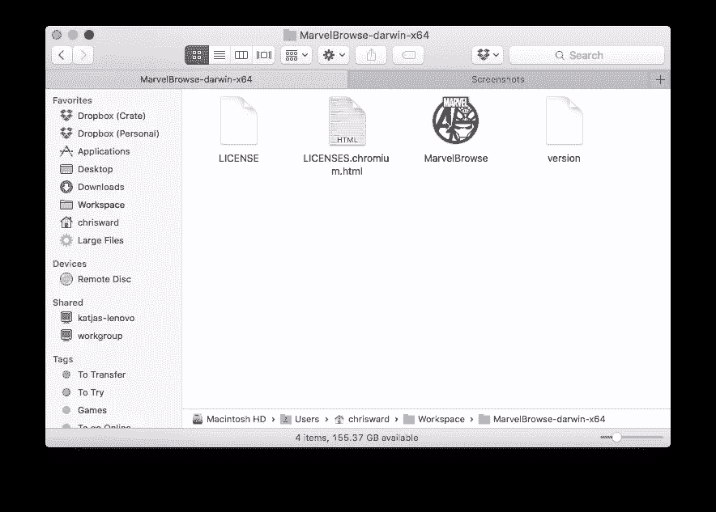

# 使用 Electron 创建跨平台桌面节点应用

> 原文：<https://www.sitepoint.com/desktop-node-apps-with-electron/>

你可以说我过时了，但我一直更喜欢使用适合每种用途的桌面应用程序。我觉得如果我做任何事情都要用浏览器，那为什么还要有一台“合适的”电脑呢？实际上，我经常出差，通常处于互联网连接或使用不稳定的互联网连接之间，而“真正的”应用程序通常更适合有效的离线工作。

我理解开发和维护原生桌面应用程序是多么复杂，并且能够理解为什么公司将用户推向 web 或跨平台版本。几十年来，实现这一目标有太多的选择。Flash、Air、Java 和 Sliverlight 都承诺了这种能力，并取得了不同程度的成功。

这些选项的主要问题是，它们通常涉及到学习另一种语言(这没有意义)，或者迫使用户安装受稳定性、性能和安全问题困扰的插件。

我们都知道 JavaScript 和 web 技术的力量，并且已经看到了使用这些知识开发和打包跨平台桌面应用程序的一波选择。

GitHub 的 Electron 是一个选择，但是我已经很高兴地使用了几个用它构建的应用程序，这似乎是一个很好的研究选择。经过两年的开发，包括一次更名(来自 Atom shell)， [Electron 最近发布了 1.0 版本](http://electron.atom.io/blog/2016/05/11/electron-1-0)，这对于任何项目来说都是一个里程碑。这是检验它的能力的最佳时机。

## 安装电子设备

电子公司有一个[快速启动项目](https://github.com/atom/electron-quick-start)和[预建版本](https://github.com/atom/electron/releases)可用，但让我们直入深水区，通过 npm 安装电子公司:

```
npm install electron-prebuilt -g 
```

或者对于 Mac 家酿爱好者来说，通过[木桶](https://caskroom.github.io/):

```
brew install Caskroom/cask/electron 
```

无论你选择哪一个，你都应该得到一个可执行的电子二进制文件。



此应用程序仅用于捆绑和运行您的最终项目，而不是创建一个。为此，您可以使用任何标准的文本编辑器或 IDE。

一个电子项目需要三个文件:

*   `index.html`:默认渲染的网页。
*   `main.js`:启动应用程序并创建一个浏览器窗口来呈现 HTML。
*   `package.json`:列出所需的应用依赖、元数据和文件。



## 你需要一个英雄

在这个例子中，我将创建一个简单的应用程序，连接到[漫威 API](http://developer.marvel.com/) ，拉 25 个超级英雄，并显示他们的名字和缩略图。当该过程完成时，它会显示一个系统通知，并有一个类似操作系统的应用程序图标。最终用户不会知道应用程序是如何创建的，也不能查看源代码。

你可以在 [GitHub](https://github.com/ChrisChinchilla/sp_electron) 上找到最终的项目。

打开`package.json`并添加以下内容:

```
{
  "name": "hero-browser",
  "version": "0.1.0",
  "main": "main.js",
  "dependencies": {
    "dotenv": "^2.0.0",
    "md5": "^2.1.0"
  }
} 
```

这是一个标准的`package.json`文件，遵循与 node.js 相同的格式和选项。

添加完这些之后，运行`npm install`以确保您已经安装了依赖项。

`main.js`处理主机操作系统和 JavaScript 代码之间的交互。这将是一个简单的例子，你可以在[电子公司的文档](http://electron.atom.io/docs/v0.37.7/)中找到更多可能的信息。

首先，让我们设置所需的要求(即电子)，创建一个应用程序，原生浏览器窗口和一个主窗口占位符。

```
'use strict';

const electron = require('electron');
const app = electron.app;  // Module to control application life.
const BrowserWindow = electron.BrowserWindow;  // Module to create native browser window.
var mainWindow = null; 
```

下一步处理如果窗口关闭退出应用程序。如果平台是 OS X，应用程序通常会在所有窗口关闭后保持打开，用户通常会显式退出，所以要处理这个用例。

```
app.on('window-all-closed', function() {
    if (process.platform != 'darwin') {
        app.quit();
    }
}); 
```

一旦初始化了 Electron，就创建浏览器窗口并加载应用程序代码。如果窗口关闭，取消对窗口对象的引用。

```
app.on('ready', function() {
  mainWindow = new BrowserWindow({width: 800, height: 600});
  mainWindow.loadURL('file://' + __dirname + '/app/index.html');

  mainWindow.on('closed', function() {
    mainWindow = null;
  });
}); 
```

创建一个名为`app`的子文件夹。在`app/index.html`中，添加对所需样式表和 JavaScript 文件的引用，并设置界面的 HTML 结构。

```
<!DOCTYPE html>
<html>
<head>
    <meta charset="UTF-8">
    <title>Marvel Super Hero Browser</title>
    <link href="css/index.css" rel="stylesheet" type="text/css"/>
</head>
<body>
    <h1>Marvel Super Hero Browser</h1>
    <em>Thanks to Marvel for their API.</em>

    <div id="character_list"></div>

    <script src="js/index.js"></script>
</body>
</html> 
```

创建`app/css/index.css`并添加一些基本的 css 来辅助布局。

```
#character_list .character img {
    width: 100px;
}

.character {
    float: left;
    padding: 25px;
    max-width: 100px;
} 
```

创建`app/js/index.js`。这将是大多数应用程序功能发生的地方。首先设置所需的依赖项和变量:

```
'use strict';

require('dotenv').config();
var md5 = require('md5');
var publicKey = process.env.MARVEL_PUBLIC_KEY;
var privateKey = process.env.MARVEL_PRIVATE_KEY;
var ts = String(new Date().getTime());
var hash = md5(ts+privateKey+publicKey);

var url = `https://gateway.marvel.com/v1/public/characters?ts=${ts}&apikey=${publicKey}&hash=${hash}&limit=25`; 
```

漫威 API 是一个使用起来很有趣的 API，但是它的认证和数据结构可能会令人困惑。[在这里注册一个密钥](http://developer.marvel.com/signup)和[按照这些指示](https://developer.marvel.com/documentation/authorization)得到上面需要的三个参数。认证所需的公钥和私钥存储在一个`.env`文件中，并使用 [dotenv 包](https://www.npmjs.com/package/dotenv)进行访问。

```
MARVEL_PRIVATE_KEY=<PRIVATE_KEY>
MARVEL_PUBLIC_KEY=<PUBLIC_KEY> 
```

`limit`值设置请求多少条记录，还有其他可以设置的参数。

如果您想跳过与漫威 API 的连接和认证，那么我创建了一个 JSON 数据文件供您使用。将上面的 JavaScript 代码替换为:

```
'use strict';

var url = `https://gist.githubusercontent.com/ChrisChinchilla/29486e8ce367f426dfe6b15dbcc3fa54/raw/3ea92af51ce3749bb5983c1cb0359883592daef6/Marvel%2520Electron%2520Data`; 
```

接下来创建将每个字符输出到`character_list` div 所需的 HTML 和占位符变量:

```
var characterHTML = (character)=> ` <div class="character">
    <h2>${character.name}</h2>
    
  </div>`; 
```

接下来，调用 API 并处理响应，深入到 JSON 结构中寻找`resp.data.results`中的实际字符列表。

为每个字符创建 HTML 元素，将它们附加到`character_list`。漫威 API 中的图像被分为文件名和扩展名。如果没有图像可用，它会显示“没有图像可用”图像，我们可以处理这个问题，但在本例中不会。

当循环完成时，显示系统通知，关闭方法并处理连接到 API 的潜在错误。

```
fetch(url)
    .then(resp => resp.json())
    .then(json => json.data.results)
    .then(characters => {
        var html = characters.map(characterHTML).join('');
        var characterList = document.getElementById("character_list");
        characterList.innerHTML = html;

        new Notification(document.title, {
            body: 'Super Heroes Loaded!'
        });
    })
    .catch((error)=> {
        console.error(error);
    }); 
```

通过在项目根目录中执行以下命令来运行应用程序:

```
electron . 
```



## 打包应用程序

将代码打包成“本地”应用程序很简单，但需要几个部分。首先是应用程序徽章的图标。这个图标的外观和文件类型将取决于你的目标操作系统，但这里是我使用的图标，取自漫威的官方 Android 应用程序。



**注意**:我们在这里使用受版权保护的漫威财产是出于说明的目的。请不要把它们当成自己的来分发！

然后我用[iconverticons.com/online/](https://iconverticons.com/online)将 png 转换成 Mac 图标文件，但是还有其他工具可用。

打包项目最简单的方法就是使用[电子打包器](https://github.com/electron-userland/electron-packager) npm 模块(**注:**这个需要单独安装)。它可以生成大型二进制文件，对于桌面应用来说这可能不是问题，但如果是，其他选项在这里[描述](http://electron.atom.io/docs/v0.37.5/tutorial/application-packaging/)。

如果你在非 Windows 平台上为 Windows 打包，你将需要安装 [Wine](https://www.winehq.org/) ，这是一个很大的依赖。

抛开这些警告，下面是如何创建应用程序二进制文件。在您的项目文件夹中，运行(*替换为项目的相关值*):

```
electron-packager /Users/chrisward/Workspace/sp_electron MarvelBrowse --platform=darwin --arch=x64 --version=0.36.10 --out=/Users/chrisward/Workspace --overwrite --icon=/Users/chrisward/Workspace/sp_electron/marvel-app.icns 
```

按顺序，这些参数设置:

*   项目文件夹。
*   生成的应用程序名称。
*   **平台**:Windows 平台`win32`，普通 Mac OS X 平台`linux`，`darwin`，Mac 应用商店发布平台`mas`。设置`all`，将为所有平台生成一个二进制文件。
*   **架构**:32 位和 64 位 CPU 架构的`ia32`和`x64`，或`all`。
*   要使用的电子版本。
*   输出二进制文件的位置以及是否覆盖现有文件。
*   要使用的图标。

**注意**:对于多个值，所有参数都可以用逗号分隔，如果您想要生成所有平台和架构，您可以用`--all`替换相关参数。



## 进一步的步骤

这是一个简单的例子来说明电子的潜力，还有更多的可能性。抛开纯 JavaScript 可以完成的事情不谈，您可能想看看:

*   [Mac App Store 提交量](http://electron.atom.io/docs/v0.37.5/tutorial/mac-app-store-submission-guide/)。
*   [使用 Chrome 开发工具](http://electron.atom.io/docs/v0.37.5/tutorial/devtools-extension/)。
*   [剪贴板访问](http://electron.atom.io/docs/v0.37.5/api/clipboard/)。
*   [创建应用菜单栏工具](https://github.com/maxogden/menubar)。
*   电子公司新的[交互式 API 浏览器](https://github.com/electron/electron-api-demos)。
*   Devtron ，Chrome 开发工具的扩展，专门用于电子开发。

还怀疑？我想指出的是，在用 [Atom](https://atom.io/) 写这篇文章的时候，我在 [Slack](https://slack.com/downloads) 中与这篇文章的编辑进行了交流，并在 [Kitematic](https://kitematic.com/) 中创建的 Docker 容器中测试了这个应用程序。所有这些都是电子产生的应用。好吧，他们有他们的问题，但那是相当令人印象深刻的！

我很乐意在下面的评论中听到你用电子构建的应用。

## 分享这篇文章