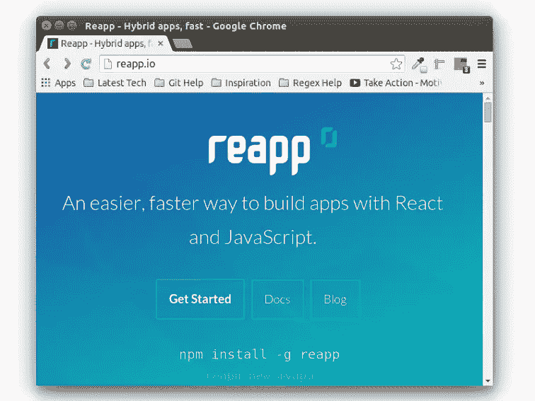
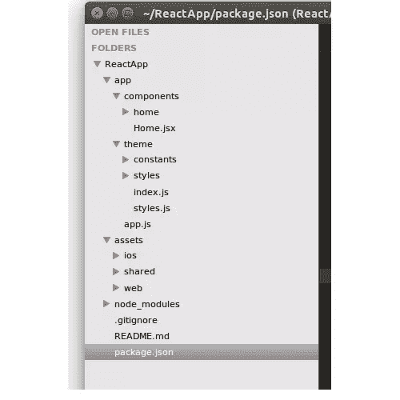
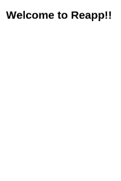
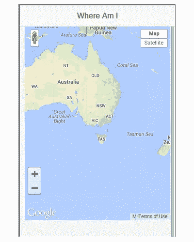
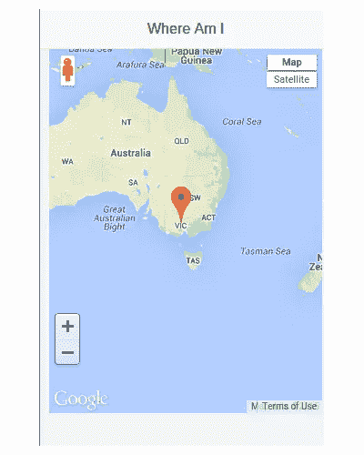
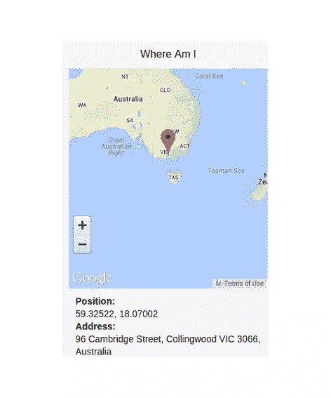
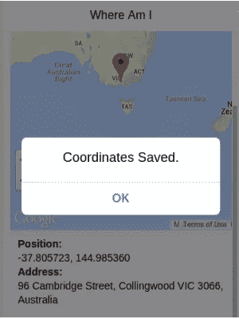

# 使用重新评估创建移动应用程序

> 原文：<https://www.sitepoint.com/creating-mobile-application-reapp/>

*本帖于 2016 年 5 月更新，以反映 React 和 Reapp 的变化。*

[React](http://facebook.github.io/react/) 是一个专注于构建用户界面的 JavaScript 库。它越来越受欢迎，部分是因为它是由脸书创建、使用和维护的。

## 为什么要反应？

React 致力于“虚拟 DOM”的概念，这使得它不同于其他 JS 库。当发生变化时，它更新虚拟 DOM，而不是更新实际的 DOM。当虚拟 DOM 发生变化时，它只进行一次更新，避免频繁更新 DOM。

从[官方网站](http://facebook.github.io/react/)，

> React 从你那里抽象出了 DOM，提供了一个更简单的编程模型和更好的性能。React 还可以使用 Node 在服务器上进行渲染，并且它可以使用 React Native 支持本机应用程序。

## 介绍重新任命

[re prep](https://reapp.io/)是一个创建移动应用的平台。它提供了一个 UI 组件包，为创建移动应用程序进行了优化和定制。



## 你会创造什么

在本教程中，您将学习如何使用 re phan 创建移动应用程序。该应用程序将帮助用户利用谷歌地图 API 保存不同的位置。它将使用 [Firebase](https://www.firebase.com/) 作为后端来保存数据。

本教程的源代码可以在 [GitHub](https://github.com/sitepoint-editors/ReactApp) 获得。

## 入门指南

从安装`reapp`开始，创建一个名为 *ReactApp* 的项目。

```
npm install -g reapp
reapp new ReactApp 
```

打开项目目录，运行 reapp，app 应该在 *[运行 http://localhost:3010](http://localhost:3010)* 。

```
cd ReactApp && reapp run 
```

下面是最终的项目结构。



项目目录里面是 *app* 文件夹，里面包含了 *app.js* 文件。 *app.js* 文件为应用程序定义了不同的路径。*组件*文件夹包含请求特定路线时呈现的不同组件。

### 创建视图

首先从 *components/home* 文件夹中删除 *sub.jsx* 文件。打开 *home.jsx* ，移除现有代码，从头开始，了解事情是如何运作的。您将创建一个名为`Home`的 react 类来呈现组件。

```
import { Reapp, React, View} from 'reapp-kit';

var Home = React.createClass({
  render: function() {
    return (
      <h1>Welcome to Reapp!!</h1>
    );
  }
});

export default Reapp(Home); 
```

render 函数返回要显示的视图。接下来更新 *app.js* 文件中的路线。

```
import './theme';
import { router, route } from 'reapp-kit';

router(require,
  route('home', '/')
); 
```

保存更改并重新启动服务器。在您的浏览器中打开*[http://localhost:3010](http://localhost:3010)*，您应该会看到默认视图。我推荐在 chrome 开发者工具中启用设备仿真的[，将该应用作为移动应用来查看。](https://developer.chrome.com/devtools/docs/device-mode)



接下来，您将把谷歌地图集成到视图中。通过修改 *home.jsx* 为应用程序添加一个标题，以返回 render 函数内部的视图。

```
<View title="Where Am I">

</View> 
```

通过向 *assets/web/index.html* 页面添加 google maps API 引用，创建一个新的地图组件来显示 Google maps。

```
<script src="https://maps.googleapis.com/maps/api/js?v=3.exp"></script> 
```

在 *home.jsx* 中，创建一个新的 React 组件，它将显示 Google 地图。

```
var MapView = React.createClass({

    render: function() {
        return (
            <div id="map"><span>Map Would be Here !!</span></div>
        );
    }
}); 
```

将`MapView`组件添加到主视图。

```
<View title="Where Am I">
    <MapView />
</View> 
```

将以下样式添加到 *assets/web/index.html* 中。

```
<style>
#map {
  width: 100%;
  height: 400px;
  margin: 0px;
  padding: 0px;
}
</style> 
```

保存更改并重新启动服务器。您应该会看到文本“地图应该在这里！!"在你的应用程序屏幕上。

### 添加谷歌地图

您已经看到了如何嵌套 react 组件，所以接下来您将移除`MapView`渲染函数中的`span`,并将其替换为实际的贴图。一旦组件安装完毕，它将创建谷歌地图并在`#map` div 中呈现。

您将使用`componentWillMount`生命周期方法编写谷歌地图代码。在`MapView`组件中添加`componentWillMount`方法。

```
componentDidMount: function() {
    // Code will be here
}, 
```

在`componentDidMount`里面定义一个默认的地图位置，地图选项和创建地图。

```
var sitepoint = new google.maps.LatLng(-37.805723, 144.985360);

var mapOptions = {
        zoom: 3,
        center: sitepoint
    },
    map = new google.maps.Map(ReactDOM.findDOMNode(this), mapOptions);

   this.setState({
       map: map
   }); 
```

要使用`ReactDOM.findDOMNode`,您将需要`react-dom`,所以在开始的`import`语句后添加这个。

```
var ReactDOM = require('react-dom') 
```

在这段代码中，`ReactDOM.findDOMNode`获取对组件的 DOM 节点元素的引用，`setState`触发 UI 更新。保存更改并重新启动服务器。如果一切正常，您应该能够查看地图。



现在给谷歌地图添加一个标记。您将为标记设置几个选项，如`animation`和`draggable`。

```
marker = new google.maps.Marker({
     map:map,
     draggable:true,
     animation: google.maps.Animation.DROP,
     position: sitepoint
}); 
```

以下是完整的`MapView`组件:

```
var MapView = React.createClass({

    componentDidMount: function() {

      var sitepoint = new google.maps.LatLng(-37.805723, 144.985360);

      var mapOptions = {
              zoom: 3,
              center: sitepoint
          },
          map = new google.maps.Map(ReactDOM.findDOMNode(this), mapOptions);
          marker = new google.maps.Marker({
           map:map,
           draggable:true,
           animation: google.maps.Animation.DROP,
           position: sitepoint
      });

      this.setState({
        map: map
      });
    },

    render: function() {
        return (
            <div id="map"><span>Map Would be Here !!</span></div>
        );
    }
}); 
```

保存更改，重启服务器，你应该有一个带标记的地图。



### 添加职位信息

当用户拖动标记时，位置信息应该显示。要实现这一点，在`Home`组件中添加所需的 HTML。更改渲染函数代码，如下所示:

```
render: function() {
    return (
      <View title="Where Am I">

        <MapView />

        <div style={{width:100 + '%',height:100 + 'px',margin: 0 + ' auto',padding:10 + 'px'}} id="infoPanel">

            <div>
              <span><b>Position:</b></span>
              <span  id="info"></span>
            </div>

            <div>
              <span><b>Address:</b></span>
              <span  id="address"></span>
            </div>

        </div>
      </View>
    );
  } 
```

接下来，您需要硬编码默认位置(纬度和经度)和地址。在初始化`componentDidMount`方法中的`sitepoint`变量后添加这一行:

```
document.getElementById('info').innerHTML = '-37.805723, 144.985360'; 
```

要显示地址，您将使用[谷歌地图地理编码器](https://developers.google.com/maps/documentation/geocoding/)。

```
geocoder.geocode({
    latLng: marker.getPosition()
}, function(responses) {
    if (responses && responses.length > 0) {
        document.getElementById('address').innerHTML = responses[0].formatted_address;
    }
}); 
```

以下是当前的`MapView`组件:

```
var MapView = React.createClass({

    componentDidMount: function() {

      var geocoder = new google.maps.Geocoder();
      var sitepoint = new google.maps.LatLng(-37.805723, 144.985360);

      document.getElementById('info').innerHTML = '-37.805723, 144.985360';

      var mapOptions = {
              zoom: 3,
              center: sitepoint
          },
          map = new google.maps.Map(ReactDOM.findDOMNode(this), mapOptions),
          marker = new google.maps.Marker({
           map:map,
           draggable:true,
           animation: google.maps.Animation.DROP,
           position: sitepoint
      });

      geocoder.geocode({
        latLng: marker.getPosition()
      }, function(responses) {
        if (responses && responses.length > 0) {
            document.getElementById('address').innerHTML = responses[0].formatted_address;
        }
      });

      this.setState({
        map: map
      });
    },

    render: function() {
        return (
            <div id="map"><span>Map Would be Here !!</span></div>
        );
    }
}); 
```

保存更改，重新启动服务器，你应该有默认的位置和地址显示在应用程序中。



现在添加一个`dragend`事件监听器，以便在拖动标记时更新位置和地址。在`dragend`回调函数中，获取标记位置和地址，并用值更新`address`和`info`元素。

```
google.maps.event.addListener(marker, 'dragend', function(e) {

    var obj = marker.getPosition();
    document.getElementById('info').innerHTML = e.latLng;

    map.panTo(marker.getPosition());

    geocoder.geocode({
        latLng: obj
    }, function(responses) {

        if (responses && responses.length > 0) {
            document.getElementById('address').innerHTML = responses[0].formatted_address;
        }

    });
}); 
```

保存更改并重新启动服务器。现在，当拖动标记时，信息会在拖动结束时更新。

### 将信息保存到 Firebase

接下来添加一个按钮来保存坐标到[火基](https://www.firebase.com/)。首先将`reapp-ui`添加到项目中。

```
npm install reapp-ui@0.12.47 
```

将按钮组件导入到 *Home.jsx* 中。

```
import Button from 'reapp-ui/components/Button'; 
```

将按钮添加到 Home 组件，在`<View>`组件的底部。点击`Save`按钮，会有一个功能将坐标保存到 Firebase。

```
<Button onTap={this.savePosition}>Save </Button> 
```

向 Firebase 注册一个免费帐户，以使用该应用程序中的服务。一旦注册，你应该有一个 Firebase 网址使用，这里是我的 Firebase 网址:

```
https://blistering-heat-2473.firebaseio.com 
```

登录到您的 firebase 帐户，并单击仪表板中显示的 Firebase URL 上的*加*图标，创建一个 URL，例如:

```
https://blistering-heat-2473.firebaseio.com/Position 
```

并使用该 URL 来保存位置信息。

在 *assets/web/index.html* 页面中包含对 Firebase 的引用。

```
<script src="https://cdn.firebase.com/js/client/2.0.4/firebase.js"></script> 
```

接下来，在`Home`组件中定义`savePosition`函数，在点击保存按钮时调用。

```
savePosition: function() {
    var wishRef = new Firebase('https://blistering-heat-2473.firebaseio.com/Position');
    var pos = document.getElementById('info').innerHTML;

    var address = document.getElementById('address').innerHTML;
    wishRef.push({
        'Position': pos,
        'Address': address
    });
}, 
```

这将使用 Firebase URL 创建一个 Firebase 对象，并使用 [push API 函数](https://www.firebase.com/docs/web/api/firebase/push.html)将数据推送到 Firebase。

保存更改并重新启动服务器。在地图上找到一个位置，然后单击保存。检查 firebase，数据应该被保存。

让我们添加一个警告来通知用户数据已经保存。这将使用模态组件，因此将模态导入到 *Home.jsx* 中。

```
import Modal from 'reapp-ui/components/Modal'; 
```

在主视图组件的渲染函数中，在`<MapView />`上方添加以下模态代码

```
{this.state.modal &&
          <Modal
            title="Coordinates Saved."
            onClose={() => this.setState({ modal: false })}>
          </Modal>
        } 
```

这将在`state.modal`为真时可见，所以当应用程序使用`getInitialState`方法加载时，将`state.modal`初始化为假。在`Home`组件内部定义了`getInitialState`。

```
getInitialState: function() {
    return {
      modal: false
    };
  } 
```

在`savePosition`方法中，将数据推送到 firebase 后，将`state.modal`设置为 true 以显示模态。

```
this.setState({ modal: true }); 
```

保存更改并重新启动服务器。一旦应用程序加载完毕，点击*保存*按钮保存数据，您应该会看到弹出的模式。



### 结论

在本教程中，您学习了如何使用 ReactJS、Reapp 和 Firebase 创建移动应用程序。您创建了一个应用程序，将在 Google 地图上选择的地图坐标保存到 Firebase。

我希望这篇教程可以作为使用 ReactJS 创建移动应用程序的良好起点。让我知道你使用 React 和 re phase 的想法和体验，以及你认为它们与其他移动 JavaScript 框架相比如何。

## 分享这篇文章