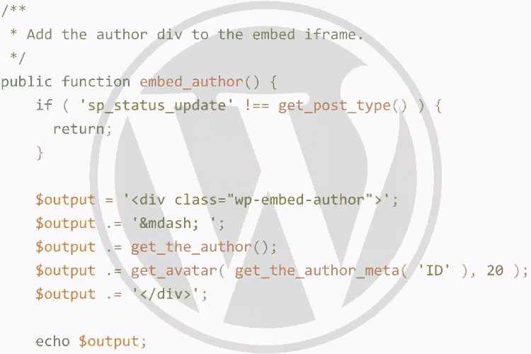

# 定制 WordPress oEmbed 内容

> 原文：<https://www.sitepoint.com/customizing-wordpress-oembed-content/>

WordPress 使得嵌入内容变得非常容易。例如，你可以抓取一个 YouTube 网址，放入帖子编辑器，然后自动看到你的帖子中嵌入的视频。这都是由 [oEmbed](http://oembed.com/) 支持的，这是一个关于页面应该如何提供嵌入代码数据的开放标准。

WordPress 依靠这个标准来获取和显示提供的 URL。虽然 WordPress 长期以来一直能够消费 YouTube 等 oEmbed 提供商，但随着 [WordPress 4.4](https://codex.wordpress.org/Version_4.4) 中包含了 [WP-API](http://v2.wp-api.org/) ，WordPress 现在可以作为 oEmbed 提供商。这意味着其他网站可以把你的 WordPress 内容嵌入到他们的网站上，就像你现在可以像上面例子中提到的那样嵌入视频一样容易。

新的 oEmbed provider 功能利用 WP-API 向 oEmbed 消费者返回 JSON 或 XML 结构化嵌入数据，为他们提供自己嵌入页面所需的信息。像 WordPress 中的所有东西一样，oEmbed provider 的功能可以通过[动作](https://codex.wordpress.org/Plugin_API/Action_Reference)和[过滤器](https://codex.wordpress.org/Plugin_API/Filter_Reference)轻松修改。让我们看看如何使用这些钩子来嵌入一个定制的文章类型。



## 我们将会建造什么

我们将构建一个简单的插件，“状态更新”，它注册一个自定义的文章类型(CPT)，`status-update`。这个 CPT 只是删除了帖子编辑器中的标题输入，使其功能类似于脸书或 Twitter 状态更新。我们将定制这篇文章的 oEmbed 输出，以显示用户的姓名和头像。你可以在这个 [GitHub 回购](https://github.com/mAAdhaTTah/sitepoint-status-update)中看到最终产品。

## 设置插件

进入你在`wp-content`中的`plugins`文件夹，创建一个名为`sp-status-update`的文件夹。在该目录中，创建一个名为`sp-status-update.php`的文件。这是我们创建插件主类的地方。将插件头添加到文件的顶部:

```
/**
 * Plugin Name: Status Update
 * Plugin URI:  https://github.com/mAAdhaTTah/sitepoint-status-update
 * Description: Post your own Facebook-like status updates
 * Version:     1.0.0
 * Author:      James DiGioia for SitePoint
 * Author URI:  http://jamesdigioia.com
 * Text Domain: wp-status-update
 * Languages:   /languages
 */ 
```

然后，我们将设置主插件单例，我们将在其上构建我们的插件:

```
class SP_Status_Update {

    /**
     * Plugin instance.
     *
     * @var static
     */
    protected static $instance;

    /**
     * Retrieve the plugin instance.
     *
     * @return static
     */
    public static instance() {
        if (null === static::$instance) {
            static::$instance = new static;
        }

        return static::$instance;
    }

    /**
     * Plugin constructor.
     */
    protected function __construct() {
        // Add actions/filters here
    }
} 
```

最后，我们需要启动文件底部的插件:

```
SP_Status_Update::instance(); 
```

我们将在构造函数中添加钩子和过滤器，如注释中所述。

## 注册自定义帖子类型

使用优秀的 [GenerateWP](https://generatewp.com) ，我们可以很容易地定制和注册我们的定制帖子类型。向 WordPress 注册该方法:

```
 add_action( 'init', array( $this, 'register_post_type' ), 0 );
```

并将注册方法添加到您的类中:

```
 /**
     * Register the Status Update custom post type.
     */
public function register_post_type() {
    $labels = array(
        'name'                  => _x( 'Status Updates', 'Post Type General Name', 'sp-status-update' ),
        'singular_name'         => _x( 'Status Update', 'Post Type Singular Name', 'sp-status-update' ),
        'menu_name'             => __( 'Status Update', 'sp-status-update' ),
        'name_admin_bar'        => __( 'Status Update', 'sp-status-update' ),
        'archives'              => __( 'Satus Update Archives', 'sp-status-update' ),
        'parent_item_colon'     => __( 'Parent Update:', 'sp-status-update' ),
        'all_items'             => __( 'All Updates', 'sp-status-update' ),
        'add_new_item'          => __( 'Add New Status Update', 'sp-status-update' ),
        'add_new'               => __( 'Add New', 'sp-status-update' ),
        'new_item'              => __( 'New Status Update', 'sp-status-update' ),
        'edit_item'             => __( 'Edit Status Update', 'sp-status-update' ),
        'update_item'           => __( 'Update Status Update', 'sp-status-update' ),
        'view_item'             => __( 'View Status Update', 'sp-status-update' ),
        'search_items'          => __( 'Search Status Updates', 'sp-status-update' ),
        'not_found'             => __( 'Not found', 'sp-status-update' ),
        'not_found_in_trash'    => __( 'Not found in Trash', 'sp-status-update' ),
        'featured_image'        => __( 'Featured Image', 'sp-status-update' ),
        'set_featured_image'    => __( 'Set featured image', 'sp-status-update' ),
        'remove_featured_image' => __( 'Remove featured image', 'sp-status-update' ),
        'use_featured_image'    => __( 'Use as featured image', 'sp-status-update' ),
        'insert_into_item'      => __( 'Insert into Status Update', 'sp-status-update' ),
        'uploaded_to_this_item' => __( 'Uploaded to this Status Update', 'sp-status-update' ),
        'items_list'            => __( 'Status Updates list', 'sp-status-update' ),
        'items_list_navigation' => __( 'Status Updates list navigation', 'sp-status-update' ),
        'filter_items_list'     => __( 'Filter Status Updates list', 'sp-status-update' ),
    );
    $args = array(
        'label'                 => __( 'Status Update', 'sp-status-update' ),
        'description'           => __( 'Simple Status Update', 'sp-status-update' ),
        'labels'                => $labels,
        'supports'              => array( 'editor', 'author', ),
        'hierarchical'          => false,
        'public'                => true,
        'show_ui'               => true,
        'show_in_menu'          => true,
        'menu_position'         => 5,
        'show_in_admin_bar'     => true,
        'show_in_nav_menus'     => true,
        'can_export'            => true,
        'has_archive'           => true,
        'exclude_from_search'   => false,
        'publicly_queryable'    => true,
        'capability_type'       => 'page',
    );
    register_post_type( 'sp_status_update', $args );
} 
```

现在，我们准备开始定制我们的 oEmbed 输出！

## 开始之前:oEmbed 如何工作

当您将一个链接放入 TinyMCE 编辑器时，它如何知道如何将该 URL 实时嵌入到您的编辑器中？

第一步是发现。oEmbed 要求提供商“通过将元素添加到其现有(X)HTML 文档的头部，使其 oEmbed 支持可被发现。”。这些元素将 oEmbed 消费者指引到 API 端点，然后 API 端点提供嵌入帖子的结构化表示。oEmbed 支持 JSON 和 XML 两种格式。

WordPress 包括元素和对两种格式的支持。在`wp_head`上注册的函数`[wp_oembed_add_discovery_links]`负责包含适当的`<head>`标签，并且可以使用`oembed_discovery_links`过滤器进行定制。

从那里，编辑器从 API 端点获取结构化版本。JSON 响应如下所示:

```
{
  "version": "1.0",
  "provider_name": "Website Name",
  "provider_url": "http://example.com",
  "author_name": "admin",
  "author_url": "http://example.com/author/admin/",
  "title": "",
  "type": "rich",
  "width": 600,
  "height": 338,
  "html": "long string of html"
} 
```

XML 响应的结构是相同的，WordPress 对两者都提供了支持。它利用 WP-API 来提供 JSON 和 XML 格式的响应，尽管 XML 响应需要特殊处理。

编辑器使用这个响应，净化`html`键并将其注入页面。在 WordPress 中，oEmbed HTML 包含一个带有文章标题的`blockquote`，一个用于安全正确处理`iframe`消息的`<script>`标签，以及一个沙箱`iframe`。这个 HTML 可以用`[get_post_embed_html]`获取，用`embed_html`过滤。

URL 是所有奇迹发生的地方。默认情况下，它会导入内置的嵌入模板，但是您可以完全覆盖它并使用您自己的嵌入模板。使用`embed_template`过滤器并返回您自己的模板文件来完全替换它:

```
add_filter( 'embed_template', 'my_embed_template' );
function my_embed_template( $template ) {
    if ( 'custom_post_type' === get_post_type() ) {
      return '/path/to/custom-embed-template.php';
    }

    return $template;
} 
```

在大多数情况下，您不需要定制上述任何过滤器，但最好熟悉 oEmbed provider 的内部结构，以便更有效地利用它。如果你需要那种力量，它就在那里。我们将使用钩子和过滤器来修改内置模板。

## 自定义 oEmbed 标题

由于插件正在嵌入状态更新，我们应该做的第一件事是从 oEmbed 的输出中删除标题。为此，我们需要连接到`the_title`过滤器:

```
add_filter( 'the_title', array( $this, 'remove_embed_title' ), 10, 2 ); 
```

在`remove_embed_title`中，我们将遇到提供的第一个助手函数:`is_embed`。当我们在 oEmbed 上下文中时，这个函数返回`true`,我们可以用它来定制 oEmbed 输出。

下面是我们删除标题的方法:

```
/**
 * Remove the title from the Status Update oembed.
 *
 * @param string $title Post title.
 * @param int    $id Post ID.
 *
 * @return string
 */
public function remove_embed_title( $title, $id ) {
    $post = get_post( $id );

    if ( is_embed() && 'sp_status_update' === $post->post_type ) {
      return '';
    }

    return $title;
} 
```

这可确保仅在 oEmbed 中删除标题。现在，如果我们以更完整的方式构建这个插件，我们可能不需要包含`is_oembed`检查，因为您可能会在任何地方都删除它，但这演示了我们如何定位和定制 oEmbed 标题输出。

## 自定义 oEmbed 摘录

因为状态更新应该是小块的文字，我们不想显示摘录，而是整个帖子。我们可以通过过滤`the_excerpt_embed`钩子来修改摘录的内容:

```
add_filter( 'the_excerpt_embed', array( $this, 'get_excerpt_embed' ) ); 
```

然后我们检查当前的文章类型是否是我们的自定义文章类型，如果是，我们返回完整的内容输出:

```
/**
 * Returns the custom excerpt for the custom post type.
 *
 * @param  string $output Default embed output.
 * @return string         Customize embed output.
 */
public function get_excerpt_embed( $output ) {
    if ( 'sp_status_update' === get_post_type() ) {
      return get_the_content();
    }

    return $output;
} 
```

这确保了摘录始终是状态更新的完整帖子内容。在 iframe 中，该摘录输出到带有类`wp-embed-excerpt`的`div`中，您可以对其应用自定义样式。如果您想做一些更复杂的事情，比如一个日历事件，您可以在那个`div`中输出您的定制内容，或者您可以用`embed_content`动作添加您自己的内容。

## 向 oEmbed 添加额外内容

`oembed_content`动作在摘录输出后立即触发，在摘录和页脚之间提供一个位置来输出您自己的定制 HTML。对于状态更新插件，我们将使用它来输出作者的名字和头像。首先，我们添加动作:

```
add_action( 'embed_content', array( $this, 'embed_author' ) ); 
```

我们可以使用这个操作挂钩来回显我们的自定义 HTML:

```
/**
 * Add the author div to the embed iframe.
 */
public function embed_author() {
    if ( 'sp_status_update' !== get_post_type() ) {
      return;
    }

    $output = '<div class="wp-embed-author">';
    $output .= '&mdash; ';
    $output .= get_the_author();
    $output .= get_avatar( get_the_author_meta( 'ID' ), 20 );
    $output .= '</div>';

    echo $output;
} 
```

我们有一个简单的 emdash、作者姓名和作者的头像。同样，如果您需要更广泛的定制，这个动作提供了一个输出任何额外的定制 HTML 的机会。

## 向 oEmbed 添加自定义样式和脚本

与标准模板页面一样，oEmbed 模板也有页眉和页脚。钩子`embed_head`给了你一个位置来将你自己的样式放入模板的`head`中。像我们一样，把你的方法挂在钩子上:

```
add_action( 'embed_head', array( $this, 'embed_styles' ) ); 
```

我们可以使用这个钩子通过标准的`wp_enqueue_style`函数将我们自己的样式排队，或者如果我们没有太多的样式要包含，我们可以直接在头中回显它:

```
/**
 * Embed the plugin's custom styles
 */
public function embed_styles() {
    echo <<<CSS
<style>
  .wp-embed-excerpt, .wp-embed-author {
    font-size: 24px;
    line-height: 24px;
    margin-bottom: 5px;
  }

  .wp-embed-author {
    float: right;
  }
</style>
CSS;
} 
```

在 JavaScript 方面，我们可以使用`embed_footer`动作做同样的事情，包括使用`wp_enqueue_script`函数将新的 JavaScript 文件排队，或者直接内联输出任何定制的 JavaScript。

## 结论

为了将输出转换为您的偏好，您需要与这些主要挂钩进行交互。本教程中的所有代码都可以在 [GitHub repo](https://github.com/mAAdhaTTah/sitepoint-status-update) 中找到。

如果您想看到这些定制的运行，请关注下一个版本的 [WP-Gistpen](https://github.com/mAAdhaTTah/WP-Gistpen) ，它将利用 WordPress oEmbed provider 来嵌入语法突出显示的代码片段。

你打算如何使用 WordPress 中的 oEmbed provider 功能？请在评论中告诉我！

## 分享这篇文章