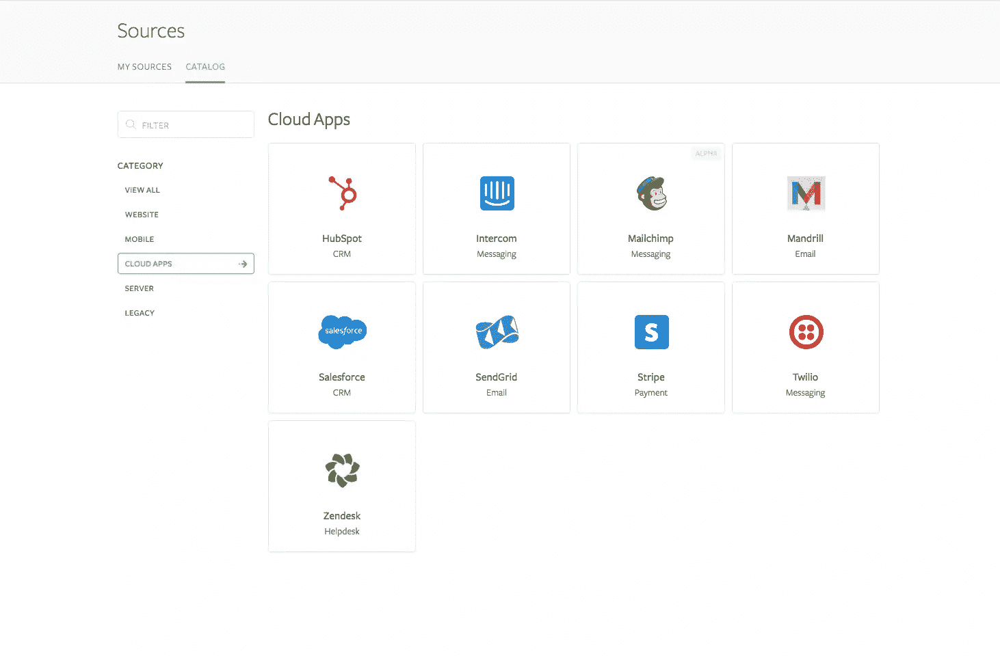
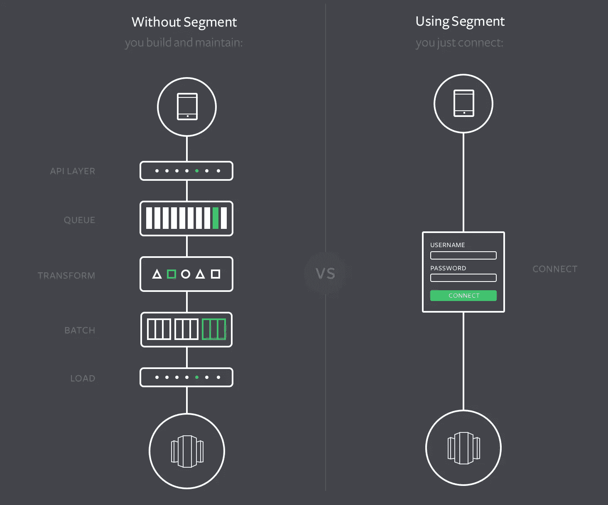
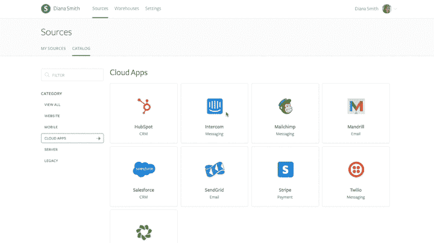

# 分段使您的数据播放更好

> 原文：<https://www.sitepoint.com/segment-makes-your-data-play-nice/>

*本文由[栏目](http://synd.co/1WQwdb2)赞助。感谢您对使 SitePoint 成为可能的赞助商的支持。*

先说数据。每个人都知道数据是一个美丽的东西，分析数据可以让您做出明智的决策，以最有效地服务客户、增加收入和发展业务。

但是很有可能你的大部分数据都是害羞的。它不喜欢玩其他数据。

您已经从 Salesforce、Zendesk、Stripe、SendGrid 和许多其他服务中获得了数据。虽然这些应用程序中的每一个都可能提供不错的现成报告，但当数据被孤立在 8 个不同的应用程序中时，很难清楚、完整地了解客户如何与您的品牌互动。你无法清楚地了解销售转化和产品使用之间的关系，或者你的电子邮件营销努力和你的客户服务互动之间的关系。你无法全面了解你的企业正在发生什么。

[细分来源](http://synd.co/1WQwdb2)让您能够解决长期存在的数据孤岛问题。它允许您从大量不同的来源提取数据，将这些数据集成到一个仓库中，然后使用 BI 工具查看这些数据的详细分析。

这个解决方案非常简单，可以节省你几个月的时间和精力。如果没有细分源代码，您将需要构建和维护 API 层、队列、转换、批处理和加载流程。您将不得不浏览各种系统和数据结构的特性，并且当某些东西改变时，您不得不手动更新所有的东西。工程师们更愿意致力于产品。分析师宁愿探索数据，也不愿争论数据。

有了[片段源](http://synd.co/1WQwdb2)，你只需简单点击几下，就能连接你所有的数据。绝对零编码要求。只需输入您的 API 密钥和您的启动和运行！

Trunk Club、New Relic、Product Hunt 和 Instacart 等公司正在使用细分来源来整合来自 Salesforce、Intercom、Stripe、Zendesk、Twilio 和 HubSpot 等应用程序的数据。

如果您没有数据仓库，Segment 可以为您托管和管理一个。此外，细分市场合作伙伴还为常见使用情形预先构建了控制面板。

使用完全托管的模式，当您跟踪事件时，Segment 将自动添加新的行和表，并且使用压缩数据类型来保持您的集群较小和您的查询较快。

越来越多的企业开始认识到，电子邮件和支持渠道中的互动会影响客户的长期参与、保留和收入。细分来源使您能够从头到尾监控和分析您的整个客户体验。您可以在一个有组织的位置查看所有数据，而不必花费数小时来比较各种应用程序的报告。

细分市场每月为数以千计的客户处理超过 500 亿个 API 调用，因此细分市场是按规模构建的。

细分来源的定价极具竞争力，从免费账户开始。

您的业务中有大量可用的数据。问题是，你真的能以一种能让你对自己的业务做出明智决策的方式来阅读它吗？[段](http://synd.co/1WQwdb2)让你做到这一点。

## 分享这篇文章