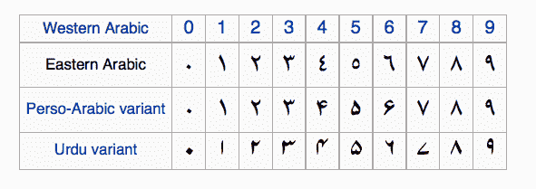

# 本地化揭秘:面向所有人的 Php-Intl

> 原文：<https://www.sitepoint.com/localization-demystified-understanding-php-intl/>


大多数应用程序执行区域感知操作，如处理文本、日期、时区等。PHP Intl 扩展提供了一个很好的 API 来访问广为人知的 T2 ICU T3 库的函数。

## 装置

该扩展默认安装在 PHP 5.3 和更高版本上。您可以通过运行以下命令来查找它:

```
php -m | grep 'intl' 
```

如果扩展不存在，您可以按照[安装指南](http://php.net/manual/en/intl.installation.php)手动安装。如果你使用的是 Ubuntu，你可以直接运行下面的命令。

```
sudo apt-get update
sudo apt-get install php5-intl 
```

如果你在你的机器上使用 PHP7，你需要添加(`ppa:ondrej/php` ) PPA，更新你的系统并安装 Intl 扩展。

```
# Add PPA
sudo add-apt-repository ppa:ondrej/php-7.0
# Update repository index
sudo apt-get update
# install extension
sudo apt-get install php7.0-intl 
```

## 消息格式

大多数现代应用程序在构建时都考虑到了本地化。有时，消息是带有可变占位符的普通字符串，有时是复杂的复数字符串。

#### 简单消息

我们将从一个包含占位符的简单消息开始。占位符是用花括号括起来的模式。这里有一个例子:

```
var_dump(
    MessageFormatter::formatMessage(
        "en_US",
        "I have {0, number, integer} apples.",
        [ 3 ]
    )
); 
```

```
// output

string(16) "I have 3 apples." 
```

传递给`MessageFormatter::formatMessage`方法的参数是:

*   消息区域设置。
*   字符串消息。
*   占位符数据。

`{0, number, integer}`占位符将把数据数组的第一项作为`number`–`integer`注入(选项列表见下表)。我们也可以为占位符使用命名参数。下面的示例将输出相同的结果。

```
var_dump(
    MessageFormatter::formatMessage(
        "en_US",
        "I have {number_apples, number, integer} apples.",
        [ 'number_apples' => 3 ]
    )
); 
```

不同的语言有不同的数字系统，如阿拉伯语的[、T2 语的](https://en.wikipedia.org/wiki/Eastern_Arabic_numerals)、印度语的等。



前面的例子是针对`en_US`地区的。我们改成`ar`看看区别。

```
var_dump(
    MessageFormatter::formatMessage(
        "ar",
        "I have {number_apples, number, integer} apples.",
        [ 'number_apples' => 3 ]
    )
); 
```

```
string(17) "I have ٣ apples." 
```

我们也可以将其更改为孟加拉语地区(`bn`)。

```
var_dump(
    MessageFormatter::formatMessage(
        "bn",
        "I have {number_apples, number, integer} apples.",
        [ 'number_apples' => 3 ]
    )
); 
```

```
string(18) "I have ৩ apples." 
```

到目前为止，我们只和数字打交道。让我们看看我们可以使用的其他类型。

```
$time = time();
var_dump( MessageFormatter::formatMessage(
    "en_US",
    "Today is {0, date, full} - {0, time}",
    array( $time )
) ); 
```

```
string(47) "Today is Wednesday, April 6, 2016 - 11:21:47 PM" 
```

```
var_dump( MessageFormatter::formatMessage(
    "en_US",
    "duration: {0, duration}",
    array( $time )
) ); 
```

```
string(23) "duration: 405,551:27:58" 
```

我们也可以拼出通过的数字。

```
var_dump( MessageFormatter::formatMessage(
    "en_US",
    "I have {0, spellout} apples",
    array( 34 )
) ); 
```

```
string(25) "I have thirty-four apples" 
```

它也适用于不同的地区。这是一个使用阿拉伯语的例子。

```
var_dump( MessageFormatter::formatMessage(
    "ar",
    "لدي {0, spellout} تفاحة",
    array( 34 )
) ); 
```

```
string(44) "لدي أربعة و ثلاثون تفاحة" 
```

| argType | 艺术风格 |
| --- | --- |
| 数字 | 整数、货币、百分比 |
| 日期 | 短、中、长、满 |
| 时间 | 短、中、长、满 |
| 拼出 | 短、中、长、满 |
| 序数 |
| 期间 |

#### 多元化

本地化我们的应用程序的一个重要部分是管理多个消息，使我们的 UI 尽可能直观。上面的苹果例子就可以了。这种情况下的消息应该是这样的。

*   我没有苹果。
*   我有一个苹果。
*   (`number_apples` > 1):我有 X 个苹果。

```
var_dump( MessageFormatter::formatMessage(
    "en_US",
    'I have {number_apples, plural, =0{no apples} =1{one apple} other{# apples}}',
    array('number_apples' => 10)
) ); 
```

```
// number_apples = 0
string(16) "I have no apples"

// number_apples = 1
string(16) "I have one apple"

// number_apples = 10
string(16) "I have 10 apples" 
```

语法非常简单，大多数多元化包都采用这种语法。查看[文档](http://icu-project.org/apiref/icu4j/com/ibm/icu/text/PluralFormat.html)了解更多详情。

```
{data, plural, offsetValue =value{message}... other{message}} 
```

*   `data`:价值指数。
*   `plural` : argType。
*   `offsetValue`:偏置值可选(`offset:value`)。它从值中减去偏移量。
*   `=value{message}`:测试相等性的值，以及花括号之间的消息。我们可以多次重复这个部分(`=0{no apples} =1{one apple} =2{two apple}`)。
*   `other{message}`:默认情况，就像在`switch - case`语句中一样。`#`字符可用于注入`data`值。

#### 选择

在某些情况下，我们需要为每个范围打印不同的消息。下面的例子就是这样做的。

```
var_dump( MessageFormatter::formatMessage(
    "en_US",
    'The value of {0,number} is {0, choice,
                                        0 # between 0 and 19 |
                                        20 # between 20 and 39 |
                                        40 # between 40 and 59 |
                                        60 # between 60 and 79 |
                                        80 # between 80 and 100 |
                                        100 < more than 100 }',
    array(60)
) ); 
```

```
string(38) "The value of 60 is between 60 and 79 " 
```

本例中的`argType`设置为`choice`，语法格式如下:

```
{value, choice, choiceStyle} 
```

来自 ICU 文件的官方定义是:

```
choiceStyle = number separator message ('|' number separator message)*

number = normal_number | ['-']  ∞ (U+221E, infinity)
normal_number = double value (unlocalized ASCII string)

separator = less_than | less_than_or_equal
less_than = '<'
less_than_or_equal = '#' |  ≤ (U+2264) 
```

*注意* : ICU 开发者[不鼓励](http://userguide.icu-project.org/formatparse/messages#TOC-Complex-Argument-Types)使用选择型。

#### 挑选

有时我们需要类似于选择选项 UI 组件的东西。简档页面使用它来根据用户的性别等更新 UI 消息。这里有一个例子:

```
var_dump( MessageFormatter::formatMessage(
    "en_US",
    "{gender, select, ".
      "female {She has some apples} ".
      "male {He has some apples.}".
      "other {It has some apples.}".
    "}",
    array('gender' => 'female')
) ); 
```

```
string(19) "She has some apples" 
```

该模式定义如下:

```
{value, select, selectStyle}

// selectStyle
selectValue {message} (selectValue {message})* 
```

`message`参数可能包含其他模式，如选择和复数。下一部分将解释一个*复杂的*例子，其中我们组合了多个模式。查看 [ICU 文件](http://icu-project.org/apiref/icu4j/com/ibm/icu/text/SelectFormat.html)了解更多详情。

#### 复杂的案件

到目前为止，我们已经看到了一些简单的例子，如复数、select 等。有些情况比其他情况更复杂。ICU 文件有一个很好的例子来说明这一点。我们将一部分一部分地插入，以便更容易掌握。

```
var_dump( MessageFormatter::formatMessage(
    "en_US",
    "{gender_of_host, select, ".
      "female {She has a party} ".
      "male {He has some apples.}".
      "other {He has some apples.}".
    "}",
    array('gender_of_host' => 'female', "num_guests" => 5, 'host' => "Hanae", 'guest' => 'Younes' )
) ); 
```

这是我们之前使用的同一个例子，但是我们没有使用简单的消息，而是根据`num_guests`值对它进行了定制(这里说的是复数)。

```
var_dump( MessageFormatter::formatMessage(
    "en_US",
    "{gender_of_host, select, ".
      "female {".
        "{num_guests, plural, offset:1 ".
          "=0 {{host} does not have a party.}".
          "=1 {{host} invites {guest} to her party.}".
          "=2 {{host} invites {guest} and one other person to her party.}".
          "other {{host} invites {guest} and # other people to her party.}}}".
      "male {He has some apples.}".
      "other {He has some apples.}}",
    array('gender_of_host' => 'female', "num_guests" => 5, 'host' => "Hanae", 'guest' => 'Younes' )
) ); 
```

注意，我们使用`offset:1`从`num_guests`值中删除一个客人。

```
string(53) "Hanae invites Younes and 4 other people to her party." 
```

这是这个例子的完整片段。

```
var_dump( MessageFormatter::formatMessage(
    "en_US",
    "{gender_of_host, select, ".
      "female {".
        "{num_guests, plural, offset:1 ".
          "=0 {{host} does not have a party.}".
          "=1 {{host} invites {guest} to her party.}".
          "=2 {{host} invites {guest} and one other person to her party.}".
          "other {{host} invites {guest} and # other people to her party.}}}".
      "male {".
        "{num_guests, plural, offset:1 ".
          "=0 {{host} does not have a party.}".
          "=1 {{host} invites {guest} to his party.}".
          "=2 {{host} invites {guest} and one other person to his party.}".
          "other {{host} invites {guest} and # other people to his party.}}}".
      "other {".
        "{num_guests, plural, offset:1 ".
          "=0 {{host} does not have a party.}".
          "=1 {{host} invites {guest} to their party.}".
          "=2 {{host} invites {guest} and one other person to their party.}".
          "other {{host} invites {guest} and # other people to their party.}}}}",
    array('gender_of_host' => 'female', "num_guests" => 5, 'host' => "Hanae", 'guest' => 'Younes' )
) ); 
```

更改来宾数量以测试所有消息类型。

```
// num_guests = 2
string(55) "Hanae invites Younes and one other person to her party."

// num_guests = 1
string(34) "Hanae invites Younes to her party."

// num_guests = 0
string(28) "Hanae does not have a party." 
```

## 消息解析

关于解析消息没什么好说的；我们使用用于格式化的模式从输出消息中提取数据。

```
$messageFormater = new MessageFormatter("en_US", 'I have {0, number}');
var_dump( $messageFormater->parse("I have 10 apples") ); 
```

```
array(1) {
  [0]=>
  int(10)
} 
```

查看[文档](http://php.net/manual/en/messageformatter.parse.php)了解更多关于消息解析的细节。

## 结论

在这篇介绍性的文章中，我们学习了如何使用 PHP Intl 扩展来本地化我们的消息。下一部分将介绍数字和日期的格式，以及如何使用日历。如果你对我们到目前为止所涵盖的内容有任何问题，你可以在下面的评论中发表！

## 分享这篇文章