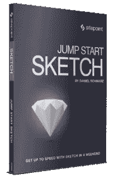
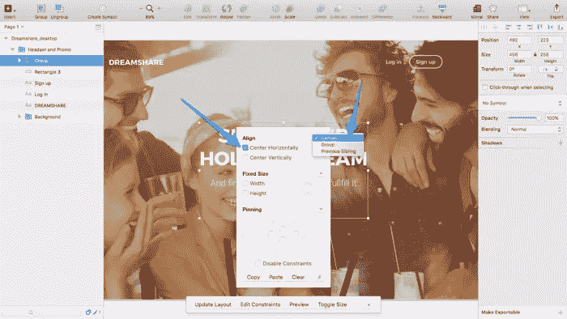
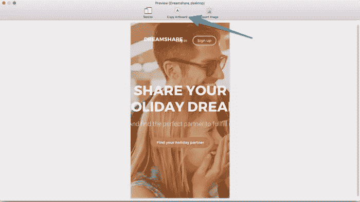

# 如何在草图中创建响应式布局(使用一滴流体)

> 原文：<https://www.sitepoint.com/how-to-create-responsive-layouts-in-sketch-using-fluid/>

 
**突发新闻**:如果你是一个素描迷，丹尼尔刚刚为 SitePoint 发布了他的第一本书。查看[跳跃启动草图](https://www.sitepoint.com/premium/books/jump-start-sketch)！

Sketch App 的一些最令人印象深刻的功能来自于开发人员的 Sketch 社区。JavaScript/Cocoa 开发人员可以利用 [Sketch 插件引擎](http://developer.sketchapp.com/)来扩展和增强使用 Sketch 的用户界面设计人员的工作流程——其中一个扩展是[流体插件](https://github.com/matt-curtis/Fluid-for-Sketch)，它为 Sketch 带来了响应设计功能的元素。

Fluid 与 Xcode 的“自动布局约束”功能非常相似，这有助于那些构建“通用应用程序”(设计用于 iPhone 和 iPad 的单一应用程序)的人做出相应的设计。Fluid 不是 Sketch 中响应式设计的完整解决方案–您不能添加/删除内容–但是，这些约束确实允许用户在调整画板大小时保持对象“对齐”或“固定”。

如果你不能完全理解移动优先的响应式设计方法，那么你一定会想看看我们的*如何为移动优先 UX* 视频(如下)，这是我们[移动 UX 大师课程](https://www.sitepoint.com/premium/courses/thinking-ux-2952)的一个核心方面。

让我们从安装流体开始。

## 安装液体

插件可以通过手动下载并放入正确的文件夹来安装，可以通过*插件→管理插件… →(点击 cog 图标)→显示插件文件夹*的草图菜单找到。否则，只需下载[草图工具箱](http://sketchtoolbox.com/)并在那里搜索/安装流体。

## 设置约束

在本教程中，我们将使用一个由 Dmitry Kustov 提供的免费. sketch，重点放在模板的桌面标题部分。下载免费赠品，在 Sketch 中打开，然后使用键盘快捷键 **command+option+3** 让图层列表和检查器界面消失——我们今天不会需要它们。

首先用 **control+shift+T** 打开流体工具栏。

### 将对象居中

按住 **shift** ，同时点击画板中央的四个图层(构成标题和行动号召的图层)，一次性选择所有图层——如果您需要点击任何*组*，也请按住**命令**。由于这四层将相互依赖，它们确实应该在它们自己的组中；使用**命令+G** 来完成。

现在从流体工具栏中选择“编辑约束”选项。

稍后，当我们调整画板大小时，我们希望这四个图层组始终保持水平居中，因此在“对齐”标题下，选中“水平居中”框。你还会注意到附近有一个下拉菜单；这些选项允许您指定对齐相对于什么，可以是相邻对象、*父*组或整个画布。

我们希望我们的组根据“画布”居中。

### 锁定对象

让我们对菜单中的项目重复这些步骤，只是这一次，我们将*固定*层，而不是对齐它们。我们不需要将徽标分组，因为它只由一层组成。返回到*编辑约束*模式，在“固定”选项卡下的顶部和左侧输入字段输入“50”。

本质上，这意味着图层将始终从画布的顶部和左侧偏移 50px。

您可能已经注意到，当您添加约束时，画板实际上不会发生变化，但不要担心，当我们使用流体的预览功能时，这些变化肯定会很明显。

接下来，从菜单的*右侧*选择三个图层，并将它们组合在一起(**命令+G** )。再次重复约束步骤，只是这次将 50px 偏移约束应用到画布的*顶部和右侧*，而不是顶部和左侧。

### 应用更改

就像我一分钟前说的，画板不会反映我们已经添加的约束，直到我们在流体工具栏中点击“预览”；毕竟，我们只想将约束应用于**较小的**设备。在任何情况下，如果您想查看画板中的更改，请单击流体工具栏中的“更新布局”。

如您所见，标题中的徽标和菜单项被“钉”在画布的边缘，模拟了 50px 的边距。按下 **command+Z** 撤销更改，因为我们实际上不希望我们的桌面版本反映这些约束。

### 设计流体宽度容器

在本教程中，我们不需要定义任何流体宽度的容器，但是为了完整起见，我们将会介绍它。通常，当在检查器中声明基于数字的样式时，我们可以使用类似“100%-100px”的数学运算，这意味着层(假设我们谈论的是宽度)将跨越画板(或组，如果层在其中)的整个宽度；负 100px。

例如:如果画板宽度为 1440px，则层宽度总计为 1340 px–数学运算为*执行*，宽度即为结果。但是，如果您在流体中声明这些宽度或高度样式，当您在“预览”中更改设备时，它将重新计算数学运算的结果。

(因此，流动性)。

### 在备用设备上预览

点击流体工具栏中的“预览”。会出现一个模态；点按“调整大小”并选取“平板电脑 7”横向(960 x 600)设备。

一切看起来都很好——我们的约束发挥了作用，设计似乎针对该设备进行了优化。我们不需要为这些维度创建单独的画板。如果你使用像 InVision App 这样的协作设计工具，你还是会想导出这个屏幕；点击“导出图像”即可。

### 组装设备优化设计

重复这些步骤，选择“iPhone 6 (375 x 667)”。虽然这些约束对平板电脑布局明显有效，但很明显，我们需要指定替代约束，以使我们的布局在比平板电脑更小的设备上工作。幸运的是，流体不会强迫你以一刀切的心态工作。

选择“复制画板”,然后关闭模式。

将其粘贴( **command+V** )到画布中。我们现在有机会在一个单独的画板中优化我们的 iPhone 6 布局。尽管此画板起源于我们桌面画板的副本，但约束不再存在。事实上，我们可以添加新的约束，并根据需要多次重复这个工作流，但由于我们不支持小于 iPhone 6 的设备，所以在这种情况下我们不需要这样做。

但我们确实需要为 iPhone 6 优化布局。您可以选择使用检查器将图层样式设置为正常，或者设置约束并以“更新布局”结束。

## 结论

响应式布局是第一个草图，感谢流体。这不是一个完整的解决方案，比如像 [Webflow](https://webflow.com/) 这样的，但它*是*一个灵活且非破坏性的解决方案。您可以使用 Fluid 快速测试概念的响应能力，或者使用它快速组装设备优化布局，这两种方法都可以显著改善和加快您的工作流程。

***新闻**:如果你是一个素描迷，丹尼尔刚刚为 SitePoint 出版了他的第一本书。查看[跳跃启动草图](https://www.sitepoint.com/premium/books/jump-start-sketch)！*

## 分享这篇文章