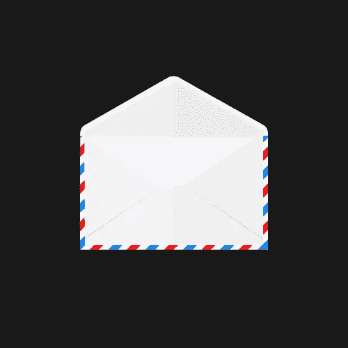

# 2016 年创建电子邮件活动的终极指南

> 原文：<https://www.sitepoint.com/the-ultimate-guide-for-creating-email-campaigns-in-2016/>

图片来源:[散养股票](http://freerangestock.com)

电子邮件活动是创建营销电子邮件的一系列有预谋的步骤，旨在产生客户响应，并最终导致目标受众的转化(可能包括产品订单、信息查询等)。与任何其他类型的营销一样，电子邮件活动向潜在客户传递信息，目的是提高认识、引起兴趣和产生偏好。

从头开始建立一个高质量的电子邮件活动可能很难，但也是可行的。在这篇指南中，我想谈一谈成功的电子邮件营销活动的基本阶段，它可以显著提高转化率。因此，在点击“发送”按钮之前，您将知道要采取的操作顺序。

因此，让我们来探索如何让电子邮件营销活动吸引人，让潜在客户高度期待。首先，仔细看看一个成功的电子邮件活动必须采取的步骤列表:

1.  定义活动的目标。
2.  为所有相关方创建一个活动需求清单。
3.  执行邮件列表分段。
4.  概述电子邮件内容，并寻找合适的图片。
5.  选择电子邮件简讯模板并插入内容。
6.  设置电子邮件跟踪。
7.  发出测试活动并进行修改。
8.  发出你的电子邮件的最终版本。
9.  收集反馈数据。
10.  如有必要，修改营销策略。

图片来源:[散养股票](http://freerangestock.com)

## 1.定义活动的目标

在开始电子邮件营销活动之前，营销人员必须定义其目标，并清楚地了解预期的客户行为。查阅统计数据也是非常有用的，这些数据显示了行业的大致[基准，以找出活动的总体策略。MailChimp 提供的统计数据显示了不同规模公司的比率:](http://www.smartinsights.com/email-marketing/email-communications-strategy/statistics-sources-for-email-marketing/)

| 公司规模 | 开放率 | 点击率 | 软税率 | 硬性税率 | 滥用率 | 不明嫌犯比率 |
| 1 到 10 | 21.95% | 2.97% | 0.66% | 0.52% | 0.03% | 0.30% |
| 11 至 25 岁 | 20.99% | 2.58% | 0.65% | 0.51% | 0.03% | 0.25% |
| 26 至 50 岁 | 21.82% | 2.94% | 0.42% | 0.31% | 0.02% | 0.17% |
| 50+ | 23.10% | 2.85% | 0.62% | 0.56% | 0.02% | 0.20% |

至于活动目标，5 Ws 和 1h 的[法则概括了这一切:](https://blog.kissmetrics.com/undermining-your-email-campaigns/)

*   定义**为什么发送**电子邮件。
*   了解你的目标受众世卫组织。
*   决定你到底想说什么，不要跑题。
*   了解你的潜在客户如何思考，并使用他们的语言进行交流。
*   收到邮件后，将收件人带到您希望他们去的地方。
*   当收件人急于采取行动时，让您的电子邮件及时到达**。**

你打算发一封一次性的电子邮件吗？你想建立一个全面的广告活动，还是只是让人们知道你提供的一个特定的新功能或服务？不管是什么原因，都必须列出一系列要求来记录你对邮件内容和设计的目标和想法。

## 2.创建活动需求列表

创建一个通用的指南对参与创建电子邮件活动的各方都非常有帮助，也是未来活动的基础。下面你会发现[营销人员在整理本指南时应该考虑的最常见的要求列表](http://www.emailonacid.cimg/blog_images/downloads/2014/RequirementsDoc_MusicalEmail.zip):

**摘要**–邮件的主题(新产品、服务)。

**目标**–活动的预期结果(例如，让潜在客户注册网站、注册服务、订购产品等。)

**语气**–传达信息的方式(可以是随意或友好、乐观、积极等)。

**写信给**——一个你正在联系的典型潜在客户的肖像。

**细分**–经过彻底挑选的目标受众/网站访问者，他们已经表现出兴趣并提交了接收简讯的电子邮件。

**主题行**——一个简洁而吸引人的口号，让人们感兴趣。

**模板**——电子邮件的排版方式，或者你选择的现成模板。

**跟踪**–如何跟踪电子邮件，具体跟踪要求。

填写目标时，必须尽可能具体，听起来像是:“让客户注册网上研讨会”，或者“让客户购买特定商品”。

不言而喻，将分析纳入电子邮件活动绝对有助于跟踪实际点击的人数。新闻服务通常有自己的工具，但也有方法使用[谷歌分析跟踪电子邮件活动](http://www.smartinsights.com/email-marketing/email-marketing-analytics/email-campaign-tracking-with-google-analytics/)。

最后，你需要为你的电子邮件打下基础。算出:

*   图像的位置以及它们的确切外观；
*   内容的数量及其将传达的内容；
*   出站链接的位置以及它们需要传达的信息。

至关重要的是，要仔细写出所有要求，以确保参与构建活动的所有各方对应该做什么有相同的看法。永远不要忘记你要发送的电子邮件的最终目标。你邮件中的每一个细节和元素(主题、图片、内容)都应该为广告活动服务。

图片来源:[散养股票](http://freerangestock.com)

## 3.执行邮件列表分段

邮件列表细分的目的是根据特定的特征来划分你的联系人，以提高转化率。根据 MarketingSherpa 的调查，[分段邮件的点击率比非分段邮件高出 50%](http://www.marketingsherpa.com/) 。下面是一个示例性的细分标准列表:

*   人口统计(年龄、性别、职位)
*   工作领域
*   兴趣/爱好
*   过去的购买
*   购买兴趣
*   地理定位

为了分割邮件列表以支持电子邮件活动的目标，营销人员必须像他们的客户一样思考，在收到信息后询问什么会真正激励他们采取行动。此外，客户必须了解谁在发送电子邮件，他们为什么会收到它，它的好处是什么。多亏了像 [Wishpond](http://corp.wishpond.com/) 这样的销售线索管理软件，才有可能插入与目标受众的人口统计和兴趣相关的细分数据。

另一件需要记住的重要事情是电子邮件活动的个性化。包括收件人的姓名是绝对必须的，也是最低要求。为了让个性化更上一层楼，营销人员应该做到以下几点:包括他们的名字；从个人(不是公司)发送电子邮件；使自动触发的电子邮件更加个性化；使用[电子邮件网关登录页面](http://blog.wishpond.com/post/81396364370/21-ways-to-generate-leads-from-your-landing-page)收集客户名称。

在电子邮件中保持个人风格是使电子邮件活动更加个性化的另一个方面。最简单的方法是使用第二人称代词，如“你”、“我”和“我们”，而不是使用不涉及特定人的非人称陈述。只需比较下面的例子就能感受到不同:“你不必费心去等待一份免费的产品拷贝。我们已经为你准备好了你的。现在就放心下载吧！”或者“现在有免费的产品副本可供下载。”

## 4.概述邮件内容，寻找合适的图片

一旦需求列表准备好了，邮件列表已经分段了，就该开始写邮件了。尝试使用[4ps 技术](https://www.campaignmonitor.com/blog/email-marketing/2015/04/email-copywriting-technique-results/)来迎合你的潜在客户的需求。这个技巧包括 4 个部分:承诺，绘画，证明，推动。

*   承诺必须是一个简短的陈述，展示产品或服务的好处，直接满足目标受众的需求。
*   **Paint** 是描述承诺兑现后客户将获得的利益。
*   **Proof** 通过展示独立组织使用所提供的产品或服务取得的成果，确认承诺和描绘阶段确实有效。
*   **推动**是一个行动号召，与描绘理想世界的绘画阶段相关。

使用 4 Ps 技巧可能非常有效，但是在写电子邮件时，还有一些其他的事情需要注意:

*   不要离题。保持简短。
*   通过提供有价值的相关信息来引起人们的兴趣。
*   使用项目符号、粗体和斜体创建可扫描的内容。
*   提供可见且易于识别的[“行动号召”(CTA)按钮](https://www.emailonacid.com/blog/article/email-marketing/9_tips_to_craft_a_killer_cta/)。
*   个性化。
*   坚持一定的基调。
*   校对-仔细阅读和修改。

找一些吸引眼球的、合适的图片来改进邮件。确保图像支持并符合您电子邮件的目的。营销专业人士建议避免过度使用库存照片，因为与普遍看法相反，库存照片会让一些读者失去兴趣。检查图像尺寸是否合适，是否适合您的电子邮件模板。不要添加太多图像，因为这将分别增加文件大小和降低可送达性。保持你的邮件大小在 102kb 以下。

## 5.选择电子邮件简讯模板

对于网页设计专业人员来说，从头开始编写电子邮件简讯模板是一件轻而易举的事情。对于 HTML 代码知识有限的人来说，这可能有点困难。因此，处理电子邮件设计问题有两种显而易见的方法:要么雇佣一个程序员，要么使用你可以在网上找到的模板提供商提供的电子邮件简讯模板。

紧跟现代网页设计趋势，响应式设计是编写电子邮件时需要考虑的一件大事。无论客户使用何种电子邮件客户端或小工具来浏览电子邮件，确保电子邮件的外观一致是至关重要的。完全响应的电子邮件简讯模板有助于控制电子邮件在任何移动设备上的外观，防止用户在几秒钟内删除它，因为它看起来很糟糕。

使用 MailChimp 这样的服务是有好处的，因为它们免费为你提供各种各样的时事通讯版面，所以你可以从中有所收获。如果你想试着自己写一封回复邮件，但不知道从哪里开始，试着用一个[教程](http://webdesign.tutsplus.com/tutorials/creating-a-future-proof-responsive-email-without-media-queries--cms-23919)解释这个过程的要点。如果你真的不想考虑太多，试试由专业网页设计师开发的[时事通讯电子邮件模板](http://www.templatemonster.com/newsletter-email-templates.php)。

电子邮件通讯设计最好的部分是有很多选择，所以不要害怕尝试不同的东西！

## 6.设置电子邮件跟踪

要找出并量化你的电子邮件活动是否成功，跟踪显然是最好的方法。如果你完全不知道从哪里开始电子邮件跟踪，看看 HubSpot 的[免费电子邮件规划和跟踪模板](http://offers.hubspot.com/email-marketing-planning-template?__hssc=&__hstc=20629287.70bde970a7cf0c24799f2251b41e1053.1458291846054.1458304337865.1458308688694.4&__hsfp=1051076766&hsCtaTracking=e442b13e-0f2e-4096-9b0f-78e686a8f0e5%7C3dca9bed-8c14-43d9-97b5-62fa064bd291)，并阅读关于[营销指标来跟踪](http://blog.hubspot.com/marketing/metrics-email-marketers-should-be-tracking)。简而言之，HubSpot 认为以下六个营销指标对于报告电子邮件活动的绩效至关重要:点击率、转化率、跳出率、列表增长率、电子邮件分享/转发率、整体投资回报率。

*   **点击率**是点击给定电子邮件中包含的一个或多个链接的收件人的百分比份额。
*   **转化率**是点击电子邮件中的链接并执行所需操作(填写表格、购买产品、订购服务等)的收件人的百分比。)
*   **退回率**显示未成功发送到收件人收件箱的电子邮件占已发送邮件总数的百分比。
*   **列表增长率**是收件人列表的增长率。
*   **电子邮件分享/转发率**显示了通过点击“分享”按钮或“转发给朋友”按钮在社交媒体上分享电子邮件或转发给朋友的收件人的百分比。
*   **总体投资回报率**–电子邮件活动的投资回报(总收入除以总支出)。

有各种各样的自动跟踪和分析工具，如 MailChimp 的“报告”，它提供了交互式图表、监控趋势、订户活动报告、收入报告、按位置打开、反弹、退订、行业比较、点击地图等功能，以计算出您的电子邮件活动的表现。也可以结合使用谷歌分析来查看您的电子邮件活动和链接跟踪，以及其他服务，如 [ActiveCampaign](http://www.activecampaign.com/help/using-google-analytics-for-your-email-campaign-read-and-link-tracking/) 、 [Email on Acid](https://www.emailonacid.com/blog/article/email-development/emailology_getting_started_with_email_analytics) 等。

## 7.发出测试活动

发送一封测试邮件是非常重要的，因为你永远不知道你的邮件会因为你的潜在客户可能使用的软件或设备而有多大的不同。你不希望你的邮件看起来像垃圾，对吗？

电子邮件活动测试至关重要，因为电子邮件软件可能会以不同的方式感知时事通讯电子邮件模板。例如，Gmail 有一个问题[呈现风格](https://www.emailonacid.com/blog/article/email-development/12_things_you_must_know_when_developing_for_gmail_and_gmail_mobile_apps/)，而 [Outlook](http://www.emailonacid.com/blog/details/C13/tips_and_tricks_outlook_07-13) 可能会通过使用 Word 引擎来处理电子邮件布局。

引入 [A/B 分割测试](https://blog.kissmetrics.com/ab-testing-email-campaigns/)的概念是为了极大地提高电子邮件活动的成功指标。长话短说，下面是营销人员对你的电子邮件营销活动进行 A/B 测试需要做的事情。

*   选择一个电子邮件列表的小样本，或分割整个列表段(基于您的电子邮件活动的目标)。
*   发出两封电子邮件，使用两种变体(称为“A”和“B”)。
*   A/B 测试代表“A”是对照组,“B”是变异组。
*   对打开率、浏览量、点击率和/或转换率进行结果跟踪。
*   选择最佳的电子邮件测试变体(“A”或“B”发送给列表中的大多数人)。
*   不费吹灰之力修改和改进结果。

像 [Campaign Monitor](http://www.campaignmonitor.com/blog/post/2782/ab-testing/) 和 MailChimp 这样的流行电子邮件竞选服务都内置了 A/B 测试工具。所以做[积极竞选](http://www.activecampaign.com/emailmarketing/)和[石蕊](https://litmus.com/email-testing)。

尝试使用测试工具，这些工具大大简化了经验数据检索的过程。然而，人们需要记住，测试必须同时进行，以减少基于时间的因素的影响，这些因素可能会扭曲结果。为了获得更准确的结果，有必要尽可能多地测试样本。记住经验数据是成功的关键，所以一定要密切关注它。建议一次测试一个变量以获得更好的结果，但是也可以用多变量测试代替 A/B 测试。

尽可能频繁地进行电子邮件活动测试。

## 8.发送电子邮件的最终版本

一旦前面的所有阶段都完成了，就该发出你的电子邮件或时事通讯的最终版本了。别急，伙计们！还有一点要确保的是，你的电子邮件活动会在最佳时机到达目标受众的收件箱。真的有发送电子邮件的最佳时机吗？你打赌有。

根据 [WordStream](http://www.wordstream.com/blog/ws/2014/09/04/best-time-to-send-email-campaign) 的说法，发送电子邮件活动的最佳时间是:

*   白天；
*   不是在星期一或星期五；
*   不是在周末；
*   面向活动的电子邮件应在活动前 3-5 天发出。
*   根据 MailChimp 的说法，周二和周四是最受欢迎的发送电子邮件简讯的日子。
*   至于最佳时间框架，它建议在下午 1 点至 3 点之间发送电子邮件(也建议在上午 9 点至 11 点发送)。

## 9.收集反馈数据

最后，是时候收集您的潜在客户的反馈并报告您的电子邮件活动的结果了。既然我们已经谈到了跟踪问题和对评估电子邮件活动的成功至关重要的事情，这里有一些由 [Campaign Monitor](https://www.campaignmonitor.com/resources/guides/reporting/) 提供的比率和报告供您考虑:

*   **打开率**是成功打开和阅读的邮件总数的百分比。最佳开口率在 20%-40%范围内变化。恭喜你。如果打开率在 40%以上，那么这个活动就是优化的。如果低于 20%，就必须考虑修改营销策略。
*   **点击率**表示为打开您电子邮件的收件人总数的百分比。最佳的电子邮件点击率在 20%-30%之间。
*   **电子邮件访问量**提供电子邮件中提供的链接或 CTA 对您网站的访问量。
*   **转换率**显示了转换率，以及电子邮件活动带来的相关收入。它有助于了解您的电子邮件活动相对于其他渠道的投资回报。
*   **退订率**以收到你邮件的收件人总数的百分比表示。健康的退订率高达 2%，所以如果退订率更低，你就非常符合行业标准。
*   **跳出率**是分段邮件列表中由于某种原因没有收到电子邮件的电子邮件地址的百分比。如果跳出率低于 3%，这是正常的。

除了主要的电子邮件活动反馈率之外，还有次要的反馈率来得出以下类型的报告:

*   **列表&细分市场报告**提供电子邮件营销活动绩效的总体评估，以防其被发送到多个邮件列表。
*   **链接活动和覆盖报告**有助于了解潜在客户正在点击哪些链接或图片。这有助于改进下一个电子邮件活动的结构和设计。
*   **电子邮件客户端使用情况报告**展示了您的订户在参与您的活动时所选择的数字设备和电子邮件软件。
*   **开启&一段时间内的点击量报告**帮助您了解活动开启的时间趋势。

得益于从电子邮件营销活动分析中收集的数据，营销人员可以轻松识别他们的弱点，并修改他们的营销策略。

## 10.修改营销策略

如果有必要修改营销策略，以便更好地开展电子邮件营销活动，可以考虑以下几个关键问题:

*   你的 CTA 可见吗？真的管用吗？你的主题是什么？观察您的电子邮件活动，了解营销文案有多成功，尤其是您的 CTA 和主题行。
*   您的目标受众更经常使用哪种电子邮件客户端？这一特定知识对于理解如何设计和测试下一个电子邮件活动或使用什么样的简讯电子邮件模板至关重要。
*   你的读者真的使用移动设备查看电子邮件吗？如果是，那么使用响应性时事通讯电子邮件模板是绝对必要的，以确保设计在移动设备上看起来感觉良好。
*   如何改进邮件列表细分策略？按照客户类型和兴趣等类别来细分你的列表，有助于提高你的营销效果。
*   谁最不关心你的电子邮件？将这些用户细分出来将使你能够[重新定位他们，并试图让他们再次](http://www.emailonacid.com/blog/details/C4/email_engagement_metrics_applying_what_weve_learned)关注你的电子邮件。

因此，这几乎是营销人员应该知道的关于创建一个成功的电子邮件活动的一切。请记住，熟能生巧，一旦你的第一封电子邮件活动结束，你会发现发送一封活动邮件并不需要花费太多的时间和精力。通过修改和修正具体的东西，你会确切地知道什么有用，什么没用。祝你好运，永远不要停止测试，以确保你的下一个电子邮件活动将会更加成功！

## 分享这篇文章