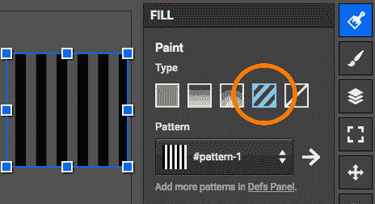
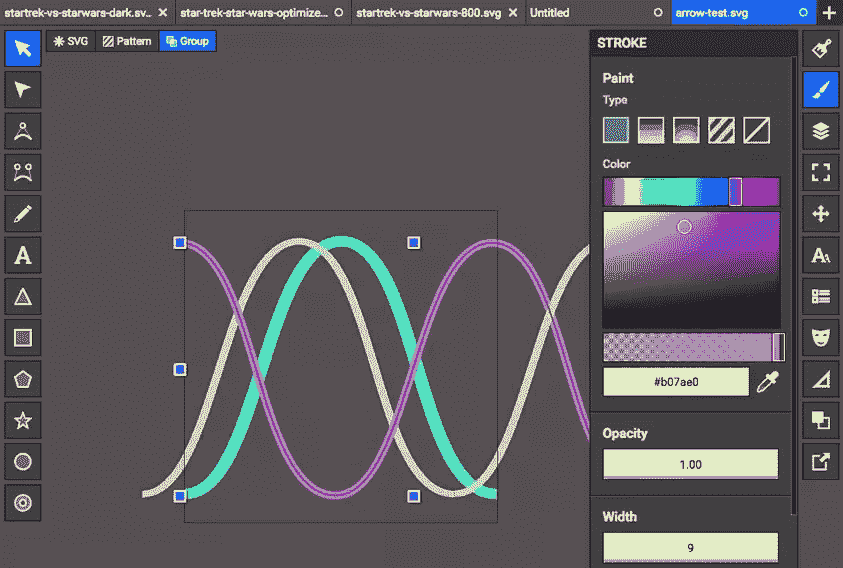
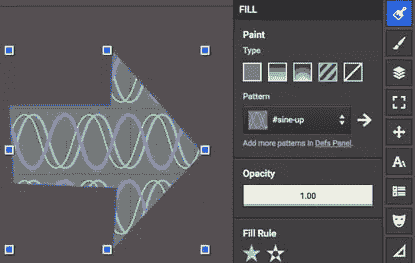
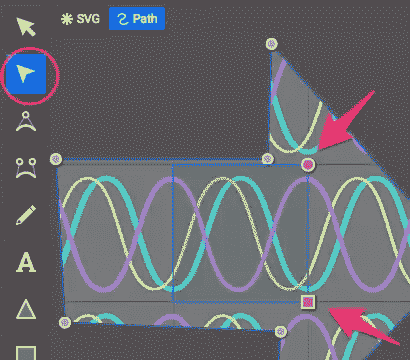
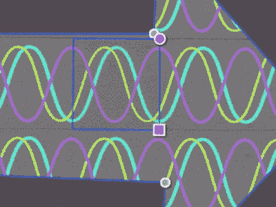
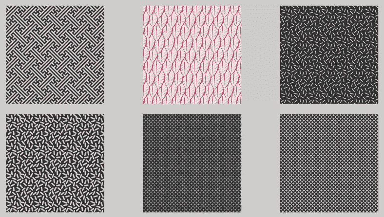
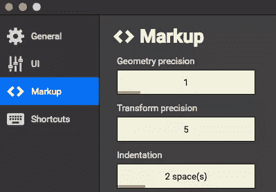

# 掌握 SVG 模式而不打破你的大脑(或预算)

> 原文：<https://www.sitepoint.com/mastering-svg-patterns-without-breaking-brain-budget/>

我想分享 Jarek Foksa 的四四方方的 SVG 编辑器的一个小特性，我认为它很漂亮，但对新用户来说可能不太明显。

模式是 SVG 最有用的特性之一——但是要让平铺和缩放达到你想要的效果可能有点费脑筋。

令人高兴的是，Boxy SVG 非常好地处理了模式创建——如果您知道去哪里找的话。这里有一个快速排练。

## 用 Boxy SVG 创建 SVG 模式。

图案填充

1).当你创建了一个新的形状，选择它，并前往填充菜单，并点击条纹图案填充瓷砖(如此处所示)。

2).在图案选择器下拉菜单下面，你会看到'*在 DEFS 面板中添加更多图案'*。点击链接切换到 DEFS 面板。

3).现在点击“ **+** ”按钮开始一个新的图案块。这将是你当前模式的副本。双击它以在新窗口中打开它进行编辑。如果你喜欢，可以随意重命名你的图案，但是它 ***必须以“#”开头*** 。

4).删除编辑器视图中当前的内容，并开始使用绘图工具创建您的新模式。如果需要，使用“视图”面板调整“平铺画布”的大小。

在这个演示中，我创建了一些重叠的正弦曲线，应该可以完美地平铺。

5).完成后(你可以随时重新编辑你的图案)，点击屏幕左上角的 SVG 框，再次切换回你的*主*图。

6).选择一个形状，在填充面板的图案下拉菜单中选择你新创建的图案(它现在应该出现在列表中)。您应该会看到类似这样的内容。

但是如何缩放和定位模式呢？

7).在左侧的工具面板中，选择形状编辑工具。你现在应该可以在你的形状中看到粉红色的图案控制手柄*。*

使用粉色圆圈旋转你的图案。用粉色方块重新缩放。

这就是全部了。您可以在同一个 SVG 文档中任意多次使用该模式，大小不限，而不会使文件变得更大。例如，我最近在我的[星际迷航 vs 星球大战 SVG 图表](https://uploads.sitepoint.com/wp-content/uploads/2016/04/1461758582optimised.svg)中为网格使用了一小部分 SVG 模式。

SVG 模式当然不是一个新的想法，但是我从来没有发现一个像 Boxy 这样快速、简单、干净的工具来创建和操作它们。在你的代码编辑器中打开你的 SVG(或者粘贴到 [Codepen.io 的 HTML 窗口](http://codepen.io/))，你会看到你的模式在你的文档顶部的 DEFS 标签中被描述。

在 SVG 中，你可以把 SVG 模式(和 SVG 符号)看作是 HTML 头部的

## 图案灵感

现在您拥有了掌握 SVG 模式的能力，您将如何使用它呢？查看 Phillip Rogers[SVG Patterns Gallery](https://philiprogers.com/svgpatterns/)和 [Patternbolt，寻找一些很酷的想法](http://buseca.github.io/patternbolt/)。

## 最后一句话

矩形 SVG 首选项:标记精度控件

值得注意的是，Jarek 最近一直在 Boxy SVG 上工作，他的更新每周(有时每天)都会集成到 Boxy SVG Chrome 应用程序中。例如，我知道本周他添加了精确标记控件，让你可以将难以控制的路径坐标四舍五入到更容易管理的位置。

因此，请留意您的四四方方的 SVG 首选项和菜单选项——新功能总有一天会神奇地出现。

*原载于 [SitePoint 设计简讯](https://www.sitepoint.com/newsletter/)* 。

## 分享这篇文章