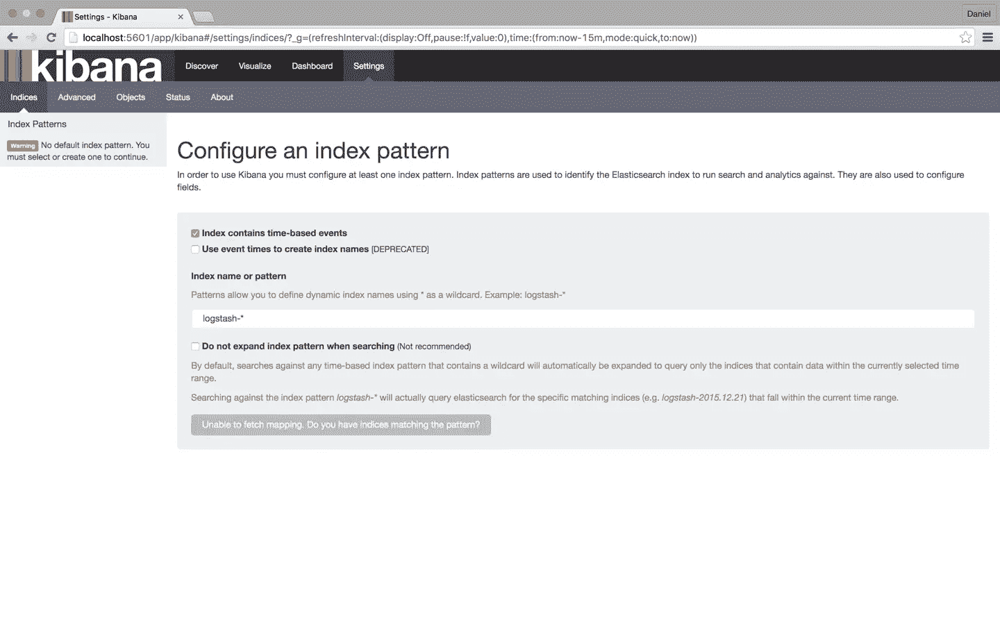
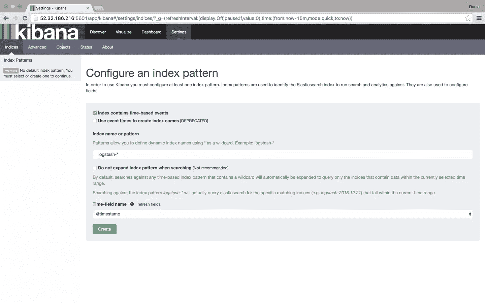
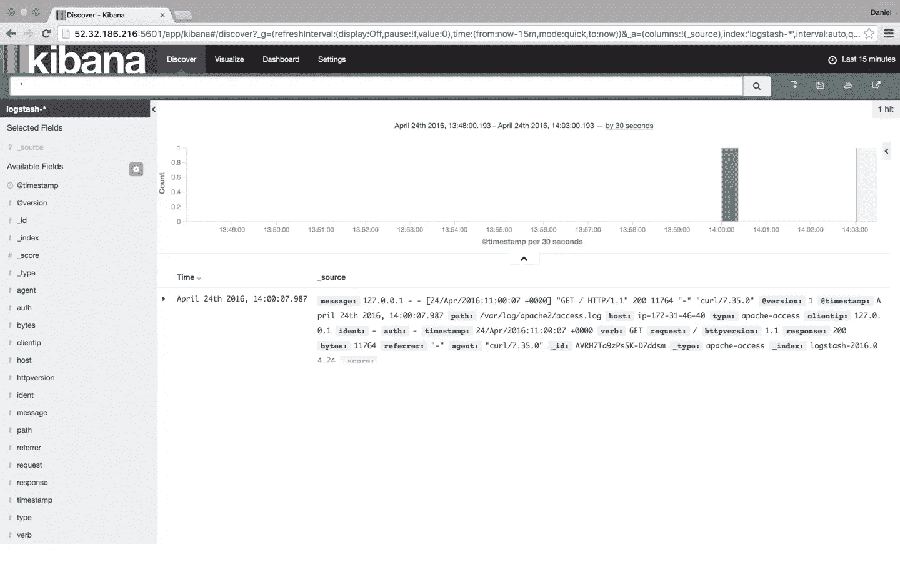
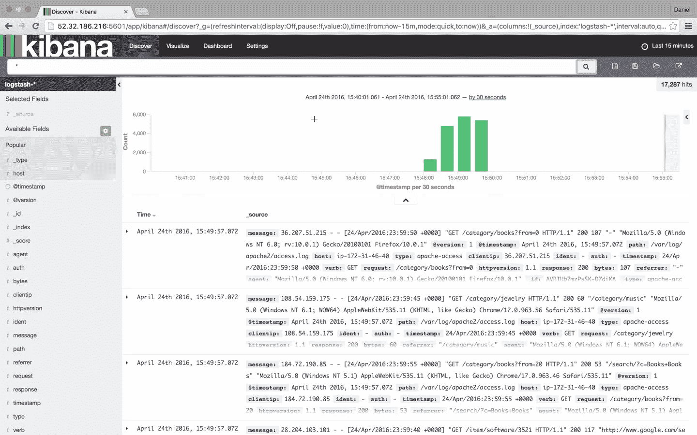
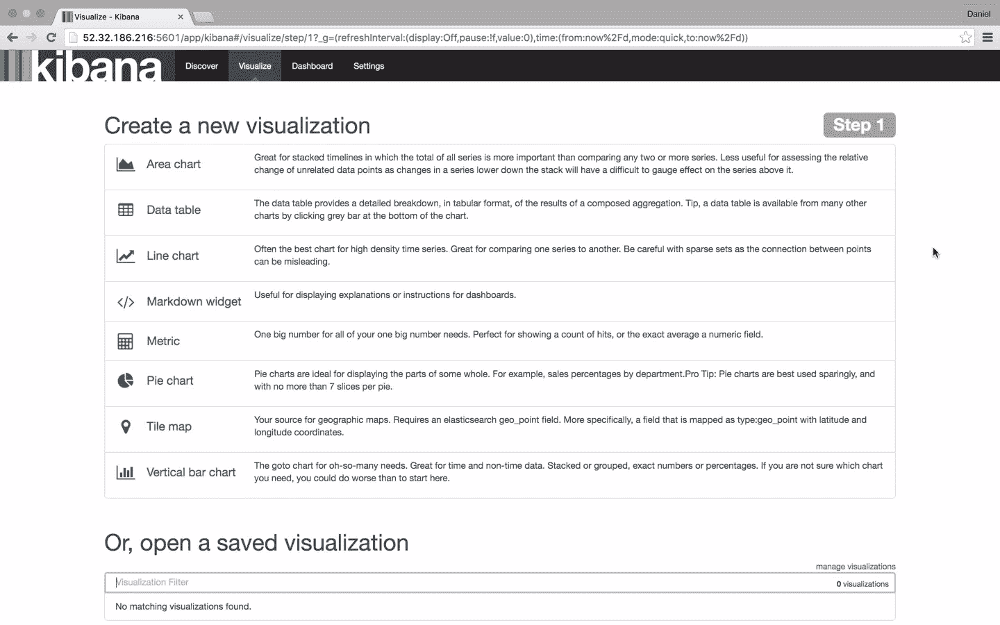

# 如何处理服务器日志

> 原文：<https://www.sitepoint.com/how-can-the-elk-stack-be-used-to-monitor-php-apps/>

当我们的应用程序出现问题时——不管我们喜欢与否，它们有时会出现——当我们开始故障排除过程时，我们的日志文件通常是我们首先要去的地方。这里最大的“但是”是，尽管日志文件包含大量关于事件的有用信息，但是它们通常非常难以破译。

现代 web 应用程序环境由多个日志源组成，这些日志源共同输出成千上万个用难以理解的机器语言编写的日志行。例如，如果您设置了一个 LAMP 堆栈，那么您就需要浏览 PHP、Apache 和 MySQL 日志。将系统和环境日志加入到争论中——以及特定于框架的日志，如 Laravel 日志——您最终会得到一大堆无穷无尽的机器数据。

谈论大海捞针。


麋鹿栈( [Elasticsearch](https://github.com/elastic/elasticsearch) 、 [Logstash](https://github.com/elastic/logstash) 和 [Kibana](https://github.com/elastic/kibana) )正迅速成为应对这一挑战的最受欢迎的方式。根据 Elastic 的数据，ELK 已经是最受欢迎的开源日志分析平台，每月有 500，000 次下载，是集中多个来源的日志、确定相关性和执行深度数据分析的好方法。

Elasticsearch 是一个基于 Apache Lucene 的搜索和分析引擎，允许用户几乎实时地搜索和分析大量数据。Logstash 可以从任何地方接收和转发日志。Kibana 是这个堆栈的漂亮的一面——一个用户界面，允许您轻松地查询、可视化和探索 Elasticsearch 数据。

本文将描述如何在本地开发环境上设置 ELK 堆栈，使用 Logstash 将 web 服务器日志(在本例中为 Apache 日志)传送到 Elasticsearch，然后在 Kibana 中分析数据。

## 安装 Java

ELK 堆栈需要 Java 7 和更高版本(仅支持 Oracle 的 Java 和 OpenJDK)，因此作为第一步，更新您的系统并运行以下命令:

```
sudo apt-get install default-jre 
```

## 安装 ELK

安装 ELK 堆栈的方法有很多——你可以使用 Docker、Ansible、vagger、Microsoft Azure、AWS 或托管的 ELK 解决方案——随便你挑。有大量的教程和指南可以帮助你，其中一个是我们在 [Logz.io](http://logz.io) 整理的 [ELK Stack guide](http://logz.io/learn/complete-guide-elk-stack/) 。

### 安装弹性搜索

我们将从安装 Elasticsearch 开始安装过程。设置 Elasticsearch 有多种方法，但我们将使用 Apt。

首先，下载并安装 Elastic 的公共签名密钥:

```
wget -qO - https://packages.elastic.co/GPG-KEY-elasticsearch | sudo apt-key add - 
```

接下来，将存储库定义保存到`/etc/apt/sources.list.d/elasticsearch-2.x.list`:

```
echo "deb http://packages.elastic.co/elasticsearch/2.x/debian stable main" | sudo tee -a /etc/apt/sources.list.d/elasticsearch-2.x.list 
```

最后但同样重要的是，更新存储库缓存并安装 Elasticsearch:

```
sudo apt-get update && sudo apt-get install elasticsearch 
```

Elasticsearch 现已安装。在我们继续下一个组件之前，我们将稍微调整一下配置文件:

```
sudo nano /etc/elasticsearch/elasticsearch.yml 
```

一些常见的配置涉及对 Elasticsearch 外部访问的限制，因此数据不能通过 HTTP API 被黑客攻击或删除:

```
network.host: localhost 
```

您现在可以重新启动 Elasticsearch:

```
sudo service elasticsearch restart 
```

要验证 Elasticsearch 是否正常运行，请使用 cURL 命令查询以下 URL:

```
sudo curl 'http://localhost:9200' 
```

您应该在终端中看到以下输出:

```
{
  "name" : "Jebediah Guthrie",
  "cluster_name" : "elasticsearch",
  "version" : {
    "number" : "2.3.1",
    "build_hash" : "bd980929010aef404e7cb0843e61d0665269fc39",
    "build_timestamp" : "2016-04-04T12:25:05Z",
    "build_snapshot" : false,
    "lucene_version" : "5.5.0"
  },
  "tagline" : "You Know, for Search"
} 
```

要使服务在引导时启动，请运行:

```
sudo update-rc.d elasticsearch defaults 95 10 
```

### 安装 Logstash

Logstash，即“ELK Stack”中的“L”，用于日志管道的开始，在将数据发送到 Elasticsearch 之前接收和收集数据。

要安装 Logstash，请将存储库定义添加到您的`/etc/apt/sources.list`文件中:

```
echo "deb http://packages.elastic.co/logstash/2.2/debian stable main" | sudo tee -a /etc/apt/sources.list 
```

更新您的系统，使存储库可以使用，然后安装 Logstash:

```
sudo apt-get update && sudo apt-get install logstash 
```

我们稍后将返回 Logstash 来配置 Elasticsearch 中的日志传送。

### 安装 Kibana

拼图的最后一块是基巴纳——麋鹿群的漂亮脸蛋。首先，创建 Kibana 源列表:

```
echo "deb http://packages.elastic.co/kibana/4.5/debian stable main" | sudo tee -a /etc/apt/sources.list 
```

然后，更新并安装 Kibana:

```
sudo apt-get update && apt-get install kibana 
```

在`/opt/kibana/config/kibana.yml`配置 Kibana 配置文件:

```
sudo vi /opt/kibana/config/kibana.yml 
```

取消对以下行的注释:

```
server.port: 5601
server.host: “0.0.0.0” 
```

最后但同样重要的是，开始 Kibana:

```
sudo service kibana start 
```

您可以在浏览器中通过`http://localhost:5601/`访问 Kibana(如果您使用的是类似 [Homestead Improved](https://www.sitepoint.com/quick-tip-get-homestead-vagrant-vm-running/) 的虚拟机，请将 URL 更改为您配置的任何主机/端口):



要开始在 Kibana 中分析日志，至少需要定义一个索引模式。索引是 Elasticsearch 组织数据的方式，它可以比作 RDBMS 世界中的数据库，映射定义了多种类型。

您会注意到，由于我们还没有发布任何日志，Kibana 无法获取映射(如页面底部的灰色按钮所示)。我们将在接下来的几个步骤中解决这个问题。

**提示:**默认情况下，Kibana 连接到运行在 localhost 上的 Elasticsearch 实例，但是您可以连接到不同的 Elasticsearch 实例。只需修改您之前编辑的 Kibana 配置文件中的 Elasticsearch URL，然后重启 Kibana。

## 运输日志

我们的下一步是建立一个进入 Elasticsearch 的日志管道，以便使用 Kibana 进行索引和分析。将数据转发到 Elasticsearch 有多种方式，但我们将使用 Logstash。

Logstash 配置文件以 JSON 格式编写，驻留在`/etc/logstash/conf.d`中。配置由三个插件部分组成:输入、过滤和输出。

创建一个名为`apache-logs.conf`的配置文件:

```
sudo vi /etc/logstash/conf.d/apache-logs.conf 
```

我们的第一个任务是配置输入部分，它定义了从哪里提取数据。

在这种情况下，我们将定义 Apache 访问日志的路径，但是您可以输入任何其他日志文件集的路径(例如，PHP 错误日志的路径)。

然而，在此之前，我建议对支持的输入插件以及如何定义它们做一些研究。在某些情况下，推荐使用其他日志转发工具，如 [Filebeat](https://www.elastic.co/products/beats/filebeat) 和 [Fluentd](http://www.fluentd.org/) 。

输入配置:

```
input {
    file {
        path => "/var/log/apache2/access.log"
        type => "apache-access"
    }
} 
```

我们的下一个任务是配置一个过滤器。

过滤器插件允许我们获取原始数据并尝试理解它。其中一个插件是 grok——一个用于从非结构化数据中导出结构的插件。使用 grok，您可以定义一个搜索，并将部分日志行提取到结构化字段中。

```
filter {
  if [type] == "apache-access" {
    grok {
      match => { "message" => "%{COMBINEDAPACHELOG}" }
    }
  }
} 
```

Logstash 配置文件的最后一部分是输出部分，它定义了日志发送到的位置。在我们的例子中，它是本地主机上的本地 Elasticsearch 实例:

```
output {
    elasticsearch {}
} 
```

就是这样。完成后，使用新配置启动 Logstash:

```
/opt/logstash/bin/logstash -f /etc/logstash/conf.d/apache-logs.conf 
```

您应该会看到来自 Logstash 的以下 JSON 输出，表明一切正常:

```
{
        "message" => "127.0.0.1 - - [24/Apr/2016:11:41:59 +0000] \"GET / HTTP/1.1\" 200 11764 \"-\" \"curl/7.35.0\"",
       "@version" => "1",
     "@timestamp" => "2016-04-24T11:43:34.245Z",
           "path" => "/var/log/apache2/access.log",
           "host" => "ip-172-31-46-40",
           "type" => "apache-access",
       "clientip" => "127.0.0.1",
          "ident" => "-",
           "auth" => "-",
      "timestamp" => "24/Apr/2016:11:41:59 +0000",
           "verb" => "GET",
        "request" => "/",
    "httpversion" => "1.1",
       "response" => "200",
          "bytes" => "11764",
       "referrer" => "\"-\"",
          "agent" => "\"curl/7.35.0\""
} 
```

在浏览器中刷新 Kibana，您会注意到我们的 Apache 日志的索引模式被标识为:



点击**创建**按钮，然后选择发现选项卡:



从这一点开始，Logstash 跟踪 Apache 访问日志中的消息，这样任何新条目都会被转发到 Elasticsearch 中。

## 分析日志

现在，我们的管道已经建立并运行，是时候享受一些乐趣了。

为了让事情更有趣一点，让我们在 web 服务器上模拟一些噪声。为此，我将下载一些[样本 Apache 日志](http://logz.io/sample-data)，并将它们插入 Apache 访问日志。Logstash 已经在跟踪这个日志，所以这些消息将被索引到 Elasticsearch 并显示在 Kibana 中:

```
wget http://logz.io/sample-data
sudo -i 
cat /home/ubuntu/sample-data >> /var/log/apache2/access.log
exit 
```



### 搜索

搜索是麋鹿栈的面包和黄油，它本身就是一门艺术。网上有大量的文档，但是我想我会涵盖基本的内容，这样你就有了一个坚实的基础来开始你的探索工作。

让我们从一些简单的搜索开始。

最基本的搜索是对所有索引字段执行的“自由文本”搜索。例如，如果您正在分析 web 服务器日志，您可以搜索特定的浏览器类型(使用页面顶部的宽搜索框执行搜索):

```
Chrome 
```

请注意，自由文本搜索不区分大小写，除非您使用双引号，在这种情况下，搜索结果会显示与您的查询完全匹配的内容。

```
“Chrome” 
```

接下来是字段级搜索。

要搜索特定字段中的值，需要将字段名称作为前缀添加到值中:

```
type:apache-access 
```

比方说，您正在寻找一个特定的 web 服务器响应。输入`response:200`将结果限制为包含该响应的结果。

您也可以在字段中搜索范围。如果使用方括号[]，结果将是包含性的。如果使用花括号{}，结果将排除查询中的指定值。

现在，是时候更上一层楼了。

接下来的搜索类型包括使用逻辑语句。这些非常直观，但需要一些技巧，因为它们对语法非常敏感。

这些语句包括布尔运算符 AND、OR 和 NOT 的使用:

```
type:apache-access AND (response:400 OR response:500) 
```

在上面的搜索中，我在寻找只有 400 或 500 响应的 Apache 访问日志。注意圆括号的使用是如何构造更复杂的查询的一个例子。

还有更多可用的搜索选项(我建议参考 Logz.io 的 [Kibana 教程](http://logz.io/blog/kibana-tutorial/)以获取更多信息)，如正则表达式、模糊搜索和近似搜索，但是一旦您确定了所需的数据，您可以保存搜索以供将来参考，并作为创建 Kibana 可视化的基础。

### 肉眼观察

ELK Stack 中最突出的特性之一，特别是 Kibana，是用摄取的数据创建漂亮的可视化效果的能力。然后可以将这些可视化结果汇总到一个仪表板中，您可以使用它来全面查看所有进入 Elasticsearch 的各种日志文件。

要创建可视化，请在 Kibana 中选择 Visualize 选项卡:



有许多可视化类型可供您选择，您将选择哪种类型在很大程度上取决于您试图实现的目的和最终结果。在这种情况下，我将选择好的旧饼图。

然后我们有了另一个选择——我们可以从保存的搜索或新的搜索创建可视化。在这种情况下，我们选择后者。

我们的下一步是为图表的 X 轴和 Y 轴配置各种指标和聚合。在这种情况下，我们将使用整个索引作为搜索基础(不在搜索框中输入搜索查询)，然后交叉引用浏览器类型的数据:Chrome、Firefox、Internet Explorer 和 Safari:


完成后，保存可视化效果。然后，您可以在 Kibana 的 dashboard 选项卡中将其添加到自定义仪表板中。

可视化是非常丰富的工具，也是理解数据趋势的最佳方式。

## 结论

ELK 堆栈正在成为分析和管理日志的方式。栈是开源的，并且有强大的社区和快速增长的生态系统支持，这一事实推动了它的流行。

DevOps 不是日志分析的唯一领域，开发人员、系统管理员、SEO 专家和营销人员也在使用 ELK。日志驱动的开发——使用度量、警报和日志监控代码的开发过程——正在越来越多的 R&D 团队中获得牵引力，将这与 ELK 的日益流行联系起来并不是什么难事。

当然，没有一个系统是完美的，用户需要避免一些缺陷，尤其是在处理大型生产操作时。但是这不应该阻止你尝试它，特别是因为有许多信息来源将引导你通过这个过程。

祝好运，并快乐索引！

* * *

*这篇文章由[克里斯托弗·托马斯](https://www.sitepoint.com/author/cthomas/)、[尤尼斯·拉菲](https://www.sitepoint.com/author/yrafie/)和[斯科特·莫利纳里](https://www.sitepoint.com/author/smolinari/)进行了[同行评审](https://www.sitepoint.com/introduction-to-sitepoints-peer-review/)。感谢 SitePoint 的所有同行评审员使 SitePoint 的内容尽可能做到最好！*

## 分享这篇文章