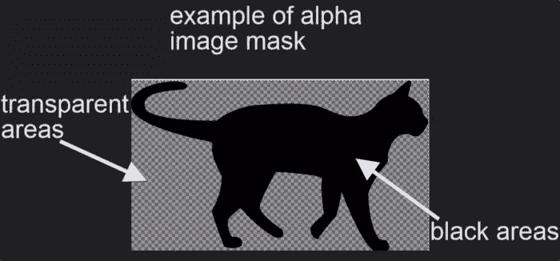
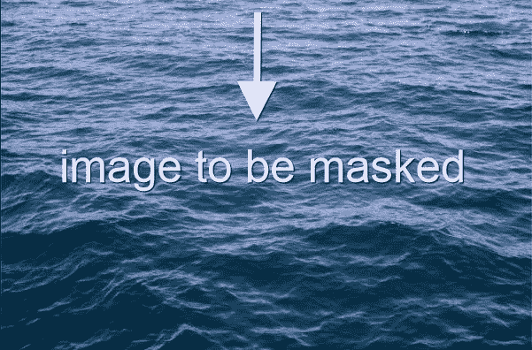
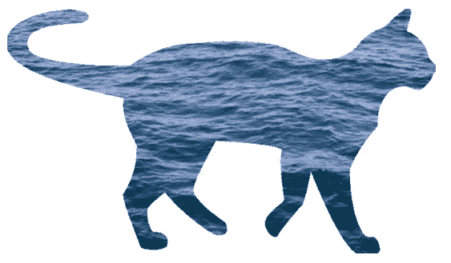
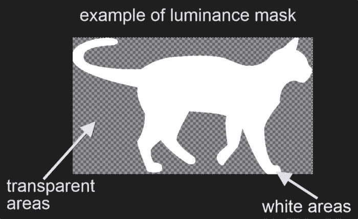
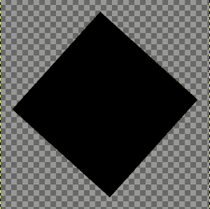
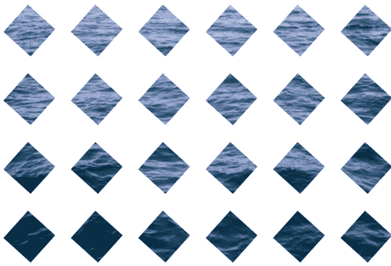
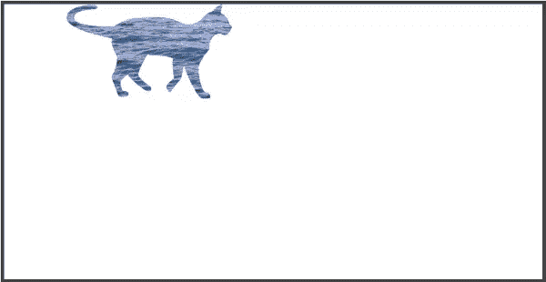
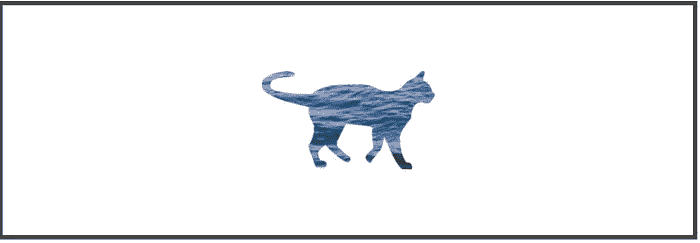
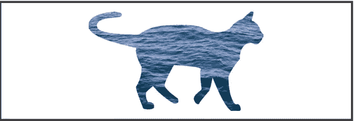
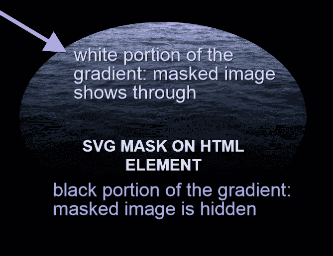

# 使用 CSS 和 SVG 在浏览器中进行遮罩

> 原文：<https://www.sitepoint.com/masking-in-the-browser-with-css-and-svg/>

遮罩是一种技术，可让您在屏幕上显示元素或图像的选定部分，同时隐藏其余部分。Web 开发人员可以通过 [`mask`](https://drafts.fxtf.org/masking/#the-mask) 属性和 [SVG `mask`元素](https://drafts.fxtf.org/masking/#MaskElement)在浏览器中使用这种技术。这些功能允许您在浏览器中显示图像和其他元素的遮罩效果，而无需使用任何类型的图像编辑软件。

在本文中，我将展示 CSS 和 SVG 的屏蔽功能，同时确保包含一些关于当前浏览器支持问题的信息。

在撰写本文时，大多数代码示例只能在 WebKit 浏览器中工作，而基于 SVG 的掩码似乎得到了更广泛的浏览器支持。因此，如果你想尝试这些例子，我推荐你使用像 Chrome 这样的 WebKit 浏览器。

## 网络上的屏蔽

您可以使用[裁剪](https://drafts.fxtf.org/masking/#clipping-paths)或遮罩在网页上实现遮罩效果。

裁剪包括在图像或元素上放置一个封闭的矢量形状，如圆形或多边形。图像中位于形状后面的任何部分都将可见，而位于形状边界之外的任何部分都将隐藏。形状的边界称为剪辑路径，您可以使用`clip-path`属性创建它。

蒙版是使用 PNG 图像、CSS 渐变或 SVG 元素来隐藏图像的某些部分或页面上的其他元素。您可以使用 CSS `mask`属性来实现这一点。

在本文中，我将专门关注 CSS `mask`属性和 SVG `<mask>`元素的屏蔽。

## CSS `mask`属性

`mask`是一大堆单独属性的 CSS 简写属性。让我们更详细地看看其中的一些。

### `mask-image`属性

您可以使用`mask-image`属性来设置元素的**遮罩层图像**。

值`none`与根本不设置值是不同的。相反，它仍然算作一个透明的黑色图像层。

您可以将`mask-image`设置为 URL 值。这可以是 PNG 图像文件、SVG 文件的路径，或者是对 SVG `<mask>`元素的引用。通过添加由逗号分隔的相应数量的 URL 值，可以设置多个遮罩图像层。

这里有几个例子:

```
/* masking with two comma-separated values */
.masked-element {
  mask-image: url(mask.png), none;
}

/* using external svg graphic as mask */
.masked-element {
  mask-image: url(mask.svg);
} 
```

这就是如何用*掩码 1* 的`id`引用 SVG `<mask>`元素:

```
.masked-element {
  mask-image: url(#mask1);
} 
```

渐变图像也是`mask-image`属性的合适值:

```
.masked-element {
  mask-image: linear-gradient(black 0%, transparent 100%);
} 
```

### `mask-mode`属性

使用 [`mask-mode`](http://tympanus.net/codrops/css_reference/mask-mode/) 可以将蒙版图层图像设置为 **alpha** 蒙版或**亮度**蒙版。

**阿尔法蒙版**是带有阿尔法通道的图像。更详细地说，alpha 通道是包含在每个像素数据中的透明度信息。将`mask-mode`属性设置为`alpha`的遮罩操作将使用图像的 alpha 值作为遮罩值。

alpha 通道的一个简便示例是带有黑色和透明区域的 PNG 图像。被遮罩的元素将透过遮罩图像的黑色部分显示，其 alpha 值为 1。透明部分下面的所有东西(alpha 值为零)都将被隐藏。

我将使用这张 [PNG 图像](https://pixabay.com/en/cat-mieze-movement-goes-1185453/)作为我的 alpha 蒙版:



并对下面的 JPG 图像执行遮罩操作:



这就是奇迹发生的地方:

```
.masked-element {
  mask-image: url(alpha-mask.png);
  mask-mode: alpha;
} 
```

下面是浏览器中的结果:



**亮度遮罩**使用图像的亮度值作为遮罩值。如上图所示的 PNG 图像(但为白色)是亮度蒙版的一个很好的例子:



被遮罩的白色像素覆盖的要遮罩的元素区域将会显示出来。被遮罩元素中被遮罩的透明像素覆盖的部分将被隐藏。

将`mask-mode`属性设置为`luminance`，使用上面的图片作为我的蒙版，将显示与之前相同的结果。

代码如下:

```
.masked-element {
  mask-image: url(luminance-mask.png);
  mask-mode: luminance;
} 
```

### `mask-repeat`属性

`mask-repeat`的工作原理非常类似于 [`background-repeat`](https://drafts.csswg.org/css-backgrounds-3/#repeat-style) 的属性。它在您设定遮罩层图像的大小和位置后控制遮罩层图像的平铺。

可能的值有:

*   `no-repeat`:掩模层图像在可用空间内不重复。
*   `repeat-x`:掩膜层图像沿 X 坐标重复。
*   `repeat-y`:遮罩层图像沿 Y 坐标向下重复。
*   `space`:遮罩层图像在整个可用区域内重复并隔开。
*   `round`:遮罩层图像在整个可用区域重复多次。如果一个整数不适合可用空间，图像将被缩放，直到它适合为止。

例如，这是我打算用作遮罩的图像:



下面的代码片段将`mask-repeat`属性设置为值`space`:

```
.masked-element {
  mask-image: url(imgs/trapeze.png);
  mask-repeat: space;
} 
```

导致以下掩蔽效应:



### `mask-position`属性

您可以使用`mask-position`属性来定位遮罩层图像。您可以将该属性设置为与您更熟悉的 CSS [`background-image`](https://drafts.csswg.org/css-backgrounds-3/#background-position) 属性相同的值。它的初始值是`center`。

例如，如果您想要将遮罩图像层放置在视口的左上角，请将`mask-position`属性设置为值 *0 0* :

```
.masked-element {
  mask-position: 0 0;
} 
```

上面的代码在浏览器中是这样的:



将上面的`mask-position`属性的值更改为 *100% 100%* ，在视口的右下角显示遮罩层图像:


### `mask-size`属性

您可以使用`mask-size`属性快速设置遮罩层图像的大小，该属性接受与更熟悉的 CSS [`background-size`属性](https://drafts.csswg.org/css-backgrounds-3/#bg-size)相同的值。

例如，将`mask-size`设置为`50%`以其全宽的 50%显示遮罩层图像:



将`mask-size`设置为`contain`会将掩模层图像缩放到最大尺寸，使其宽度和高度都适合掩模定位区域:



你可以在下面的 CodePen 网站上看到这些演示[的实况](http://codepen.io/SitePoint/pen/YqByJG):

参见 [CodePen](http://codepen.io) 上 SitePoint ( [@SitePoint](http://codepen.io/SitePoint) )的笔 [CSS 遮罩示例](http://codepen.io/SitePoint/pen/YqByJG/)。

### 合成遮罩层

如上所述，通过用逗号分隔`mask-image`属性的每个值，可以在同一个元素上使用多个遮罩层。这些层堆叠在其他层的顶部，最后一层首先显示在屏幕上。

例如:

```
.masked-element {
  mask-image: url(mask1.png), url(mask2.png);
} 
```

在上面的片段中，*mask2.png*层叠在*mask1.png*之上。

`mask-composite`属性允许您根据以下关键字的值组合不同的遮罩层:

*   `add`:*mask2.png*被画在*mask1.png*的上面
*   `subtract`:显示 mask2.png 的*不与*mask1.png*重叠的部分。浏览器还不支持标准关键字，因此，至少目前，你需要使用相应的复合运算符关键字`source-out`*
*   `intersect`:显示 mask2.png 的*与 mask1.png*重叠的部分。然而，WebKit 浏览器是唯一一种支持 CSS 掩码的浏览器，即使使用了非标准的复合`source-in`关键字，它似乎也不会在屏幕上显示任何内容。
*   `exclude`:显示 mask1.png 和 mask2.png 的*没有重叠的部分。同样，因为 standard 关键字还不支持，所以使用复合操作符`XOR`会好得多。*

您也可以在下面的 CodePen 演示中查看[现场演示](http://codepen.io/antonietta/pen/zqpBEg):

在 [CodePen](http://codepen.io) 上看由 SitePoint ( [@SitePoint](http://codepen.io/SitePoint) )合成的钢笔 [CSS 蒙版。](http://codepen.io/SitePoint/pen/GZzomx/)

### `mask`速记属性

您可以使用`mask`一次性设置控制 CSS 遮罩操作的所有属性。

以下是完整的`mask`简写:

```
.masked-element { 
  mask: image mode position / size repeat origin clip composite; 
} 
```

`mask-origin`和`mask-clip`工作起来就像大家比较熟悉的 [`background-origin`](https://drafts.csswg.org/css-backgrounds-3/#background-origin) 和 [`background-clip`](https://drafts.csswg.org/css-backgrounds-3/#background-clip) 属性。

虽然您可以在`mask`简写中重新排序属性，但是您需要在`mask-position`属性之后设置`mask-size`属性，用“/”符号分隔。此外，设置`mask-size`而不设置`mask-position`将导致无效声明。

最后，由于您没有在`mask`属性上指定的任何值都会被设置回其初始默认值，所以当您需要重置任何单个属性时，使用`mask`会非常方便。

## SVG `mask`元素

可缩放矢量图形，简称 SVG，是一种基于 XML 的图形标记语言。

您可以在 SVG 文档中使用`<mask>`元素为 HTML 元素和其他 SVG 图形添加遮罩效果。

使用 SVG 可以做的另一件很酷的事情是使用文本屏蔽页面上的其他元素。

让我们更深入地了解这些可能性。

### 在 HTML 元素上使用 SVG `<mask>`元素

在编写本文时，使用内嵌 SVG 图形中的`<mask>`元素来屏蔽 HTML 元素只能在 Firefox 浏览器中使用。这里有一个例子:

```
<!-- SVG markup -->
<svg class="svg-mask">
 <defs>
  <mask id="mask1" maskUnits="objectBoundingBox" maskContentUnits="objectBoundingBox">
   <linearGradient id="grad" gradientUnits="objectBoundingBox" x2="0" y2="1">
    <stop stop-color="white" offset="0"/>
    <stop stop-color="black" stop-opacity="0" offset="1"/>
   </linearGradient>
   <circle cx="0.50" cy="0.50" r="0.50" id="circle" fill="url(#grad)"/>
  </mask>
 </defs>
</svg>

<!-- masked HTML img element -->

```

使用以下 CSS:

```
/* CSS */
.masked-element {
  mask: url(#mask1);
  ...more styles
}
```

在上面的代码中，我包含了一个`<mask>`元素，其`id`为 *mask1* 。在蒙版内部，我放置了一个黑白渐变，T2 为 T5 渐变 T6，圆形使用这个渐变作为填充颜色。

最后，我在 CSS `mask`属性中引用了 SVG `<mask>`元素的`id`值。这将对页面上的图像应用遮罩效果。

只需为页面背景和蒙版图像添加一些其他样式声明，您就可以获得如下所示的非常生动的效果:



请注意圆形蒙版中填充了渐变白色阴影的部分是如何让蒙版图像显示出来的。相反，用渐变的黑色色调填充的部分会隐藏被遮罩的图像。

这里有一个在 CodePen *上的现场演示(记住，它只能在 Firefox 上运行！)*。

在 [CodePen](http://codepen.io) 上通过 SitePoint ( [@SitePoint](http://codepen.io/SitePoint) )使用内嵌 SVG 蒙版元素查看钢笔[蒙版。](http://codepen.io/SitePoint/pen/xVMwmb/)

### 在 SVG 图形上使用 SVG `<mask>`元素

您可以使用上一个示例中的相同 SVG `<mask>`元素，但是这次要屏蔽 SVG 图形而不是 HTML 元素。优点是浏览器支持更好，包括 WebKit 浏览器和最新的 IE 浏览器。

在下面的代码片段中，我将把我想要遮罩的图像放在一个 SVG 元素中，并对其应用 CSS `mask`属性。CSS `mask`属性用 *mask1* 的`id`引用 SVG `<mask>`元素，就像前面的例子一样。以下是蒙版 SVG 图形的代码:

```
<svg class="masked-element" width="300" height="200" viewBox="0 0 300 200">
 <image xlink:href="backdrop.jpg" width="300" height="200" />
</svg>
```

这是负责 CSS 中屏蔽操作的代码片段:

```
.masked-element image {
  mask: url(#mask1);
} 
```

结果与上一个示例非常相似，只是这次您可以在所有主流浏览器上查看它。

看看 [CodePen 演示](http://codepen.io/SitePoint/pen/qZgOvb/):

通过 [CodePen](http://codepen.io) 上的 SitePoint ( [@SitePoint](http://codepen.io/SitePoint) )查看 SVG 元素上的 Pen [SVG 蒙版。](http://codepen.io/SitePoint/pen/qZgOvb/)