# 必须有音乐家的 WordPress 插件

> 原文：<https://www.sitepoint.com/must-have-wordpress-plugins-for-musicians/>

如今，迷人的在线形象至关重要，无论你是当地医生、国际律师事务所还是全球新闻机构。音乐行业也不例外。事实上，随着免费音乐流媒体服务的出现，CD 和数字下载的销量持续下降，音乐人必须拥有引人注目的在线形象。

幸运的是，音乐家们可以随意使用 WordPress。WordPress 使得即使是最不懂技术的音乐家也有可能创建一个网站来展示他们的才华，并打开一个全新的在线观众。

WordPress 安装程序提供的标准工具包足以让任何音乐家快速起步。但是，要真正让你的网站唱歌(双关语！)，来创建一个网站，让人们想要停留更长时间，购买你的音乐，去你的演唱会，并留下热情洋溢的评论，这些 WordPress 插件可能是你新的最好的朋友。

## 管理旅游日期的插件

任何音乐家的谋生之道都是现场表演。这通常是音乐家成为音乐家的主要原因之一——因为对舞台的热爱，以及在人群中表演。所以，我们用 WordPress 插件来帮助管理旅游日期和活动来开始我们的列表也就不足为奇了。

### [活动组织者](https://wordpress.org/plugins/event-organiser/)

虽然这是一个更广泛的事件管理插件，不是专门为乐队和音乐家设计的，但它仍然可以用于演出管理。这是一个高度综合的事件管理工具，使用户能够创建和维护事件。它通过使用 WordPress 中内置的“自定义帖子类型”来运行，这给事件提供了与帖子相同的功能，但具有额外的功能。通过使用此插件，您可以重复事件(使用复杂的自定时间表)、给事件分配场地、与 iCal 同步、添加折扣代码等等。

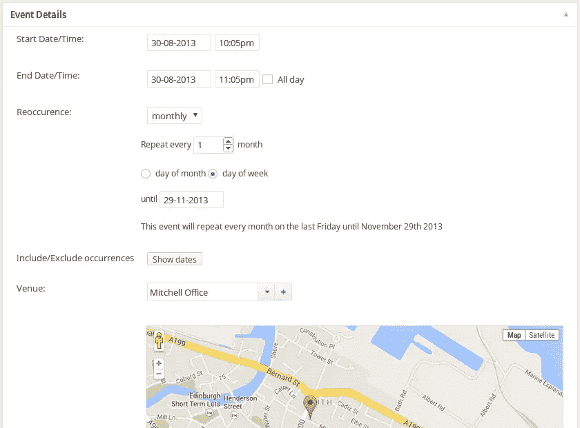

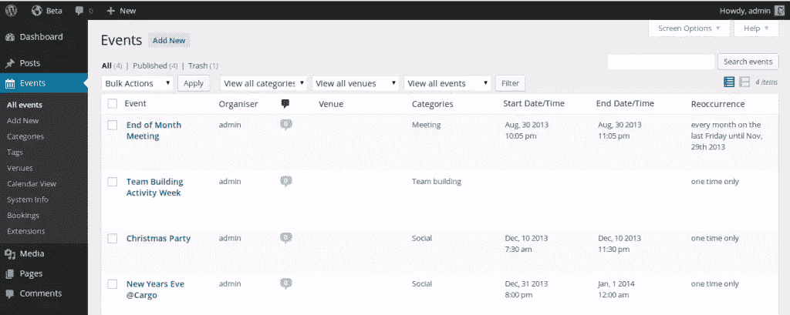

还有 Event Organiser Pro，这是一个付费的高级插件，提供预订管理功能、通过 PayPal 的支付网关、活动搜索短码、场地自定义字段等。每个网站的价格从 40 英镑起。

如果你对数字感兴趣，那么这就是你的活动组织者插件——在其生命周期中有超过 50 万次下载，其中 3 万次是活跃的。而且，它在 80 多条评论中获得了 4.7 星的评级。命中率还不错。

### [GigPress](http://gigpress.com/)

如果你经常巡回演出或者演奏，你真的应该考虑把 GigPress 加入你的 WordPress 库。GigPress 于 2007 年推出，允许你在 WordPress 管理面板中管理即将到来的和过去的表演，并使用 GigPress 网站、PHP 模板标签或简单的短代码在你的网站上实时显示它们。

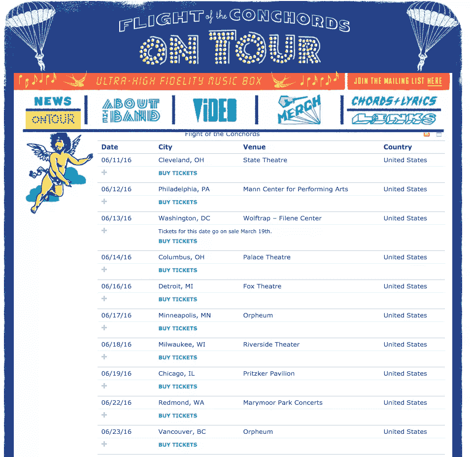

这个插件非常容易使用，你可以使用 HTML 或 CSS 创建你想要的外观。您可以在 GigPress 中管理多个艺术家，并以组合列表或按艺术家分组的方式显示他们——如果您运营一个现场菜单场所，这将非常有用。该插件甚至包括 iCalendar 提要，以及可下载的谷歌日历和个人节目的 iCal 链接。如果你是一个巡回音乐人，你的网站肯定需要包括你的演唱会或巡演日期的所有细节，这是一个简单的方法。

超过 260，000 次下载(目前有 20，000+活跃)和 4.7 星评级，这绝对是最受欢迎的旅游管理插件。

### [MF 演出日历](https://wordpress.org/plugins/mf-gig-calendar/)

这是一个相当简单的活动日历，最初是由一个音乐人创作的，以音乐人为中心。纽约的爵士钢琴家 Matthew Fries(MF in MF Gig Calendar 的出处)开发了这个插件，因为他想为自己的音乐网站设计一个灵活的日历。

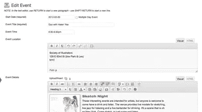

它的功能包括支持多日事件，能够在事件列表中包含样式化的文本、图像、链接和一系列其他媒体，一个超级容易使用的事件复制功能，以及短代码变量，以便用户可以定制输出。此外，它可以让您将活动日历放在您喜欢的任何页面或帖子的多个位置。它的统计数据并不像 GigPress 那样令人印象深刻——20，000 次下载(3，000 次活跃)。

### [演出日历](https://wordpress.org/plugins/gigs-calendar/stats/)

这个插件比 MF Gig Calendar 稍微高级一点(它承认它是为了简单和灵活)。它的目标是音乐家和乐队，他们希望能够在他们的 WordPress 网站上包含他们现场表演的日历。

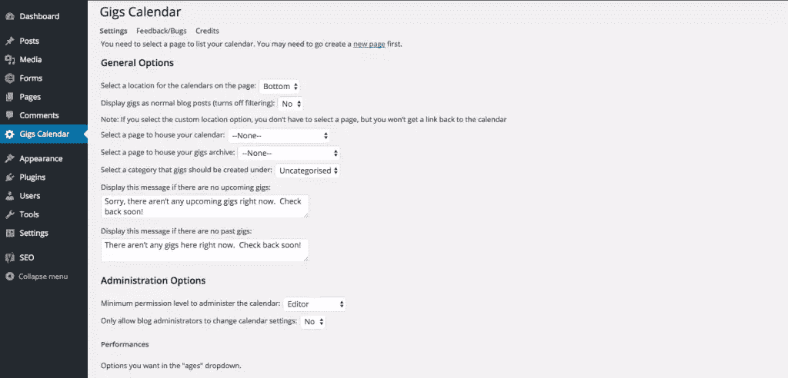

它被设计成对音乐家和乐迷来说都很容易使用。它甚至可以管理场馆数据，包括位置地图和购票链接。它的下载量一直保持在 70，000 次，目前有 3，000 次活跃下载。

## 管理乐队照片的插件

在某些时候，你可能想展示你自己或者你整个乐队的照片。也许你拍了一些很棒的宣传照片，或者你在最近的演出中拍了一批很棒的照片。不管是什么情况，你的粉丝都希望以最简单、最吸引人的方式浏览你的照片。这些图像插件应该有助于这一点。

### 下一代

据它的创建者称，下一代图片库是目前最全面的 WordPress 图片库插件。这个插件有免费版和专业版。专业版将花费你 39 美元，如果你是那种上传大量照片的乐队，可能只值得花这笔钱。专业版可以让你的照片更有创意，你甚至可以制作全幅照片和幻灯片。

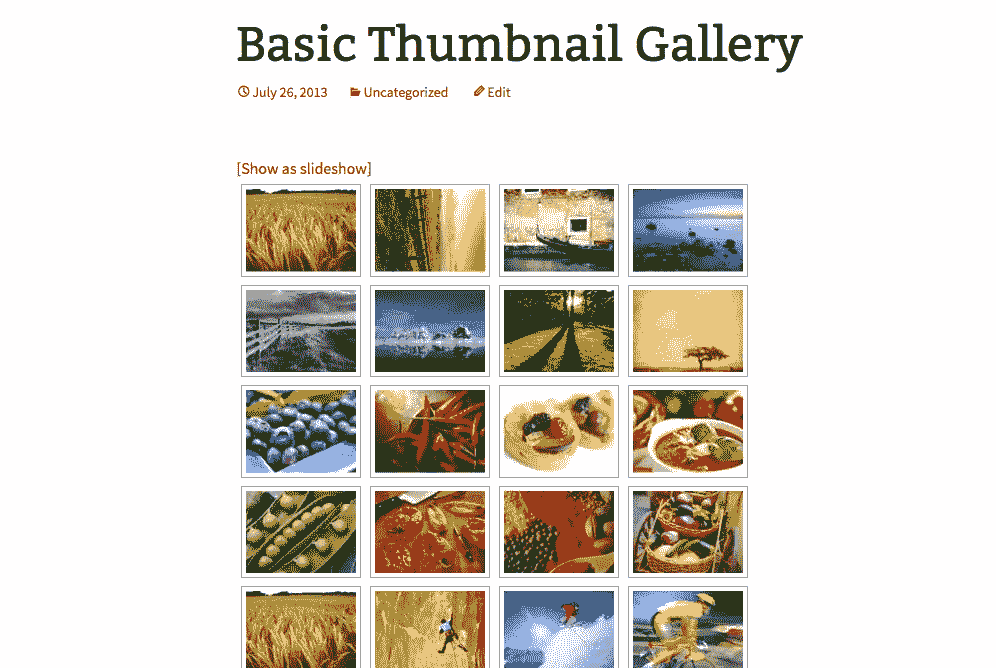

还有许多扩展，添加了所有能想到的功能。如果你的照片是你营销的一个重要部分，那么 NextGen 是你的一个很好的选择。有史以来超过 1400 万次下载，其中 100 万次仍然活跃，可以说这是一个可靠的图像管理工具。

如果这个图片插件不能引起你的兴趣，那么看看我们最近关于 8 个 WordPress 插件的文章，来创造令人敬畏的图片效果。

## 在你的网站上播放音乐的插件

如果你想让粉丝们先睹为快，还有什么比在你的网站上提供现场试听更好的方式呢？有很多插件可以让你很容易地做到这一点，而且不需要太多的麻烦。

### [HTML5 jQuery 音频播放器](https://wordpress.org/plugins/html5-jquery-audio-player/)

如果你想给你的 WordPress 站点添加一个高质量的音乐插件，这可能是最好的选择。有了这个插件，你就可以上传歌曲，让你的听众随时随地都能听到。它是移动友好的，这意味着他们也可以在旅途中听。

这个插件最棒的地方是你可以把它放在页面上任何你喜欢的地方。你可以把它放在你的商店页面上，在专业版中，你甚至可以在每首歌曲旁边放上“立即购买”按钮。你的网站必须展示你的音乐，这是最好的方法。

### [Spotify 大师](https://wordpress.org/plugins/spotify-master/)

Spotify Master for WordPress 使乐队和音乐家可以通过音乐网络 Spotify 显示音乐、播放列表甚至整张专辑。它不使用 JavaScript(而是用 HTML 编码),是一个无错误的扩展。因此，它确保了快速的页面加载速度。

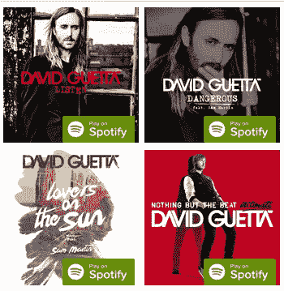

它在页面和页面上都能很好地工作，并且可以通过小部件或短代码插入。此外，它完全移动响应。它的统计数据还不算太差(考虑到 Spotify 的时代)——它已经有超过 27000 次下载。

### [音云大师](https://wordpress.org/plugins/soundcloud-master/)

或者，如果你是 SoundCloud 用户(而不是 Spotify)，你可以选择这个插件。类似于上面的插件，由相同的人制作(TechGasp)——这只是支持 SoundCloud 平台而已！它已经有 59，000 次下载，超过 5，000 次仍然活跃。

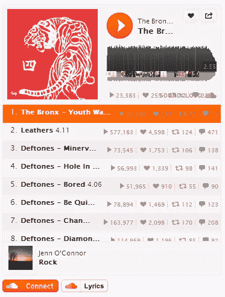

## WordPress 插件帮助联系你的粉丝

对于任何一个音乐人来说，你越成功，你和你的粉丝一对一交流的时间就越少。很有可能，你没有时间回复每一封邮件，每一篇博客评论，每一条推文。幸运是，有几个 WordPress 插件可以帮助你自动化这些过程。它们可能不会取代真正个性化的回应，但至少比没有回应要好。

### [过会儿谢谢我](https://wordpress.org/plugins/thank-me-later/)

这是确保你接触到你的粉丝和祝福者的最好方式，而不必整天粘在你的电脑上。您可以创建一个自动回复，在访问者在您的网站上留下评论后的指定时间发布。

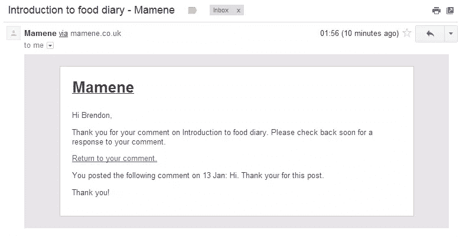

所以，你可以设置它在你的粉丝评论后 5 分钟，一小时，甚至立即回复。你的粉丝会真正欣赏这种个人风格，你可以花更多的时间创作你的下一部杰作。统计数据:164，000 次下载，其中 7，000 次仍然有效。

### [评论重定向](https://wordpress.org/plugins/comment-redirect/)

这是一种比“以后再谢我”更自动化的联系粉丝的方式。这个插件不是发布回复，而是在你的访问者发表评论后，立即将他们重定向到你选择的页面。

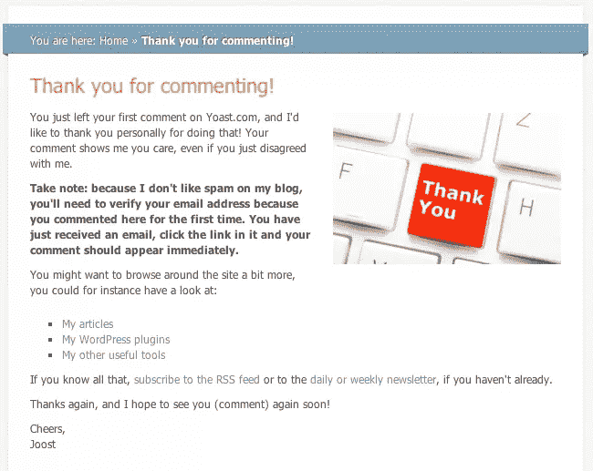

你可以把他们引导到你的“音乐”页面，并留下一张纸条，上面写着“非常感谢你的评论。点击这里查看我们的免费音乐样本。或者，你可以引导他们到你的“巡演”页面，让他们知道你下一场演出的时间和地点。

### [重力形式](https://wordpress.org/plugins/gravity-forms-addons/)

与粉丝和其他音乐人联系是建立你的个人资料和创建网络的最好方式。你的网站通常是粉丝和其他音乐人试图与你联系的主要途径，所以你需要尽可能地简化它。周围有大量的[自由接触形式插件](https://www.sitepoint.com/6-best-free-contact-form-plugins-for-wordpress/)，但是如果你想要一些更令人印象深刻的东西，你应该考虑重力形式。

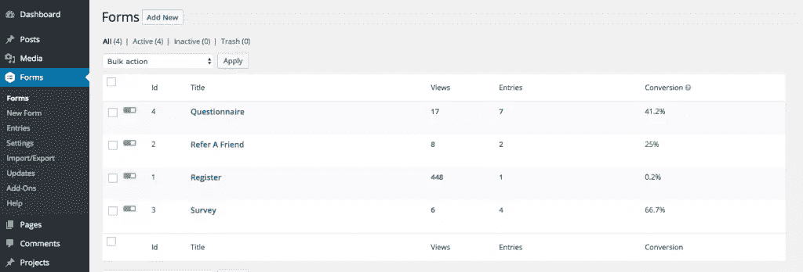

现在你有了它，一个乐队或音乐家的一些最重要的 WordPress 插件的综述。如果你有任何自己的建议，欢迎在下面的评论区提出来。

## 分享这篇文章