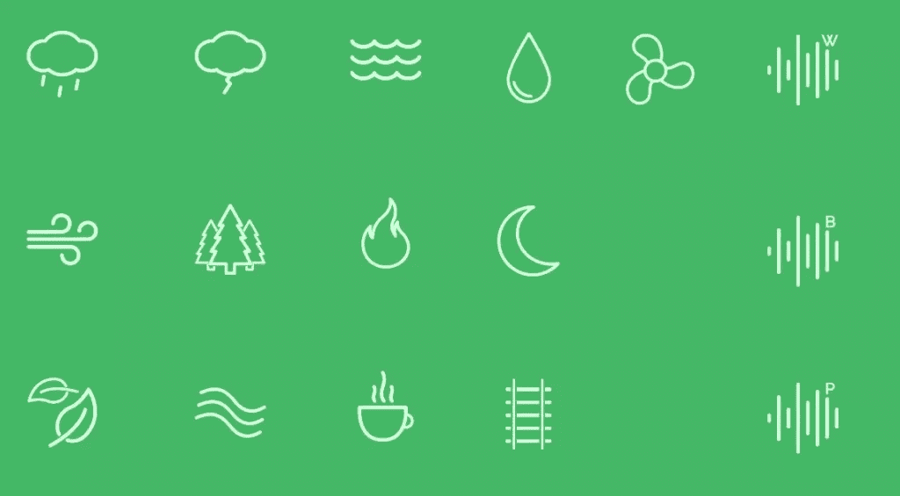

# 快速提示:使用背景白噪音来提高工作效率

> 原文：<https://www.sitepoint.com/quick-tip-use-background-white-noise-for-greater-productivity/>

在这个信息无止境、杂乱无章的时代，很多人都在寻找生产力的天堂，但很少有人能做到。虽然没有适合所有人的最终解决方案，但有各种流程和工具对不同的人有不同程度的影响。

Noisli 就是这些工具中的一个。它基本上是一个背景噪音发生器，帮助你淹没恼人的噪音，让你创造一个完美的工作和放松环境。Noisli 允许您混合不同的声音，根据您的个人需求和品味打造您自己的声音环境。如果你是那些每周尝试一些新的音乐播放列表或广播电台的人之一，Noisli 可能会满足你的需求。事实上，我写这篇文章的时候，Noisli 正在播放背景音乐。

让我们来看看它的特点。

## 声音

Noisli 具有 13 种环境循环声音和三种附加噪音(白噪音、棕色噪音、粉色噪音)。有趣的是，你可以激活一种或多种声音，并改变相对音量，以创造一个总是不同的，令人愉快的声音环境。

## 计时器

Noisli 还提供了一个定时器功能，您可以使用它来实现时间管理方法，如番茄工作法。据说这是一种更有效的时间管理方法，可以减少分心，防止精疲力竭。

您可以使用计时器将工作分成不同的时段，传统上是 25 分钟，中间有 5 分钟的短暂休息。四次训练后，你应该休息 20 到 30 分钟。

**奖励:**如果激活“渐弱”功能，声音会在定时器结束时轻轻停止并渐弱。

## 小型爵士乐队

为了避免每次工作都要混合你喜欢的组合，Noisli 允许你保存你的组合，这样你只需点击一下就可以重放它们。当你发现适合某项任务或情绪的组合时，这真的很有用。您还可以在各种社交网络上与朋友分享您最喜欢的组合。

## 奖励:文本编辑器

Noisli 的主要产品有点噱头，它还包括一个非常简约的文本编辑器。欢迎您的是一个普通的空白屏幕，您可以开始输入。编辑器支持 Markdown 格式，因此您可以使用粗体、斜体、标题或项目符号列表等样式来格式化您的文本。

文本将保存在浏览器的本地，并可以导出到您的 Dropbox 或 Google Drive 帐户。

我发现文本编辑器是一个不错的想法，但我还没有发现自己使用它。文本和一些背景颜色之间的低对比度也使得文本编辑器很难使用。然而，这并不妨碍交易(尤其是对于不花一分钱的东西)。

## 感觉很吵？

Noisli 绝对是你在其他一切都失败的时候应该尝试的东西。这可能不能解决你所有的效率问题，但是试一试，尤其是在你努力排除干扰的情况下。诺斯利绝对为我工作。

[大声点](http://www.noisli.com/)

## 分享这篇文章