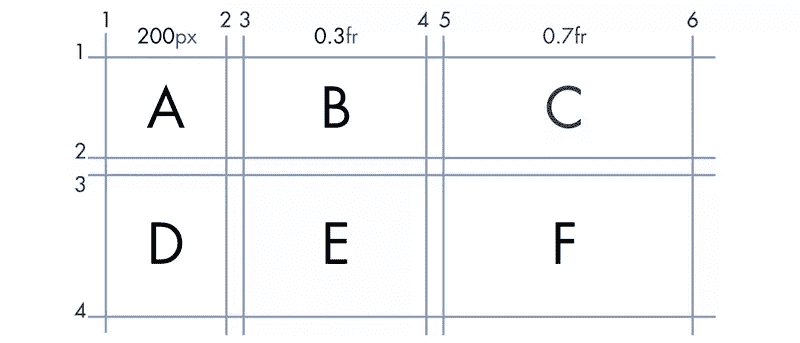
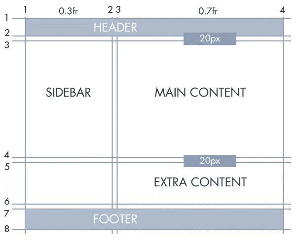

# CSS 网格布局简介

> 原文：<https://www.sitepoint.com/introducing-the-css-grid-layout/>


SitePoint/ [Natalia Balska](http://sf-lab.net/) 的作品。

创建复杂的网站时，网格很重要。网格在现代 web 设计中的重要性从大量实现网格系统以加速开发的框架中显而易见。

随着 [CSS 网格布局](https://www.w3.org/TR/css-grid-1/)规范的引入，您将不再需要仅仅为了使用网格系统而包含一个单独的样式表。另一个好处是，你不必依赖像`inline`和`float`这样的属性来在网页上布局元素。在本教程中，我们将介绍网格系统的基础知识，并创建一个基本的博客布局。

## 浏览器支持

目前，只有 IE 10+和 Edge 支持网格布局——你还不能在商业网站上使用它。

在 Chrome 中可以通过`chrome://flags`中的*“实验 Web 平台特性”*标志来启用。您可以在 Firefox 中使用`layout.css.grid.enabled`标志来启用它。

另一种选择是使用多填充物。一个 [CSS 网格聚合填充](https://github.com/FremyCompany/css-grid-polyfill/)确实存在！使用上面的各种选项，您可以在网格还处于初级阶段时就开始尝试并尽可能多地了解网格布局。

*注意:Internet Explorer 目前已经实现了该规范的旧版本。不幸的是，这意味着它与最新的规范不完全兼容。当浏览本教程中的例子时，我建议你使用 Chrome 或 Firefox，并启用适当的标志。*

## 网格系统术语

CSS 网格系统在布局元素方面类似于表格。但是，它的功能更强大，也更灵活。在这一节中，我将讨论一些在使用网格时需要记住的术语:

**`fr`单位**:该单位用于指定可用空间的一部分。它应该与`grid-rows`和`grid-columns`一起使用。根据规范—

> 在所有基于“长度”或内容的行和列的大小都达到最大值后，就会分配分数空间。

**线条**:线条定义了其他元素的边界。它们既可以垂直运行，也可以水平运行。在下图中，有四条垂直线和四条水平线。

**轨迹**:轨迹是平行线之间的空间。在下图中，有三个垂直和三个水平轨道。

**单元格**:单元格是网格的构建块。在下图中，总共有九个单元格。

**区域**:一个区域是一个具有任意数量单元格的矩形。因此，*轨道*是*区域*，并且*单元*也是如此。


## 在网格中定位元素

让我们从基础开始。在本节中，我将教你如何使用网格将元素定位在某个位置。要使用 CSS 网格布局，您需要一个父元素和一个或多个子元素。为了便于演示，我将为我们的网格系统使用以下标记:

```
<div class="grid-container">
  <div class="grid-element item-a">A</div>
  <div class="grid-element item-b">B</div>
  <div class="grid-element item-c">C</div>
  <div class="grid-element item-d">D</div>
  <div class="grid-element item-e">E</div>
  <div class="grid-element item-f">F</div>
</div>
```

完成标记后，您需要在父元素上应用`display:grid`或`display:inline-grid`以及其他样式，如下所示:

```
.grid-container {
  display: grid;
  grid-template-columns: 200px 10px 0.3fr 10px 0.7fr;
  grid-template-rows: auto 20px auto;
}
```

`grid-template-columns`和`grid-template-rows`属性用于指定各种行和列的宽度。在上面的例子中，我定义了五列。`10px`列充当了在元素之间提供所需间距的槽。第一列`200px`宽。第三列占据了`0.3`部分的剩余空间。同样，第五列占据了`0.7`部分剩余空间。

对`grid-template-rows`中的第一行使用`auto`允许该行根据其内容进行必要的扩展。`20px`排充当排水沟。

在这一点上，这些元素紧密地组合在一起，如下面的演示所示。

参见 [CodePen](http://codepen.io) 上 SitePoint ( [@SitePoint](http://codepen.io/SitePoint) )的笔 [CSS 网格布局演示 1](http://codepen.io/SitePoint/pen/BKVJdW/) 。

请注意，元素 B 位于我们计划用作檐槽的第二列中。如果没有指定子元素在网格中的位置，浏览器会在每个单元格中放置一个元素，直到第一行被完全填充，然后其余的元素会放入下一行。这就是我们在第二行留下四个备用列的原因。

要将元素移动到网格中的特定单元格，需要在 CSS 中指定它们的位置。在我解释如何使用网格系统移动元素之前，请看下图。



在本例中，我们将使用“基于行的位置”。基于线的放置意味着网格系统中的线将作为放置和限制元素的准则。我们以 B 元素为例。水平方向上，从第 3 列开始，到第 4 列结束。沿着垂直轴，它位于第 1 行的线和第 2 行的线之间。

我们使用`grid-column-start`来指定一个元素的起始垂直线。在这种情况下，它将被设置为`3`。`grid-column-end`表示一个元素的结束垂直线。在这种情况下，该属性将等于`4`。相应的行值也将以类似方式设置。

记住以上所有内容，要将元素 B 移动到第二个单元格，您将使用以下 CSS:

```
.element-b {
  grid-column-start: 3;
  grid-column-end: 4;
  grid-row-start: 1;
  grid-row-end: 2;
}
```

类似地，要将元素 F 移动到第六个单元格，可以使用下面的 CSS:

```
.element-f {
  grid-column-start: 5;
  grid-column-end: 6;
  grid-row-start: 3;
  grid-row-end: 4;
}
```

在 CSS 中做了这些改变后，元素的间距应该适当，就像在这个演示中一样:

参见 [CodePen](http://codepen.io) 上 SitePoint ( [@SitePoint](http://codepen.io/SitePoint) )的笔 [CSS 网格布局演示 2](http://codepen.io/SitePoint/pen/BKVJJR/) 。

## 创建基本布局

现在是时候创建一个基本的博客布局了。博客将有一个标题，一个页脚，一个侧边栏和两个实际内容的部分。让我们从标记开始:

```
<div class="grid-container">
  <div class="grid-element header">Header</div>
  <div class="grid-element sidebar">Sidebar</div>
  <div class="grid-element main">Main Content</div>
  <div class="grid-element extra">Extra Info</div>
  <div class="grid-element footer">Footer</div>
</div>
```

请记住，标记中元素的顺序对于元素在网页上的位置没有任何影响。只要不更改 CSS，就可以将页脚放在标记中页眉的上方，并且元素在网页上的位置不会改变。当然，我不会推荐它。关键是，您的标记将不再决定元素的位置。

我们现在要做的就是计算出各种元素的属性值，比如`grid-row-end`。就像上一个例子一样，我们将使用一个网格图来确定所有网格属性的值。



如上图所示，标题从第 1 列到第 4 列，从第 1 行到第 2 行。为此，CSS 应该如下所示:

```
.header {
  grid-column-start: 1;
  grid-column-end: 4;
  grid-row-start: 1;
  grid-row-end: 2;
}
```

类似地，“额外内容”从列行 3 到列行 4，从行行 5 到行行 6。因此，CSS 应该是:

```
.extra {
  grid-column-start: 3;
  grid-column-end: 4;
  grid-row-start: 5;
  grid-row-end: 6;
}
```

现在也可以轻松确定所有其他元素的网格属性。查看 CodePen 演示，并尝试各种网格值，以更好地理解基于行的放置:

参见 [CodePen](http://codepen.io) 上 SitePoint ( [@SitePoint](http://codepen.io/SitePoint) )的笔 [CSS 网格布局演示 3](http://codepen.io/SitePoint/pen/GZGydN/) 。