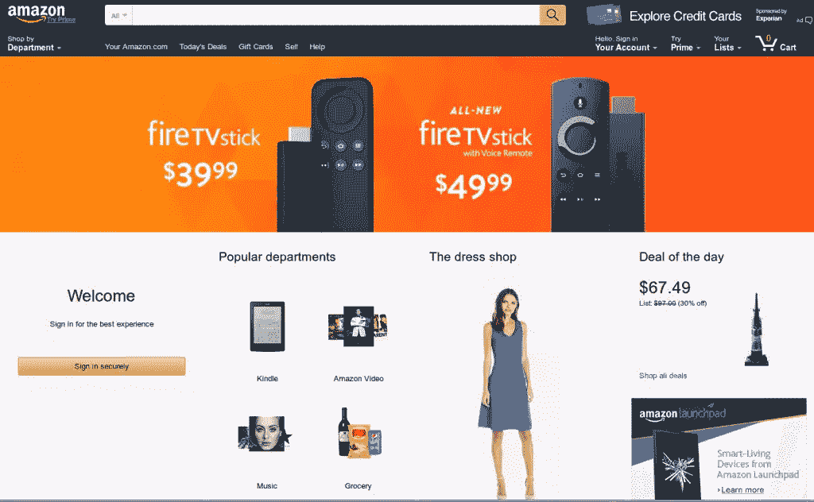
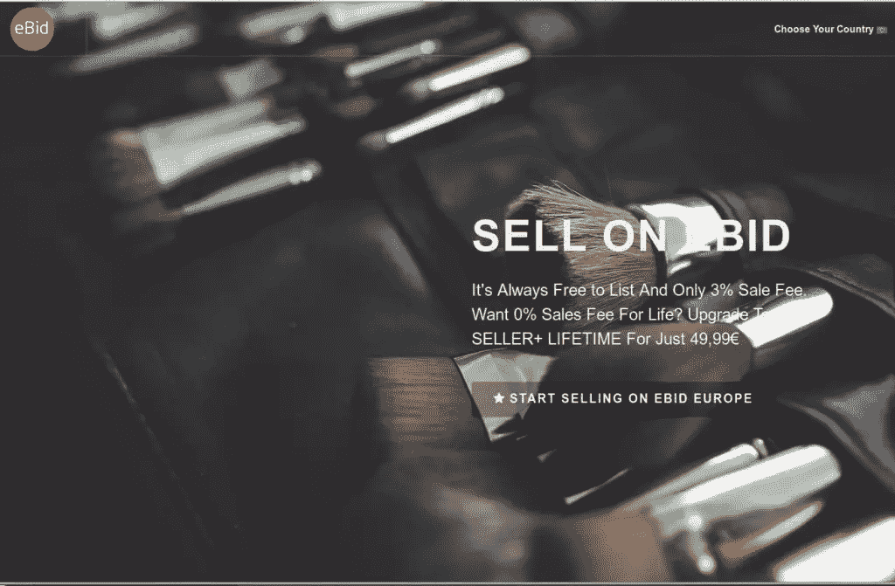
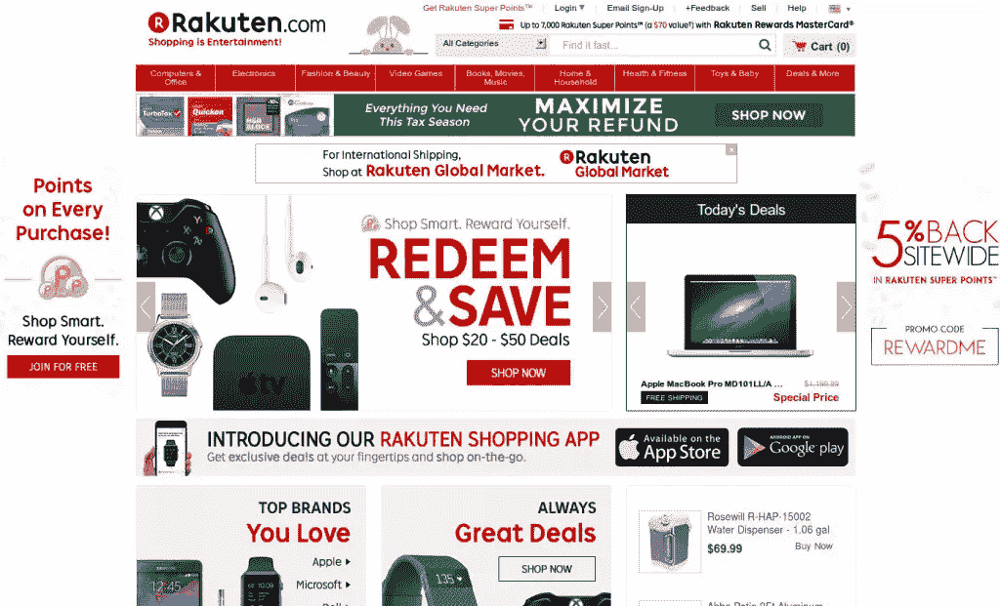
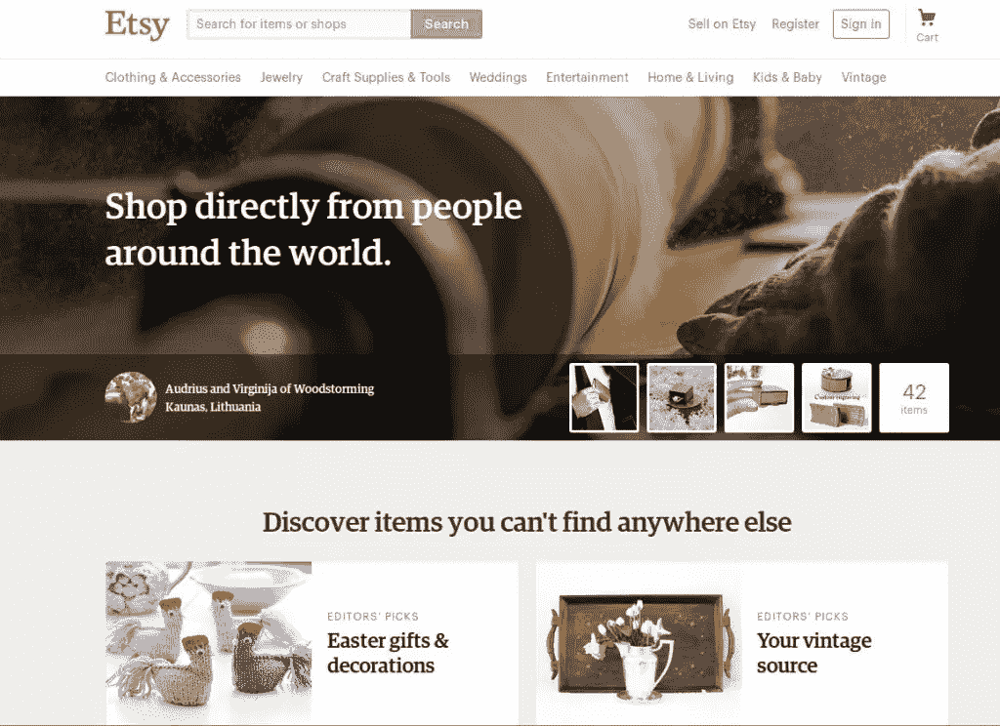
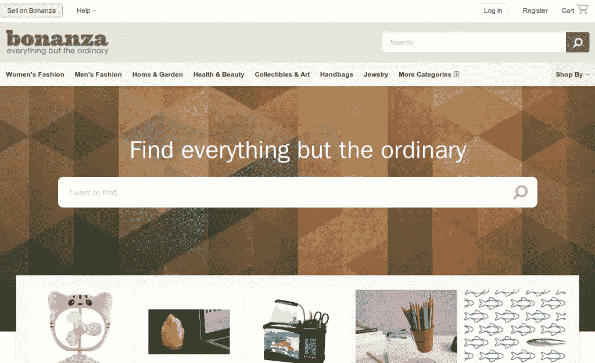
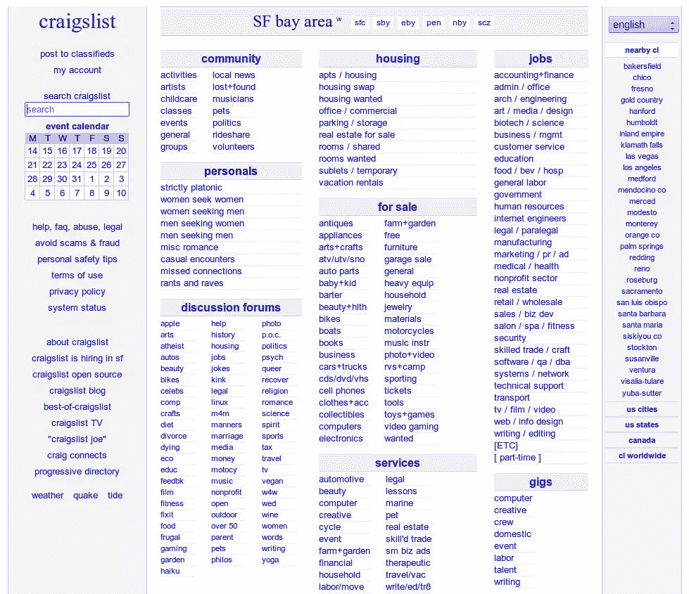
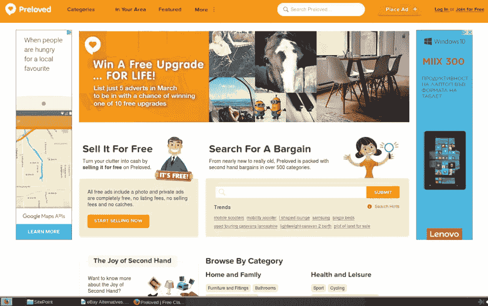

# 电子商务卖家的 7 个易贝选择

> 原文：<https://www.sitepoint.com/ebay-alternatives-for-sellers/>

当你想找一个地方卖你的东西时，易贝可能是你想到的第一个市场。它是世界上最大也可能是最知名的市场，但这并不意味着它是你的最佳选择。

尽管易贝很好，但很难忽视它的缺点。这里很拥挤，卖家经常无缘无故被封杀，纠纷以有利于买家的方式解决，等等。所有这些原因肯定会让潜在卖家望而却步——谁愿意在这样一个不确定的环境中投入时间和金钱？

我自己也考虑过在易贝出售，但经过初步研究后，我完全放弃了这个想法。相反，我开始研究替代方案，这是这篇文章的灵感来源。

有相当多的易贝替代品，我建议你尝试一些。正如我经常说的，不要把所有的鸡蛋放在一个篮子里，也就是说，你最好在多个市场销售，而不是把所有的资源都集中在一个市场上。

选择哪一个开始取决于你(和你的产品类型)。基本规则是，较大的市场吸引更多的买家，但较小的市场可能是更好的选择，因为一般没有太多的竞争。

除了在一些市场上列出你的产品，建立自己的网上商店也是一个选择。然而，这几乎不是最简单和最便宜的方法。虽然你肯定对自己的网站有更多的控制权，但计算一下为了使它成功，你必须投入到建立商店、维护商店和推广商店的所有金钱和精力，结果证明一个已建立的市场是一个更好的选择，至少在开始时是这样。

这里有一些其他的易贝替代品供您考虑。

## 1.亚马孙

虽然许多人会争辩说亚马逊根本不是易贝的替代品，因为它表现出了一些将卖家拒之门外的症状——例如，高得离谱的佣金，随心所欲的关门等等。—你不能否认亚马逊是一个巨大的市场，在这里你可以出售几乎所有你能想到的东西(当然，前提是它是合法的)。

说亚马逊是一个机构并不为过。不要指望马上去网站开始销售。在你开始销售之前，有很多东西要读。例如，你需要考虑开立账户的类型([专业卖家](https://services.amazon.com/content/sell-on-amazon.htm/ref=footer_soa?ld=AZFSSOA-dT1)、[卖家](http://www.amazon.com/b/ref=footer_vend?ie=UTF8&node=10659983011)、[制造商和经销商](http://www.amazon.com/b/ref=footer_B2B_MM?ie=UTF8&node=11436294011)等)，因为他们有几个，每个人都有不同的津贴。

你还需要考虑卖什么。除了你可以在许多其他网站上销售的各种各样的产品之外，亚马逊的一些独特之处在于你可以销售服务

[自行发布](http://www.amazon.com/gp/seller-account/mm-summary-page.html?ie=UTF8&ld=AZFooterSelfPublish&topic=200260520)。名单上的其他易贝城市都不具备这一点。

至于付款、运输和佣金，这些因产品和账户类型而异。以下是关于[运输和交付](http://www.amazon.com/gp/help/customer/display.html/ref=footer_shiprates?ie=UTF8&nodeId=468520)以及[支付、定价和促销](http://www.amazon.com/gp/help/customer/display.html/ref=hp_left_v4_sib?ie=UTF8&nodeId=513058)的一般规则。你可能还想检查亚马逊的[履行情况。](https://services.amazon.com/fulfillment-by-amazon/benefits.htm/ref=asus_fba_fnav)

换句话说，如果你决定在亚马逊上销售，准备好花几天甚至几周时间研究这个系统是如何工作的。它确实提供了巨大的机会，但它不适合新手卖家。如果你是网上销售的新手，你最好从容易的地方开始。

## 2.eBid

eBid 是另一个巨大的市场，尽管没有易贝或亚马逊那么大。看起来真的很有前途！这并不新鲜，自 1999 年就有了，但最近几年呈指数级增长。它的一个很大的特点是，你可以从亚马逊、易贝和其他市场进口商品，再加上它的批量上传功能，可以节省大量时间。

eBid 是一个全球市场。它拥有超过 13，000 个产品类别，涵盖所有产品组，从书籍和技术，到服装和家居用品。也可以批发销售。

我喜欢在主页上清楚地说明佣金，潜在卖家不必浏览无数页面来获得这些重要数据:

*“总是免费上市，只收 3%的销售费用。想要终身 0 销售费？仅需 49.99 欧元即可升级至卖家+终身服务。”*

eBid 提供卖家和卖家+账户。至于支付，他们与 PPPay、PayPal、Skrill 合作，当然还有信用卡。总而言之，对于大多数产品来说，eBid 是最好的易贝替代品。

## 3.乐天

乐天市场是另一个全球市场。它在日本很受欢迎，但在许多其他国家也很受欢迎。过去我为他们做过一些代销商销售，但我没有在那里做销售的个人经验。乐天是一个全球网站，提供你能想到的任何类别的商品——书籍、个人物品、科技产品、家居用品等。

如果你正在寻找一个便宜的地方出售，乐天不是你的选择。与列表免费且佣金很低的网站相比，乐天的[定价选项](http://www.rakuten.com/sell#pricing)令人吃惊，但如果你设法在那里卖出数量，它可能会比没有费用(也没有买家)的网站更好。

与我没有列出的其他一些大型网站类似，乐天也不对国际卖家开放。以下是他们的条款对资格的规定:

 *“出售有什么要求？

我们网站上的商家必须具备以下条件:

1.  美国发货和退货地址
2.  美国银行账户
3.  美国或加拿大信用卡”

支付系统的选择取决于你。正如他们所说，“我们市场上的大多数商店接受主要信用卡(Visa、MasterCard、JCB、AMEX、Diners 等)、Paypal、支付宝和银行转账。”这同样适用于运输方式——您可以单独管理它们，并且可以使用直接或间接运输。

基于所有这些，我的结论是，与易贝的前两个选择相比，乐天没有那么好，但它仍然是一个大市场，对你来说，它毕竟可能是一个选择。

## 4.Etsy

与目前的市场不同，Etsy 并不是一个通用的市场。相反，它专注于手工和复古的东西。起初，卖家只允许出售他们自己制作的东西，但现在他们可以使用直运。这意味着你也可以在 Zazzle 或 CafePress 等网站上销售按需印刷的产品。

至于产品类别，正如我已经提到的，Etsy 不是一个通用的市场。它有以下几个类别:服装和配饰、珠宝、工艺用品和工具、婚礼、娱乐、家居生活、儿童和婴儿以及古董。

Etsy 收取 0.20 美元的上市费。上市有效期为 4 个月或直到产品售出。理论上，刊登费应该会减少垃圾邮件的数量，因为当卖家必须付费时，他们只会上传他们最好的东西。然而，除非你上传了数百万件卖不出去的东西，否则费用还是可以承受的。

该网站使用他们自己的直接结账支付系统，但在商店的描述中，我看到卖家提到他们也接受直接支付。如果你选择直接支付，这取决于你选择接受哪种支付系统。使用直接结账，您可以通过信用卡和借记卡、PayPal、谷歌钱包、Apple Pay 和 Etsy 礼品卡付款。

当您销售产品时，如果您使用直接结账，将收取 3.5%的交易费和 4%+0.30 美元的支付处理费。如果你不使用直接结帐，在大多数情况下，你仍然需要支付处理费用，但这些费用取决于你所使用的服务。

## 5.富矿带

Bonanza 是另一个可以考虑的易贝选择。事实上，他们积极宣传自己是比易贝更好的[——“连续五年推荐易贝”。](http://www.bonanza.com/ebay_alternative)

Bonanza 的产品种类不像易贝那么多，主要是时尚、家居和园艺、健康和美容产品，但他们也有书籍、电脑和科技产品等。这个网站看起来很有前景，它在我个人的尝试列表中。

与 Etsy 类似，Bonanza 专营独特的物品和独一无二的发现，但你也可以看到大量生产的物品。与 eBid 类似，Bonanza 也为易贝、Etsy 和亚马逊上的列表提供导入功能。

他们的费用和支付相对较低。标准展位 500 美元以下的 FOV(最终报价)收取 3.5%的费用，500 美元以上的展位收取 17.50 美元+ 1.5%的费用，这些费用相当合理。

在 Bonanza 上，你可以通过 PayPal、信用卡和借记卡接受付款，也可以通过亚马逊结账。

## 6.分类广告网站

Craigslist 和其他类似的分类广告网站是易贝的另一个选择。我认识一些卖家，他们只在 Craigslist 上卖东西，甚至不知道还有其他销售渠道。然而，这并不意味着分类广告会为你工作。有些网站是免费的，有些是按列表收费的，或者是固定的(每周/每月)费用。一般来说，他们不收佣金，你自己处理付款。

## 7.当地市场和/或分类广告网站

最后，但同样重要的是(正如老话所说)，你可能想探索当地的替代方案。这里的选择非常多——从 Craigslist 的本地版块，到本地网站，比如 [Preloved](http://preloved.co.uk) 。不幸的是，我在这方面帮不上什么忙——你需要自己研究在你的特定位置有哪些选择。

当地市场通常较小，但更有针对性。减少竞争的好处是显而易见的。当从另一个地方送货花费很大时，在本地销售是笨重和/或体积大的物品的一个很好的选择。此外，当买家想在购买前亲自看到商品时，本地销售胜过所有其他选择。

## 结论

还有更多全球性和普遍性的市场，更不用说本地和利基市场，我没有包括在本文中。其中一些对你个人来说可能是更好的选择，但我试图把重点放在更受欢迎的替代品上。

如果文章中列出的易贝替代品都不适合你，通过一些研究，你一定会找到其他的。例如，如果你在英国，[这个列表](http://www.ebay-alternatives.co.uk/)可能对你特别有用。或者，如果你是批发商，别忘了检查一下[阿里巴巴](http://www.alibaba.com)。

## 分享这篇文章*