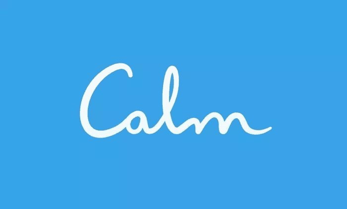
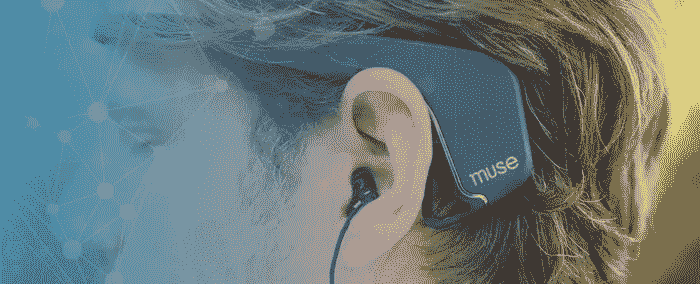
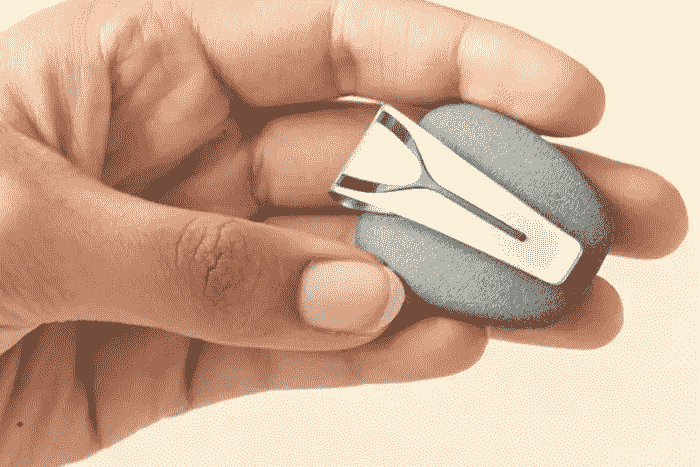
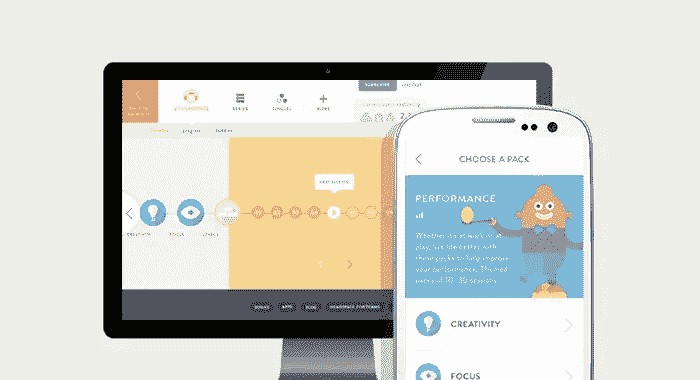
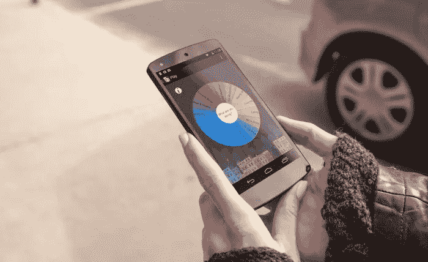

# 7 个冥想应用程序和设备，供有头脑的企业家使用

> 原文：<https://www.sitepoint.com/7-meditation-apps-and-devices-for-mindful-entrepreneurs/>

压力是日常生活的一部分，尤其是当你不得不应对难缠的客户，一天中盯着电脑屏幕几个小时，或者不断回复电子邮件时——更不用说上下班高峰期经常可怕的通勤，以及其他各种你几乎无法控制的事情了。

幸运的是，冥想可以帮助减少(甚至停止)压力。

冥想是一种练习，在这种练习中，你学会休息你的大脑，并达到一种意识状态，这种状态导致完全的清晰和平静，通常通过舒适地坐着，闭上眼睛，倾听周围的声音和深呼吸来实现。你可以每天冥想 10 分钟。具有讽刺意味的是，一般企业家压力的主要原因(当然是技术)也可以帮助我们找到我们的禅。让我们来看看七个可以帮助你冥想的应用程序和小工具，这是一种已经使用了几千年的练习的现代替代方法。

## 1.镇定的;冷静的

冷静是一个冥想应用程序，有助于睡眠，放松和正念。通过 [Google Play](https://play.google.com/store/apps/details?id=com.calm.android) 或[苹果应用商店](https://itunes.apple.com/gb/app/calm-meditate-relax-breathe/)可以免费下载，一旦你通过脸书或电子邮件登录，你就可以开始一个名为“平静 7 天”的初学者课程。每节课只有 10 分钟。非常适合忙碌的企业家在午休或堵车时使用！如果它对你有用，你可以订阅每月 9.99 美元或每年 39.99 美元。

## 2.司文艺、音乐、美术的女神缪斯

[Muse](http://www.choosemuse.com/how-does-muse-work/) 是一款在你冥想时测量大脑信号的头带。它的七个校准传感器(两个在前额，两个在耳朵后面，三个参考传感器)检测和测量大脑的活动。

它通过蓝牙连接到你的移动设备上的一个应用程序，一旦连接上，你将被引导通过一个教程，如何调整它，以便它有效地读取和监控你的大脑信号。每次使用前，因为你的大脑每天都不一样，所以你会完成一个 60 秒的头脑风暴任务。

在用放松的音乐给你减压后，Muse 通过将你的大脑信号转换成风的声音来对你的冥想过程提供反馈。平静的风表明你的思想已经安定；当大脑更活跃时，风变得更强。使用后，你的进度会被记录下来，你可以解锁新的应用功能。

有什么不好的地方吗？也许吧。很明显你正穿着它，它的价格是 249 美元(在亚马逊上)——如果你不介意的话，评论平均是四星！

## 3.螺旋

Spire(149 美元)是一个小石头形状的活动和正念追踪器，可以很容易地放在你的腰带上，非常适合那些经常移动或需要一些可以带着去工作的东西的人。它会记录你的呼吸和活动，并在相应的应用程序上传达。

Spire 在你的设备屏幕上实时显示你的呼吸，就像你对着镜子呼吸一样，并让你知道你是否感到压力或缺乏注意力。一旦它通知你当前的精神状态，应用程序就会为你提供活动，以便达到最佳的正念水平。

遗憾的是，它不适用于 Android，但很快就会推出！

## 4.顶部空间

[Headspace](https://www.headspace.com/headspace-meditation-app) 是一款 iOS/Android 应用，它将自己描述为“头脑的健身房会员”；它使用健身房伙伴系统的概念，使冥想也成为一种社交体验。像 Calm 一样，有一个名为“Take Ten”的免费课程，但如果你喜欢 Headspace，你可以每月支付 6.24 美元。订户可以享受数百小时的内容，包括从两分钟到整整一小时的有指导和无指导冥想课程。

## 5.Thync

Thync 是一个弯曲的三角形模块，可以卡在两条带子上，然后贴在你的额头和脖子上。它通过蓝牙连接到智能手机，并使用安全的电振动(低能量波形)，有趣的是，Thync 刺激的神经与接吻、舒缓按摩或冷水溅到脸上时刺激的神经相同。你可以通过应用程序选择不同的氛围，这取决于你是需要放松还是需要活力。thync 199 美元。

## 6.成佛 2

Buddhify 2 是一款允许你在任何地方休息和冥想的应用程序，对于那些正在参加会议或工作的人，或者在高峰时间的压力下，或者那些在忙碌的一天中需要一分钟呼吸的人来说，这是一款非常棒的应用程序。它包括 80 多个全天的冥想指导课程，包括旅行、睡眠、午休和工作(甚至在电脑上工作)，这是忙碌的企业家的绝佳选择。

适用于 iOS 和 Android 设备的 [Buddhify 2](http://buddhify.com/) 仅售 2.99 美元，对于那些不需要所有花哨功能的人来说，这是一个实惠、简约的选择。

## 7.奥姆瓦纳

Omvana 是一款捆绑了舒缓音乐、冥想演讲和舒缓声音的应用。Omvana 被称为冥想的“Spotify ”,可以在 iOS 和 Android 设备上免费下载。它有数千首曲目，有些甚至针对特定领域，如睡眠和生产力。Omvana 还有一个混音板，允许用户混合和编辑曲目，创建他们自己的放松冥想环境。

## 结论

冥想不需要一个隐蔽、安静的地方，也不需要占用你一天的大量时间；多亏了现代科技的奇迹，你可以在早晨的通勤中、在你的办公室里冥想，想冥想多久就冥想多久。

科技如何帮助你更好地冥想？有没有一款冥想 app 改变了你的生活？如果有我可能错过的任何应用程序或小工具，请在下面的评论中分享它们。

## 分享这篇文章