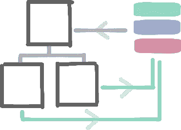
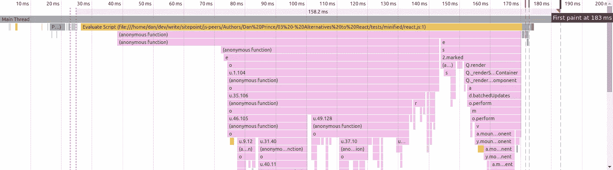
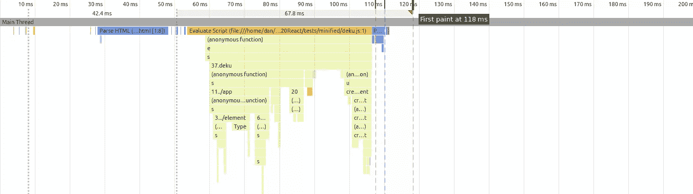
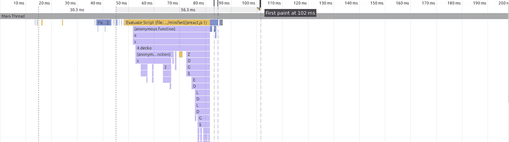
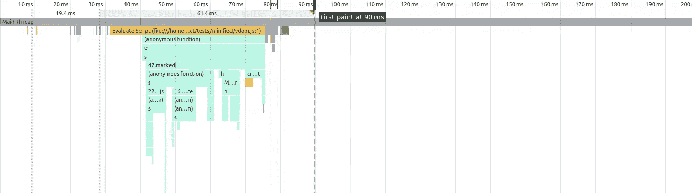

# 3 种轻量级 React 替代方案:Preact、VirtualDom 和 Deku

> 原文：<https://www.sitepoint.com/react-alternatives-preact-virtualdom-deku/>

*这篇文章由 [Craig Bilner](https://www.sitepoint.com/author/cbilner) 和 [Bruno Mota](https://www.sitepoint.com/author/bmota/) 进行了同行评审。感谢 SitePoint 的所有同行评审员使 SitePoint 的内容尽可能做到最好！*

React 的声明性组件和虚拟 DOM 渲染已经席卷了前端开发领域，但它并不是唯一基于这些想法构建的库。今天，我们将探索在其他三种类似 React 的替代方案中构建应用程序是什么样的。

我们假设您已经熟悉 React 及其生态系统中使用的术语。如果你需要从头开始或者只是更新一下，那么看看我们之前的文章。

## 概观

让我们从我们将要比较的库的高级概述开始。

### [德库(2.0.0-rc15)](https://github.com/dekujs/deku)

[](https://www.npmjs.com/package/deku)

Deku 的目标是成为 React 的一个更实用的替代品。它防止组件具有本地状态，这允许所有组件被编写为与外部状态管理解决方案如 [Redux](https://redux.js.org) 通信的纯函数。

### [预动作(4.1.1)](http://developit.github.io/preact/)

[](https://www.npmjs.com/package/preact)

Preact 试图使用尽可能少的代码来模拟 react 的核心功能。假设您将使用 ES2015，Preact 采用了一些快捷方式，并削减了 react 的原始功能集，以产生一个仅重 3KB 的微型库。

### [虚拟 DOM (2.1.1)](https://github.com/Matt-Esch/virtual-dom)

[](https://www.npmjs.com/package/virtual-dom)

React、Deku 和 Preact 给了你一个虚拟 dom 之上的组件抽象，virtual-dom 包给了你自己创建、比较和渲染虚拟 DOM 节点树所需的底层工具。(*这与 React 和 Preact 所基于的虚拟 DOM 不是一回事！*)

像 Virtual-DOM 这样的低级库可能看起来像一个奇怪的反应，但是如果你对编写高性能的移动网络体验感兴趣，那么观看[袖珍 JS](https://www.youtube.com/watch?v=okk0BGV9oY0) 是一个很好的开始。事实上，这就是我们将虚拟世界作为对比的原因。

我们将使用这些库中的每一个来构建一个组件，构建我们的数据流，并最终查看每个应用程序的大小和性能。

## 成分

这里有一个 React 组件，它将使用标记为的库[呈现一些 Markdown。](https://github.com/chjj/marked)

```
import React from 'react';
import marked from 'marked';

const Markdown = React.createClass({
  propTypes: {
    text: React.PropTypes.string
  },
  getDefaultProps() {
    return { text: '' };
  },
  render() {
    return (
      <div
        dangerouslySetInnerHTML={{
          __html: marked(this.props.text)
        }}>
      </div>
    );
  }
}); 
```

我们使用[道具验证](https://facebook.github.io/react/docs/reusable-components.html#prop-validation)让组件在收到错误类型的道具时警告我们。它还实现了一个`getDefaultProps()`方法，允许我们为组件提供默认值，以防没有值传入。最后，我们实现了一个 render 方法，它返回这个组件的用户界面。

为了防止 React 在渲染时逃脱我们的标记，我们需要将它传递给 [dangerouslySetInnerHTML](https://facebook.github.io/react/tips/dangerously-set-inner-html.html) 属性。

### 德库

接下来，我们将使用 Deku 实现相同的组件。

```
/** @jsx element */
import { element } from 'deku';
import marked from 'marked';

const Markdown = {
  render({ props: { text='' } }) {
    return <div innerHTML={marked(text)}></div>;
  }
}; 
```

第一行是一个编译器杂注，它告诉我们的编译器将 JSX like `<h1>Hello</h1>`转换为`element('h1', null, 'Hello')`而不是`React.createElement('h1', null, 'Hello')`，这允许我们将 JSX 与 Deku 一起使用，而不是 React。该选项也可以通过[进行配置。babelrc 文件](https://babeljs.io/docs/plugins/transform-react-jsx/)。

相比 React，我们的 Deku 组件肯定更简单。Deku 组件没有可以用`this`引用的实例，这意味着组件可能需要的所有数据都将作为一个名为`model`的对象传递给方法。这个对象包含我们组件的`props`，我们可以使用析构语法来提取`text`属性。

Deku 没有适当验证，但是我们至少可以通过在这些析构赋值中提供默认值来模拟`getDefaultProps()`。

### 提前

接下来是 Preact。

```
/** @jsx h */
import { h, Component } from 'preact';
import marked from 'marked';

class Markdown extends Component {
  render() {
    const { text='' } = this.props;
    return (
      <div
        dangerouslySetInnerHTML={{
          __html: marked(text)
        }}>
      </div>
    );
  }
} 
```

同样，我们需要告诉编译器将 JSX 转换成 Preact 能理解的东西。Preact 组件与 [React 的 ES2015 类组件](https://facebook.github.io/react/blog/2015/01/27/react-v0.13.0-beta-1.html#plain-javascript-classes)非常相似，我们能够复制早期的大部分渲染代码。像 Deku 一样，Preact 不支持属性验证或默认属性，但是我们可以用析构赋值来模拟默认属性。

### 虚拟世界

最后，我们将看看虚拟世界。

```
/** @jsx h */
import { h } from 'virtual-dom-util';
import marked from 'marked';

function Markdown({ text='' }) {
  return <div innerHTML={marked(text)}></div>;
} 
```

我们没有提供任何构建组件的工具，所以你不会在这里看到像`this`、`props`或`state`这样的构造。事实上，这些“组件”只是返回虚拟 DOM 节点树的函数。

创建虚拟 DOM 节点的本地方式与 JSX 不兼容，所以我们使用`virtual-dom-util`包为我们提供了一个 JSX 兼容的替代方案。在呈现组件之前，我们实际上不需要导入`virtual-dom`包。

## 渲染组件

接下来，我们将看看如何将组件呈现到 DOM 中。所有这些库都呈现在一个目标节点中，所以我们将在 HTML 文件中创建一个。

```
<div id="app"></div> 
```

### 反应

```
import { render } from 'react-dom'

render(
  <Markdown text='Hello __world__' />,
  document.getElementById('app')
); 
```

为了呈现一个 React 组件，我们需要使用`react-dom`包，它提供了一个`render`函数，该函数理解如何将 React 组件树转换成 DOM 节点树。

为了使用它，我们传递一个 React 组件的实例和一个对 DOM 节点的引用。ReactDOM 处理其余的。

### 德库

```
/** @jsx element */
import { createApp, element } from 'deku';

const render = createApp(
  document.getElementById('app')
);

render(
  <Markdown text='Hello __world__' />
); 
```

Deku 呈现组件的方式略有不同。因为 Deku 组件不是有状态的，它们不会自动重新呈现自己。相反，我们使用`createApp()`围绕一个 DOM 节点构建一个渲染函数，每次外部状态改变时我们都可以调用它。

现在，我们可以传递 Deku 组件的实例，以便在该节点中呈现它们。

### 提前

```
/** @jsx h */
import { h, render } from 'preact';

render(
  <Markdown text='Hello __world__' />,
  document.getElementById('app')
); 
```

Preact 为我们提供了一个类似的接口，用于将组件呈现到 DOM 节点中，但是它位于核心 Preact 包中，与 ReactDOM 不同。像许多 Preact API 一样，没有什么新东西需要学习，react 中的概念很容易移植。

### 虚拟世界

```
/** @jsx h */
import { create } from 'virtual-dom';
import { h } from 'virtual-dom-util';

const tree = <Markdown text='Hello __world__' />;
const root = create(tree);

document
  .getElementById('app')
  .appendChild(root); 
```

Virtual-DOM 在如何创建和使用组件方面给了我们更多的灵活性。首先我们创建一个虚拟树的实例，我们用`create`函数将它实现为一个 DOM 节点。最后，我们可以随意将这个孩子添加到 DOM 中。

## 数据流

在我们考虑的三个库中，有两种不同的方法来管理我们的应用程序状态。

### 里面的

和 React 一样，Preact 也允许组件管理自己的状态。


每个组件跟踪对不可变状态对象的引用，该对象可以通过一个叫做 [setState](https://facebook.github.io/react/docs/component-api.html#setstate) 的特殊组件方法来更新。当这个函数被调用时，组件将假设某些东西已经被改变，并尝试重新呈现。从状态已更新的组件接收道具的任何组件也将被重新呈现。

Preact 还以 [shouldComponentUpdate](https://facebook.github.io/react/docs/component-specs.html#updating-shouldcomponentupdate) 的形式为我们提供了一种通过细粒度控制来覆盖默认行为的机制。

### 在外面

Deku 特意决定将状态管理移到组件之外，而 Virtual-DOM 的级别太低，无法处理像 state 这样的抽象。这意味着如果我们想用它来构建应用程序，那么我们需要将状态保存在其他地方。



在这种情况下，我们的状态转移到一个外部容器中，根组件用它为应用程序的其余部分提供数据。每次状态容器更新时，我们都需要重新呈现整个应用程序。

要更新状态，组件必须与状态容器交流更改。在类似 Flux 的系统中，这种交流通常以*动作*的形式出现。

重要的是要记住，尽管 React 和 Preact 支持组件本地状态，但它们也可以用于外部状态管理解决方案。

## 应用程序结构

本节将着眼于我们如何实现这些关于状态、数据流和作为实际代码重新呈现的想法。在这个过程中，我们将把我们的`Markdown`组件构建成一个实时降价编辑器。你可以在下一节的[中看到成品组件的演示。](#demos)

### 德库

一个 Deku 应用程序通常由两个主要部分组成:**一个组件树**和**一个商店**。


我们将使用 [Redux](http://redux.js.org/) 作为商店，因为它与 Deku 开箱即用。树*中的组件分派*动作，我们的 Redux reducers 将使用这些动作来改变状态，并且每当状态改变时，我们将使用*订阅*机制来重新呈现组件树。

首先，我们将建立一个简单的 Redux 商店。

```
import { createStore } from 'redux';

const initState = { text: '' };
const store = createStore((state=initState, action) => {
  switch(action.type) {
    case 'UPDATE_TEXT':
      return { text: action.payload };
    default:
      return state;
  }
}); 
```

不涉及太多细节，Redux 存储是由一个 reducer 函数构建的，它将当前状态和一个动作作为参数。该函数应该根据动作中的数据返回一个新的状态。

现在我们将重温渲染代码，让 Deku 了解我们的 Redux 商店。

```
const render = createApp(
  document.getElementById('app'),
  store.dispatch
); 
```

因为 Deku 希望您使用外部状态管理解决方案，所以它的`createApp`函数接受 dispatch 函数作为第二个参数。反过来，Deku 将向其所有组件提供这个调度功能，以便它们可以与 Redux store 对话。

我们还将把存储的当前状态传递给 render 函数。Deku 将把这个值作为`context`提供给每个组件，允许我们树中的任何组件从存储中读取。

```
render(
  <MarkdownEditor />,
  store.getState()
); 
```

我们可以使用`store.subscribe()`方法来监听状态的变化，这样我们就可以重新呈现组件树。

```
store.subscribe(() => {
  render(
    <MarkdownEditor />,
    store.getState()
  );
}); 
```

为了更新状态，组件应该将动作传递给它们的分派函数。然而，在组件内部创建我们的动作很容易导致组件代码膨胀，因此我们将创建中间人函数来为我们分派参数化的动作。这些功能通常被称为“动作创建者”。

```
const actions = {
  updateText: dispatch => text => {
    dispatch({
      type: 'UPDATE_TEXT',
      payload: text
    });
  }
}; 
```

动作创建者接受一个分派函数和一个参数，然后使用它们来创建和分派一个适当的动作对象。出于惯例，我们正在设计我们的动作，以便它们符合[通量标准动作](https://github.com/acdlite/flux-standard-action)。

为了将这些联系在一起，我们的组件将读取`context`中的状态，并使用新的动作创建器分派动作。

```
const MarkdownEditor = {
  render({ context, dispatch }) {
    return (
      <main>
        <section>
          <label>Markdown</label>
          <hr />
          <Editor onEdit={actions.updateText(dispatch)} />
        </section>
        <section>
          <label>Preview</label>
          <hr />
          <Markdown text={context.text} />
        </section>
      </main>
    );
  }
}; 
```

### 提前

一旦 Preact 组件被渲染，它将通过监听其内部状态的变化来管理自己的重新渲染。

```
import { Component } from 'preact';
import { bind } from 'decko';

class MarkdownEditor extends Component {
  constructor() {
    super()
    this.state = { text: '' };
  }
  @bind
  onEdit(text) {
    this.setState({ text });
  }
  render() {
    return (
      <main>
        <section>
          <label>Markdown</label>
          <hr />
          <Editor onEdit={this.onEdit} />
        </section>
        <section>
          <label>Preview</label>
          <hr />
          <Markdown text={this.state.text} />
        </section>
      </main>
    );
  }
} 
```

我们使用构造函数来初始化这个组件的状态。然后我们创建一个`onEdit`方法，用于根据参数更新状态。您可能还注意到我们在这里使用了一个`@bind`装饰器。

这个装饰器来自一个名为 [Decko](https://github.com/developit/decko) (不是 Deku！)并且我们使用它来确保`onEdit`方法具有正确的值`this`，即使它是从组件外部调用的。

最后，我们将`this.state.text`作为道具传递给我们的`<Markdown />`组件。每次调用`onEdit`回调时，我们将更新状态，组件将重新呈现。

### 虚拟世界

与 React、Deku 和 Preact 不同，Virtual-DOM 不假设如何管理状态，也不假设虚拟节点从哪里接收数据。这意味着我们必须做一些额外的工作来设置它。

谢天谢地，Redux 足够简单，我们也可以在这里使用它。事实上，我们可以从 Deku 的例子中借用创建商店的代码。

```
import { createStore } from 'redux';

const store = createStore((state = initState, action) => {
  switch (action.type) {
    case 'UPDATE_TEXT':
      return {
        text: action.payload
      };
    default:
      return state;
  }
}); 
```

我们不会将商店的调度功能传递给组件，而是直接从动作创建者那里引用它。

```
const actions = {
  updateText(text) {
    store.dispatch({
      type: 'UPDATE_TEXT',
      payload: text
    });
  }
} 
```

这可能比我们的其他动作创建者更简单，但是这使得他们更难隔离和测试，因为他们都依赖于 Redux 存储。

我们将在第一次渲染时将初始状态传递给组件。

```
let tree = <MarkdownEditor state={store.getState()} />;
let root = create(tree);

document
  .getElementById('app')
  .appendChild(root); 
```

然后我们将利用订阅机制来监听状态的变化。

```
import { diff, patch } from 'virtual-dom';

store.subscribe(function() {
  let newTree = <MarkdownEditor state={store.getState()} />;
  let patches = diff(tree, newTree);
  root = patch(root, patches);
  tree = newTree;
}); 
```

我们不是简单地渲染新树，而是手动执行 diff，然后我们使用返回的补丁集来应用最小数量的必要更改，以使渲染的 DOM 节点反映我们的`newTree`中的虚拟 DOM 节点。

最后，我们覆盖我们的老树，为下一次渲染做准备。

## 民众

我们将这些组件放在一起，为每个框架创建了一个简单的分屏、实时降价编辑器。您可以在 Codepen 上看到代码并使用完成的编辑器。

*   [React Markdown 编辑器](http://codepen.io/SitePoint/pen/qZxpeP)
*   [Deku Markdown 编辑器](http://codepen.io/SitePoint/pen/NNyXQZ)
*   [预测降价编辑器](http://codepen.io/SitePoint/pen/reJJBW)
*   [虚拟 DOM 降价编辑器](http://codepen.io/SitePoint/pen/reJJNW)

## 大小

当我们开发设计用于桌面和移动设备的轻量级应用程序时，我们必须从服务器传输的数据量是选择视图层时的一个重要因素。

在每种情况下，我们都创建了一个包含应用程序代码和依赖项的小型包，以供比较。

### 4.反应

*   **代码行** : 61
*   **属地** : `react`，`react-dom`，`marked`
*   **包大小** : 154.1kb
*   **Gzipped** : 45.3kb

根据 React 团队的建议，我们正在使用 React 的预构建生产版本，而不是自己缩小它。Marked 的独立缩小版大小约为 17kb。缩小版的 React 和 ReactDOM 的时钟大小约为 136kb。

### 3.德库

*   **代码行** : 80 行
*   **属地** : `deku`，`redux`，`marked`
*   **包大小** : 51.2kb
*   **Gzipped** : 15.3kb

我们的 Deku 包已经比 React 轻了 100kb，并且我们还以 Redux 的形式包含了一个成熟的状态管理器。Redux 和 Marked 的总重量约为 30kb。留下大约 21kb 的应用程序代码和对 Deku 的依赖。

### 2.虚拟世界

*   **代码行** : 85
*   **所属** : `virtual-dom`，`virtual-dom-util`，`redux`，`marked`
*   **包大小** : 50.5kb
*   **Gzipped** : 15.2kb

尽管它是极简的、低级的，我们的虚拟 DOM 包重约 50kb(大约和 Deku 一样大)。同样，Redux 和 Marked 负责大约 30kb 的大小。virtual-dom 包和应用程序代码总共占用了大约 20kb。

### 1.提前

*   **代码行** : 62
*   **属地** : `preact`，`decko`，`marked`
*   **包大小** : 30.6kb
*   **Gzipped** : 10.5kb

忠实于它的目的，我们的 Preact 包达到了令人印象深刻的 30.6 kb。Decko 和 Marked 一起负责了大约 19kb，剩下 Preact 和我们的应用程序代码只有 11kb。

## 表演

对于移动网络，我们应该同样意识到，并非所有的移动设备处理器都是生而平等的。我们将看看我们的应用程序在屏幕上显示第一帧有多快。

### 4.反应



浏览器在 30 毫秒左右开始评估 JavaScript。然后，在样式重新计算、回流和更新层树之后，我们在 173.6 毫秒获得一个绘画事件，然后层被合成，最后第一帧在**183 毫秒**到达浏览器。所以我们看到大约 150 毫秒的转变。

### 3.德库



浏览器在 55 毫秒左右开始评估 JavaScript。然后我们看到相同的风格重新计算，回流和层树更新，在我们看到 111 毫秒的绘画事件之前，层被合成，第一帧在**118 毫秒**着陆。Deku 超过一半的 React 的周转时间，将其降低到大约 70 毫秒。

### 2.提前



我们看到浏览器在大约 50 毫秒时开始评估脚本，画图事件出现在 86.2 毫秒，第一帧在**102 毫秒**着陆，周转时间为 50 毫秒。

### 1.虚拟世界



浏览器在 32 毫秒时开始评估，绘画事件在 80.3 毫秒时着陆(有趣的是，浏览器比其他框架花费了将近 10 倍的时间来合成层)，然后帧在**89.9 毫秒**着陆。周转将近 60ms。因此，尽管 Virtual-DOM 具有最快的帧时间，但它的渲染过程似乎比 Preact 慢。

当然，我们在这里看到的是微观层面的性能，总体来说，所有这些库都非常快(对于该应用程序而言)。他们都在 200 毫秒内将自己的第一帧搬上银幕。

这些测试结果也是在 Chromebook 上获得的，而不是在移动设备上，因此它们只是为了比较这些库之间的相对性能。

你可以在 GitHub 上找到这些测试[的代码。](https://github.com/sitepoint-editors/virtual-dom-showdown)

## 结论

React 改变了我们对开发应用程序的整个看法。如果没有 React，我们就不会有这些奇妙的替代品，而且在生态系统、工具和社区方面，它仍然是无可争议的。

npm 上已经有数百甚至数千个 React 包可用，围绕 20 多个高质量开源项目创建了一个 [ReactJS 社区组织](https://github.com/reactjs)，以确保它们得到长期支持和维护。

React 迎合了我们见过的其他库的大多数编程风格。如果您想将状态转移到像 Redux 这样的存储中，并使用无状态组件，React 将允许您这样做。同样，React 也支持功能性的无状态组件。

这个库本身已经经过了战斗的考验，大量的先进技术公司(包括脸书)在生产中使用 React，npm 包每周获得数十万次下载。

但是我们在这里考虑使用 React 的替代方案。所以让我们看看，在什么地方，什么时候，为什么你会考虑使用不同的库。

### 德库

如果 Redux 是你工作流程的重要组成部分，那么你可以尝试 Deku。它比 React 更轻，(在我们的例子中)运行速度更快，采用了自以为是的方法，这使得它可以删除许多原始功能集。

Deku 非常适合希望 React 增强功能性风格的程序员。

### 虚拟世界

Virtual-DOM 非常适合构建自己的抽象概念。它提供的开箱即用的工具不足以构建完整的应用程序，并且很遗憾它在默认情况下不支持 JSX，但是这些特性使它成为不太适合 React 本身的高级抽象的理想目标。

Virtual-DOM 将继续成为语言开发人员的一大目标，他们希望使用声明式的、基于组件的模型，而不用担心弄脏了 DOM 操作的手。例如，它目前作为 [Elm](http://elm-lang.org/blog/blazing-fast-html) 的一部分，效果很好。

### 提前

Preact 是这里的惊喜。它不仅可以捆绑到最小的应用程序中，而且将帧显示到屏幕上的周转时间也非常短。

它是轻量级的，它有一个小但不断增长的生态系统，并且有越来越多的 React 包可以与 Preact 一起使用。无论您正在构建高性能应用程序，还是需要通过低速网络连接交付的页面，Preact 都是一个值得关注的伟大项目。

## 分享这篇文章