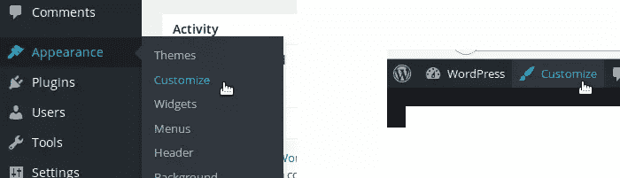
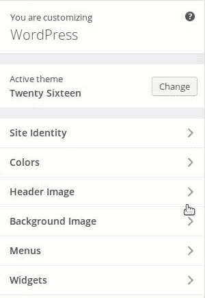

# 如何使用 WordPress 自定义徽标 API

> 原文：<https://www.sitepoint.com/wordpress-custom-logo-api/>

不一定是开发者的 WordPress 用户不能总是按照他们想要的方式定制他们的网站。他们可以从成千上万个可用的(免费和付费)主题中选择一个，但他们不能轻易改变标识，这常常令人沮丧。一些主题提供了允许用户改变标识的选项，但并不总是这样。

为了让所有用户都可以方便地更改他们网站的 logo，WordPress 团队决定在 [WordPress 4.5](https://www.sitepoint.com/whats-new-wordpress-4-5/) 中增加一个新功能:自定义 Logo。使用这个特性，任何 WordPress 用户都可以通过主题定制器来改变他们的 logo。

如果你是一名开发人员，你会想知道如何在你的主题中使用自定义徽标。好消息是它并不复杂，所以你不会有任何借口不允许你的用户自定义他们的标志！在本文中，我们将了解用户如何使用自定义徽标功能来更改他们的徽标。然后，我们将介绍开发人员如何使用自定义徽标 API 来启用自定义徽标功能。

## 自定义徽标

从用户的角度来看，当自定义徽标功能启用时，更改网站的徽标非常容易。这毕竟是该专题的目的。

首先要做的是打开主题定制器。为此，你可以使用 WordPress 仪表盘中“外观”菜单中的“自定义”条目。如果你看不到那个条目，那意味着你没有站点的管理员权限来定制主题(或者你正在使用一个非常旧的 WordPress 版本，你应该尽快更新它！).您还可以通过网站任何页面上管理顶部栏中的“定制”链接来访问定制器。



在定制器中，转到“站点标识”面板，您会发现“徽标”部分。如果这是你第一次更改徽标，你会发现一个“选择徽标”按钮，允许你选择要在网站上显示的徽标。

点击这个按钮将打开一个媒体窗口。您可以选择任何现有的图像，也可以上传新的图像。点击右下角的“选择徽标”按钮提交您的选择。

一旦选择了一个徽标，就会在“徽标”部分显示出来，在两个按钮上方:一个用于删除自定义徽标，另一个用于更改它。



使用主题定制器的好处是您可以直接看到变化。事实上，在选择你的标志后，你会在你的网站上看到它。您是唯一可以看到这些更改的人，直到您使用定制器顶部的“保存并发布”按钮保存它们。

## 使用自定义徽标 API

你可以用 WordPress 的默认主题来测试这个特性，因为它们允许使用自定义的 Logo。如果您使用另一个主题，您需要这个主题来明确启用自定义徽标功能。我们现在将强调如何实现这一点。

### 启用自定义徽标功能

要启用自定义徽标功能，我们实际上需要声明对它的支持。有一个很好的理由来解释为什么这个特性在默认情况下是不启用的。正如我们将在下面看到的，我们必须使用一个特定的函数来显示自定义徽标。如果我们不使用这个功能，自定义的 Logo 是不显示的，改了也没用。

为了声明对自定义徽标特性的支持，我们使用了`add_theme_support()`函数。最好的方法是使用回调函数和`after_setup_theme`动作。将以下代码放入主题的`functions.php`文件中，以声明对自定义徽标特性的支持。

```
function mytheme_setup() {
    add_theme_support('custom-logo');
}

add_action('after_setup_theme', 'mytheme_setup'); 
```

现在，您的用户将能够选择一个徽标。问题是还没有显示出来。在我们查看如何显示自定义徽标之前，我现在将介绍另一个有用的参数。

### 选择徽标的大小

徽标是网站身份的一部分。然而，这并不意味着作为主题的开发者，你不能选择它的大小。我认为这样做相当重要，因为太大的标志会破坏整个主题设计，这不是我们想要的。

如果您想要控制自定义徽标的大小，您首先需要用接受三个参数的`add_image_size()`声明大小:您想要的这个大小的名称、宽度和高度。然后，在自定义徽标支持声明中将这个大小(用您选择的名称)作为参数。

```
add_image_size('mytheme-logo', 160, 90);
add_theme_support('custom-logo', array(
    'size' => 'mytheme-logo'
)); 
```

如果用户选择了一个更小的标志，那么标志不会被调整大小。然而，如果图像的尺寸大于指定的尺寸，无论是高度还是宽度，那么它都会被调整大小。在所有情况下，当调整图像大小时，WordPress 将保持原来的比例。

因此，自定义徽标不会比提供的区域更高或更宽，但可以更小。

### 显示自定义徽标

如果您声明支持自定义徽标功能，您将需要显示用户的选择。为此，您可以在任何想要看到徽标的地方使用功能`the_custom_logo()`。它将自动回显正确的 HTML 代码来显示徽标:一个大小合适的图像，封装在重定向到主页的链接中。

如果出于某种原因，您希望检索这段代码，而不仅仅是回显它，那么您也可以使用`get_custom_logo()`。注意，在引擎盖下，`the_custom_logo()`调用`get_custom_logo()`来显示用户的徽标。

最后，第三个功能可以帮助你的主题:`has_custom_logo()`。顾名思义，这个函数返回一个布尔值:`true`如果已经设置了自定义徽标，否则返回`false`。

在下面的代码中，我们显示自定义徽标(如果有的话)。我们检测到带有`has_custom_logo()`的自定义徽标的存在，如果没有要显示的徽标，我们只显示网站的名称。

```
<?php
// Display the Custom Logo
the_custom_logo();

// No Custom Logo, just display the site's name
if (!has_custom_logo()) {
    ?>
    <h1><?php bloginfo('name'); ?></h1>
    <?php
}
?> 
```

注意，我们在使用`the_custom_logo()`之前不使用`has_custom_logo()`。事实上，如果没有标识显示，那么`the_custom_logo()`将显示一个空字符串，所以检查标识的存在是没有用的。

下面是做同样事情的另一种方法。我们定义了一个函数(例如在`functions.php`文件中),它显示自定义的徽标或者只显示网站的名称。这一次，我们使用`function_exists()`来确保我们的主题仍然兼容 WordPress 的旧版本。

```
function mytheme_custom_logo() {
    // Try to retrieve the Custom Logo
    $output = '';
    if (function_exists('get_custom_logo'))
        $output = get_custom_logo();

    // Nothing in the output: Custom Logo is not supported, or there is no selected logo
    // In both cases we display the site's name
    if (empty($output))
        $output = '<h1><a href="' . esc_url(home_url('/')) . '">' . get_bloginfo('name') . '</a></h1>';

    echo $output;
} 
```

然后我们可以在任何需要的地方调用这个函数，比如在头部。

## 概括起来

随着 WordPress 新版本的发布，主题定制器对最终用户越来越有用。用户现在可以个性化他们的网站，而不需要改变主题的代码。

多亏了新的自定义徽标 API 和我们在上一篇文章中提到的[站点图标 API](https://www.sitepoint.com/all-you-need-to-know-about-the-new-wordpress-site-icon-api/) ，最终用户现在可以更容易地控制他们网站的身份，而不需要自定义开发。

## 分享这篇文章