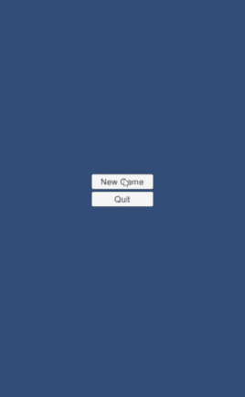
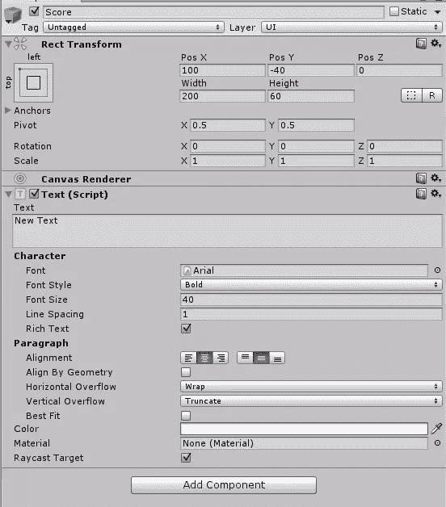
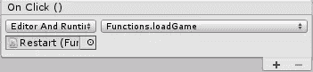
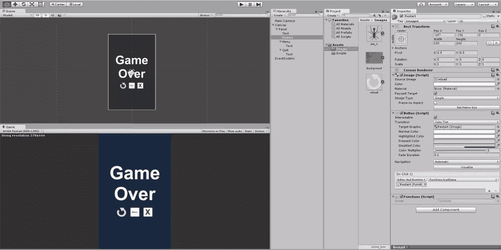
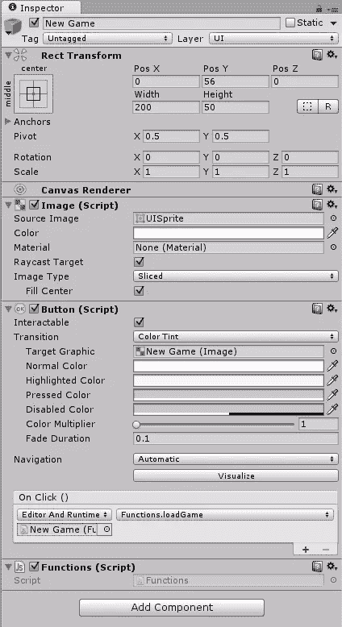
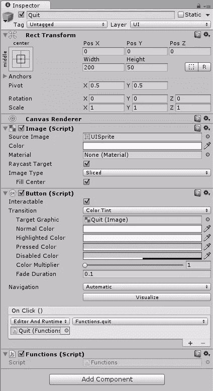
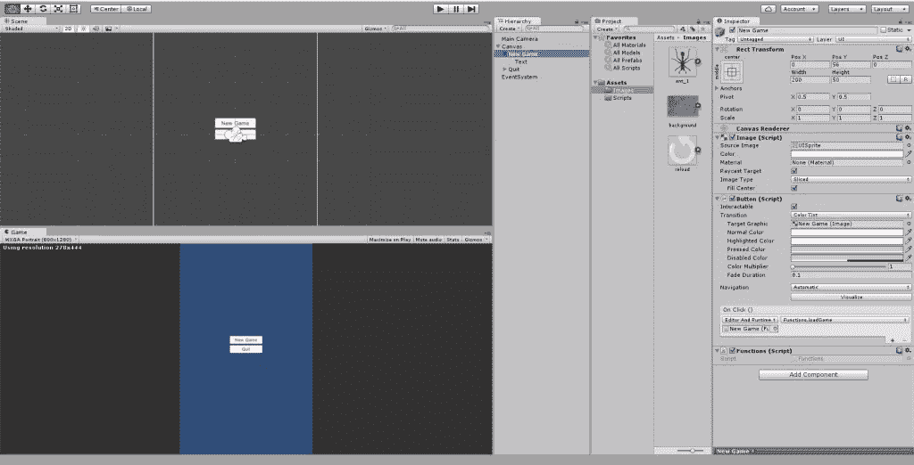

# 如何在 Unity 中构建 2D 敲击游戏

> 原文：<https://www.sitepoint.com/how-to-build-a-2d-tapping-game-in-unity/>

*感谢[米凯拉·莱尔](https://www.sitepoint.com/author/mlehr/)好心帮助[同行评审](https://www.sitepoint.com/introduction-to-sitepoints-peer-review/)这篇文章。*



在本教程中，我将演示如何在 Unity 中创建一个简单的 2D 敲击游戏。这个想法类似于著名的游戏[敲击昆虫](https://play.google.com/store/search?q=bug&c=apps&hl=en):你敲击一只移动的昆虫，它消失了，另一只进来了。

我不会太关注这个设计，因为我想用一些简单的代码展示它是如何工作的。这个游戏可以在一个 Android、iOS 或 WebGL 游戏中转换。

首先，确保你有最新版本的 Unity。我用的是 5.3 版本。

这里是这个 [Tapit 项目](https://github.com/sitepoint-editors/Tapit/tree/master/Assets/Images)的资产文件夹，或者你可以在这里查看/下载整个项目文件[。](https://github.com/sitepoint-editors/Tapit)

## 创建游戏场景、画布和 GUI 元素

创建一个新的 2D 项目，并根据自己的意愿命名。一旦新项目准备就绪，在`Assets`文件夹中创建一个名为`Images`的新文件夹。打开这个文件夹，点击右键，选择**导入新资产**，导入`background.jpg`图片。将该图像拖入`Scene`窗口，并根据您使用的屏幕尺寸拉伸它。我用的是类似手机屏幕的纵向屏幕，800 x 1280px。

现在用同样的方法导入`ant_1.png`图像。我将宽度和高度缩放了 2 倍，以使其更明显，更容易点击。在**层级**视图中点击**蚂蚁**，添加一个**圆形碰撞器 2D** 。

右键单击**层级**视图中的空白区域，然后进入 **UI >画布**。

在**画布**菜单中，选择**渲染模式**为**屏幕空间-摄像机**。**渲染摄像头**应该是你默认的摄像头，**主摄像头**。**平面距离**应该是背景与主摄像头距离之间的任意值。大多数情况下，这是一个介于 **0** 和 **10** 之间的数字。我把它设置为 **3** 。

在 **Canvas Scaler (Script)** 菜单中，将 **UI 缩放模式**设置为**随屏幕大小缩放**，将**屏幕匹配模式**设置为**展开**。

现在在**层级**视图中右击**画布**，选择 **UI >文本**。让这个新的游戏对象叫做<q>分数</q>。设置一个可读的字体大小，并把它放在你想要的任何角落。



创建另一个文本游戏对象，并将其命名为<q>生命</q>。这段经文将向我们展示我们剩余生命的数量。使这个对象类似于乐谱对象，并放置在另一个角落。

现在所有的 GUI 都完成了。


## 剧本

最新版本的 Unity 只支持两种脚本语言:UnityScript(类似于 JavaScript)和 C#。这个项目将用 UnityScript 编写。

在`Assets`文件夹中，创建一个名为`Scripts`的新文件夹。这将包含所有必要的功能，使游戏运行。在第一部分中，我们将创建变量，给它们一个名称和类型。

在`Scripts`文件夹中，创建一个新的 JavaScript 文件，并将其命名为`AntScript.js`。它将从这些变量开始:

```
var ant : GameObject; 
var scoreNumber : int;       
var livesNumber : int;        
var scoreText : GameObject;
var livesText : GameObject;
var walkingSpeed : double;
```

因此，我们游戏中的唯一玩家将被称为`ant`，它将是一个`GameObject`。事实上，它是一个 2D 精灵，会根据我们马上要看的代码移动和改变行为。

在这种情况下，我们将使用两个名为`scoreNumber`(用于保存玩家分数)和`livesNumber`(用于存储玩家剩余寿命)的整数变量。

`scoreText`和`livesText`游戏对象将显示分数和剩余游戏时间的信息。

要在 2D 空间移动玩家，它的坐标必须改变，这取决于它将沿着哪个轴移动。因为 2D 空间有点小，我们将沿着轴使用小的数字。

它的速度将由一个名为`walkingSpeed`的变量决定。这个变量将以小数字递增，如 **0.01** 。所以它的类型会是`double`。

## 函数开始()

对 UnityScript 有些了解的人都知道，它有两个重要的功能:`function Start()`和`function Update()`。第一个在所有场景播放中只调用一次，第二个在每个游戏帧中调用(如果 MonoBehaviour 被启用)。以下是`function Start()`包含的内容:

```
function Start () {
    ant = GameObject.Find("Ant");
    scoreText = GameObject.Find("Score");
    livesText = GameObject.Find("Lives");

    //Initialize the values of walking speed
    walkingSpeed = 0.0;
    livesNumber = 3;
    scoreNumber = 0;

    //Initialize the GUI components
    livesText.GetComponent(UI.Text).text = "Lives Remaining: " + livesNumber;
    scoreText.GetComponent(UI.Text).text = "Score: " + scoreNumber;

    //Place the ant in a random position on start of the game
    ant.transform.position.x = generateX();
    ant.transform.position.y = generateY();
}
```

在第一个代码块中，变量现在已经初始化。Unity 脚本有一个很好的引用`GameObjects`的方法:你只需要写`GameObject.Find("[Name_of_gameobject]");`。

初始的`walkingSpeed`会是 **0.0** ，`livesNumber`会是 **3** ，`scoreNumber`通常会是 **0** 。

第二个块将文本设置为我们之前初始化的 UI 元素。

在第三块中，我们正在访问`ant`对象的 **x** 和 **y** 坐标。`generateX()`和`generateY()`是两个返回随机数的函数。

## generateX()和 generateY()函数

他们的代码是这样的:

```
//Generates random x
function generateX(){
    var x = Random.Range(-2.54,2.54);
    return x;
}

//Generates random y
function generateY(){
    var y = Random.Range(-4.0,3.8);
    return y;
}
```

这两个函数有相似的代码，除了包含在`Range()`中的内容。在每一个，我们把左和右极限。

根据您的屏幕大小，选择左和右限制作为 ant 的极限水平位置，以便位于屏幕内部。

它返回的值取决于放在括号内的参数类型。在本例中，我们放置了`double` s，因此它返回一个`double`值。同时，这些值代表了我们游戏中可见的 2D 游乐场。

## 功能更新()

这个函数在游戏运行过程中做了最重要的工作。

```
function Update () {        
    if(ant.transform.position.y < -4.35 && livesNumber > 0){                
        livesNumber -= 1;
        livesText.GetComponent(UI.Text).text = "Lives Remaining: " + livesNumber;
        generateCoordinates();    
    }
    else if(ant.transform.position.y < -4.35 && livesNumber == 0){
        Destroy(GameObject.Find("Ant"));
        gameOver();    
    }
    else{    
        ant.transform.position.y -= walkingSpeed;
    }
}

function Update () {    
  if(ant.transform.position.y < -4.35 && livesNumber > 0) { 
        livesNumber -= 1;
        livesText.GetComponent(UI.Text).text = "Lives Remaining: " + livesNumber;
        generateCoordinates();

  } else if(ant.transform.position.y < -4.35 && livesNumber == 0) {
        Destroy(GameObject.Find("Ant"));
        gameOver();
  } else {
        ant.transform.position.y -= walkingSpeed;
  }
}
```

从这个函数中，我们可以获得每个游戏帧上我们的游戏对象的信息。由于**蚂蚁**大部分时间都在移动，我们应该设置玩家未命中条件。在这种情况下，当**蚂蚁**走到屏幕底部，或者当它的 **y 位置**小于`-4.35`时，玩家就会错过。如果玩家失误，并且生命数*比 0* 多，则有其他机会上场，因此生命数减少`1`并且屏幕文本显示减少的生命数。于是，`generateCoordinaes()`就叫做。

如果蚂蚁在生命数为 **0** 的时候走到了底部，那么这个对象就被销毁，并调用`gameOver()`函数。这个函数加载场景中的*游戏。*

如果蚂蚁不在屏幕的底部，它会沿着 **Y** 轴以每帧一步的速度移动。

## OnMouseDown()函数

该功能是发动机的内部功能。每次用鼠标按钮点击或在触摸设备上点击其父游戏对象时，都会调用它:

```
function OnMouseDown(){
    //Place the ant at another point
    generateCoordinates();

    //Increase the walking speed by 0.01
    walkingSpeed += 0.01;
}
```

这里意味着玩家点击了**蚂蚁**，他/她刚刚获得了 **+1** 的分数。乐谱文本得到更新，并随机生成两个新坐标。 **ant** 出现在新的坐标上，并且随着`walkingSpeed`的增加而下降。

完整的`AntScript.js`代码可以在 GitHub 上看到[。](https://github.com/sitepoint-editors/Tapit/blob/master/Assets/Scripts/AntScript.js)

拖动这个脚本，放在**层级**视图中显示的**蚂蚁**游戏对象上。

在`Scripts`文件夹中创建一个名为`Functions.js`的新脚本。代码是:

```
function loadGame(){
    Application.LoadLevel("Game");
}

function loadMenu(){
    Application.LoadLevel("Menu");
}

function quit(){
    Application.Quit();
}
```

现在游戏场景差不多完成了。点击**文件* >保存场景**保存此场景，并将其命名为<q>游戏</q>。

## 游戏结束场景

转到**文件>新场景**。创建一个新的画布，就像我们在最后一个场景中所做的一样。在里面新建一个面板，给它你想要的颜色。

在面板内部，放置一个新的文本元素来显示游戏已经结束。

创建一个新按钮，并将其命名为<q>重启</q>。将它放在<q>游戏下面的</q>文本上，并从`Assets`文件夹中选择它的**源图像**作为`reload.png`。

点击**添加组件**，选择**脚本>功能**。确保点击此按钮时调用`Functions.loadGame`。



您还可以添加另一个按钮来加载菜单场景。

在这个按钮下，创建一个新按钮，命名为<q>退出</q>。点击时调用`Functions.quit`。



我们已经完成了这个场景，所以保存它并将它的名字设置为 <q>GameOver</q> 。

## 菜单场景

最后，我们需要创建一个新场景，并将其命名为<q>菜单</q>。这将是应用程序加载后用户看到的第一个场景。

用和上面一样的方法添加一个新的画布，并在里面添加两个按钮。第一个应该叫<q>新游戏</q>第二个<q>退出</q>。

如下调用每个按钮上的`Functions.js`脚本中的函数。

新的游戏按钮:



退出按钮:



菜单:



## 结论

本教程展示了可用于一系列其他游戏的元素。正如我在开始时所说的，重点还没有放在设计上，但是您可以很容易地用您自己设计的其他资产来替换这些资产。你也可以随心所欲地创造菜单场景。

现在游戏结束了。试着自己构建它，如果你有任何困难或问题，不要犹豫，在下面评论。

同样，你可以在 GitHub 上下载完整的代码库。

## 分享这篇文章