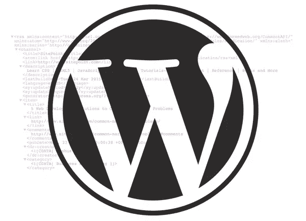

# 快速提示:将 WordPress RSS 订阅源连接到社交网络

> 原文：<https://www.sitepoint.com/connect-wordpress-rss-to-social-networks/>

在你的网站上展示你的社交媒体网络活动有巨大的优势。它向你的读者表明你是你所在领域的积极参与者，并帮助你确立自己作为思想领袖的地位。最棒的是，在 WordPress 中显示你的活动既快又容易。



为了显示您的社交媒体网络(SMN)活动，您将解析您帐户的 RSS 源。WordPress 内置的 SimplePie 和 FeedCache 功能允许你使用一个简单的函数`fetch_feed`。[WordPress Codex 为你提供了一个方便的代码片段，](https://codex.wordpress.org/Function_Reference/fetch_feed)在这篇文章中，我们将一步一步地介绍查找和解析你的 feeds 的过程。

## 第一步:找到你的社交网络源

首先，你必须找到你的 SMN 的特定 RSS 源。我们将讨论三个流行的社交网站:脸书、推特和 Reddit。

**对于脸书:** [按照以下步骤，](https://blog.dlvrit.com/2015/08/how-to-find-facebook-rss-feed/)使用 Zapier 从任何脸书页面获取 RSS 提要。

**对于 Twitter:** [TwitRSS.me](https://twitrss.me/) 将很容易检索提要。

**对于 Reddit:** Reddit 提供了一个直接链接到你账户的 RSS 源的链接。只需将你的用户名插入这个网址:【https://www.reddit.com/user/YourUsernameHere/.rss 

## 第二步:解析你的提要并显示在你的站点上

现在您将使用`fetch_feed`函数来检索 RSS 提要，并在您选择的任何地方显示它。

以下是 WordPress.org 慷慨提供的代码:

```
<h2><?php _e( 'Recent news from Some-Other Blog:', 'my-text-domain' ); ?></h2>

<?php // Get RSS Feed(s)
include_once( ABSPATH . WPINC . '/feed.php' );

// Get a SimplePie feed object from the specified feed source.
$rss = fetch_feed( 'http://example.com/rss/feed/goes/here' );

$maxitems = 0;

if ( ! is_wp_error( $rss ) ) : // Checks that the object is created correctly

    // Figure out how many total items there are, but limit it to 5\. 
    $maxitems = $rss->get_item_quantity( 5 ); 

    // Build an array of all the items, starting with element 0 (first element).
    $rss_items = $rss->get_items( 0, $maxitems );

endif;
?>

<ul>
    <?php if ( $maxitems == 0 ) : ?>
        <li><?php _e( 'No items', 'my-text-domain' ); ?></li>
    <?php else : ?>
        <?php // Loop through each feed item and display each item as a hyperlink. ?>
        <?php foreach ( $rss_items as $item ) : ?>
            <li>
                <a href="<?php echo esc_url( $item->get_permalink() ); ?>"
                    title="<?php printf( __( 'Posted %s', 'my-text-domain' ), $item->get_date('j F Y | g:i a') ); ?>">
                    <?php echo esc_html( $item->get_title() ); ?>
                </a>
            </li>
        <?php endforeach; ?>
    <?php endif; ?>
</ul> 
```

这段代码生成了一个包含 5 个链接的列表，每个链接指向你最近的活动。因此，如果你刚刚在 Reddit 上发布了五个线程，这段代码将链接到这些线程。

将这段代码复制并粘贴到`sidebar.php`文件中。请确保将上面的“example.com”更改为您的 RSS 源链接。

现在我们将实现代码。

为了举例，假设您想要在侧边栏中显示提要。在仪表板中，导航到外观，然后导航到编辑器。您将看到一个`.php`文件列表；点击`sidebar.php`。将您的代码粘贴到该文件中，然后单击更新文件。现在，您可以在侧栏中看到您最近的 SMN 活动。

## 结论

这是一个简单、灵活的方法来展示你在社交媒体网络上的活动。您也可以根据自己的喜好修改代码，并与其他`.php`文件一起使用。尽管有些人可能会说 RSS 过时了，但它仍然是一个强大的方法，可以让你的读者随时了解你的活动。

## 分享这篇文章