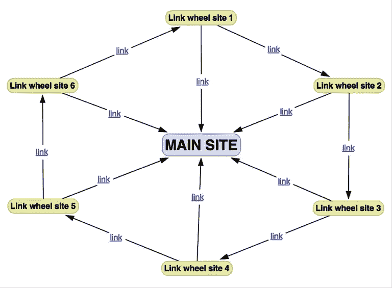
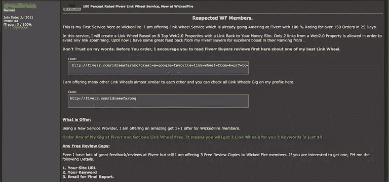
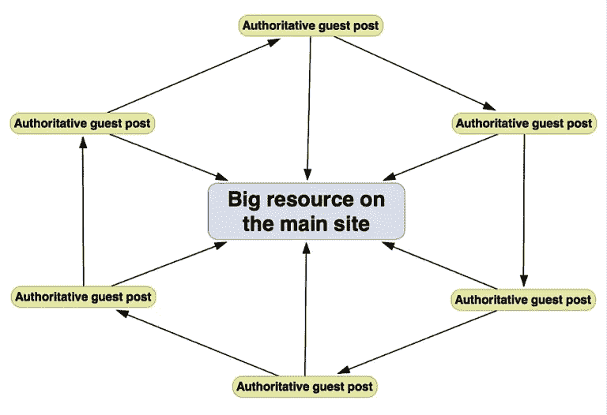
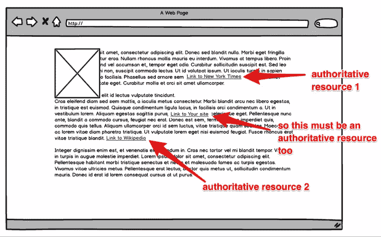
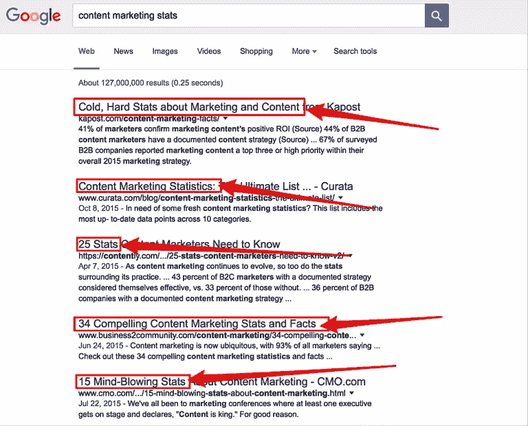
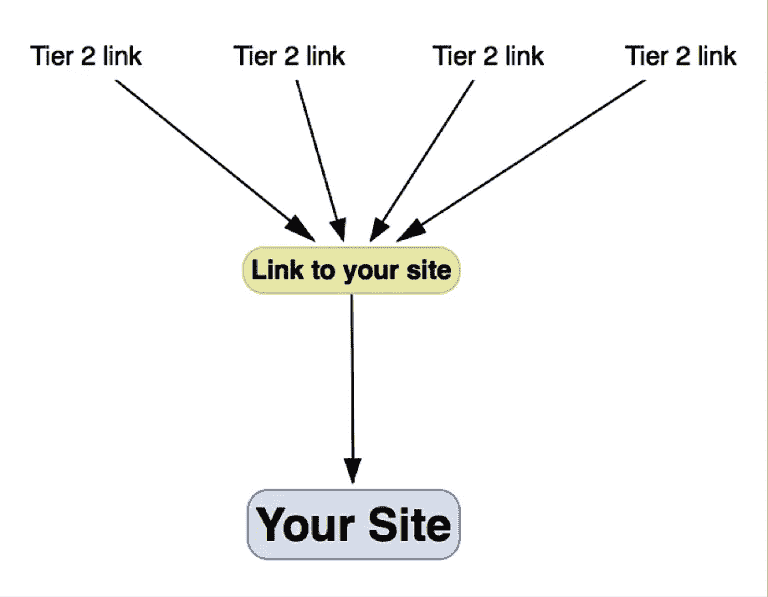

# 如何排名使用黑帽搜索引擎优化战术在一个白帽的方式

> 原文：<https://www.sitepoint.com/how-to-rank-using-black-hat-seo-tactics-in-a-white-hat-way/>

*本文原载于[单粒](https://www.singlegrain.com/social-media-management/best-practices/rank-using-black-hat-seo-tactics-white-hat-way/%E2%80%9D%20rel=)。*

乍一看，链接构建似乎非常简单，不是吗？

你只需要选择你想要排名的关键词，[创造惊人的内容](https://www.sitepoint.com/ultimate-guide-link-building-content/)，让其他博主在他们的帖子中链接到你的专家文章，然后嘭！就像变魔术一样，你的网站开始在 SERPs 中攀升。

当然，在建立链接时，你需要记住一些错综复杂的事情和排名因素。例如，多达 [21%的 SEO 成功](http://www.business2community.com/content-marketing/how-domain-authority-depends-on-unique-and-original-content-0392106#gBpagToxZC7DDmZ1.97)取决于你在外部链接上使用的锚文本，22%取决于链接的受欢迎程度。

所以只要按照这些步骤去做，应该就没问题了吧？

告诉我…当其他人都在做同样的事情时，你是如何保持领先的？

加大力度？

推出更多内容？

[多发外联邮件](https://blog.kissmetrics.com/guide-to-blogger-outreach/)？

或者……转向你的竞争对手更愿意远离的策略，比如[黑帽技术](http://searchengineland.com/blackhat-social-media-affect-seo-199516)但以白帽方式使用？

这正是我在这篇文章中要向你展示的:几个黑帽 SEO 策略，你可以在不违反谷歌准则的情况下使用，以获得更高的排名，吸引更多的流量，增加转化率。

但是首先，快速回顾一下…

## 什么是黑帽 SEO？

术语黑帽指的是侵犯搜索引擎优化策略，违反了搜索引擎的准则和最佳实践。

黑帽 SEO 的基本特征是无视用户，专注于操纵搜索引擎和排名。

黑帽子使用类似于[文章旋转](https://en.wikipedia.org/wiki/Article_spinning)、[内容自动化](http://www.meinstyn.com/seo/what-is-content-automation-in-seo.html)和[关键词填充](https://en.wikipedia.org/wiki/Keyword_stuffing)的策略来操纵排名，并在搜索结果中定位低质量的内容。他们还会构建[链接轮](http://www.seochat.com/c/a/google-optimization-help/real-link-wheel-secrets-to-top-google-rankings/)和[隐藏链接](http://positionly.com/blog/seo/black-hat-seo-techniques)，[创建门口页面](https://support.google.com/webmasters/answer/2721311?hl=en)，并使用[分层链接构建](http://www.matthewwoodward.co.uk/tutorials/the-ultimate-guide-to-tiered-link-building-part-1/)。

最终，谷歌通过发布[谷歌企鹅](https://www.singlegrain.com/blog-posts/search-engine-optimization/google-penguin-changes-are-coming-will-your-site-be-affected/)，搜索结果排名算法[谷歌熊猫](https://www.singlegrain.com/blog-posts/search-engine-optimization/google-panda-in-plain-english-infographic/)的更新，抓住并解决了黑帽行为。从此，一个网站在使用黑帽战术时会受到谷歌的处罚。

然而，我将向你展示如何以白帽方式将这些策略融入你的链接建设活动**中，以帮助你的有机流量暴涨。**

## 策略一。连接轮

链接轮是一个突破性的链接建设技术只有几年前。甚至一些著名的白帽 SEO[也称赞他们有能力](http://famousbloggers.net/link-wheels.html)影响一个网站在谷歌的排名。

黑帽使用链接轮来增加他们生成的链接的强度，进而推动他们的网站在搜索结果中排名更高。

链接轮背后的前提很简单:

创建一个从一个网站链接到另一个网站的模式，也是你的主网站。轮子中的每一个站点都会启动下一个辐条。由于这是一个封闭的系统，理论上他们的权威会不断增长，反过来发送一个更强的链接到你的主网站。

这是一个基本的连接轮的样子:

为了创建链接轮，SEOs 使用高 PR Web 2.0 属性(免费博客平台，如 Tumblr、WordPress.com 或 Blogger.com)或文章目录(如 ezinearticles.com)。

他们在这些资产上创建了免费网站，添加了一些内容(通常只有一篇文章)，补充了一些低质量的帖子，并包括了到下一个轮辐以及主网站的链接。

最终，搜索引擎开始认为链接轮是一种操纵策略。

但是这里有一个问题:

链接轮最大的问题不是轮子本身，而是黑帽子用来建造它们的东西。

让我们面对现实吧，免费的 Web 2.0 对用户来说没有任何价值。这反过来又使得整个策略容易受到搜索引擎的审查。

以下是黑帽论坛上链接轮服务的一个例子:

**请记住，链接轮的*概念*有效。**

今天你仍然可以使用它。然而，你只需要从著名的资源中建立一个链接轮。

不要使用 Web 2.0 属性、免费博客网站或文章目录，而是从与你建立了关系的真实网站中建立链接。

例如，让我们假设您想要建立一个销售自行车存储系统的在线商店的链接。你可以在权威的自行车网站上写一系列的客座博文，每个博文涵盖自行车保养的不同方面。然后，您可以在链接轮中将这些文章链接为辐条，并在每篇文章中包含对您的商店的引用。

这样，您就创建了一个链接轮，它:

1.  建立在高质量的网站上
2.  为用户提供高价值
3.  传递高 PR 到你的主站点

提示:为了确保链接轮不在谷歌的审查之下，不要从每个分支链接回你的主页。相反，创建另一个高度相关的资源，并从每篇文章中引用它。

您的链接轮看起来或多或少像这样:

## 策略二。混合链路构建

你并不总是需要更多的 T2 链接来提高网站的排名。

这是另一个黑帽策略的前提，被称为“混合链接建设”

你看，通过在链接到其他高度权威的网站(如维基百科、纽约时报等)时引用你的网站。)，你可以欺骗谷歌，让它像对待其他网站一样对待你的网站——反过来，给你的网站更高的排名。

为了使用这种策略，黑帽要么找到愿意链接到他们网站以及某些相关权威网站的人，要么自己创建这些资源。

为了做到这一点，黑帽子将再次诉诸于使用 Web 2.0 博客、文章目录和其他他们可以控制内容的属性，以便将他们的链接与权威网站相结合。

但同样，使用这些网络属性使得这种策略容易受到搜索引擎的惩罚。

另一方面，混合链接技术仍然有效。你只需要更有策略地去做。

**这里是我建议你如何建立混合链接:**

从创建其他人愿意链接的[精彩的资源内容](http://backlinko.com/skyscraper-technique)开始。

例如，这可以是一个统计列表、一个资源页面或一个研究发现的汇编。关键是提供高质量的信息，让作者和内容创作者可以在自己的文案中参考。

为什么会这样？

因为他们在不断寻找资源来丰富自己的博客和文章。他们知道通过包括或引用相关的统计数据、研究结果、图表、统计数据、数字等。，他们[增加他们内容的感知权威](http://www.contentchampion.com/authority-content-hacks/)。

从现在开始，你的策略有两种方式:

**选项 1:**

找到已经链接到与你自己的资源相似的网页，并推荐你的资源。联系网站管理员、博客作者或编辑，概述在他们的文章中引用你的内容的好处。

**选项二:**

行业顶级网站上的客座博文。在内容中包含相关权威资源的链接，以及您自己资源的链接。

注意:许多权威网站不允许你从内容链接回一个作者的网站，但是如果你创造了一个高度相关和惊人的资源，他们的编辑可能会被说服链接到它。

**奖金:**

为了(被动地)建立更多的混合链接，优化你的关键词资源，当作家和内容营销者寻找参考资料时，他们可能会用到这些关键词。例如:

1.  *【话题】+研究】*
2.  *"[主题] +统计"*
3.  *【主题】+统计】*

这样，您可以确保他们在其他权威资源中找到并包含您的内容。

*“内容营销统计”查询的最佳结果。猜猜每个月有多少作家链接或者引用他们？*

## 策略三。分层链接建设

我相信你已经知道这一点，但它值得重复:**链接到你的页面越权威，反向链接就越强**。

然而，仅仅从高权威网站建立链接是非常困难的。

那么，黑帽 SEOs 想出了一个简单的解决方案——建立链接到已经链接到他们的页面，以增加他们的权威和排名。

这种方法被称为分层链接建立。

黑帽将建立链接层，每个链接指向前一个链接，最终加强反向链接。

同样，黑帽会使用 Web 2.0 博客和其他网络属性来构建层级。这又一次让这个策略变得脆弱。

但是建立分层链接和加强反向链接并不是一个坏主意。

事实上，你今天仍然可以使用它们来提高你的排名。怎么会？通过使用客座博文链接到已经链接到你的资源。

所以每次写客座博文的时候，都要想一想有没有链接到你的相关内容可以在帖子里参考。

通过发送几个链接到那个页面，你可以加强它，并确保它开始在关键词的前 100 个结果中排名，使它成为一个高度相关的链接源。

## 策略四。接触刮擦

刮痧是黑帽实践的选择。

使用像 [Scrapebox](http://www.scrapebox.com/) 这样的应用程序，黑帽子会搜索网络，从网站管理员的联系方式到关键词到内容，无所不包。然后，他们会使用这些信息发送自动链接请求，发送带有胡言乱语评论的垃圾网站，甚至创建他们发现的内容的变体。

很自然，所有这些导致了网络上垃圾邮件的增加。

但是刮痧本身并不是一个坏习惯。

你看，抓取的强大之处在于它能够大规模地找到信息。

例如，抓取工具可以帮助分析你的网站的搜索引擎优化技术问题。Bartosz Góralewicz 发布了一个关于使用 Scrapebox 检测和解决许多 SEO 技术问题的教程。

它还可以帮助您找到与您相关的网站管理员的联系方式。只是你不用给他们发不相关的垃圾信息，而是用这些信息去接触和建立可能会带来链接的联系。

例如:想象你正在进行一个[断链建设](https://www.quicksprout.com/the-advanced-guide-to-link-building-chapter-7/)活动。您发现网站包含断开的链接，并且您想要联系它们以提供您的资源作为替代。

但首先你需要找到那些网站管理员的联系方式。一种方法是简单地访问每个站点并手动检索这些信息。当然，根据你的清单的大小，这可能要花上几个小时。

因此，为了加快速度，你可以在几分钟内收集一个域名列表，以接收你需要的信息。从那时起，你可以使用自动化的拓展软件，比如 Salesloft 销售拨号器(T1)或 T2 的 grow bots(T3 ),与这些人取得联系。

在这种情况下，使用抓取的目的不是产生垃圾邮件，而是简单地扩大你的努力。

事实上，刮擦是当今流行的策略。例如，[销售人员在他们的销售线索挖掘工作中依靠刮削](http://thenextweb.com/insider/2015/10/23/17-tools-to-make-linkedin-work-for-you/)。他们使用诸如 [SalesLoft Prospector](https://salesloft.com/) 、 [LeadFuze](https://www.leadfuze.com/) 、 [import.io](https://import.io/) 和 [Grabby](https://grabby.io/) 等应用程序从 LinkedIn 个人资料或网站中提取联系方式，并将信息添加到他们的 CRM 系统中，以便建立联系。

## 结论

链接建设一开始可能看起来很容易。但是有许多错综复杂的过程和某些步骤，以扩大您的链接配置文件。

那么，当每个人都在做同样的事情时，你如何保持领先呢？

我的答案是:使用你的竞争对手更喜欢远离的战术和策略——黑帽 SEO。*但总是以白帽子的方式*。

当正确和完整地使用时，这些策略可以帮助你的网站在搜索结果中排名靠前，吸引更多的流量，增加转化率。

你呢？你使用过，或者看到过其他人以白帽的方式使用其他黑帽 SEO 策略吗？在下面的评论中与我们分享吧！

## 分享这篇文章