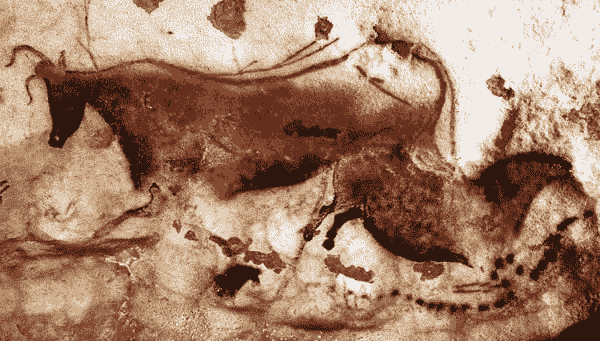
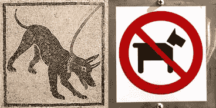
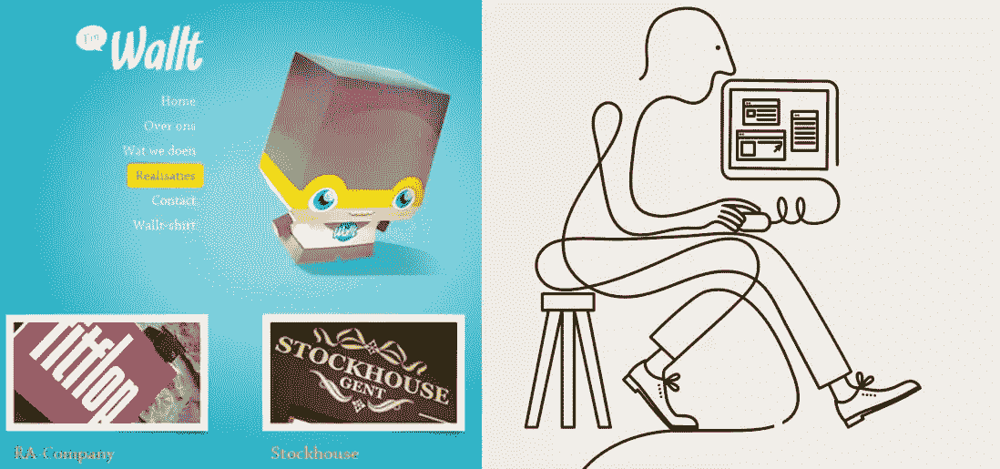
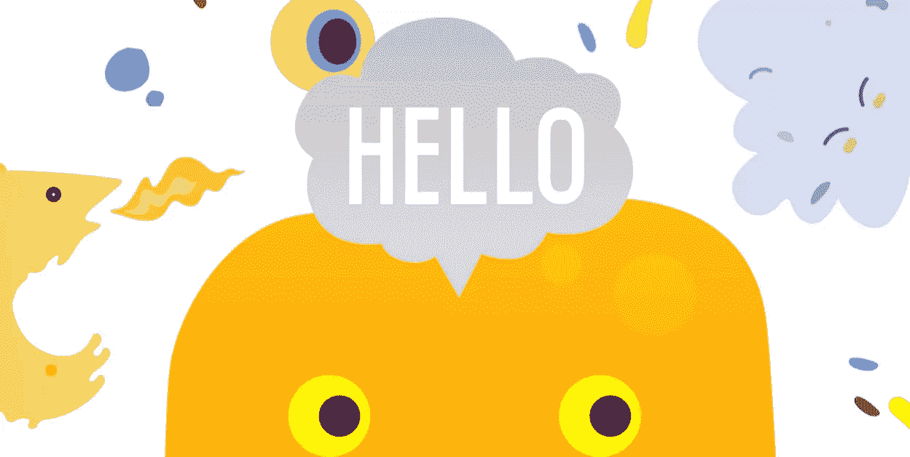
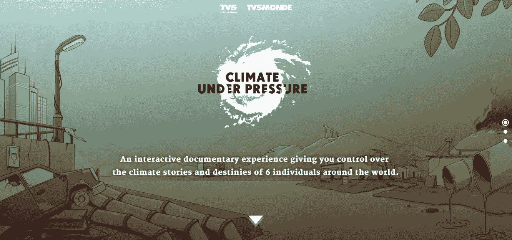
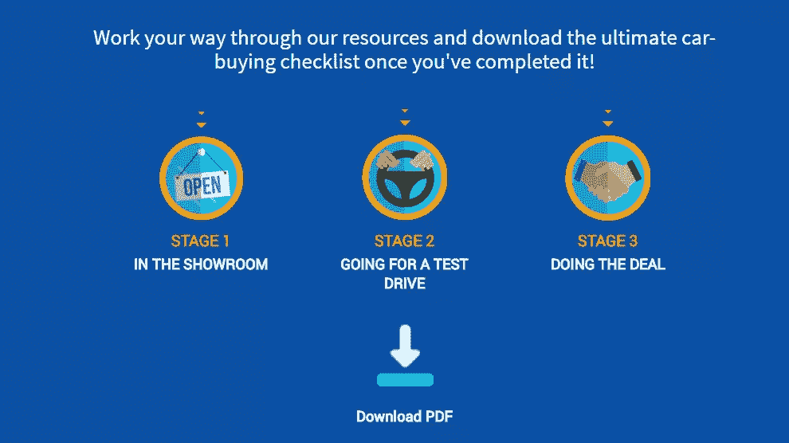
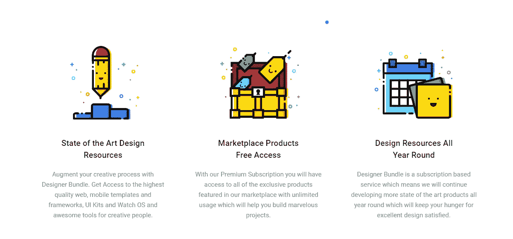
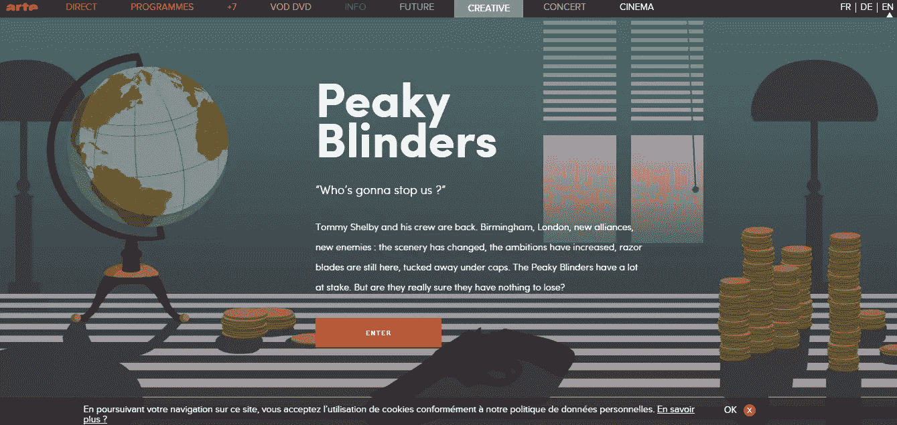
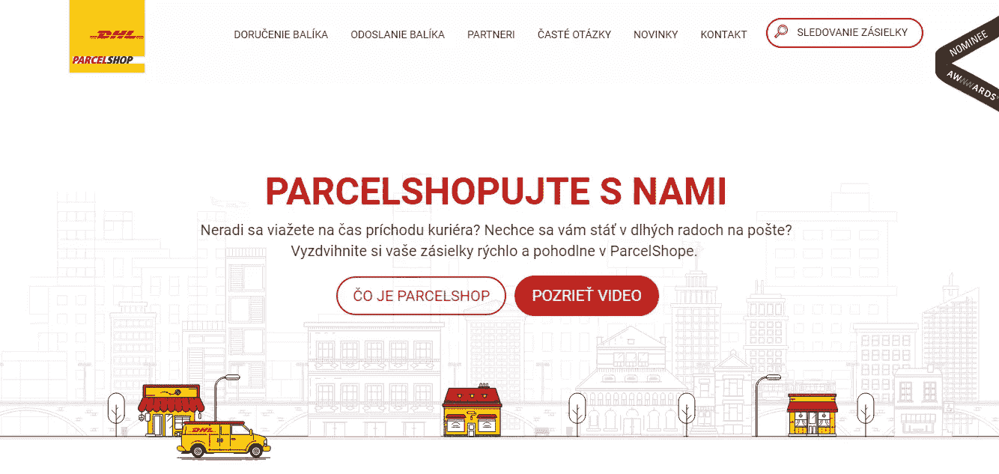
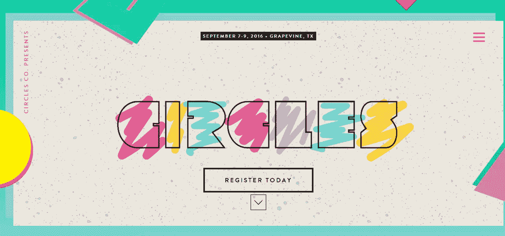

# 设计 2016:插画之年？

> 原文：<https://www.sitepoint.com/design-trend-2016-year-illustration/>

在众多 2016 年设计趋势榜单中，我一直看到三个一致的预测:

*   亮色的回归
*   分屏布局，以及
*   插图的兴起

当然，在网页设计中使用插图并不是什么开创性的概念。事实上，2012 年、2013 年和 2014 年都预测会有更多插图的使用，这要归功于设计师们不断提升的艺术技巧。

我们看到了吗？是的，在某种程度上，但今年将有所不同，设计师们倾向于更真实和多样化的体验。

## 插图:第一种通用语言

插图可以追溯到书写发明之前很久。我们说的是洞穴绘画——确切地说是拉斯科和阿尔塔米拉。至少有 40，000 年的历史，似乎很明显，人类——无论文化或背景如何——与插图有着深刻而持久的联系。

与狗相关的标志

虽然写作通常是精英阶层的工具，但在历史的大部分时间里，插图一直是与大多数文盲沟通的最佳方式。绘画、雕刻、彩色玻璃窗和马赛克用来记录历史，娱乐大众，并告知大众法律、危险、道德和其他习俗。

事实上，自古以来插图的使用方式与现代设计中的使用方式并没有太大的不同。

## 插图中的最新趋势

在本世纪早期，我们看到了许多图标和充满活力的吉祥物形状的彩色艺术品。浓重的阴影、三维的人物和丰富的表现形式风靡一时。

今年的插画正走向更真实和有机的体验。专为单一场所设计的浅色手绘外观变得越来越常见，预计至少会在今年剩余时间内持续存在。

定制设计通常会呈现出独特、松散甚至幼稚的感觉。由于流行的平面设计/极简主义潮流，与我们一直看到的复制和粘贴相比，网站会感觉更有个性。

## 大局

在你的网页设计中，有很多地方可以使用插图。为了快速吸引你的观众，英雄风格的插图可能是你最好的选择。

大型英雄插图会比其他的更适合一些利基市场。例如，一个设计机构或冲浪店使用插图英雄通常会比律师事务所或政府部门更容易工作。话说回来，没有一成不变的规则。

climateunderpressure.com

英雄风格的插图的伟大之处在于，你可以包含比你被创造成像图标一样的东西时更多的细节。

### 快速提示:

*   **做**去找相关性。无关的设计在英雄部分没有位置，更不用说你的网站了。

*   不要忘记细节。你想抓住访客的注意力并给他们留下深刻印象，所以不要害怕在你的外表上花更多的功夫。

*   一定要保持干净。虽然细节很好，但你需要留意你用了多少来避免混乱。

## 成为标志性人物

有时候找到合适的地方使用插图是一个挑战，尤其是当你的网站不够丰富多彩的时候。幸运的是，如果你想添加插图，就像看你的图标一样简单。

图标和类似的用户界面元素是在你的网站设计中注入个性和能量的好地方，尽管它们和你现有的元素结合起来很重要。正如 DesignBundle 所示，可以添加小而简单的个性元素。有很多风格可供选择，尽管“平面设计”仍然流行，但不要害怕追求一些纹理和深度。

designerbundle.com

虽然你可以也应该定制你的图标，但是不要过度使用。现在不是为了艺术表达而牺牲意义的清晰性的时候。

### 快速提示:

*   **做**定制。当涉及到你的图标时，不要害怕跳出框框思考，与众不同是好事。

*   **不要**走极端。图标不应该依靠细微的细节来识别。

*   **做**保持一致。尽管图标是一个尝试新事物的好地方，但记住要围绕你的网站设计来构建它们。

## 让它动起来

[http://peakyblinders.arte.tv/en/#/](http://peakyblinders.arte.tv/en/#/)

趋势的伟大之处在于，你可以随意混合搭配它们，并获得一些真正引人注目的结果。有品味的动画和插图可以携手并进，所以毫不奇怪，我们看到更多的网站将这种结合纳入他们的工作。

有许多领域可以使用动画插图，但最好的应用场合是那些交互式手绘元素。DHL 的斯洛伐克网站只需要 3 或 4 个简单的动画就能给他们的网站增添一丝活力。他们还延迟动画足够长的时间，以避免分散知道他们要去哪里的用户的注意力。

DHL 斯洛伐克公司

不过，我必须承认，我确实担心那些无人驾驶的 DHL 货车。

当然，你需要保持这个动画微妙，不要过于复杂的事情。如果你还没有开始在你的作品中添加动画，我建议你看看我的在设计中使用动画的 4 个技巧。

### 快速提示:

*   **做**使用悬停。悬停动画总是一个受欢迎的附加功能，而且你会立刻知道什么是交互的，什么不是。

*   **不要**过度复杂化。你的插图应该是有目的的动画。避免一个周期超过 5 秒的动画。

*   **做**实验。不要害怕尝试普通的淡入或跳跃动画之外的东西。循环可能像滴水的水龙头一样令人抓狂，所以改变不同元素的定时以掩盖它们的重复。

## 定制类型

今年，大胆的字体设计又回来了，所以和动画一样，将这种趋势和插图结合起来才是有意义的。

大号字体的伟大之处在于它可以用来代替图片。手绘造型的加入会让原本已经很迷人的造型引起你想要的注意。

circlesconference.com

当你决定说明你的自定义类型时，记住颜色、形状和大小对你的特殊设计很重要。手绘铅笔外观可能比网络资源网站更适合波西米亚风格的商店。把这样的事情记在心里。

### 快速提示:

*   做你的研究。在你尝试手绘字体之前，你应该看看使用这种技术和字体资源的网站，比如[达丰](http://dafont.com)和[字体松鼠](https://www.fontsquirrel.com/)。

*   **不要**使用多种风格。插图排版本身就是一个大胆的选择，所以无论多么引人注目，你都要避免混合和搭配，坚持使用一种字体——最多两种。

*   **做**得到花式。不要只是让你的排版简单明了。尝试渐变、轮廓和纹理以获得酷炫的效果。

### 底线

将插图融入设计有时可能是一种“硬推销”,因为它更多的是一种未知。利益相关者(客户/经理)更容易想象出一个标准的图片/文字布局，所以经理们觉得批准开始新插图的工作风险更大。可能需要一些牵手。

然而，正如上面的例子所显示的，创造一个深刻的原创，独特的外观和感觉的机会是如此之好，以至于忽视它们几乎是疯狂的。只要按照上面的快速提示，试一试。

你觉得在你的设计中加入插图怎么样？

## 分享这篇文章