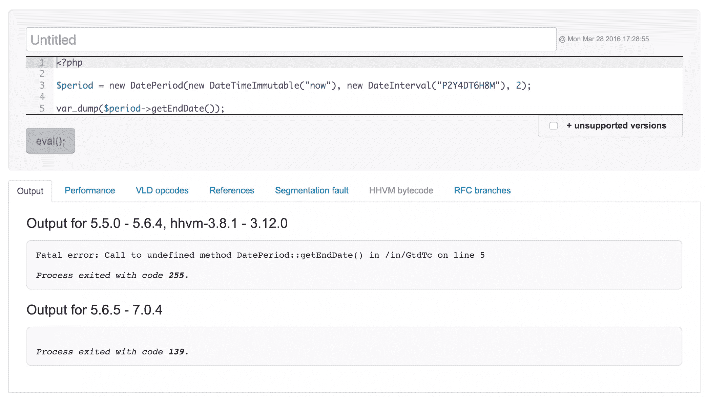
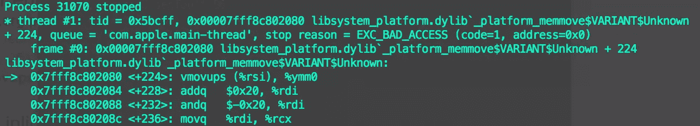
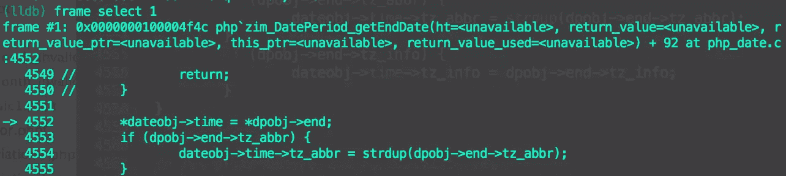

# 为 PHP 做贡献:如何修复 PHP 核心中的错误

> 原文：<https://www.sitepoint.com/contributing-to-php-how-to-fix-bugs-in-the-php-core/>

之前，我们讨论了对 PHP 文档的贡献。现在，我们将讨论如何使用 PHP 的核心。为了做到这一点，我们将查看修复核心中一个简单错误的工作流程。


由于向 PHP 提交新特性[已经被很好地解释过了](https://wiki.php.net/rfc/howto)，我们在此不再赘述。此外，本文并不试图讲授 PHP 的内部原理。关于这方面的更多信息，请参见我在[之前发表的关于为 PHP](https://www.sitepoint.com/re-implementing-the-range-operator-in-php/) 添加特性的文章。

## 解决 bug

修复核心中的错误是基本熟悉 PHP 内部的一个好方法。它只需要基本的 C 语言知识，并且是帮助改进 PHP 的简单方法。但是在这样做之前，需要对 PHP 的版本管理有一个基本的了解。

### PHP 版本管理生命周期

PHP 次要版本遵循每年发布一次的周期，每个次要版本有 3 年的支持。前两年为一般的错误修复提供“积极支持”，最后一年只为安全修复提供“安全支持”。3 年的周期结束后，对该 PHP 版本的支持就停止了。

目前支持的 PHP 版本可以在 php.net 网站上看到。在撰写本文时，PHP 5.5 处于安全支持中，PHP 5.6 和 7 处于主动支持中。

### 修复一个错误

为了演示一个基本的工作流程，让我们解决来自[bugs.php.net](https://bugs.php.net)的[错误#71635](https://bugs.php.net/bug.php?id=71635) 。错误报告指出，在没有结束日期的情况下调用`DatePeriod::getEndDate()`时会出现 segfault。所以我们首先要做的是确认它的有效性。

对于看起来微不足道的错误(很少或没有环境设置要求)，我们可以从快速查看该错误是否可以在 3v4l 中重现[开始。(3v4l 是一个方便的工具，可以在数百个 PHP 版本上运行一段代码。)这让我们可以看到所有受影响的 PHP 版本，这有助于快速发现旧的、仍然受支持的 PHP 版本是否受到影响。正如我们所看到的，PHP 在从 5.6.5 到 7.0.4 的所有版本中都存在 segfault。](https://3v4l.org/GtdTc)



不管这个错误是否能在 3v4l 中复制，在我们着手修复它之前，我们需要在本地复制它。为此，您需要派生 [php/php-src](https://github.com/php/php-src) ，并在本地克隆您的派生。如果您已经这样做了一段时间，您可能需要更新您的克隆，并检索所有最新标记的版本(用`git remote update`)。

我们将致力于 PHP 5.6 分支，因为这是受此 bug 影响的最低版本的 PHP(同时仍受到积极支持)。(如果这个 bug 影响了 PHP 5.5，我们仍然会忽略这个版本，并针对 PHP 5.6 工作，因为这个 bug 与安全无关。)提交 bug 修复的标准工作流程是针对受影响最小(同时仍受支持)的 PHP 版本进行修复。一个 php/php-src 开发人员将在必要时向上合并修复。

因此，让我们签出一个 PHP 5.6 分支的副本来工作:

```
git checkout -b fix-dateperiod-segfault upstream/php-5.6 
```

然后，我们构建 PHP，并尝试通过用以下代码创建一个文件(比如说**segfault.php**)来在本地重现 segfault:

```
<?php

$period = new DatePeriod(new DateTimeImmutable("now"), new DateInterval("P2Y4DT6H8M"), 2);
var_dump($period->getEndDate()); 
```

然后，我们用新构建的 PHP 二进制文件运行**segfault.php**:

```
sapi/cli/php -n segfault.php 
```

(`-n`标志表示 php.ini 文件不会用于配置。如果您在默认的 php.ini 文件中加载了自定义扩展，这将非常方便，因为它可以防止每次使用本地 php 二进制文件执行文件时出现大量错误。)

一旦确认我们可以在本地触发它，我们就可以为它创建一个测试。让我们把这个测试文件叫做 **bug71635.phpt** 并把它放在 **ext/date/tests/** 文件夹中，内容如下:

```
--TEST--
Bug #71635 (segfault in DatePeriod::getEndDate() when no end date has been set)
--FILE--
<?php
date_default_timezone_set('UTC');
$period = new DatePeriod(new DateTimeImmutable("now"), new DateInterval("P2Y4DT6H8M"), 2);

var_dump($period->getEndDate());
?>
--EXPECT--
NULL 
```

运行该单一测试表明它没有通过:

```
make test TESTS=ext/date/tests/bug71635.phpt 
```

我们现在在之前创建的**segfault.php**文件上运行我们选择的调试器。(我使用 [LLDB](http://lldb.llvm.org) 是因为那是 Mac OS X 现在捆绑的，但是 [GDB](https://www.gnu.org/software/gdb/) 是另一个类似的调试器，它有[重叠命令](http://lldb.llvm.org/lldb-gdb.html)。)

```
lldb sapi/cli/php a.php 
```

(`-n`命令这次没有被使用，因为它似乎会扰乱 lldb。)

现在我们在 LLDB 调试器中，我们键入`run`来执行文件。它应该显示 segfault 出现在代码中的什么位置:



虽然第一帧似乎没有向我们展示任何过分有意义的东西(除非你用 asm 编程)，但我们可以看到程序因为一个`EXC_BAD_ACCESS`而停止了。它还向我们展示了它试图操作的指针地址是`0x0`，因此我们可以看到我们有一个空指针访问。

使用`bt`命令向我们展示了 segfault 的回溯(导致 segfault 的每一帧)。查看第 1 帧(通过输入`frame select 1`，我们回到 C 代码，可以看到导致问题的代码行:



由此，我们可以推断罪魁祸首是`dpobj->end`计算为 null，因此试图取消引用它会导致 segfault。因此，我们在上面放置一个检查，看看`dpobj->end`是否是一个空指针，如果是，简单地从函数返回(尽可能早地这样做):

```
PHP_METHOD(DatePeriod, getEndDate)
{
        php_period_obj   *dpobj;
        php_date_obj     *dateobj;

        if (zend_parse_parameters_none() == FAILURE) {
                return;
        }

        dpobj = (php_period_obj *)zend_object_store_get_object(getThis() TSRMLS_CC);
+
+        if (!dpobj->end) {
+                return;
+        }

        php_date_instantiate(dpobj->start_ce, return_value TSRMLS_CC);
        dateobj = (php_date_obj *)zend_object_store_get_object(return_value TSRMLS_CC);
        dateobj->time = timelib_time_ctor();

        *dateobj->time = *dpobj->end;
        if (dpobj->end->tz_abbr) {
                dateobj->time->tz_abbr = strdup(dpobj->end->tz_abbr);
        }
        if (dpobj->end->tz_info) {
                dateobj->time->tz_info = dpobj->end->tz_info;
        }
} 
```

(从一个方法返回隐式地使函数返回`null`(就像所有内部 PHP 函数在失败时所做的那样)。这是因为`return_value`变量(可以在任何函数定义中访问)保存了函数的实际返回值，它默认为 null。)

因此，让我们构建 PHP 并再次运行我们的测试:

```
make test TESTS=ext/date/tests/bug71635.phpt 
```

现在应该过去了！现在我们可以简单地提交更新后的文件和相应的 bug 测试，然后[针对 php/php-src 的 5.6 分支](https://github.com/php/php-src/pull/1791)提交一个 PR。

## 结论

本文展示了在解决核心中的错误时使用的简单工作流。解决 bug 是接触 PHP 内部的一个很好的起点，而且它只需要很少的 c 语言知识。

对于那些厌倦了在 [Project Euler](https://projecteuler.net) 和类似网站上发现的基于算法的挑战的人来说，Bug 修复也是一系列不错的小编程挑战。而且[有超过 5000 个公开的错误报告](https://bugs.php.net/search.php?limit=30&order_by=id&direction=DESC&cmd=display&status=Open&bug_type=All)，当然不缺少要处理的错误！

## 分享这篇文章