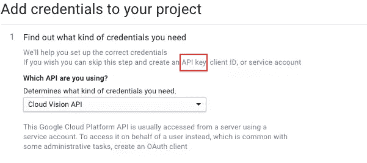
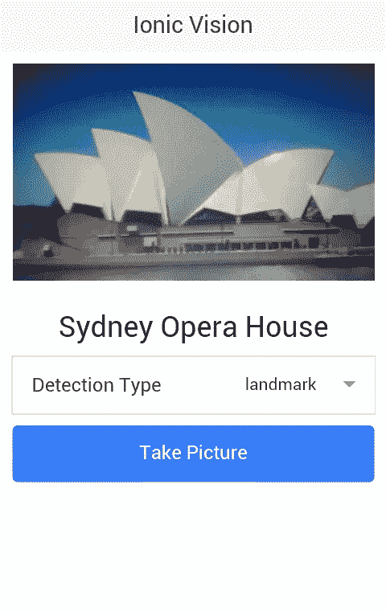

# 使用 Google Vision API 和 Ionic 进行图像识别

> 原文：<https://www.sitepoint.com/image-recognition-with-the-google-vision-api-and-ionic/>

图像识别允许计算机以与人类相似的方式识别图像。过去，开发人员不得不使用复杂的图像识别技术和算法，如[模式识别](https://en.wikipedia.org/wiki/Pattern_recognition)。随着谷歌发布[云视觉 API，开发人员现在有了一套强大的工具，这些工具来自一家拥有一些最佳图像识别功能的公司。](https://cloud.google.com/vision/)

在本教程中，您将构建一个 Ionic 应用程序，允许用户拍摄可由 Cloud Vision API 识别的照片。

## 入门指南

使用 API 需要将一个 JSON 文件上传到 API 端点，该文件包含所需的图像检测类型和图像的 base64 编码。

以下是 JSON 文件的一个示例:

```
{
  "requests":[
    {
      "image":{
        "content":"base64-encoded-image"
      },
      "features":[
        {
          "type":"LABEL_DETECTION",
          "maxResults":1
        }
      ]
    }
  ]
}
```

在这个例子中，您必须用图像的实际 base64 编码字符串表示替换`base64-encoded-image`。在`features`属性中，您可以提供一个包含您想要的图像检测类型的对象数组。`LABEL_DETECTION`试图通过给图像加标签或描述来对其进行分类。

一旦你有了回应，它会像下面这样:

```
{
  "responses": [
    {
      "labelAnnotations": [
        {
          "mid": "/m/0bt9lr",
          "description": "dog",
          "score": 0.89208293
        }
      ]
    }
  ]
}
```

因为您为特性指定了`LABEL_DETECTION`，为`1`指定了`maxResults`，所以在`responses`数组中有一个对象。在这种情况下，`labelAnnotations`。

除了`LABEL_DETECTION`，您还可以使用以下内容:

*   `FACE_DETECTION`:检测照片中的人脸，返回坐标，你可以用它来画出检测到的人脸。
*   检测地标，如悉尼的歌剧院或威尔特郡的巨石阵。
*   `LOGO_DETECTION`:检测不同的公司标志。
*   `TEXT_DETECTION`:采用光学字符识别(OCR)技术从图像中提取文本。
*   `SAFE_SEARCH_DETECTION`:根据安全搜索参数对图像进行分类。这将图像分类为`adult`、`spoof`、`medical`或`violence`。

## 注册云愿景 API

在撰写本文时，Google Cloud Vision API 还处于测试阶段，这意味着它可以免费试用。进入[谷歌云平台网站](https://cloud.google.com/vision/)，点击*免费试用*按钮。这将把你带到一个页面，询问你的业务和信用信息，但不用担心，谷歌不会向你收取高达 300 美元的费用。

一旦完成，[在谷歌控制台](https://cloud.google.com/vision/docs/auth-template/cloud-api-auth)上创建一个新项目，[为您的项目启用计费](https://console.cloud.google.com/billing?_ga=1.106053319.577568564.1457525841)，而[启用云视觉 API](https://console.cloud.google.com/flows/enableapi?apiid=vision.googleapis.com) 。我建议您跳过正常流程，使用“API 密钥”选项。



## 构建应用程序

现在您已经准备好构建应用程序了。但首先，我想简单介绍一下你将要开发的应用程序。该应用程序将有一个页面，其中包含与云视觉 API 交互所需的所有元素。它将有一个用于选择用户想要的图像检测类型的下拉菜单，一个用于拍摄图片的按钮，一个用于显示所拍摄图片的图像元素，以及一个用于显示图片描述的标题元素。

这是最终应用的外观:



你可以在 [GitHub](https://github.com/sitepoint-editors/ionic-vision) 上找到该项目的最终代码。

### 安装依赖项

在你的工作目录中，打开一个新的终端窗口并安装 Cordova 和 Ionic:

```
npm install -g cordova ionic
```

使用空白模板创建一个新的 Ionic 项目:

```
ionic start ionic-vision blank
```

添加您想要使用的平台。我只打算安装 Android，但代码应该也可以在 iOS 上运行。

```
ionic platform add android
```

你需要安装一些插件来与相机、文件和上传文件的设备 API 进行交互。

```
cordova plugin add cordova-plugin-camera
cordova plugin add cordova-plugin-file
cordova plugin add cordova-plugin-file-transfer
```

使用[凉亭](http://bower.io/)安装 [ngCordova](http://ngcordova.com/) :

```
bower install ngCordova
```

ngCordova 库为安装的插件提供 AngularJS 包装器。这些包装器使得在 Ionic 应用程序中使用插件变得更加容易。

### 添加控制器

打开 *www* 目录，在 *js* 目录下创建一个*controllers/home controller . js*文件，添加以下代码:

```
(function(){
    angular.module('starter')
    .controller('HomeController', ['$scope', '$ionicModal', '$cordovaFile', '$cordovaFileTransfer', '$cordovaCamera', HomeController]);

    function HomeController($scope, $ionicModal, $cordovaFile, $cordovaFileTransfer, $cordovaCamera){

        var me = this;
        me.current_image = 'img/koro-sensei.png';
        me.image_description = '';
        me.detection_type = 'LABEL_DETECTION';

        me.detection_types = {
          LABEL_DETECTION: 'label',
          TEXT_DETECTION: 'text',
          LOGO_DETECTION: 'logo',
          LANDMARK_DETECTION: 'landmark'
        };

        var api_key = 'your-google-api-key';

        $scope.takePicture = function(){

            var options = {
                destinationType: Camera.DestinationType.DATA_URL,
                sourceType: Camera.PictureSourceType.CAMERA,
                targetWidth: 500,
                targetHeight: 500,
                correctOrientation: true,
                cameraDirection: 0,
                encodingType: Camera.EncodingType.JPEG
            };

            $cordovaCamera.getPicture(options).then(function(imagedata){

                me.current_image = "data:image/jpeg;base64," + imagedata;
                me.image_description = '';
                me.locale = '';

                var vision_api_json = {
                  "requests":[
                    {
                      "image":{
                        "content": imagedata
                      },
                      "features":[
                        {
                          "type": me.detection_type,
                          "maxResults": 1
                        }
                      ]
                    }
                  ]
                };

                var file_contents = JSON.stringify(vision_api_json);

                $cordovaFile.writeFile(
                    cordova.file.applicationStorageDirectory,
                    'file.json',
                    file_contents,
                    true
                ).then(function(result){

                    var headers = {
                        'Content-Type': 'application/json'
                    };

                    options.headers = headers;

                    var server = 'https://vision.googleapis.com/v1/images:annotate?key=' + api_key;
                    var filePath = cordova.file.applicationStorageDirectory + 'file.json';

                    $cordovaFileTransfer.upload(server, filePath, options, true)
                        .then(function(result){

                            var res = JSON.parse(result.response);
                            var key = me.detection_types[me.detection_type] + 'Annotations';

                            me.image_description = res.responses[0][key][0].description;
                      }, function(err){
                        alert('An error occurred while uploading the file');
                      });
                }, function(err){
                    alert('An error occurred while trying to write the file');
                });

            }, function(err){
              alert('An error occurred getting the picture from the camera');
            });
        }
    }
})();
```

分解上面的代码。首先创建控制器并导入所需的库。

```
(function(){
    angular.module('starter')
    .controller('HomeController', ['$scope', '$cordovaFile', '$cordovaFileTransfer', '$cordovaCamera', HomeController]);

function HomeController($scope, $cordovaFile, $cordovaFileTransfer, $cordovaCamera){
...
}
```

在控制器内部，设置视图使用的默认数据。这包括要显示的占位符图像、空描述和默认检测类型。`LABEL_DETECTION`之所以被使用，是因为它比其他词更通用。

```
var me = this;
me.current_image = 'img/koro-sensei.png';
me.image_description = '';
me.detection_type = 'LABEL_DETECTION';
```

下面是一个包含所有检测类型和来自 Google 的 API 密钥的对象:

```
me.detection_types = {
  LABEL_DETECTION: 'label',
  TEXT_DETECTION: 'text',
  LOGO_DETECTION: 'logo',
  LANDMARK_DETECTION: 'landmark'
};

var api_key = 'your-google-api-key';
```

接下来，创建按下相机按钮时执行的方法。

```
$scope.takePicture = function(){
    ...
};
```

在该方法中，声明相机插件的选项，将`destinationType`设置为`Camera.DestinationType.DATA_URL`。这意味着一旦图片被选中，回调函数将拥有图像的数据 URI。由于这个数据 URI 已经是 base64 编码，它不再需要转换。

`sourceType`是`Camera.PictureSourceType.CAMERA`，所以它使用从相机拍摄的图像作为源。`targetWidth`和`targetHeight`设置该图像的首选尺寸。`correctOrientation`为`true`时，它会自动将图像方向更改为纵向，而`cameraDirection`为`0`时，它会使用背部摄像头。最后，`encodingType`是`Camera.EncodingType.JPEG`，允许您将`data:image/jpeg;base64,`添加到数据 URI 前面，这样您就可以显示图像了。

```
var options = {
    destinationType: Camera.DestinationType.DATA_URL,
    sourceType: Camera.PictureSourceType.CAMERA,
    targetWidth: 500,
    targetHeight: 500,
    correctOrientation: true,
    cameraDirection: 0,
    encodingType: Camera.EncodingType.JPEG
};
```

这将通过调用`$cordovaCamera.getPicture`打开设备上的默认相机应用。它使用`options`作为参数，调用`then`并提供成功和错误回调函数。同样的模式适用于您以后要使用的所有插件。

```
$cordovaCamera.getPicture(options).then(function(imagedata){
    ...
}, function(err){
    alert('An error occurred getting the picture from the camera');
});
```

在成功回调中，更新图像源(`current_image`)并将描述重置为空字符串。

```
me.current_image = "data:image/jpeg;base64," + imagedata;
me.image_description = '';
```

使用相机插件的数据 URI 和用户选择的检测类型(`me.detection_type`)构建物体。然后将它转换成一个字符串，这样就可以将它作为发送给 API 的 JSON 文件的内容。

```
var vision_api_json = {
  "requests":[
    {
      "image":{
        "content": imagedata
      },
      "features":[
        {
          "type": me.detection_type,
          "maxResults": 1
        }
      ]
    }
  ]
};

var file_contents = JSON.stringify(vision_api_json);
```

使用 Cordova 文件插件将`file_contents`写入存储在应用程序沙箱根目录下的 *file.json* 文件。`writeFile`方法的第三个参数是一个布尔值，用于设置如果文件不存在是否创建它。

```
$cordovaFile.writeFile(
    cordova.file.applicationStorageDirectory,
    'file.json',
    file_contents,
    true
).then(function(result){
    ...
}, function(err){
    alert('An error occurred while writing to the file');
});
```

当内容写入文件时，声明文件传输插件工作所需的变量。下面是一个`headers`变量，它是请求的 http 头。因为您正在发送一个 JSON 文件，所以您必须将`Content-Type`设置为`application/json`。`server`是发送请求的 API 的完整 URL，`filePath`是您将要发送的 JSON 文件的完整路径。

```
var headers = {
    'Content-Type': 'application/json'
};

options.headers = headers;

var server = 'https://vision.googleapis.com/v1/images:annotate?key=' + api_key;
var filePath = cordova.file.applicationStorageDirectory + 'file.json';
```

您使用文件传输插件的`upload`方法将文件发送到服务器。提供给`upload`方法的第四个参数是一个布尔值，用于设置是否接受来自所有主机的安全证书。一旦得到响应，使用`JSON.parse`将其转换成 JavaScript 对象。通过连接当前检测类型的值和单词“Annotations”来构造键。如果用户选择`LABEL_DETECTION`作为检测类型，这允许你形成字符串`labelAnnotations`。然后，您可以使用该字符串提取图像的实际描述。

```
$cordovaFileTransfer.upload(server, filePath, options, true)
    .then(function(result){

        var res = JSON.parse(result.response);
        var key = me.detection_types[me.detection_type] + 'Annotations';
        me.image_description = res.responses[0][key][0].description;

}, function(err){
    alert('An error occured while uploading the file');
});
```

### 添加视图

创建一个 *templates/home.html* 文件，并添加以下代码:

```
<ion-view title="IonicVision" ng-controller="HomeController as home_ctrl">
    <header class="bar bar-header bar-stable">
        <h1 class="title">Ionic Vision</h1>
    </header>

    <ion-content class="has-header padding">
        
        <h3 class="text-center" ng-show="home_ctrl.image_description">{{ home_ctrl.image_description }}</h3>
        <label class="item item-input item-select">
          <div class="input-label">
            Detection Type
          </div>
          <select ng-model="home_ctrl.detection_type">
            <option value="{{detection_type}}" ng-repeat="(detection_type, detection_type_value) in home_ctrl.detection_types">{{detection_type_value}}</option>
          </select>
        </label>
        <button class="button button-positive button-block" ng-click="takePicture()">
        Take Picture
        </button>
    </ion-content>
</ion-view>
```

分解上面的代码。首先，它创建一个新的`ion-view`并指定要使用的控制器。

```
<ion-view title="IonicVision" ng-controller="HomeController as home_ctrl">
</ion-view>
```

在`ion-view`里面是标题和`ion-content`，它们是你在标题下面看到的 UI 元素。例如图像、图像描述、检测类型列表和拍照按钮。

```
<header class="bar bar-header bar-stable">
    <h1 class="title">Ionic Vision</h1>
</header>

<ion-content class="has-header padding">
    
    <h3 class="text-center" ng-show="home_ctrl.image_description">{{ home_ctrl.image_description }}</h3>
    <label class="item item-input item-select">
      <div class="input-label">
        Detection Type
      </div>
      <select ng-model="home_ctrl.detection_type">
        <option value="{{detection_type}}" ng-repeat="(detection_type, detection_type_value) in home_ctrl.detection_types">{{detection_type_value}}</option>
      </select>
    </label>
    <button class="button button-positive button-block" ng-click="takePicture()">
    Take Picture
    </button>
</ion-content>
```

### 式样

大部分样式工作由 Ionic 处理，所以您只需要几个样式声明。将以下内容添加到 *css/style.css* 中:

```
.text-center {
    text-align: center;
}

.picture {
  max-width: 100%;
  max-height: 100%;
}
```

### 将所有东西整合在一起

打开包含初始化 Ionic 和 ngCordova 代码的 *js/app.js* 文件。如果您使用的是 Ionic blank starter 模板，那么大部分代码已经完成了。所有需要做的就是指定使用`ngCordova`并编辑`config`方法的内容以指向 home.html 文件*。*

```
angular.module('starter', ['ionic', 'ngCordova'])

.run(function($ionicPlatform) {
  $ionicPlatform.ready(function() {
    if(window.cordova && window.cordova.plugins.Keyboard) {

      cordova.plugins.Keyboard.hideKeyboardAccessoryBar(true);

      cordova.plugins.Keyboard.disableScroll(true);
    }
    if(window.StatusBar) {
      StatusBar.styleDefault();
    }
  });
})
.config(function($stateProvider, $urlRouterProvider) {
  $stateProvider

  .state('home', {
    url: '/home',
    templateUrl: 'templates/home.html'
  });

  $urlRouterProvider.otherwise('/home');
});
```

打开*index.html*，链接到 *ionic.bundle.js* 文件后的 *ng-cordova.js* 文件。在 *app.js* 文件下面，链接到 *HomeController.js* 文件。

不要忘记将`starter`指定为`ng-app`的值，并在`body`中添加`ion-nav-view`，这样它将显示【home.html】的*视图*。

```
<!DOCTYPE html>
<html>
  <head>
    <meta charset="utf-8">
    <meta name="viewport" content="initial-scale=1, maximum-scale=1, user-scalable=no, width=device-width">
    <title></title>

    <link href="lib/ionic/css/ionic.css" rel="stylesheet">
    <link href="css/style.css" rel="stylesheet">

    <!-- IF using Sass (run gulp sass first), then uncomment below and remove the CSS includes above
    <link href="css/ionic.app.css" rel="stylesheet">
    -->

    <!-- ionic/angularjs js -->
    <script src="lib/ionic/js/ionic.bundle.js"></script>

    <script src="lib/ngCordova/dist/ng-cordova.js"></script>
    <!-- cordova script (this will be a 404 during development) -->
    <script src="cordova.js"></script>

    <!-- your app's js -->
    <script src="js/app.js"></script>

    <script src="js/controllers/HomeController.js"></script>
  </head>
  <body ng-app="starter">
    <ion-nav-view></ion-nav-view>
  </body>
</html>
```

## 运行应用程序

您可以通过执行以下命令在您的设备或模拟器上运行该应用程序:

```
ionic run android
```

## 最后的想法

在本教程中，您使用 ionic 和 Cloud Vision API 的帮助构建了一个图像识别应用程序。我介绍了不同图像检测类型的使用，比如标签、地标、徽标和文本检测。我没有涉及人脸检测或安全搜索检测，但对于人脸检测，您可以使用类似于 [Fabric.js](http://fabricjs.com/) 的东西。这将把图像转换成画布对象，并在检测到的人脸上画圆。

有关云视觉 API 的更多信息，请阅读[官方文档](https://cloud.google.com/vision/docs/)，我很乐意听到您的经验和想法。

## 分享这篇文章