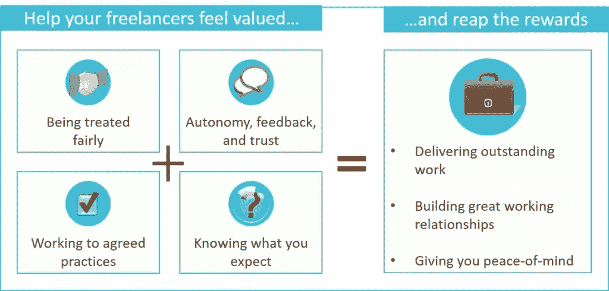
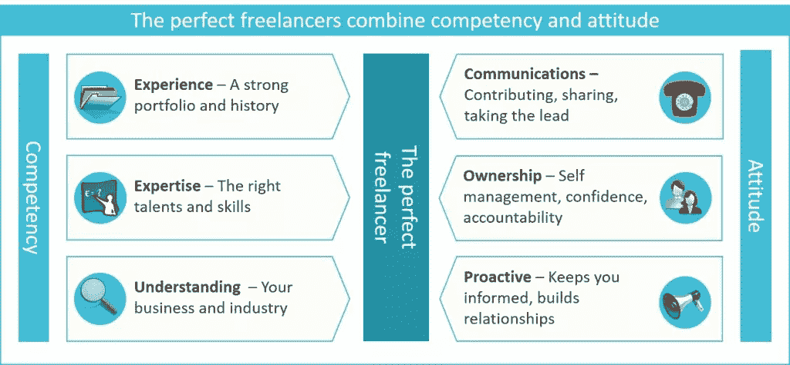
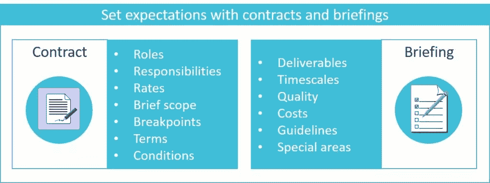
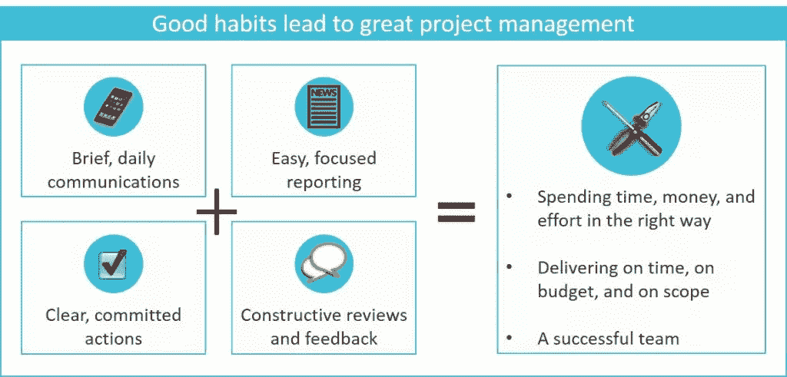

# 如何充分利用你的自由职业者

> 原文：<https://www.sitepoint.com/how-to-get-the-most-out-of-your-freelancers/>

我们的合作方式正在发生变化，技术使得与虚拟和本地团队的合作比以往任何时候都更快、更容易。任何时候，一个项目经理或企业家想要做一些漂亮的东西，他们只需要去一个在线自由职业者市场，找到合适的承包商，给他们机会，并一起努力交付一些令人惊叹的东西…

要是这么简单就好了。

你知道在现实世界中并不是这样。无论你的团队有多好，你的技术有多强大，或者你的工作效率有多高，问题总是会突然出现。当您在多个地点工作时，这些问题甚至更难解决。

幸运的是，您可以采取几个实际步骤来创建更好的工作实践，建立更强的团队关系，并最终帮助您的项目成功交付。作为一名前项目经理和一名活跃的自由撰稿人，我已经看到这些技术在两方面都起作用。做出这些改变确实需要努力和承诺，但从长远来看，这无疑是值得的。

在本文中，我们将探索:

*   为什么重视你的自由职业者至关重要。
*   基础——态度雇佣。
*   期望——写下东西的重要性。
*   习惯——有效的项目管理。
*   把这一切结合在一起。

## 为什么重视你的自由职业者至关重要

你可能想知道为什么你需要考虑这些东西。毕竟，你是在为自由职业者的时间和技能买单。你有期望和需求，他们有才华和服务，为什么不只是简单的金钱换工作呢？

原因很简单，当人们感受到价值和参与时，他们会更努力、更快地工作，并产生更高质量的可交付成果。这对你、你的生意和你的自由职业者都有好处。

作为一名自由职业者，感受价值不仅仅是支付我的发票。它包括:

*   受到公平对待。
*   分享自主权、反馈和信任。
*   按照约定的惯例工作。
*   知道你期望什么。

我知道我的许多同事也有同感。在这些方面花一点时间，我们会用出色的交付成果、良好的工作关系和安心来回报您。这一切都始于找到有正确态度的自由职业者。

## 基础:态度雇佣

雇佣合适的人本身就是一门艺术和科学。当你建立任何类型的团队(尤其是远程团队)时，要记住的一件事是“雇佣态度和能力”虽然许多承包商和自由职业者可以证明自己的能力——强大的投资组合、合适的技能和人才、行业经验——但态度却很难界定。为了使事情变得简单，关注三个方面是有用的:沟通、所有权和积极主动。

### 通信

一个好的自由职业者应该是一个好的沟通者。这不仅仅是回复邮件或闲聊。它包括参与讨论、分享想法、在自己的专业领域发挥领导作用以及展示自己的想法。简而言之，他们不应该害怕直言不讳。

### 所有权

虽然所有权在一定程度上与自信和自我管理有关，但也与责任有关。这意味着完全掌控工作，理解你的业务和项目流程，让你知道任何困难，并按照你的范围、预算和时间表交付。

### 积极主动

你没有时间不断地追逐工作和里程碑。一个好的自由职业者会让你了解情况，管理你的期望，并积极增进你的工作关系。

针对这些态度，最好的招聘方式是面试你潜在的自由职业者。提出有助于他们展示这些价值观的问题，并仔细聆听答案。最终，自由职业者的态度应该是建立信任，给你信心，他们能做好工作，满足你的需求。

记住，对于远程团队来说，沟通、所有权和积极主动更加重要，所以雇佣那些在这些方面具有优秀品质的人。一旦你找到了合适的人，你需要设定期望值。最好的方法是把事情写下来。

## 写下东西的重要性

项目经理和自由职业者有一个共同点:他们都喜欢清晰。努力达成共识、一致的指导方针和公平的合同会让每个人都开心。这就是为什么你应该把一切都写下来，与你的承包商沟通，并确保他们同意。你和你的自由职业者应该记录并同意三个主要方面:

*   合同。
*   简报和范围。
*   还有别的吗？

### 合同:保护自由职业者和企业

合同对任何工作关系都是必不可少的。一份好的合同应该明确所有的条款、条件以及自由职业者和企业的期望。这包括角色和职责、工作的简要概述、费率和定价、范围内外的内容、断点以及其他任何需要定义的内容。

作为一名自由作家，我在大约 90%的时间里提供合同(这里有一个[链接，链接到我的标准自由写作合同](https://docs.google.com/document/d/12JpW7iJQVTA5ZHYKmIcoP6tLuLNFpgoft97BcJFMfEY/edit)，减去我的个人信息)。大多数优秀的自由职业者应该有一个标准的自由职业模板，他们可以根据客户的需求进行调整。作为企业家或项目经理，你可能有自己的合同。如果没有，你想开发一个，有很多好的模板和例子[只要谷歌搜索一下](https://www.google.com/webhp?sourceid=chrome-instant&ion=1&espv=2&ie=UTF-8#q=freelance+contract+template+OR+example)。

因为合同是如此的重要，许多自由职业者直到有一个签署的，同意的合同才开始工作。

### 简报和范围文件

简报和范围文件是你希望你的自由职业者做的事情的核心。它定义了项目的质量、预算和时间表。

总之，简报文件和合同是你和自由职业者之间关于你到底需要什么和预期结果的协议。将简报文档视为项目计划的扩展，为特定的团队成员量身定制。

典型的简报文件可能包含:

*   **需要交付什么**:项目的预期结果。
*   **你需要团队成员做什么**:定义他们的关键任务、行动和里程碑。
*   时间表:截止日期和你工作的其他时间表。
*   **质量**:你对质量的期望，以及评审过程。
*   **成本和费用**:如果合同中没有明确，这里应该列出。
*   **项目管理**:对沟通、报告、进度、评审、测试和其他领域的期望。
*   **现有指南**:任何现有内容、指南、风格指南、最佳实践或其他文档的链接。

根据你雇佣的自由职业者的类型，你可以在简介文件中加入一些特定的内容:

*   工具和技术:你希望你的自由职业者使用的任何工具、技术或方法——对任何类型的软件开发都是必不可少的。
*   **目标受众和风格**:理解目标受众、方法和风格对于内容创作者、平面设计师和自由撰稿人来说至关重要。
*   品牌指南:如果你和平面设计师或其他视觉媒介一起工作，这是至关重要的。

作为一名自由职业者，我倾向于创建简报文档，并与我的客户分享以供审阅。然后他们进行任何修改，一旦文件定稿，它就成为任何工作的中心点。到目前为止，这是一个有效的过程。

### 还有别的吗

这是一个包含所有你需要捕捉的东西的类别。它可能包括项目文档、业务或用户分析、会议纪要、详细的行动计划或其他您希望每个人都知道的内容。

一旦你记录了你需要做的事情，与你的自由职业者分享，并获得他们的同意和签署。对于一些文件，电子邮件就足够了。对于其他内容(如合同)，最好使用文档签名服务。一旦你同意了所有的事情，就该开始培养好习惯了。

## 习惯:有效的项目管理

把事情写下来并与人分享有助于你和你的自由职业者设定期望。养成良好的习惯有助于每个人*在实践中达到那些期望*。作为企业主、企业家或项目经理，从第一天开始就培养这些习惯是个好主意。它们会让管理你的团队变得更加容易。

### 简短的日常交流

项目的成功取决于有效的沟通；没有他们，项目几乎肯定会失败。虽然有许多技术使沟通变得更容易(Skype、Slack、工具内通信、即时消息、电子邮件)，但这并不意味着人们一定会使用它们。

这就是为什么让每个人都养成定期有效沟通的习惯至关重要。你可以通过每天的团队会议、某种检查过程或任何其他收集想法和反馈的方法来做到这一点。

这不需要太繁琐。围绕具体行动、后续步骤、顾虑和问题进行沟通。你更新得越容易越快，人们就越有可能完成它们。

### 明确、坚定的行动

当人们清楚他们需要做什么时，他们更有可能完成他们的行动。这意味着同意:

*   谁在执行行动。
*   到底需要实现什么。
*   当它需要完成的时候。
*   预期的可交付成果。

每当你向自由职业者请求工作时，确保你尽可能清晰地定义行动。让你的自由职业者致力于这些行动，如果他们遇到任何问题，让你知道。一旦你给了他们行动，让他们自主工作，并要求他们汇报进展。

### 简单、集中的报告

几乎所有人都讨厌报道，但这是一种必要的邪恶。如果你正在运行一个项目，你需要确信任务和行动正在如期完成。做到这一点的最简单的方法是从您的团队获得定期的进度更新。

您可以将这一部分作为常规交流的一部分，或者在项目工具中或通过其他方式请求单独的更新。像通信一样，使报告尽可能快速和简单是很重要的。

一旦发生任何风险、问题或难题，立即发现它们尤其重要，因此您可能希望将其作为报告的一个具体部分。

### 建设性的评论和反馈

评审和反馈是让每个人关注质量的重要部分。反馈可以来自几个方面:

*   **业务评审**:来自业务和涉众对可交付成果的反馈。
*   **产品测试**:产品测试的结果和交付物是否适合目的。
*   **最终用户反馈**:产品或服务的最终用户的反应。
*   同行评审:来自你或项目或产品团队的其他成员的反馈。

提供易于理解和可操作的反馈至关重要。如果你能看到改进的空间，确切地解释你想看到什么，为什么需要，并提供需要改变的建议。

给出建设性的、有用的反馈是管理团队的核心，所以花点时间把它做好是值得的。

## 将这一切结合在一起

正如你所看到的，建立良好的关系，设定期望，并让人们满足他们需要时间。事实是，现在多一点努力将显著提高项目的成功。提醒一下，有四个主要方面需要关注:

*   重视你的自由职业者:通过公平对待他们，给予反馈、自主权和信任，按照约定的惯例工作，分享你的期望，帮助你的团队感受到重视和参与。
*   态度招聘:面试和招聘人不仅要看态度，还要看技能。你最好的团队成员将有很强的沟通技巧，对他们的工作完全负责，并且积极主动。
*   **记下一切**:签订公平的合同，创建并同意简报和范围文档，以及分享任何其他重要内容。
*   **培养良好的习惯**:鼓励定期沟通，让人们致力于行动，让报告尽可能简单，并给出建设性的反馈。

最终，你会花费时间、精力、专业知识和金钱来交付有价值的东西。花一些时间思考和增强这些领域将有助于确保你的项目和你的业务蓬勃发展。

## 分享这篇文章